# 系列是否随着时间的推移越来越差？

> 原文：<https://towardsdatascience.com/are-series-getting-worse-over-time-b81886c376d1?source=collection_archive---------53----------------------->

## 用 BeautifulSoup 和 Seaborn 可视化来抓取 IMDb 评分


杰瑞米·雅普在 [Unsplash](https://unsplash.com/?utm_source=medium&utm_medium=referral) 上的照片

你有没有过这样的感觉，随着时间的推移，你最喜欢的电视剧质量下降了？你不再像以前那样着迷了。是的…我有这种感觉。😐

在这篇文章中，我通过检查 **IMDb** 的分数来分析其他观众是否有同样的印象。IMDb 是一个关于连续剧、电影和视频的在线数据库。数据库中包含的所有剧集都有一个剧集指南，其中提供了每集的相关信息(标题、收视率、上映日期和情节)。

为了执行这一分析，首先，我们将使用 **BeautifulSoup** 提取每集的收视率，并将它们存储在 **Pandas** 数据帧中。然后，我们将使用 **Seaborn** 库用**热图**可视化结果。

如果您对用于从 **IMDb 网页**中提取费率以及生成**热图**的代码感兴趣，请阅读到最后，因为我们首先提供结果，然后解释我们如何获得它们！那么…让我们开始吧，⭐️

# 据 IMDb 用户称，质量随着时间的推移而下降

在很多情况下，我有一种感觉，一个系列花费了太多的时间。成功的剧集通常会有很多季，有重复的风险。接下来，我们分析了 5 个随时间推移质量逐渐下降或在最后一季急剧下降的系列。

# 越狱

《越狱》是一部 2005 年上映的美剧。这部电视剧讲述了一个杰出的结构工程师迈克尔·斯科菲尔德制定计划帮助他的兄弟林肯·巴罗斯越狱的故事。林肯因被指控杀害美国副总统的兄弟而被监禁并被判处死刑。

下面的**热图**显示了每一集的评分。正如你所观察到的，**前两季**的平均分数比其他的都要高。

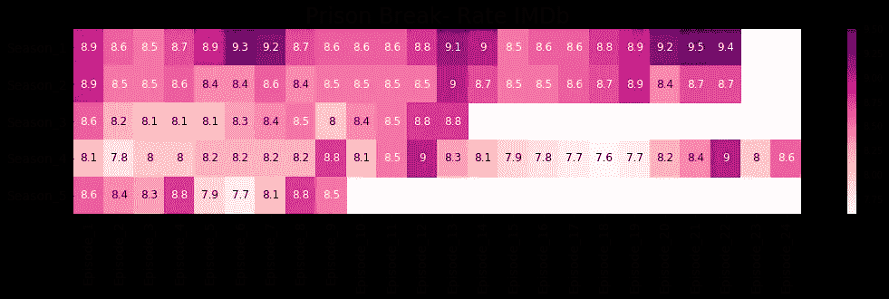

监狱破裂

# 行尸走肉

《行尸走肉》是一部于 2010 年在 AMC**频道**播出的美剧。该系列呈现了一个后世界末日的世界，一群幸存者试图在僵尸的不断攻击下生存，同时面临与其他人类幸存者的冲突。我们可以观察到，分数随着时间的推移逐渐降低。

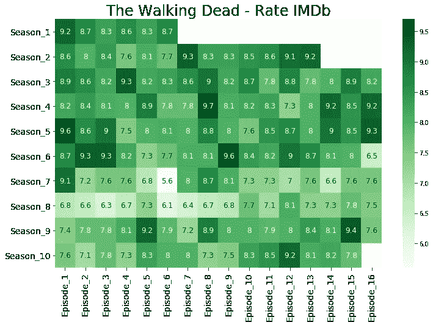

行尸走肉

# 金钱抢劫

**金钱大劫案**是一部西班牙电视剧，最初于 2017 年在 Antena 3 播出。在被**网飞**收购后，**金钱抢劫**已经成为一个世界性的现象。该系列讲述了由“**El professor**”组织的**皇家铸币厂劫案**的故事。在计划了多年的抢劫后，El Profesor 招募了八名以城市命名的劫匪(东京、内罗毕、里约、柏林、莫斯科、丹佛、奥尔索和赫尔辛基)来执行他的总计划:印制 24 亿欧元并成功逃离铸币厂。

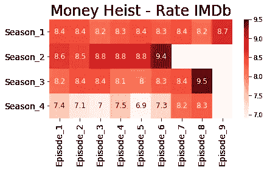

金钱抢劫

如上图，上一季很多集的评分大幅下降(1 分左右)；然而，它们在赛季结束时增加(第 7 和第 8 集)。

我不得不承认**金钱大劫案**是我最喜欢的❤️系列之一

# 《权力的游戏》

**权力的游戏**是一部于 2017 年在 **HBO** 播出的美剧，改编自**乔治·r·r·马丁**写的一系列奇幻小说。该系列讲述了王朝之间为争夺铁王座而发生冲突和结盟的故事。

你可以在下面观察到，剧集的评分在所有季节都很高，在最后一季出现了大幅下降。

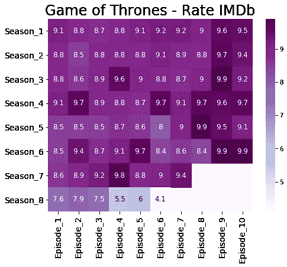

# 《黑镜》

**黑镜**是一部**英国**反乌托邦电视剧，于 2011 年上映。该系列批评了现代社会，尤其是对技术的不当使用。所有的情节都是独立的，并呈现了不久的将来，科技扮演着重要但也有害的角色。

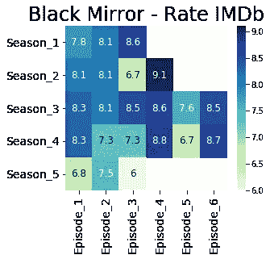

如上图所示，我们还可以观察到上个赛季的得分有所下降。

# 其他系列

如**纸牌屋**、**维京人**、**绯闻少女**、**罪人**等系列，根据 **IMDb** 用户的说法，也显示出质量随着时间的推移而下降。但是，有没有一个系列能保持它们的质量？答案是肯定的！

# 根据 IMDb 用户的意见，随着时间的推移，质量保持不变

虽然随着时间的推移，许多系列会失去质量，但也有一些系列能够在整个季节保持质量。让我们看一些例子。

# **绝命毒师**

**绝命毒师**刚刚好。所有的部分都完美地组合在一起的拼图。什么都不缺，什么都不多余。不用说，**绝命毒师**是我最喜欢的系列！💚

《T4》系列于 2008 年在 AMC 电视台**播出，讲述了**沃尔特·怀特**的故事，他是一名高中化学老师，在被诊断患有无法手术的肺癌后，开始生产冰毒以保证家庭的经济前景。**

如下图所示，该系列甚至**随着时间的推移而提高质量**。

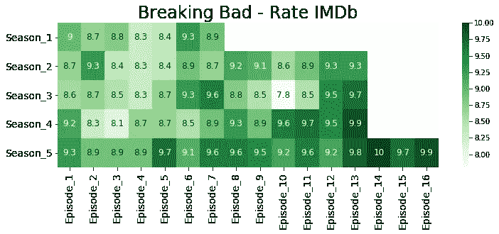

《绝命毒师》

我完全同意 **IMDb** 的用户。第四季的最后一章简直完美。

# 老友记

**老友记**是 1994 年在 **NBC** 播出的一部**美国**连续剧。这部电视剧讲述了住在纽约的六个朋友(瑞秋、莫妮卡、菲比、乔伊、钱德和罗斯)的故事。

由于《老友记》的成功，经过多次薪资谈判，剧组在第九季和第十季每集获得了 100 万美元的报酬！

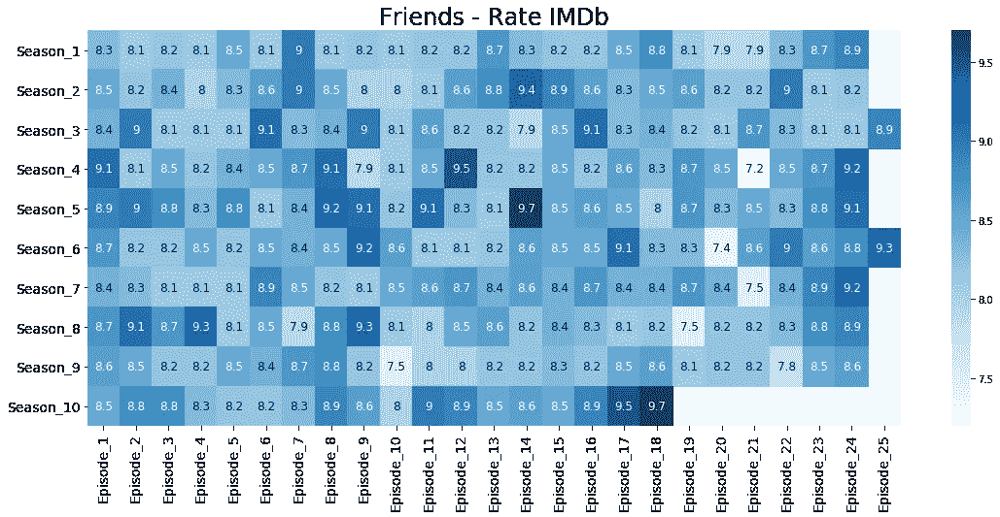

老友记

如上所示，我们观察到各集之间分数的差异；然而，没有明显下降的质量在整个季节。

# 如何逃脱谋杀

**如何逍遥法外**是 2017 年在 *ABC* 上发布的一部**美国**系列。这部连续剧讲述了安娜莉丝·基廷的故事，她是米德尔顿大学的法学教授，也是一名成功的律师。她和她的五个学生卷入了安娜莉丝丈夫萨姆·基廷的谋杀案。

在这种特殊情况下，我们无法理解质量随时间的下降。然而，我们可以注意到，这一季的最后几章比第一章评价更高。我们几乎可以在所有系列中观察到这种趋势！

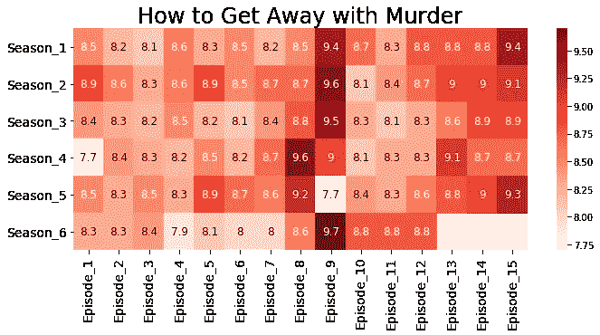

现在，是时候让你自己的形象化了！

# 密码

首先，我们介绍本文中使用的第三方库。由于这些库不是 **Python 标准库**的一部分，我们需要单独安装它们。这可以通过使用 **pip** 组件轻松实现。在计算机上执行代码之前，请验证是否安装了所有库。

然后，我们提供用于从 **IMDb 网页**抓取数据并生成**热图**的代码，这样您就可以轻松地制作自己的可视化效果了！

# 图书馆

## 请求

[**请求**](https://requests.readthedocs.io/en/master/) 是一个第三方库，允许你使用 **Python** 发送 **HTTP** 请求。在本文中，我们将只使用**请求库**来获取一个网页的 **HTML** 代码。

## 美味的汤

当执行数据分析时，我们并不总是能够下载 **csv 格式**的数据，或者通过**应用编程接口** (API)访问数据。在某些情况下，我们必须直接从**网页**获取数据。这时候**美汤**就派上用场了。

[**美汤**](https://www.crummy.com/software/BeautifulSoup/bs4/doc/) 是一个 **Python** 库，用于从 **HTML** 和 **XML** 文档中提取数据，有很多有用的功能可以从网页中抓取信息(例如从标签或图片中提取超链接、文本)。

## 熊猫

[**Pandas**](https://pandas.pydata.org/?source=post_page---------------------------) 是一个 **Python** 开源库，用于**数据科学**，允许我们轻松处理结构化数据，如 **csv 文件**、 **SQL 表**或 **Excel 电子表格**。它提供了以不同格式读写数据、执行探索性分析和数据清理的工具。

## 海生的

**Seaborn** 是基于 **Matplotlib** 的 **Python** 数据可视化库。与 **Matplotlib** 、 **Seaborn** 相比，它允许您使用更少的代码行来绘制图表，并提供更复杂的可视化工具，如**热图**、**盒图**和**小提琴图**。此外，可视化效果看起来更好！❤️

# 美声网刮

为了从 IMDb 收集数据，我们创建了一个函数(**剧集 _ 比率)**，该函数接受一个剧集(剧集指南)的**网页**作为输入，返回一个**数据帧**，其中**行**表示**季**，而**列**表示**集**，如下所示:

剧集 _ 费率功能

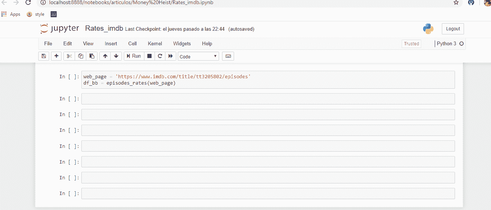

让我们一步一步地理解代码👌

1.我们使用**请求模块**以字符串形式获取网页的 **HTML** 代码。首先，我们使用**向指定的 **url** 发送一个 **GET 请求**。get(url)** 方法。然后，我们使用**获取页面的 **HTML** 文本。文本**属性**属性**。

```
# obtain the html code as a string 
 response = requests.get(url_serie + url_season)
 html = response.text
```

我们可以观察到，**网址**由两部分组成:**网址 _ 系列**和**网址 _ 季节**。 **Url_serie** 是函数(**剧集 _ 收视率)**的输入，在 **url_season** 时保持不变(例如？季节=1，？季节=2，…)随着我们选择不同的季节而变化。

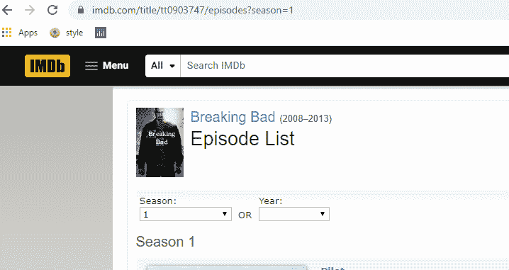

2.我们将字符串 **html** 传递给 **BeautifulSoup** 构造函数，获得一个 **BeautifulSoup** 类型的对象。现在，我们可以使用**美丽的汤**中可用的方法轻松地从该对象中提取信息。

```
# create a BeautifulSoup object
 soup = bs4.BeautifulSoup(html, “html.parser”)
```

3.接下来，我们用 **Chrome 开发工具**探索 **HTML** 代码。 **Chrome Dev Tools** 是一套直接内置于谷歌 Chrome 的网络开发工具，允许你轻松检查页面的 **HTML** 代码。我们可以通过点击 **Ctr + Shift + I** 或者选择**更多工具>开发者工具**来轻松访问 **Chrome 开发工具**。

在元素选项卡中，我们可以检查和编辑页面的 **HTML** 和 **CSS** 。要显示某个元素的 **HTML** 代码(例如，事件率)，您可以点击检查元素按钮(带箭头的方块)并在浏览器中选择该项目，如下所示:

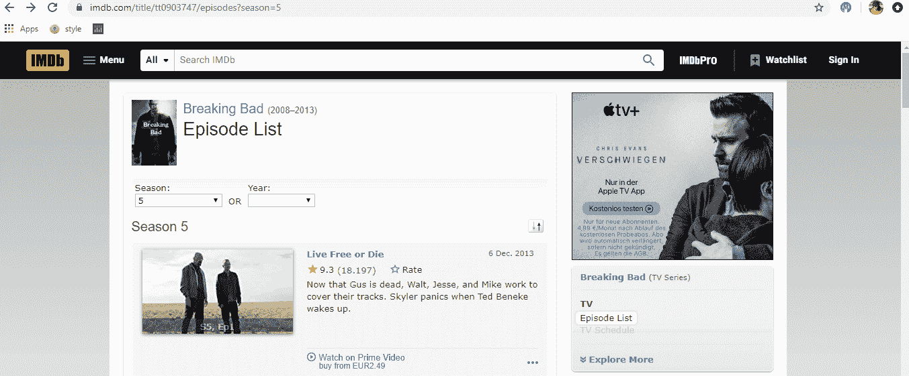

正如我们所观察到的，感兴趣的元素(剧集比率)位于具有**类属性**(“IPL-rating-star _ _ rating”)的 **span 标签**内。这个 **span 标签**在一个 **division 标签**内，带有一个 **class 属性**(“IPL-rating-star small”)。

我们使用这种方法。 **find_all()** 获取所有具有**类属性**(“IPL-rating-star small”)的标签。这个函数返回一个 **bs4.element.ResultSet** 对象。然后，我们遍历这个对象(division 标签)，使用**访问包含分数的 span 标签(“ipl-rating-star__rating”)。find()** 方法。为了获得标签之间的文本，我们使用了**。文本属性**如下。

```
rates_season = {}
 # we obtain all division tags with the class attribute “ipl-rating-star small”
 division_tags = soup.find_all(class_=”ipl-rating-star small”)

 # we loop through the tags and extract the scores
 # we create a dictionary with the scores
 for index, tag in enumerate(division_tags):
     rate = tag.find(class_=”ipl-rating-star__rating”).text
     episode = ‘Episode_’ + str(index + 1)
     # we insert the score in the dictionary
     rates_season[episode] = float(rate)

 # we append the dictionary to a list
 rates_all.append(rates_season)
```

如上图所示，我们将分数插入到一个**字典**中，作为**键**的剧集编号和**值**的剧集分数。最后，我们将这本词典附加到一个列表中。

4.一旦我们收集了一个赛季的所有分数，我们必须访问下一个赛季的 **url** 来继续收集分数。首先，我们检查另一季是否可用(**anchor tag**—id = " load _ next _ 剧集")。如果是这样，我们使用。 **get()** 方法。

```
# get next season anchor tag
 next_season = soup.find(“a”, id=”load_next_episodes”)
 # if next_season equal to None break the loop
 if not next_season:
  break
 # if next_season is not equal to None, we access the url 
 url_season = next_season.get(‘href’)
```

如上图所示，如果没有 id="load_next_episodes "的**主播标签**，意味着没有另一季可用，则 **while 循环**终止。

5.最后，我们获得一个字典列表，其中每个字典包含一个赛季的得分。我们使用这个**字典列表**创建一个**熊猫数据帧**，如下所示:

```
df = pd.DataFrame(rates_all, index=list(map(lambda x: ‘Season_’ + str(x+1), range(num_season))))
```

瞧！我们获得一个**数据帧**，只提供一个**网页**💪接下来，我们使用这个**数据帧**使用 **Seaborn** 创建一个**热图**。

# Seaborn 可视化

**热图**是一种数据可视化技术，其中每个数据点的值用颜色(色调或强度的变化)表示。我们可以使用 **seaborn.heatmap()** 函数轻松创建一个带有 **Seaborn** 的热图。

如下所示，我们创建了一个函数**网页到热图**，它接受剧集(剧集指南)的**网页**、图像的颜色图以及标题作为输入，返回热图可视化。正如您所看到的，我们使用函数 **episodes_rates** 返回的数据帧作为 **seaborn.heatmap()** 函数的输入。

网页热图

现在，让我们选择一个系列，并可视化其分数！

首先，我们转到一个系列的剧集指南，我们复制 url 直到单词 episode，如下所示:

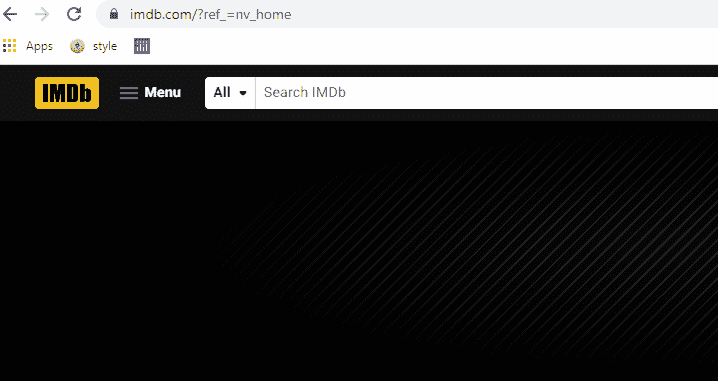

然后，我们选择一个**色图**和一个**标题**用于可视化。最后，我们用**网页热图**函数创建了**热图**。

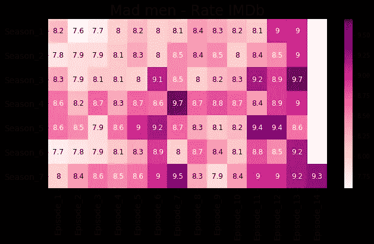

如你所见，《广告狂人》随着时间的推移质量不断提高！此外，这一季的最后几章比第一季评价更高。

现在，是时候让你自己的形象化了！

阿曼达💜