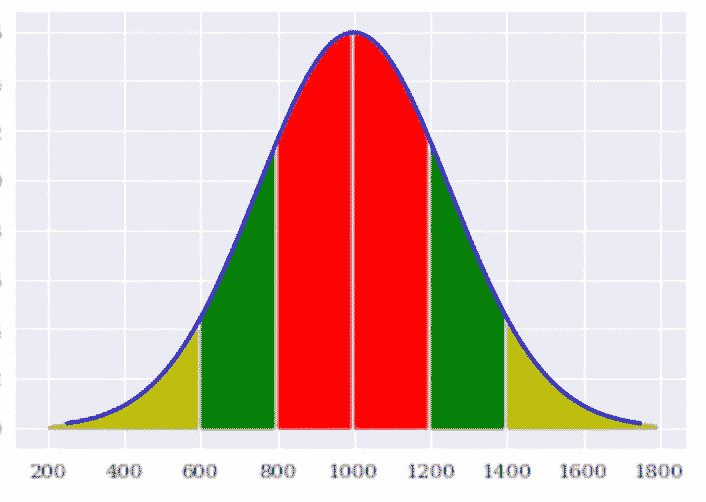
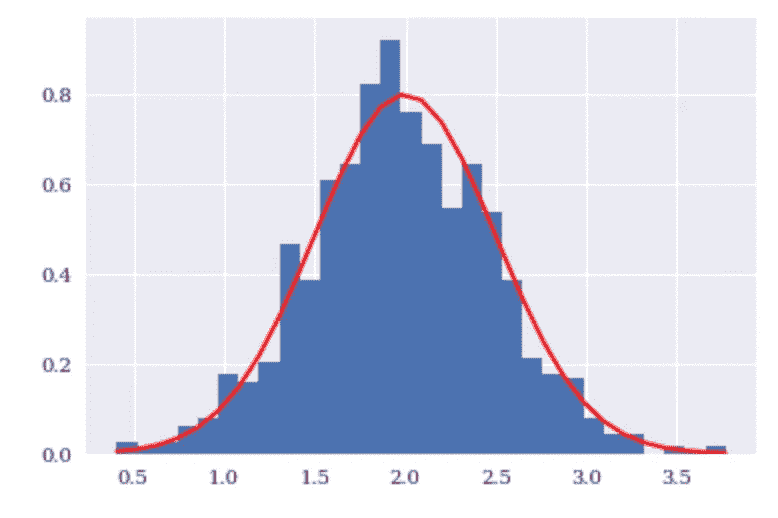
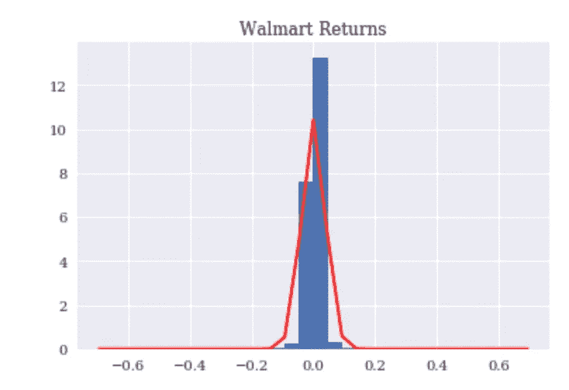
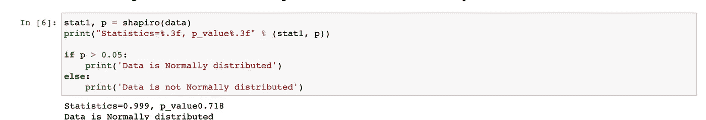
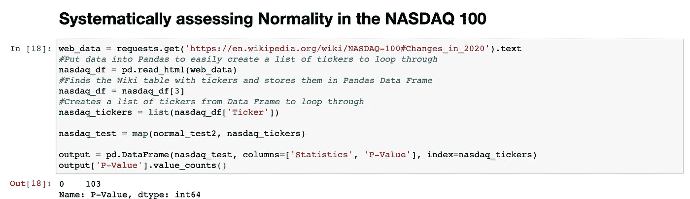
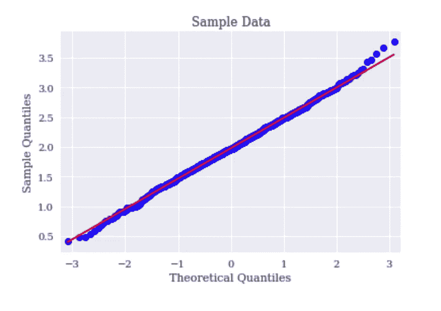
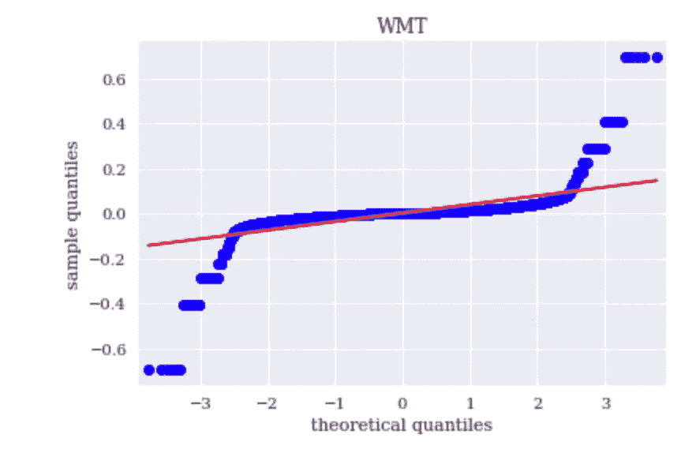

# 股票收益是正态分布吗？

> 原文：<https://towardsdatascience.com/are-stock-returns-normally-distributed-c602ad3dd498?source=collection_archive---------40----------------------->

## 不可能的事变得更有可能了

马库斯·斯皮斯克在 [Unsplash](https://unsplash.com?utm_source=medium&utm_medium=referral) 上的照片

***来自《走向数据科学》编辑的提示:*** *虽然我们允许独立作者根据我们的* [*规则和指导方针*](/questions-96667b06af5) *发表文章，但我们并不认可每个作者的贡献。你不应该在没有寻求专业建议的情况下依赖一个作者的作品。详见我们的* [*读者术语*](/readers-terms-b5d780a700a4) *。*

## 介绍

在辉瑞公司上周宣布其新冠肺炎疫苗有 90%的成功率后，股票市场立即停止并改变了方向。美国航空公司(American Airlines)和 AMC 等受到疫情重创的股票，突然被突然涌入的资金赋予了新的生命，而所谓的“呆在家里”的股票突然失去了动力(Zoom 度过了艰难的一周)。事件的快速变化让“定量”投资者收拾起刚刚发生的事情。像这样的事件应该是非常罕见的，以至于“[写出任何一天发生的概率需要一个 16 位数字，后面跟着 63 个零。”](https://www.bloomberg.com/news/articles/2020-11-13/quant-shock-that-never-could-happen-hits-wall-street-models?sref=iFWW0xUZ)

定量分析师部署的策略突然崩溃，暴露了对股市行为的某些假设，以及为什么做出这些假设如此危险，其中最主要的一个假设是，股票回报或多或少是正态分布的。本文旨在证明这一假设是错误的，股票价格不是正态分布的。这样做结果就是“反常事件”，也就是说，变成了比预期更常见的地方(相对而言，仍然是相当高的比率)。然而，这并不意味着定量模型毫无用处。它只是强调了一个模型的好坏取决于它背后的假设。

## 正态分布简介

正态分布是一个统计概念，它非常重要，因为它描述了我们每天观察到的数据的行为。更具体地说，它描述了一个变量的值——例如，人的身高——是如何分布的。在进入更多细节之前，让我们看一张正态分布的图片来更好地了解它:

正态分布是一个钟形的 a 曲线，它的关键方面是 1)曲线下 68%的值落在平均值的一个标准偏差内(在图表的红色区域内), 2)95%的值落在平均值的两个标准偏差内(在图表的绿色或红色区域内),最重要的是，在我看来，3)99.7%的正态分布数据落在平均值的三个标准偏差内(在黄色、绿色或红色区域内)。换句话说，一个变量 99.7%的取值都落在上图的蓝色曲线下。使用正态分布的哑数据，如下图所示，一个变量 99.7%的取值范围大约在 0.5 到 3.5 之间。

随机生成的数据

这一点很重要，因为如果股票回报符合这种分布，那么投资者就可以确信回报的 99.7%将被限制在一定的范围内。例如，如果沃尔玛的回报是*假定*正态分布，如下图所示，那么投资者可以确信可能的价值范围将落在曲线之下。注意，如果数据是正态分布的，收益沿着分布曲线尾部的概率几乎是不可能的，*:*

## 常态检验

这个百万美元的问题是，股票回报是否正常，以及一个沃尔玛的投资者，如果知道-0.2 或更低的回报实际上是不可能的，他是否能睡得安稳。检验正态性有几种方法，本文将重点介绍夏皮罗-维尔克检验和分位数-分位数图。

## 夏皮罗-维尔克试验

夏皮罗-维尔克检验是几种正态性检验之一，它通过使用所谓的 p 值来评估样本从正态分布中抽取的可能性，然后将其与阈值(通常为 0.05)进行比较。在 Python 中，如果 p 值低于 0.05，则有可能(但不确定)所讨论的数据不是正态分布的，如果 p 值高于 0.05，则数据可能遵循正态分布。将该测试应用于上述随机生成的数据，数据可能遵循正态分布:

Python 中的夏皮罗-维尔克测试

然而，将这一检验应用于沃尔玛，产生了不同的结果，即它未通过正态性检验。当然，其他股票可能会通过这个测试。然而，对纳斯达克 100 指数中的每只股票进行同样的测试会得出相同的结果:

没有一只股票的 p 值大于 0.05，这意味着它们的回报可能不符合正态分布。

## 分位数-分位数检验(QQ 图)

简单地说，分位数-分位数检验是一个通过一系列点画出一条对角线的图形。如果图上的每个点都落在对角线上，则数据可能遵循正态分布:

抽样资料

上面的样本数据非常接近直线，表明数据可能是正常的。对沃尔玛的历史回报率进行这种测试会产生一个结果，表明回报率可能不正常，因为与对角线有偏差:

## 结论:不可能的事情并没有那么不可能

正态性测试很重要，因为它们有助于确定在建立投资模型时做出一系列假设是否合适。如果数据没有按照假设的方式运行，那么被认为是不可能的事情，比如遭受巨大的投资损失，可能会变得更有可能。要点是不要把投资模型扔到一边，而是要认识到它们的好坏取决于它们背后的假设。

**进一步探索**

Python 代码可以在[这里](https://github.com/cbecks1212/Normality-Tests/blob/main/Normality%20Tests.ipynb)找到