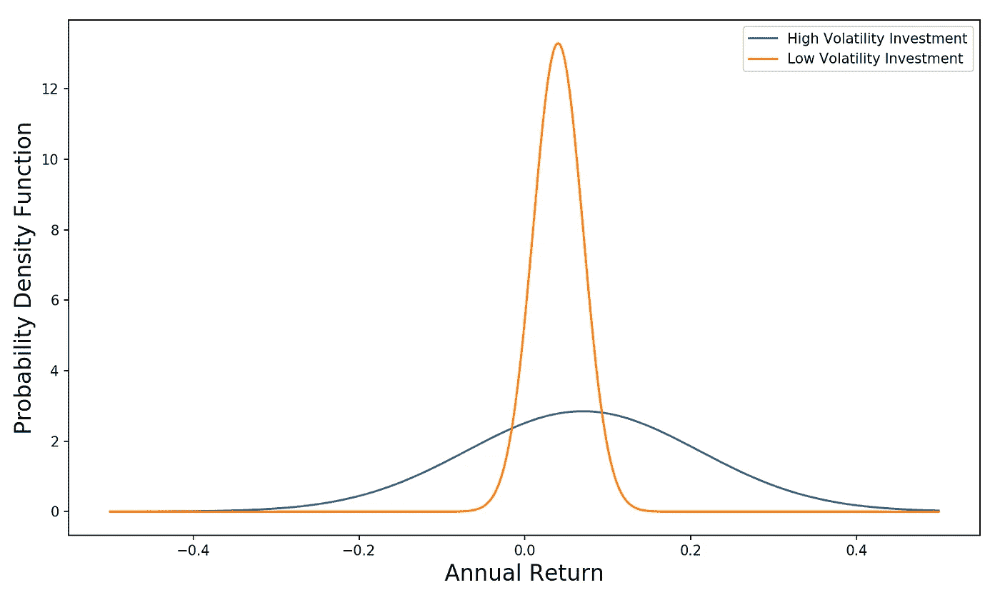
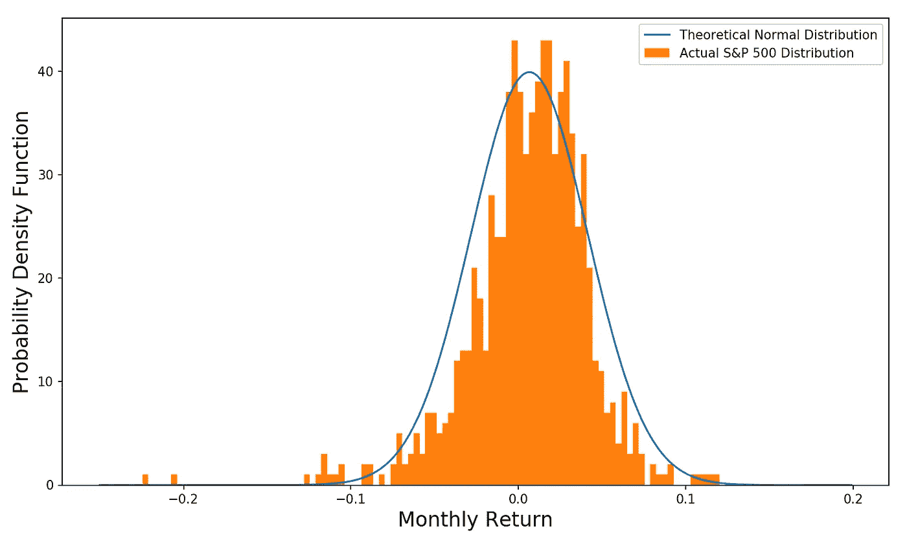
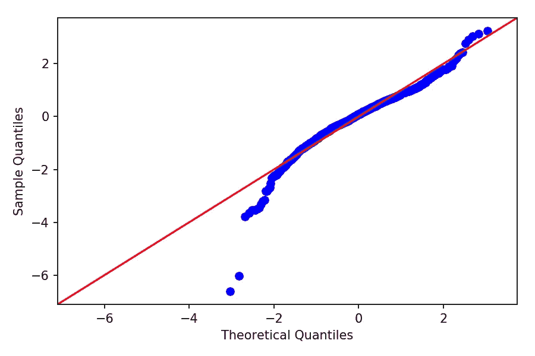

# 股票收益是正态分布吗？

> 原文：<https://towardsdatascience.com/are-stock-returns-normally-distributed-e0388d71267e?source=collection_archive---------4----------------------->


[M. B. M.](https://unsplash.com/@m_b_m?utm_source=medium&utm_medium=referral) 在 [Unsplash](https://unsplash.com?utm_source=medium&utm_medium=referral) 上拍摄的照片

## 从概率分布中得出的预期与真实世界的股票回报匹配吗？

虽然痛苦，但最近金融市场的混乱给我们提供了一个质疑自己假设的好机会。在投资行业中，用正态分布来模拟投资未来回报的潜在范围[是很常见的。任何时候我们都可以用正态分布来建模一些东西，这使得生活变得容易多了。例如，由许多投资组成的投资组合(每个投资的回报都是正态分布的)的回报也是正态分布的。为了描述一项投资，我们只需要两个值:平均值(也就是投资的预期回报)和标准差(也就是投资的风险)。如果我们想彻底，我们还应该记录投资与我们整体投资组合的相关性。](/understanding-the-normal-distribution-with-python-e70bb855b027)

我之前写过金融业如何对投资风险进行建模。钟形曲线峰值的 X 轴位置是预期收益，钟形曲线的宽度代表其风险:



投资钟形曲线

但是用这些假设做出的风险估计真的有意义吗？股票收益实际上正常吗？常态假设是否低估、恰当表述或夸大了市场灾难的频率(就像我们在过去几周经历的那样)？

# 股票收益正常吗？

自 1950 年以来，标准普尔 500 的平均年回报率约为 8%，回报率的标准差为 12%。我想看看月度回报，所以让我们把它们转换成月度回报:

```
Monthly Expected Return = 8%/12 = 0.66%
Monthly Standard Deviation = 12%/(12^0.5) = 3.50%
```

让我们将实际回报叠加在理论正态分布之上，平均值为 0.66%，标准差为 3.5%:



实际分布与正态分布

它看起来近似正常，但如果我们看分布的左边，我们可以看到著名的厚尾。厚尾意味着现实中极端事件发生的频率比正态分布预测的要高。更多的证据表明，标准普尔 500 指数月度回报率的实际分布在中心比正态分布更薄。瘦的中间和胖的尾部意味着正态分布可能不是股票收益的最佳描述。相反，似乎有两种制度——一种平静的制度，在这种制度下，我们大部分时间都处于正态分布状态(但波动性低于 12%),另一种制度则具有高波动性和可怕的回报。

[另一种检查正常性的方法是 QQ 图(我也写了一篇博客详细介绍 QQ 图是如何工作的)。](/what-in-the-world-are-qq-plots-20d0e41dece1)让我们来看看每月 S & P 500 回报的 QQ 图:



每月标准普尔 500 回报的 QQ 图

与红色 45 度线的偏差代表与正态分布的差异。虽然大多数观察值都或多或少落在红线上，但我们可以在左尾巴上看到明显的偏差，在右尾巴上看到较小的偏差。X 轴上的值(理论分位数)告诉我们期望在正态分布上看到该量级的观察值的频率(它们是 Z 分数，也称为远离平均值的标准偏差，这意味着概率)。Y 轴上的值(样本分位数，也是 Z 分数)告诉我们实际上看到它的频率。

例如，左边的 2 个点是明显的异常值。这两者都代表着标准普尔 500 的回报率低于-20%。在数据集中，总共有 843 个月的观测值。因此，这两个异常点仅占我们观察值的 0.237%。我们可以使用下面的代码行来找到正态分布中 0.237%的观察值位于左侧的点:

```
**In:**from scipy.stats import norm# Multiply by 2 to account for probabilities in right tail also
theoretical_z_score = norm.interval(1-(0.00237*2))[0]
print('Theoretical Z = ' + str(round(theoretical_z_score, 2)))**Out:**Theoretical Z = -2.82
```

这意味着在正态分布中(均值=0，标准差=1)，我们预计 0.237%的观察值位于-2.82 的左侧(该值是 Z 得分的一个示例)。我们刚刚计算的 Z 分数是 QQ 图上第二差回报的 X 轴位置。

我们可以通过累积密度函数(CDF 方法)来证实这一点，它告诉我们，对于给定的分布，位于 Z 得分左侧的概率之和:

```
**In:**prob_left = norm.cdf(theoretical_z_score)
print('Probability to left = ' + str(round(prob_left, 5)))**Out:** Probability to left = 0.00237
```

## Z 分数

Z 得分是一种将数量与概率联系起来的度量。它的公式是:

```
Z-score = (observed - mean)/standard_deviation
```

Z 值为-2.82 意味着观察值比平均值低-2.82 个标准偏差(在任一方向上离平均值越远，观察的可能性越小)。-2.82 是一个理论上的 Z 值，也称为 Z 值。低于该值时，我们预计 0.237%的观察值将服从正态分布。

现在让我们来计算实际数据的 Z 值。2 个异常点代表了灾难性的月回报率-20.4% (2008 年金融危机)和-22.5%(过去一个月)。因此，我们可以使用-20.4%来计算我们的 Z 得分(因为 842 个观察值中有 2 个是-20.4%或更低)，以及标准普尔 500 月度回报的均值和标准差:

```
**In:**actual_z_score = (-0.204 - 0.0066)/0.035
print('Actual Z = ' + str(round(actual_z_score, 2)))**Out:**Actual Z = -6.02
```

**哇，月收益率-20%是 6 sigma 事件**(均值以下 6 个标准差)！让我们用更容易理解的概率来描述这一点:

*   发生-2.82 sigma(或更差)事件的频率为 0.237%。这意味着我们预计每 1/0.00237 个月会发生一次。所以我们预计它每 422 个月发生一次，或者每 35 年发生一次。
*   8.87*10^-8%频率出现-6.02 西格玛(或更差)事件。是的，这个数字对我来说也没有意义，所以我们换个说法。就年份而言，如果股票回报确实正常，那么我们预计像这样的 6 sigma 事件每 93，884，861 年发生一次！

这就是为什么 QQ 图特别突出了这 2 点(其中-6.02 sigma 是 QQ 图上第二差回报的 Y 轴值)。**据说我们在数据中观察到 6 sigma 事件(大规模不可能发生的事件)的频率远高于预期(大约 3 sigma 频率)。**它试图告诉我们:

这意味着我们在数据中观察到 6 sigma 事件(大规模不可能发生的事件)的频率远远高于预期(大约 3 sigma 频率)。它试图告诉我们:

> “嘿，根据我们数据的平均值和标准差，以及最关键的假设，我们的数据是正态分布的，我们在这里观察到的是超级不正常的！”

我们观察到 2 个回报率低于-20%！这是一个只有 70 年历史的数据集中的两个六西格玛事件(9000 万年一次的事件)。所以我们可以非常自信地说(不需要假设检验！)认为没有股票回报是不正常的。此外，假设它们导致我们低估了灾难性市场回报的可能性。

# 那现在怎么办？

我们是不是要废弃所有的模型，然后从头开始？我不认为我们需要一路走到那里。毕竟，股票回报大致是正常的，即使在股票回报低于正常水平、存在厚尾的世界(或许更是如此)，投资理论(如多样化)的许多好处也是成立的。

但是，当我们对我们的投资组合进行压力测试时(以及我们自己对未来可能发生的事情的心理预期)，我们绝对应该认识到假设的 4、5 和 6 sigma 事件实际上似乎在每个商业周期都会发生一次。

我们还可以具体反思一下我们估算灾难性市场回报频率的方式。一个问题是金融市场存在的时间还不够长。因此，我们没有足够的观测数据来确信我们对均值、标准差等的估计。真正代表了真实的分布。因此，我们应该承认，我们做出的推论(使用我们确实拥有的市场数据)有时可能会非常不正确。这让我想起了地震预测，科学家们试图利用一个以中小地震为主的数据集来预测大地震的震级和频率(类似的地震可能以前从未记录过)。或许金融业可以向他们借一两页纸。

***本文引用的往期帖子:***

[*了解投资风险*](/understanding-investment-risk-3882c58e00e0)

[*理解正态分布*](/understanding-the-normal-distribution-with-python-e70bb855b027)

[*QQ 剧情到底是什么？*](/what-in-the-world-are-qq-plots-20d0e41dece1)