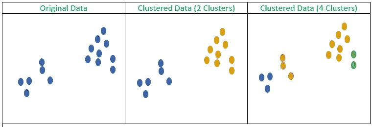
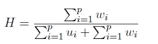
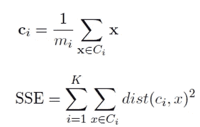
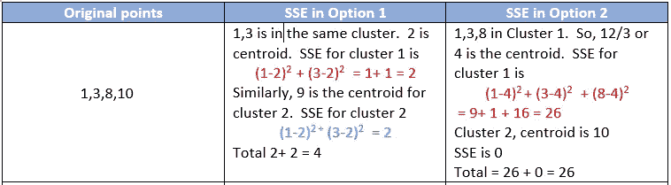
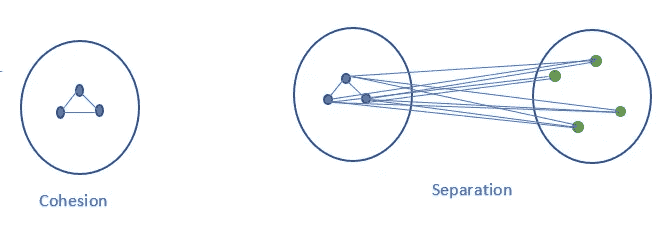
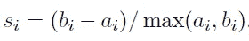
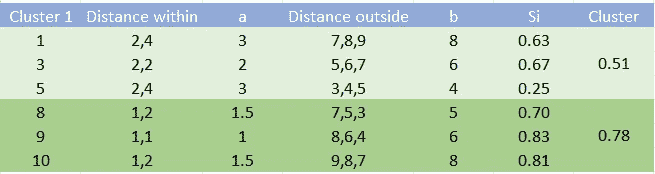
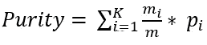
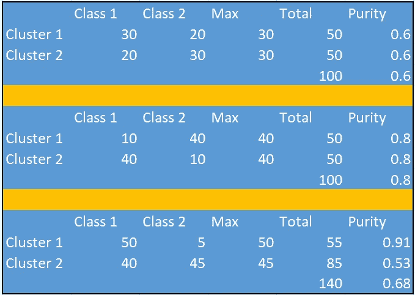

# 集群好吗？

> 原文：<https://towardsdatascience.com/are-the-clusters-good-1567de6a9524?source=collection_archive---------25----------------------->

了解如何评估集群

**聚类**定义为在数据中寻找自然群体。但是这个定义本身就是主观的。

**什么是自然群体？**

如果我们看到下面的图片，我们能找出这些花的自然组合吗？是根据形状还是根据颜色？它甚至可能是由花的大小或种类决定的。因此，*自然群体的概念根据我们关注的特征而变化。*

图 1:鲜花(资料来源:Unsplash)

让我们再举一个例子，我们在 2D 平面上有一些点或观察值，也就是说，我们只有两个属性

图 2:原始数据和不同聚类数的聚类(图片来源:作者)

如果我们看上面的图，它有三个子图。第一个子图显示了原始数据，第二和第三个子图显示了聚类，聚类数分别为两个和四个(属于同一聚类的观察值用相同的颜色标记)。

幸运的是，我们仍然可以可视化并尝试衡量集群的质量，但是，如果我们追求更多的数字特征，我们就无法可视化和看到。因此，需要有一种机制，一些措施，可以让我们比较两组或更多组的聚类，或者可能是对同一组数据的两种或更多种聚类算法。*不幸的是，就像我们可以使用精确度比较分类算法一样，或者在使用均方误差进行回归的情况下，聚类就不是那么明确了。*

**聚类趋势:**

如果数据没有任何聚类趋势，即使数据是随机的，我们应用 k-means，算法也会生成 k-clusters。因此，我们如何衡量数据是否有聚集趋势？为了测量这一点，我们借助霍普金斯的统计数据。

**霍普金斯统计(H)**

在这种方案中，添加的人工生成的随机点与数据集中的原始数据点一样多。对于每个原始点，计算与其最近邻居的距离，用 **w** 表示，并且对人工生成的点重复相同的练习。这里，与最近邻居的距离计算为 **u.**

接近 0.5 的值表示数据没有聚集趋势，因为 w 和 p 相等。

**聚类评估方法:**

**误差平方和(SSE):-**

最常用的聚类评估工具是误差平方和，由以下等式给出。

SSE 方程(图片来源:作者)

基本上，在第一步中，我们通过取该聚类中所有观察值的平均值来找到每个聚类的质心。

*   然后我们找出该簇中的点偏离中心的程度并求和。
*   然后，我们将单个集群的偏差或误差相加。
*   SSE 要尽可能低。

我总是通过例子更好地理解直觉，让我们就这么做吧

图 3:上海证券交易所示意图。(图片来源:作者)

我认为上面的例子不言自明。(1，3)和(8，10)是自然的集群组织，集群数量为 2。上证 4。在另一个设置中，我们在同一个群集中保留了 1、3、8 个，在另一个群集中保留了 10 个，而 SSE 已飙升至 26 个。

SSE 被广泛用于寻找聚类的数目(K ),尤其是 K-均值。

图 iris 数据集上不同聚类数的 SSE(图片来源:作者)

在这里，我们也比较了不同集群数选项的集群质量。这是一个单调递减的函数，如果我们继续增加聚类数，它将继续减少。因此，当插入 SSE 稳定或形成肘形时，采用最佳的集群数量。如果我们试图寻找球状星团，SSE 是一个很好的测量方法。

让我们从一个更广义的角度来看，我们想要的一组结构良好的集群如下

*   一个集群内的观测值要尽可能接近。这被称为**内聚力**
*   两个星团的观测值应该相距很远。这被称为**分离**

使用下图进行说明

图 5:凝聚与分离(图片来源:作者)

评估措施可分为两种方式

**内测:**

当类别标签不可用时，这是一个更通用的方法。**轮廓系数**就是这样一种流行的测量方法。这使用了内聚和分离的概念。让我们从簇 j 中取一个点 I，首先，我们计算点 I 到 j 中所有点的距离，并求平均值我们称之为 ai(内聚力)。现在，让我们取另一个簇 k，类似地，我们从簇 k 中的所有点中找到点 I 的平均距离，让我们称之为 b(分离)。可以有许多这样的群，它们中的最小值被认为是 bi。

那么点 I 的轮廓系数为

轮廓系数(图片来源:作者)

对于聚类，需要计算聚类中所有点的轮廓系数，并取平均值。该值介于-1 和 1 之间，值越高，分类越好。下图是一个算出的例子

图 6:剪影系数(图片来源:作者)

1，3，5，8，9，10 作为初始点集。假设 1，3，5 是第一个聚类，8，9，10 是第二个聚类。

所以对于点 1，a1 是(2+ 4)/2 = 3，b 是(7+8+9)/3 =7 然后我们用公式。我们可以观察

*   第二类具有更好的轮廓系数，因为它更紧凑
*   与其他点相比，中心点具有更好的轮廓系数
*   边界点具有最低的轮廓系数

其他一些常用的指标有**邓恩指数和 DB 指数**。

**外部测量:**

我们有一个可用的类标签，我们使用这个类标签来评估聚类结果。理想情况下，每个类都应该形成一个集群。一种这样的度量被称为纯度，由下面的公式给出。

纯度方程式(图片来源:作者)

k 是聚类的数量，mi 是聚类中的观测值的总数，m 是观测值的总数。Pi 是该群集中多数类的比例。例如，如果聚类 I 具有来自类 1 的 5 个观察值和来自类 2 的 20 个观察值。那么类别 2 是多数类别，纯度是 20/25 或 0.8。下面的例子进一步说明了这一点

图 7:纯度说明(来源:作者)

在上图中，显示了聚类结果的三个变量，这些计算是不言自明的。对于选项 1 和选项 2，两个集群大小相等。第二种选择更均匀，因此纯度更高。对于选项 3，集群 2 支配集群 1。

**纯度有 0 和 1 两个数值，越接近 1，纯度越好。**还有更多像熵、F 值等度量。关于细节，我强烈推荐你阅读庞、斯坦巴克、库马尔的书。为什么我们要使用聚类，当我们有标签可用时，也许要提出一个新的聚类算法，测试不同的配置和假设。需要注意的是，当然，聚类是在去除类别标签之后对数据进行的，然后标签用于验证聚类质量。

我们不讨论层次聚类的评估，这是另一回事。

**结论:**

*   聚类本质上是一项复杂的任务，因此需要评估聚类的质量。
*   这有助于比较多个聚类算法，以及使用不同参数值的同一聚类算法的不同结果
*   首先，我们可以测试是否存在聚集趋势
*   群集质量度量应该考虑内聚性和分离性
*   根据类别标签的可用性，它可以是内部的和外部的

**参考文献**:

[1] Tan PN，Steinbach M，Kumar V .数据挖掘导论。培生教育印度公司；2016.

[2]贾恩 AK。数据聚类:超越 K 均值的 50 年。模式识别字母。2010 年 6 月 1 日；31(8):651–66.

[https://youtu.be/_KKT55JohcU](https://youtu.be/_KKT55JohcU)

[4][https://towards data science . com/clustering-evaluation-strategies-98a 4006 fcfc](/clustering-evaluation-strategies-98a4006fcfc)