# 太空入侵者是确定的还是随机的？

> 原文：<https://towardsdatascience.com/are-the-space-invaders-deterministic-or-stochastic-595a30becae2?source=collection_archive---------24----------------------->

## 对 ALE 和开放式人工智能体育馆注入随机性技术的探讨。

作者图片

# **摘要**

谷歌 Deepmind 使用街机学习环境(ALE)在 49 款雅达利游戏上取得了人类水平的性能。本文描述了我用来重现这种性能的方法，并讨论了 Deepmind 和 Open AI 用来在 ALE 中注入随机性的机制的效率。

# **简介**

作为一个附带项目，我花了一些时间试图在《突围》和《太空入侵者》上实现同样的 Deepmind 的人类级性能。虽然我知道有许多性能更好的架构，但我的目标是使用与 deep mind 2015 年《自然》论文中介绍的相同的网络([通过深度强化学习进行人类级别的控制](https://www.nature.com/articles/nature14236))。我这样做是为了更好地理解 Deepmind 在童年玩一些标志性游戏时经历的挑战和表现。Deepmind 经历的一个挑战是我特别感兴趣的:环境是随机的还是确定的？Deepmind 和 Open AI 对抗过太空入侵者的确定性波吗？在本文中，我们讨论了 Deepmind 和 Open AI 在 ALE 中注入随机性的机制的效率。

源代码可以在[https://github.com/NicMaq/Reinforcement-Learning](https://github.com/NicMaq/Reinforcement-Learning)访问

这个存储库包含我用来支持我的结论的代码，以及我的 tensorboard 运行的数据，以鼓励讨论和促进比较。

此外，对于想了解我的算法如何工作的读者，我发表了 [Breakout 解释了](https://colab.research.google.com/drive/1nzH8TZ8zFth0oLwXwIXbn9OuAaJ4mVXG?usp=sharing)和 [e-greedy 和 softmax 解释了](https://colab.research.google.com/drive/1--qFcl5QuTuudC-yYcE1odKx_htui4h6?usp=sharing)。这是两个 Google Colab 笔记本，我在其中解释了预期的 sarsa 和两个策略 e-greedy 和 softmax 的实现。

最后，强化学习是一个令人兴奋和有前途的人工智能领域，但要知道它是被诅咒的。阅读我关于 RL 最佳实践的帖子来加速你的成功之路。

# **游戏分数**

在 Deepmind 的 2015 年《自然》论文中，我们发现了两个呈现结果的表格(扩展数据表 2 和扩展数据表 3)。在表 2 中，Deepmind 列出了前 5000 万帧中报告的最高平均剧集分数，同时对 135，000 帧中的每 250，000 帧进行评估。在表 3 中，他们列出了前 1000 万帧中报道的最高平均剧集分数。

我没有 Deepmind 的计算能力，所以我将我的结果与表 3 进行了比较。在前 1000 万帧(用于训练代理人)中，deepmind 报告了《越狱》的最高平均分 316.8，以及《太空入侵者》的最高平均分 1088.9。

这家名为 Open AI 的公司开源了 baselines，这是他们的内部努力，旨在重现强化学习算法，其性能与公布的结果相当。

据我所知，baseline 团队并没有在与 Deepmind 相同的网络上发布结果。我们能找到的最接近的是用双 q 学习训练的网络，正如它的名字所示，它是对 q 学习的改进。尽管如此，通读这些报告并检查我的结果是否具有可比性还是很有趣的。因此，如果 Open AI 使用与 Deepmind 相同的方法，特别是跳过 4 帧，他们在前 1000 万帧中获得的分数在 360 到 410 之间(参见[基线 DQN 结果](https://github.com/openai/baselines-results/blob/master/dqn_results.ipynb))。

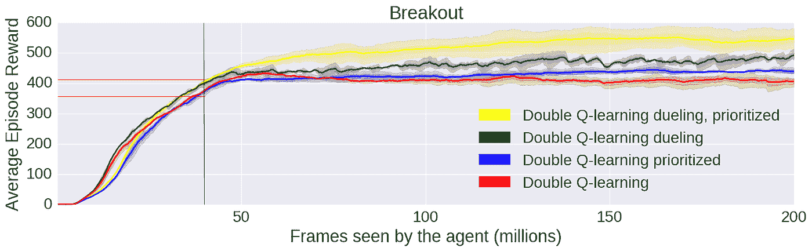

图自【https://openai.com/blog/openai-baselines-dqn/ 

最后， [2017 ALE 论文](https://arxiv.org/abs/1709.06009)报道的《太空入侵者》DQN 的得分是 673。

我使用的方法将在后面的章节中详细讨论。我试图严格遵循 Deepmind 的方法论。下面是我用几乎相同的评估程序得到的《突围》和《太空入侵者》的结果。我在 GitHub 中提交了我的 Tensorflow 运行:

突围(跑 20200902182427)——我的最好成绩是 427

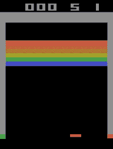

作者图片

太空入侵者(Run 20200910151832)——我的最好成绩是 1085

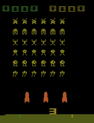

作者图片

恭喜你，我成功重现了 Deepmind 在《突围》和《太空入侵者》上的表现。

但我真的有吗？

Deepmind 的代码和我的代码之间的一个主要区别是，当我使用 OpenAI Gym 时，Deepmind 直接使用 ALE。当然，最大的不同是我们如何在游戏中注入随机性。

ALE 是确定性的，因此 OpenAI Gym 实现了不同的技术在游戏中注入随机性。我们来讨论一下哪些技术最接近 Deepmind 的方法论，以及它们的效率。

# ALE 和 OpenAI 健身房的确定性和随机性。

虽然在 2013 年 ALE 的第一篇论文中没有提到决定论。在 [2017](https://arxiv.org/abs/1709.06009) 中写道，ALE 的一个主要担忧是“在几乎所有的游戏中，Stella 本身的动态是由代理的行为决定的。”

最初的 Atari 2600 控制台没有生成随机数的功能。因此，ALE 也是完全确定的。因此，通过简单地记住一系列好的行动，而不是学习做出好的决定，是有可能获得高分的。这种方法在 ALE 之外不太可能成功。环境的随机性是鼓励 RL 算法的鲁棒性以及它们转移到其他任务的能力的关键因素。

人们已经开发了各种方法来为 ALE 动力学添加各种形式的随机性(通常是在比 Deepmind 论文发表日期更晚的日期)。在 [2017 ALE 论文](https://arxiv.org/abs/1709.06009)中我们可以发现:

1.  粘性动作
2.  随机帧跳过
3.  初始无操作
4.  随机动作噪声

Google deepmind 使用固定的 4 跳帧，最多 30 次初始无操作，以及随机动作噪声。

ALE 是决定性的。我们可以在 [2017 ALE 论文](https://arxiv.org/abs/1709.06009) 中读到“给定一个状态 s 和一个操纵杆输入 a 存在唯一的下一个状态 s0，即 p(s0 | s；a) = 1。”所以，如果在游戏的每一步只有一个可能的结果，我们应该总是用相同的网络和相同的初始状态获得相同的分数。

在下面的段落中，我们将研究我们获得的分数的方差，以评估不同方法增加的随机性水平。我们也将通过观察结果的分布来支持我们的结论。

## **粘性动作的随机性**

在 [2017 ALE 论文](https://arxiv.org/abs/1709.06009)中，Machado，Bellemare & al。，推荐粘性动作来加强随机性。粘性动作增加了代理动作的粘性。在每一步，环境要么执行先前的动作，要么执行新代理的动作。

“我们提出的解决方案 sticky actions 利用了其他方法的一些主要优点，而没有它们的大部分缺点。它不受研究者偏见的影响，不干扰代理人的行为选择，并且不鼓励代理人依赖记忆。新环境在整个事件中是随机的，生成的结果是可重复的。”

我们进行了两个实验来学习如何区分随机环境和确定性环境。我们的确定性环境是 BreakoutNoFrameskip-v4。我们可以在 Open AI 的源代码中读到这种环境:“*无跳帧。(雅达利没有熵源，所以这些是确定性环境)”。*我们的随机环境是带粘性动作的 breakout noframeskip-v4(breakout noframeskip-v 0)。

在左下方，我们可以看到确定性环境下的结果分布，在右侧，我们可以看到随机环境下的结果分布。

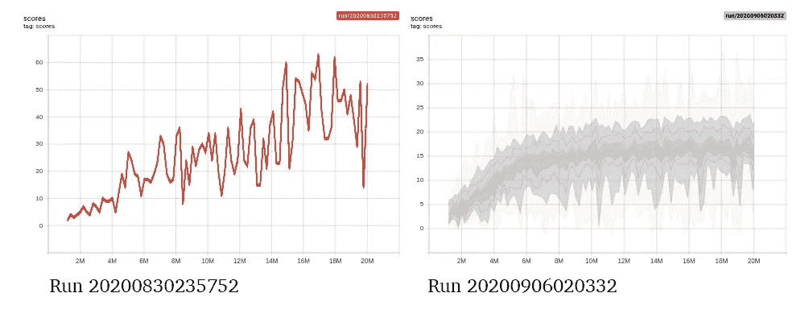

按作者分类的图表

正如所料，对于决定论者的环境，我们有一个非常窄的结果分布，而对于随机环境，我们有一个更宽的分布。

查看两种环境的结果直方图也非常有趣:

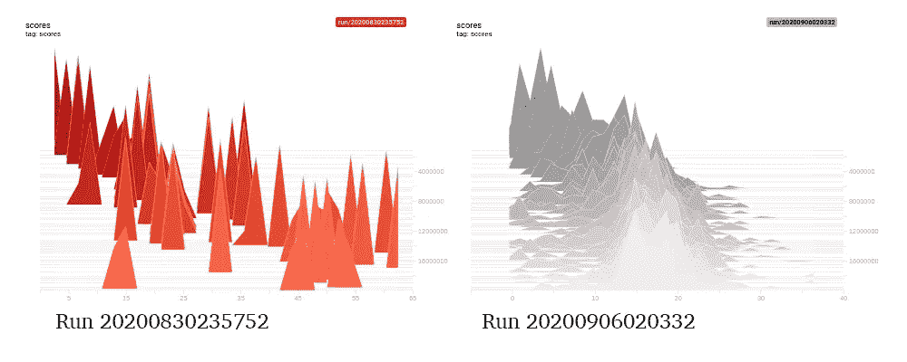

按作者分类的图表

我们可以在左边看到，在评估阶段的 100 场比赛中，我们都取得了相同的分数。在右边，粘性动作增加的随机性导致代理人获得不同的分数。

为了测量分布，我们可以计算结果的方差。下面是确定性环境和随机环境的方差比较。

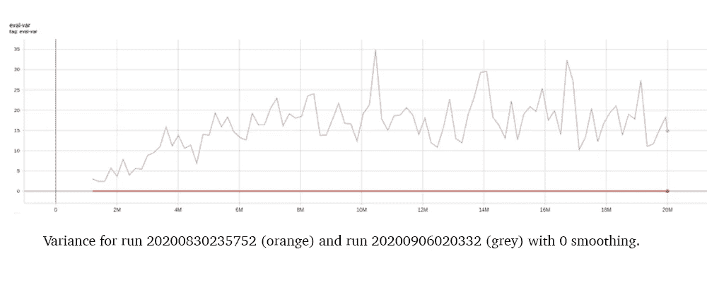

按作者分类的图表

对于确定性环境，结果的方差始终为零，而对于随机环境，方差大于零。

让我们将这些初步结果与其他技术的分布和方差进行比较。

## **跳绳**

跳帧包括重复由代理决定的最后一个动作，重复次数为随机的 n 个连续帧。代理在 n+1 帧中只看到 1。

在 Open AI Gym 中，跳帧可以跳过任意数量(2、3 或 4)的帧。跳过固定帧数的环境是{ }确定性 v4 和{ }确定性 v0 环境。跳过随机数量的帧的环境是{}-v4 和{}-v0 环境。

Deepmind 用的是固定跳帧。我们将使用 BreakoutDeterministic-v4。

下面是左边的 BreakoutNoFrameskip-v4 和右边的 BreakoutDeterministic-v4 的结果分布对比。BreakoutDeterministic-v4 与 BreakoutNoFrameSkipV4(确定性)是相同的环境，但是增加了一个固定的跳帧。

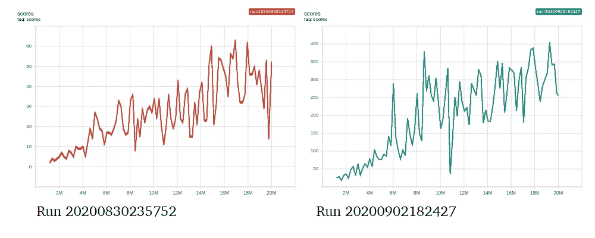

按作者分类的图表

这两种分布非常相似。对于 BreakoutDeterministic-v4，我们获得了确定性环境的分布。

如果我们计算两个实验的方差，所有的值都等于零。

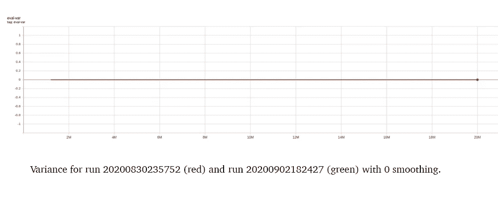

按作者分类的图表

在 [2017 ALE 论文](https://arxiv.org/abs/1709.06009)中，Bellmare 和 al 关于随机跳帧技术的结论是“除了注入随机性，跳帧导致了更简单的强化学习问题，并加快了执行速度。”

根据我们的实验，固定框架技术不会注入随机性，但明显简化了学习问题并加快了收敛速度(见下面的分数)。

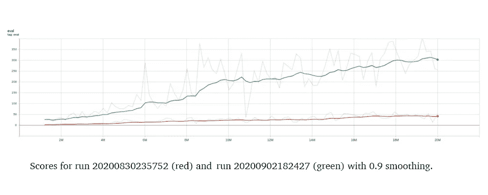

按作者分类的图表

下面是我的一个 breakout-v4 实验的分布图，它使用了随机跳帧技术。我们清楚地看到，这种分布类似于我们的随机环境。

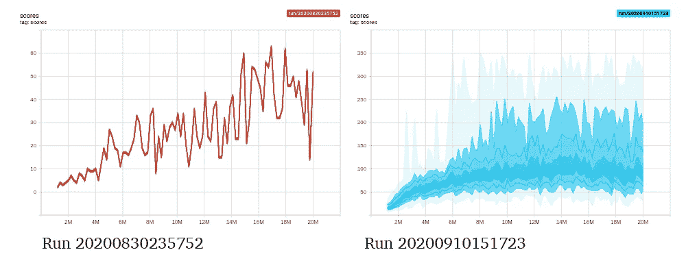

按作者分类的图表

随机跳帧技术增加了随机性，但也增加了复杂性。我们可以在 [2017 ALE 论文](https://arxiv.org/abs/1709.06009)中读到:“贴现也必须更谨慎地对待，因为这使得有效贴现因子是随机的。”

我的代码没有考虑时间失真。在时差强化学习方法中扭曲时间肯定是具有挑战性的。

因为它简化了学习问题并加快了收敛速度，所以在本文的剩余部分，我们将使用 BreakoutDeterministic-v4 作为我们的确定性环境。

## **初始无操作**

Deepmind 使用的另一项技术是通过执行 k 个无操作动作(k=30)来改变初始状态。这个技术不是 Open AI Gym 实现的。

我的无操作突围实现通过在发送“开火”动作之前随机移动飞船来鼓励初始状态的多样性(对于随机数 k，我选择“右”或“左”动作)。

左边可以看到我们确定性环境的结果分布(BreakoutDeterministic-v4)右边是代理执行 k 个无操作动作时的结果分布(k < 0).

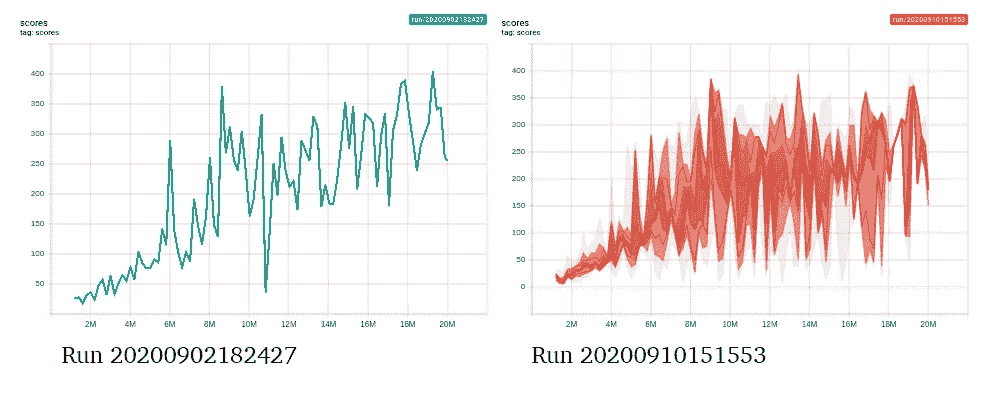

Graph by author

The comparison between the two charts is interesting. While we don’t have the same pattern as a deterministic environment, the spread is definitely narrower than the spread of a deterministic environment.

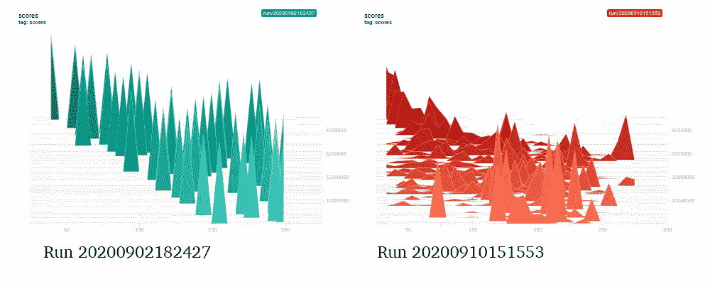

Graph by author

The number of distinct results is increased but remains lower than in a stochastic environment.

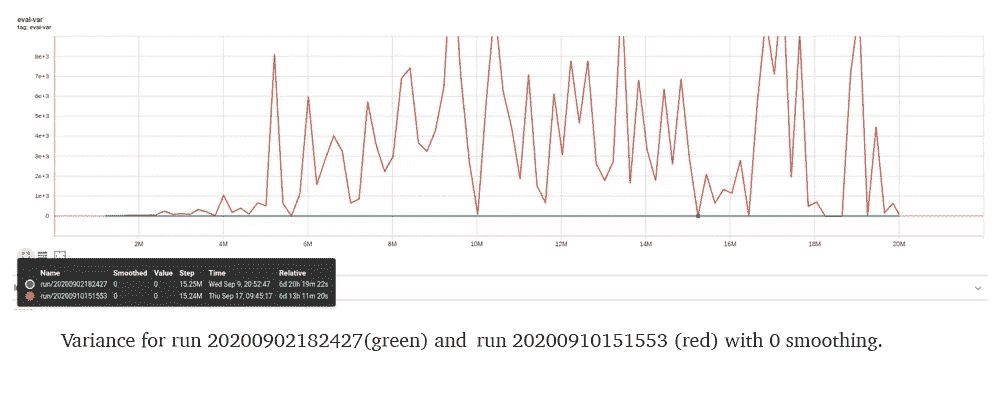

Graph by author

When studying the variance, we can notice that the environment presents signs of a deterministic environment. The variance is close to zero for a few evaluation phases and significantly lower than the variance of our deterministic environment. The technique no-ops injects little stochasticity. It is less efficient than other techniques.

This confirms what Machado et al state in the [2017 ALE 论文](https://arxiv.org/abs/1709.06009):“环境在起始状态的选择之外保持确定性。”

## **随机动作噪音**

最后，我们将观察随机动作噪声的效率。一个随机动作噪声是保持一个小概率用一个随机动作替换代理的选择动作。Deepmind 用的就是这个技术。在评估阶段，他们保持 5%的概率来执行随机动作。

左边是ε= 0 的 BreakoutDeterministic-v4，右边是ε= 0.05 的 BreakoutDeterministic-v4。

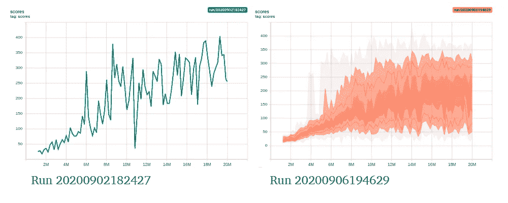

按作者分类的图表

我们可以观察到，保持ε非 nul 显然注入了随机性。得到的结果非常接近我们用 BreakoutNoFrameskip-v0 得到的结果。在下图中，我们还可以看到，在前 2000 万帧中，方差在增加。

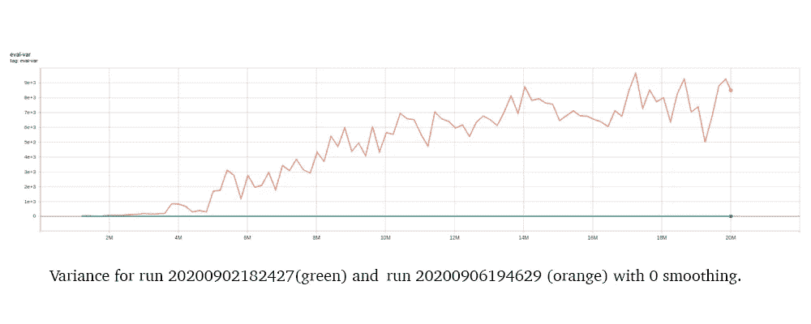

按作者分类的图表

用随机动作噪声注入随机性显然是有效的。尽管它有一个重要的缺点，因为它会影响策略并降低性能。

这支持了贝尔马尔和艾尔。在 2017 年 ALE 论文中写道:“随机行动噪音可能会显著干扰代理人的政策”。

## **太空入侵者**

让我们验证一下我们之前关于太空入侵者的结论。

**确定性与随机性**

首先，让我们验证我们在 SpaceInvadersDeterministic-v4(确定性的)和 SpaceInvadersDeterministic-v0(随机的)之间有相同的区别。

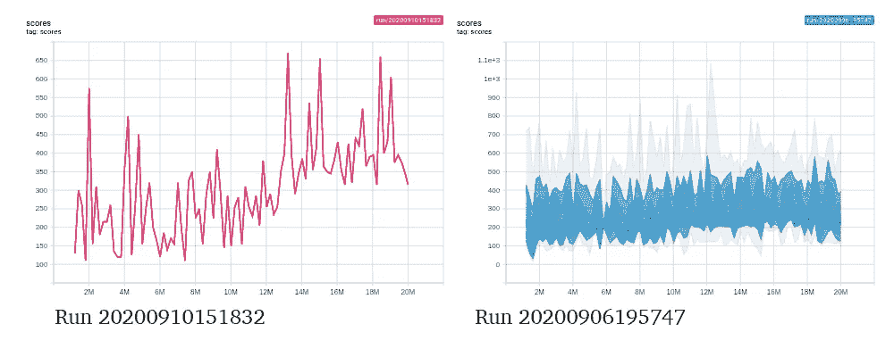

按作者分类的图表

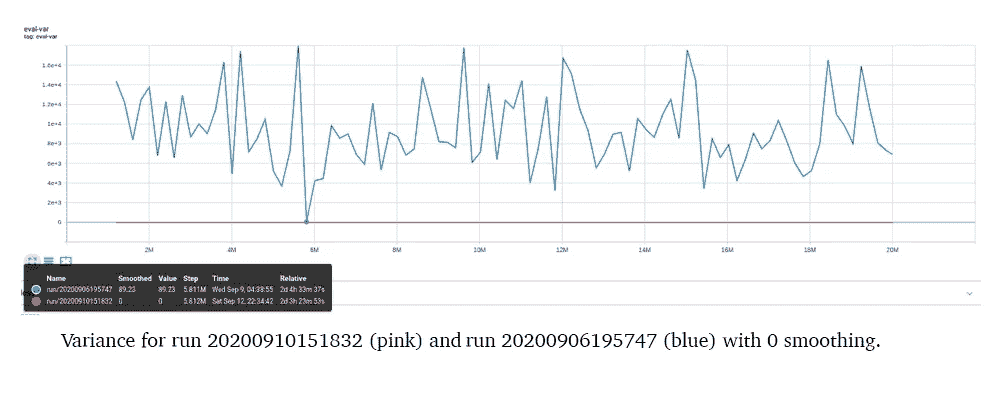

按作者分类的图表

我们在这两种分布上观察到与突破相同的模式。此外，对于确定性环境，分布的方差为零，而对于随机环境，分布的方差非零。

**初始无操作**

对于突破来说，最初的不作为并没有注入随机性。

让我们比较一下 SpaceInvadersDeterministic-v4 和 SpaceInvadersDeterministic-v4 与 no-ops (k=30)。

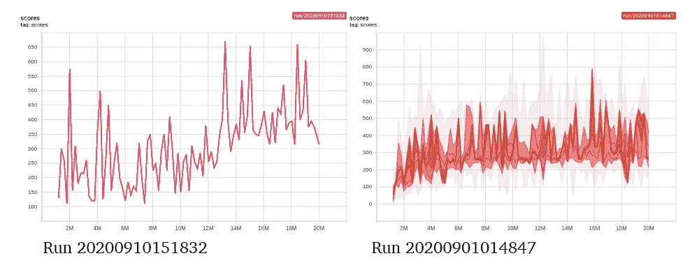

按作者分类的图表

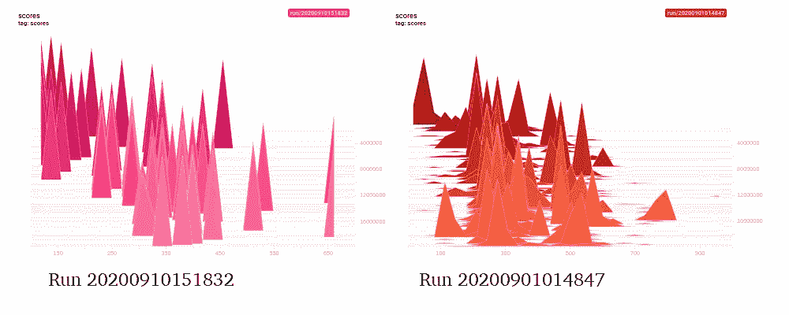

按作者分类的图表

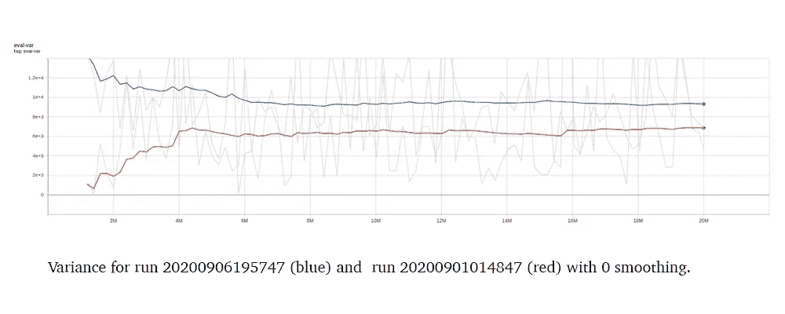

按作者分类的图表

我们可以说，不带任何操作的 SpaceInvadersDeterministic-v4 的行为与 Breakout 相同。它显示了决定性行为的迹象。我们得到了一个显著低于随机环境的方差。

**随机动作噪音**

让我们比较一下 SpaceInvadersDeterministic-v4(左)和带有随机动作噪声的 SpaceInvadersDeterministic-v4(右)。

下面的两个分布清楚地证实了将ε保持为非零值会引入随机性。

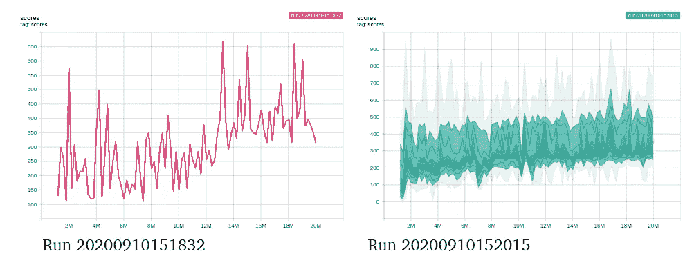

按作者分类的图表

而且，方差几乎和我们随机环境的方差一样。

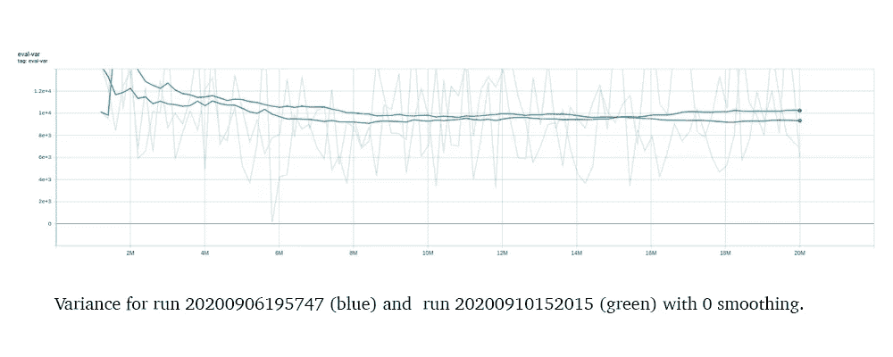

按作者分类的图表

# **结论**

在本文中，我们证明了在 ALE 中注入一定程度的随机性有不同的有效方法。然而，有些方法会带来不良的副作用:随机的帧跳跃会扭曲时间；最初的无操作表现出决定论的迹象，有时对游戏没有影响；随机行为噪声惩罚行为策略。

这证实了 Machado，Bellemare 等人的结论。谁写的:*“*我们的建议是使用粘性动作，最终提出粘性动作作为标准的培训和评估协议。”

因此，当我在开放式人工智能健身房训练时，我倾向于使用{ }确定性-v0，我们有很好的随机性，没有时间失真。

重要的是要注意，如果你正在训练一个 RL 算法，检查你分数的分布是否有决定论的迹象总是令人感兴趣的。

现在，要回答关于 Deepmind 战胜确定性太空入侵者的问题，我会说他们使用了两种方法来注入随机性(初始无操作和随机动作噪音)。

使用这两种方法似乎有些过分，因为随机动作噪声足以确保随机性。也许，Deepmind 开始了他们的无操作实验，并注意到他们在一些游戏中过度适应。不清楚，只有 Deepmind 能说。

尽管很难理解基线方法，但从[结果](https://github.com/openai/baselines-results/blob/master/dqn_results.ipynb)中可以清楚地看出，他们增加了无操作。不清楚他们是否使用了随机动作噪音。使用无操作是否足以在游戏中增加足够的随机性来防止过度拟合？

当使用随机突破环境时，我与 Deepmind 处于相同的性能范围。当转换到具有相同超参数的太空入侵者时，我的结果明显更低。也许这与方法论的差异有关，或者仍然需要对超参数进行一些微调，以便在其他游戏中获得良好的性能。

我希望您喜欢看到确定性环境和随机环境之间的差异！并且，我希望这篇文章能加速你的人际网络在其他任务上的转移，帮助你走向成功。

# **参考文献**

[Deepmind 的 2015 年自然论文](https://www.nature.com/articles/nature14236)

Mnih，v .，Kavukcuoglu，k .，Silver，D. *等*通过深度强化学习的人级控制。*性质* 518，529–533(2015)。

[2013 年 ALE 论文](https://arxiv.org/abs/1207.4708)

M. G .贝勒马尔、y .纳德夫、j .维内斯和 m .鲍林。街机学习环境:通用代理的评估平台，人工智能研究杂志，第 47 卷，第 253-279 页，2013 年。

[2017 ALE 论文](https://arxiv.org/abs/1709.06009)

M. C. Machado，M. G. Bellemare，E. Talvitie，J. Veness，M. J. Hausknecht，M. Bowling。重温街机学习环境:通用代理的评估协议和开放问题，人工智能研究杂志，第 61 卷，第 523-562 页，2018 年。

# **方法和超参数**

[**方法和超参数**](https://docs.google.com/document/d/e/2PACX-1vQVP3qsMYCQrchrfmr2zznL_lFt-bHGgbolr40VxdMKab3k3ksDapX7b_XqjZXmnXuZTVOhqR_QJy_n/pub)