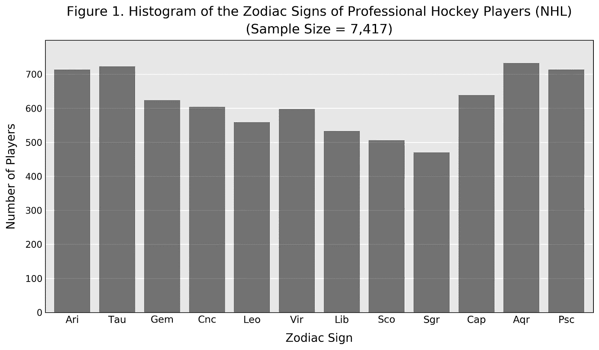
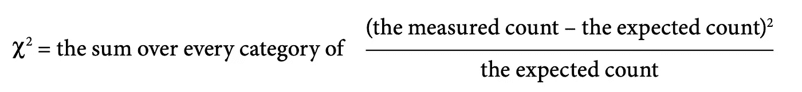
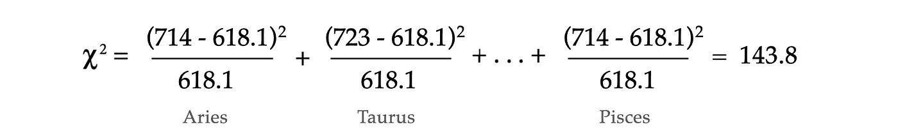

# 全国曲棍球联盟真的摩羯座多吗？

> 原文：<https://towardsdatascience.com/are-there-really-more-capricorns-in-the-national-hockey-league-6edbf4401ea0?source=collection_archive---------51----------------------->

## 用数据科学测试占星术

拥有一个特定的星座会让你在某些职业中获得成功吗？这可能听起来是一个荒谬的问题，如果不是离谱的话。然而，从数据科学的角度来看，它的合法性不亚于学术研究人员和行业分析师每天都在研究的任何其他假设的相关性。你认为答案是什么并不重要；重要的是你能否用数据和统计数据来支持你的观点。在这方面，占星术提供了一个数据科学案例研究的极好来源，因为在所有丰富多彩的迷信背后，占星术最具挑衅性的问题实际上只是数据问题。因此，对占星术进行测试是展示统计推断、计算数据分析的基础知识的一个很好的方式，并且鉴于它引起的强烈反应，如何在检查一个有争议的话题时抛开你的个人偏见。(声明:我不相信占星术！)

此外，如果你仔细想想，占星学和数据科学的共同点比任何一门学科可能愿意承认的都要多。两人都认为可以从数字数据中得出关于个人和群体的有意义的推论。两者都有着制造极其复杂、高度特定、却又极其不准确的预测模型的不幸记录。对于占星术，有一种奇怪的坚持，即太阳、月亮和行星的坐标总是最相关的因素。

我在我的新书《天堂的计划:占星术的历史和在数据中寻找我们的命运》中探索了古代占星术和现代数据科学之间的联系(W. W. Norton，2020 年 1 月)。我的基本论点是，占星家是原始的数据科学家，这带来了所有的好和坏，即使在今天，或者更确切地说，尤其是今天，我们在生成和解释数字预测时，仍然在努力应对许多相同的模式匹配陷阱。正如我在书中所写的，

> “占星家是他们那个时代的定量分析师和数据科学家，我们这些热衷于用数字数据来解开我们自己和我们的世界的秘密的人，只要承认其他人以前走过这条路就行了。”

作为一个恰当的例子，个人是否可以用性格类型来标记，以及这些类型是否适合特定的职业，这个问题实际上几千年来一直令人感兴趣。这又把我们带回了手头的问题:有什么职业显示出与黄道十二宫的相关性吗？为了回答这个问题，我们需要三样东西:

1.  我们需要确定职业，在这些职业中，大样本的出生日期是已知的和可获得的。
2.  我们需要将黄道十二宫的开始日期确定为日历年的函数，这样我们就可以将出生日期映射到星座上。
3.  最后，我们需要选择一个统计测试，它能告诉我们是否有任何星座在我们的数据中被显著地过度呈现

对于这个项目，我使用了标准的 Python 数据科学包 NumPy、Pandas 和 Matplotlib，以及 BeautifulSoup 进行 web 抓取。然而，每一步都相对简单，应该很容易适应其他语言，比如 R、Scala 或 Julia。

## 第一步。收集生日数据

如今，网上不乏生日数据；唯一的限制是你的好奇心和浏览网页的能力。在[](https://www.amazon.com/dp/0393634841/ref=rdr_ext_tmb)*的天堂计划中，我对职业与黄道十二宫的相关性的调查是由一首名为 [*天文学*](https://www.thelatinlibrary.com/manilius1.html) 的古代占星诗的讨论激发的，这首诗是生活在基督时代的一位名叫马库斯·曼尼里乌斯的罗马占星家的作品。尽管它出现的时间相对较晚——⁠很晚，也就是说，鉴于占星术起源于⁠——《天文学》实际上是从古代流传下来的最古老的占星术及其方法。也包含了最古老的十二生肖性格类型的描述。这些中的许多在今天的星象杂志中仍然可以辨认出来。举例来说，金牛座在罗马时代似乎同样缓慢而固执，天秤座也同样墨守成规。*

*马尼利乌斯与每一个黄道星座相关的职业很大程度上是基于星座本身；例如，双鱼座据说是优秀的水手，而天秤座是一流的法官。然而，我很快发现，最有趣的发现来自职业体育领域。*

*职业运动员是星座分析的绝佳对象，因为他们非凡的天赋使他们天生迷人，而他们的名气反过来又使他们的生日很容易在网上找到。你也不必担心样本偏差问题，因为你通常可以得到所有玩过这项运动的人的出生日期。对于职业曲棍球来说，HockeyDB.com 网站是一个无与伦比的宝库。为了方便我们， [HockeyDB](https://www.hockeydb.com/) 在[按字母顺序排列的网页](https://www.hockeydb.com/ihdb/players/player_let.html)上列出了国家曲棍球联盟(NHL)每个球员的生日。因此，只需使用 BeautifulSoup 进行几行 html 解析，我就能够检索到超过 7000 名当前 NHL 前玩家的出生日期列表，并将其存储在 Pandas 数据帧中。*

## *第二步。确定每年的生肖开始日期*

*我们分析的下一步是将生日映射到黄道十二宫。这可以通过 dataframe apply 来实现，它将个人的出生年月日作为输入，并将其与之前计算的黄道起始日期表进行比较。主要的困难是这些生肖的开始日期会随着年份的不同而稍有变化。例如，标志着摩羯座开始的冬至发生在 2019 年 12 月 22 日，但将发生在 2020 年 12 月 21 日。*

*根据我的经验，我发现每个人，不管他们对占星术的感觉如何，都知道自己的星座。然而很少有人知道这些是如何定义的。事实上，这些占星量是根据纯粹的天文计算确定的。尽管有星座的名字，黄道十二宫和星星没有任何关系；相反，从地球上看，它们指示太阳沿其视在轨道的位置。更具体地说，十二个星座表示太阳黄道经度的整数分 30 度。例如，在天文春分点，太阳有黄道经度 0，这标志着白羊座黄道星座的开始。金牛座从黄道经度 30°开始，双子座从 60°开始，以此类推。*

*然而，知道这一点并不等同于能够计算出来。对于任何对计算天文学感兴趣的人，我强烈推荐让·梅乌斯的必不可少的书，[](https://www.willbell.com/math/mc1.htm)*(威尔曼-贝尔，1998)，该书提供了计算任何时期太阳坐标的公式。然而，一种更简单、更准确的方法是通过他们的[地平线在线星历系统](https://ssd.jpl.nasa.gov/?horizons)，直接从 NASA 自身查询这些信息。这项服务由加利福尼亚州帕萨迪纳的喷气推进实验室(JPL)维持，向公众提供用于星际航行的航天器使用的同样的高精度天文数据。深入研究 HORIZONS API 的细节将是另一篇文章的主题，但他们的 [web 界面](https://ssd.jpl.nasa.gov/horizons.cgi)尤其令人耳目一新，用户友好。**

**要确定给定年份的黄道起始日期，您只需每隔一天查询一次太阳的黄道经度，或者为了更精确，每小时查询一次。十二个黄道十二宫开始于这个数量经过 30 的偶数增量的日期。无可否认，这种方法有些低效，因为如果每天只查询一次太阳的位置，那么对于任何给定的年份，只需要 365 或 366 个值来标识 12 个日历日期。然而，这种方法的优点是它是精确的，并且在你计算一次之后，你就不需要再计算一次了。**

## ****第三步。测试假设****

**步骤 1 的结果是当前和以前的 NHL 球员的数据框，由球员姓氏索引，具有包括球员生日在内的各种统计数据的列。步骤 2 的结果是在数据框中添加一个新列，列出每个玩家的星座。一个简单的分组和计数操作会生成下面的汇总表，我们也可以将其绘制成直方图(图 1)。**

```
**Table 1\. NHL Players Grouped by Zodiac Sign
╔═════════════╦═══════╗
║ Sign        ║ Count ║ 
╠═════════════╬═══════╣
║ Aries       ║  714  ║
║ Taurus      ║  723  ║
║ Gemini      ║  624  ║
║ Cancer      ║  604  ║ 
║ Leo         ║  559  ║
║ Virgo       ║  598  ║
║ Libra       ║  533  ║
║ Scorpio     ║  506  ║
║ Sagittarius ║  470  ║
║ Capricorn   ║  639  ║
║ Aquarius    ║  733  ║
║ Pisces      ║  714  ║
╚═════════════╩═══════╝**
```

****

**作者图片**

**表 1 包含了我们将用来检验某些星座是否在职业曲棍球运动员中出现过多的数据。但是怎么做呢？简单地看直方图是不行的，不管它看起来多么有启发性，因为外表可能很有欺骗性，尤其是当样本量很小时。需要一个定量的统计测试来给我们更多的信息。**

**幸运的是——这也是为什么像这样的黄道分析是教授统计学的一个好方法的另一个原因——我们关于黄道十二宫的问题可以被改写成教科书式的统计假设检验。事实上，我们可以使用有史以来最早设计的统计检验之一:卡尔·皮尔逊卡方检验。皮尔森的测试，他在 19 世纪 90 年代不断完善，最初被用于评估掷硬币、掷骰子以及著名的蒙特卡洛轮盘赌的公平性(他发现，这根本不公平)[1]。令人惊讶的是，数学经常揭示两个看似不同的问题实际上是相同的，事实证明，我们关于黄道十二宫的问题在数学上等同于检查 12 面骰子的公平性。**

**换句话说，作为假设检验，我们的零假设， *H₀* ，是职业曲棍球运动员的出生日期和任何特定的黄道十二宫没有关联。更具体地说，我们将把 *H₀* 定义为 NHL 玩家星座的基本分布是均匀的——也就是说，NHL 玩家拥有特定星座的概率与任何其他星座的概率相同，即 1/12。在 *H₀* 下，我们在数据中看到的任何偏离完美一致性的情况都可以被解释为最有可能来自随机噪声。另一个假设 *H₁* 断言，观察到的均匀性偏差足够大，不太可能是由随机噪声引起的。**

```
**Null and Alternative Hypotheses
════════════════════════════════
H0: probability(zodiac sign) has a uniform distribution
H1: probability(zodiac sign) does not have a uniform distribution**
```

**请注意，我们的均匀分布的零假设的优点是，我们不需要测试与每个星座的相关性；在这方面，就好像我们用一个测试的价格得到了十二个测试。**

**要进行皮尔逊卡方检验，我们需要知道三个量:**

*   **根据我们的数据计算的皮尔逊卡方统计χ**
*   **适合我们数据的自由度ν**
*   **我们测试的显著性水平 *α* 。**

****皮尔逊的χ**
皮尔逊的卡方统计量χ对于参加过大学水平实验室测试的人来说可能很熟悉，其计算方法如下:**

****

**等式 1**

**这种形式可以作为二项分布对多项分布的扩展。在大数极限中，每个类别中的结果都接近以该类别的期望值为中心的正态(高斯)分布。皮尔逊卡方统计量是这些准正态分布值的平方和，接近真正的卡方分布。**

**在零假设下， *H₀* ，玩家的出生日期均匀分布在十二个星座上，所以每个类别的期望值就是简单的 *N* ，样本大小，除以类别数，即 12。在我们的例子中，样本大小 *N* ，是 7417。因此，每个星座的 NHL 玩家期望数为 7417/12 = 618.1。(可以肯定的是，这是一个相当不实际的曲棍球运动员人数，但统计学家并不关心这个数字。)使用该值，将表 1 中测得的计数直接代入等式 1，得到:**

****

**自由度，在我们的例子中，玩家的星座有 12 种可能的结果，因此有 11 个自由度**

****显著性水平，***α*
*α*的值是我们要选择的参数。社会科学研究中使用的标准显著性水平为 0.05。这意味着，在零假设下，任何出现概率小于 5%的χ值都被标记为“显著”。相比之下，在粒子物理学中，标准的显著性水平是 1/350 万。**

**一个“显著”的结果是否有意义或有趣，完全由测试者自行判断。这种花招是许多研究中许多错误的根源，也是社会科学中复制危机的主要原因。我认为，这也是现代统计学与占星术的共同点，复杂的算法为实际上非常主观的结论提供了客观的外衣。就我们的目的而言，我们简单地指出，任何统计测试的重要结果主要是作为在何处寻找更深层次的提示性指标。它不是一个充分条件，甚至不是支持一个结论的必要条件。**

****执行测试**
我们现在有了进行皮尔逊卡方检验所需的三个要素。回到等式 1，很明显，我们测量的计数越接近预期的计数，我们的χ就越小。相反，我们的样本越不平衡，我们的χ就越大。那么我们的结果 143.8 在哪里呢？这是皮尔逊卡方检验回答的具体问题。**

**接下来，我们简单地将根据我们的数据计算出的皮尔逊卡方统计χ与临界值标准表进行比较，给出参数ν和 *α* 。对于ν = 11 且 *α* = 0.05 的测试，上尾临界值列为 19.675。我们的测量值 143.8 远高于这一临界值，这意味着，在均匀分布的黄道十二宫的零假设下，我们预计获得这一结果的几率不会超过 5%。因此，我们的结果被认为是测试的“重要”结果。这反过来表明，拒绝均匀分布的黄道十二宫的零假设是有统计学依据的。**

> **换句话说，证据表明，是的，职业曲棍球运动员比其他人更有可能有某些星座。**

## **相对年龄效应**

**你对这个结果感到惊讶吗？我当然是。但是好的数据分析的价值在于它能够揭示一些你以前不知道的东西；否则，整个练习只不过是证明你已经相信的东西的一种精心制作的方式。然而，正如我们在上面所断言的，统计假设检验的结果既不是对这个世界做出任何有意义的推断的必要条件，也不是充分条件。相反，这些测试提供了一种便捷的方式来识别值得深入研究的主题。这当然适用于像我们这样奇怪的结果，这似乎意味着你的星座与你的曲棍球实力有某种联系。**

**我在进一步研究中发现，这种与恒星或行星完全无关的现象已经被了解和研究了几十年[2]。这被称为[相对年龄效应](https://en.wikipedia.org/wiki/Relative_age_effect)，它在依赖于年龄界限严格的竞技青年联盟的体育运动中相当常见。**

**例如，青少年曲棍球联盟通常根据球员出生的日历年对他们进行分组。这意味着一个出生于 1 月 1 日的球员将会比他出生于 12 月 31 日的队友大将近一岁，尽管他们属于同一个年龄段。对于 9 岁或 10 岁的球员来说，这种差异代表着巨大的发展优势，无论是身体上还是精神上。由于只有某一年的最佳选手才有可能进入下一个级别，累积效应是一个逐渐淘汰射手座、天蝎座和天秤座而支持摩羯座、水瓶座和双鱼座的系统，甚至在这些选手成为职业选手之前。如图 1 所示，最终结果是惊人的。**

**类似的偏见也出现在美国职业棒球大联盟和国家足球联盟中，前者的球员倾向于八月生日，后者的球员倾向于一月生日。有趣的是，在有组织的青年联盟不太重要的篮球运动中，没有观察到相对的年龄效应。**

**相对年龄效应会在体育之外的任何地方出现吗？大多数地方的学年都有一个秋季截止期，一些研究声称，可以在学术成就、工作成功和一系列其他影响我们生活的指标中找到偏见。如果是的话，那么影响是很小的。然而，正是这种发现之前未知的相对年龄效应的诱人可能性，使得分析不同职业的生肖成为一种有趣的数据科学转移。**

**除了已经讨论过的职业，我还关注了国会中的共和党人和民主党人、最高法院法官、奥林匹克水手和英国足球运动员。对这些群体来说，没有一个数据支持拒绝出生日期全年均匀分布的假设。(当然，请注意，通过采用 0.05 或 1/20 的显著性水平，我可以确保平均而言，20 个调查中有 1 个会产生完全偶然的显著结果。)我知道还有一个众所周知的大群体，他们的生日呈现出明显的、不一致的模式，但我将在另一个时间讨论这个问题——[或者你可以在我的书](https://www.amazon.com/dp/0393634841/ref=rdr_ext_tmb)中读到它！**

**最后，我希望这个练习能提供一个迷人而难忘的例子，说明统计学和数据科学是如何帮助我们理解我们生活的世界的。有了数据，你永远无法准确预测你会发现什么。对我来说，这使它的启示力量比占星术承诺的任何事情都更令人兴奋。**

## **参考**

**[1]亚当·库恰尔斯基，*《完美的赌注:科学和数学如何把运气从赌博中剔除》*(纽约:基础图书，2016)，第 4–7 页。**

**[2]特别参见马尔科姆·格拉德威尔，*局外人:成功的故事*(纽约:Little，Brown 出版社，2008 年)，第一章。1.**