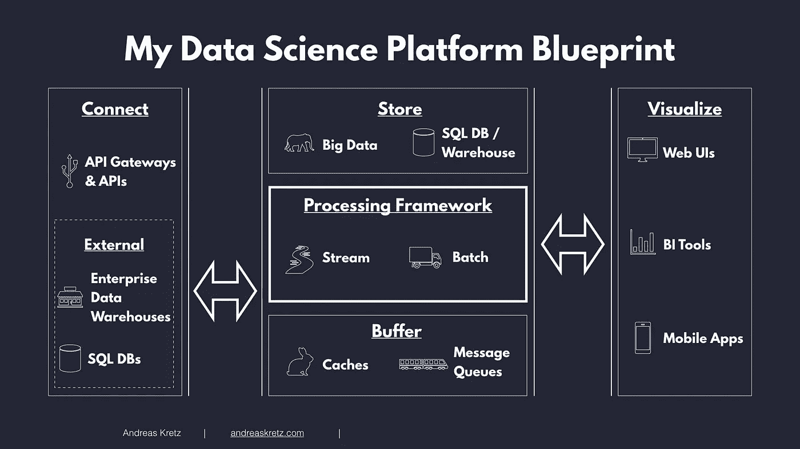

# 确定您需要的云工具的智能而简单的方法

> 原文：<https://towardsdatascience.com/are-tools-in-the-cloud-market-confusing-to-you-5ffa6a758f03?source=collection_archive---------76----------------------->

## 你首先关注职位还是公司？

来自[佩克斯](https://www.pexels.com/photo/architecture-buildings-business-city-325185/)的亚历山大·帕萨里克拍摄的迪拜城市景观

首先，作为一名数据工程师，我可以告诉你，有这么多工具需要担心，但只有少数*工具*是你真正会用到的！

其次，当你研究和筛选工作机会时，你会遇到很多工具。Hadoop，Spark，AWS Lambda，TensorFlow，Kafka，Google Pub/Sub，Airflow，Hive，Azure Data Lake，Kubernetes 等等。有些甚至在一个开口中包含了几种语言、框架和工具！

> 事实是，你永远不需要知道大部分，也绝对不需要知道全部。

通过这三个简单的步骤，你可以找到符合你职业目标的工具。

*   了解数据科学平台的要素
*   了解传统数据科学角色和职责
*   首先关注公司，而不是职位

# 数据科学平台要素

了解公司中数据科学平台的要素非常重要。一个平台可以是内部的、完全基于云的或部分基于云的(混合)。亚马逊网络服务(AWS)、微软 Azure (Azure)和谷歌云平台(GCP)是一些使用最广泛的云平台。

LinkedIn 顶级语音数据工程师 Andreas Kretz 创建了一个了解任何数据平台的蓝图。他取消了所有工具，以便根据公司不断变化的需求进行调整。

数据科学平台蓝图由 [Andreas Kretz](https://github.com/andkret/Cookbook/blob/master/images/Data-Science-Blueprint-New.jpg)

蓝图的模块传达了团队中各种互补的任务。

## 连接

*   从数据源(API、数据仓库或关系数据库)中提取数据
*   将数据发送到您的 API 服务以存储在临时存储中(以允许后面的模块快速访问)

> 几个工具:REST APIs，Apache Flume，AWS API Gateway，Azure Event Hub，GCP 云数据流

## 缓冲器

*   在存储之前，将数据从 API 发布到缓冲区消息队列中
*   Buffer 允许您管理数据负载，避免系统不堪重负

> 少数工具:Apache Kafka、Apache Redis Pub-Sub、AWS Kinesis、Azure Data Factory、GCP Pub/Sub

## 处理框架

*   以流(实时数据)或批(数据区块)的形式分析数据(存储中)
*   一些用例可能还要求您将数据写入存储

> 一些工具:Apache Spark，MapReduce，AWS Lambda，Azure Databricks，GCP 计算引擎

## 商店

将缓冲区中的数据存储在存储模块中

> 一些工具:SQL 数据库，NoSQL 数据库(Hadoop HDFS，MongoDB 等。)、NoSQL 数据仓库(Hive 等。)，AWS 红移，Azure 数据湖，GCP BigQuery。

## 设想

*   将数据中的见解可视化
*   设置一个网络用户界面，一个移动应用程序，甚至一个数据可视化工具
*   或者，创建一个 API，为开发人员提供对商店模块中数据的访问
*   使用 API，用户可以为他们的业务案例开发定制的可视化

> 少数工具:Android 和 iOS 应用程序，仪表盘(Grafana，Kibana 等。)、Web 服务器(React、Tomcat 等。)、数据可视化工具(Tableau、Power BI 等。).

在数据科学蓝图中，专业化在最近几年加速发展。理解这些角色会让你深入了解团队内部的协作。

# 传统角色和职责

数据科学团队聚在一起解决复杂的数据问题。传统数据科学团队中的每个角色都有特定的词汇表。

有数据科学家、数据工程师和数据分析师，但也有混合角色，如机器学习工程师！

## 数据科学家

这无疑是最受欢迎的角色。

*   他们应用统计学和算法的理论知识来寻找解决数据科学问题的最佳方法。
*   他们将业务问题转化为数据问题，创建预测模型来回答问题，并讲述他们的发现。

## 数据工程师

可靠的数据基础设施的提供者。

*   他们专注于编程来处理大型数据集，清理数据并实现来自数据科学家的请求。
*   他们构建和维护项目的数据架构，并确保服务器和应用程序之间的数据流不会中断。

## 机器学习工程师

*   他们接受数据科学家的分析，并将其部署到生产中。
*   这是因为数据科学家传统上不是处理万亿字节数据并将其代码实施到生产中的工程师。

## 数据分析师

*   他们进行调查，提供报告和可视化来解释数据中隐藏的见解。
*   它们通过图表和仪表板帮助公司员工理解特定的查询。

> 不同公司的两位数据科学家或数据工程师，甚至同一家公司的两位数据科学家或数据工程师，可能从事完全不同的工作。

所以，首先关注*公司*——而不是职位头衔

# 首先关注公司，而不是职位

试着找几个真正适合你工作和发展职业的公司(想想文化、机会、人脉等等)。

确保入围公司拥有*相似的*数据科学平台架构。例如，你可以通过查看他们在职位空缺中要求的工具来了解一家公司的结构。从同一个提供商那里将他们的系统部署到云上的公司共享许多工具。

> 接下来，确定特定数据科学角色的交付成果。

您需要在生产环境中编写代码吗？您需要创建数据管道吗？您是否将使用可视化工具对内部数据执行分析？

> 可交付成果详细描述了候选人日常工作的性质。而职位描述是为了鼓励具备各种技能的候选人去申请。

之后，列出你获取技能并通过项目实施所需的工具。您可以根据蓝图中的每个模块对工具进行分类。

由于你的入围公司有相似的数据平台，你将*淘汰*市场上的大多数工具。您现在只有少量的工具来构建您的项目。

# 结束语

一旦你有了相关的经验，不仅仅是在 GitHub 上发布代码，而是在 Medium 或 LinkedIn 上为你的项目写一篇详细的博文。为自己创建一个投资组合。这给了你更多的曝光率，也体现了你对自己工作的深刻理解。

有了相关的经验和曝光率，你会和大多数招聘经理有联系。因为他们看到你知道如何利用他们所使用的工具！

*感谢阅读！我很想在下面的评论中听到你的想法。你也可以关注我的* [*LinkedIn*](https://www.linkedin.com/in/prakashdontaraju/) *和*[*Twitter*](https://twitter.com/WittyGrit)*。*

*如果你觉得这篇文章可能对你认识的人有所帮助，请与他们分享这个链接:*[*https://bit.ly/36Dpj2Z*](https://bit.ly/36Dpj2Z)