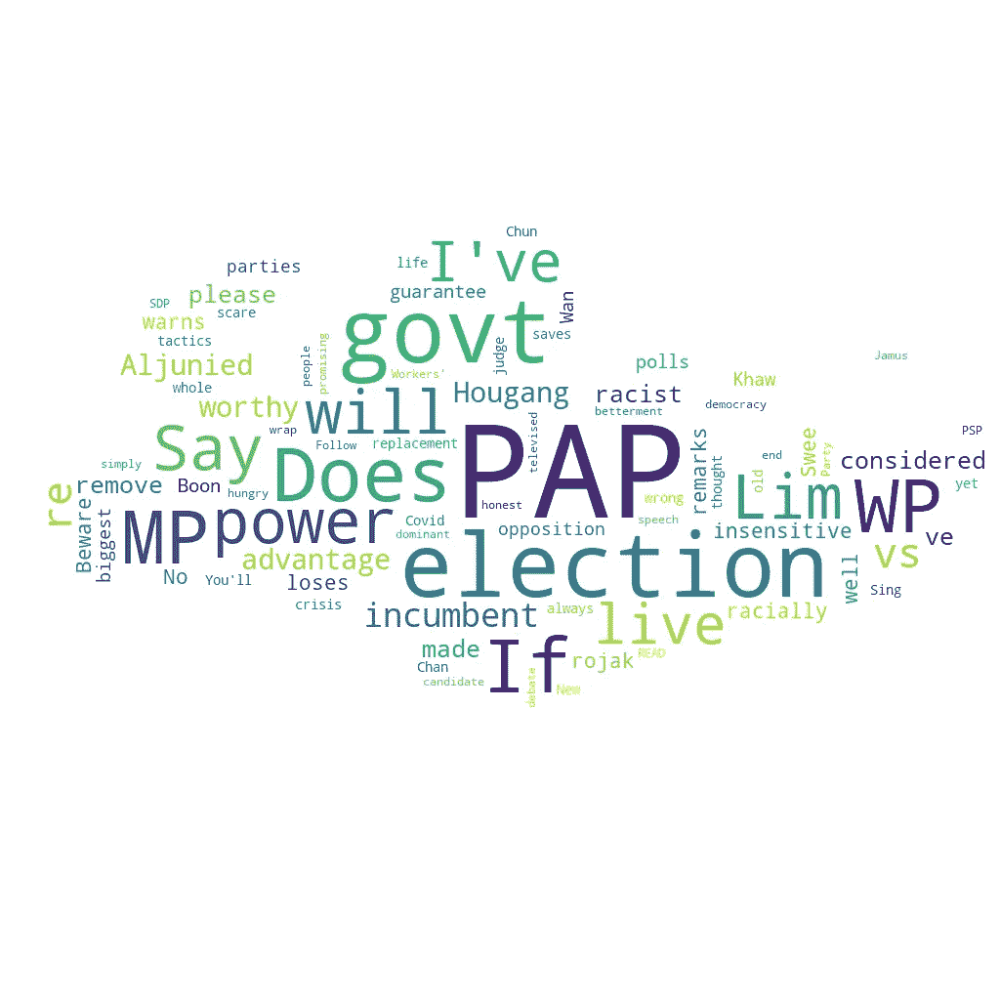
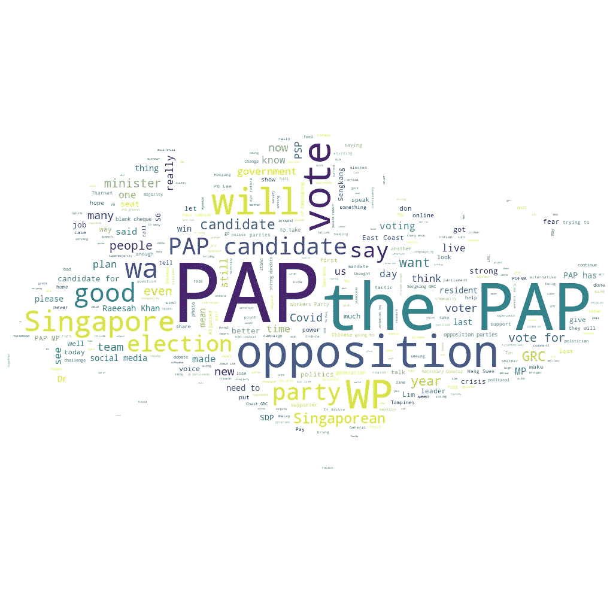
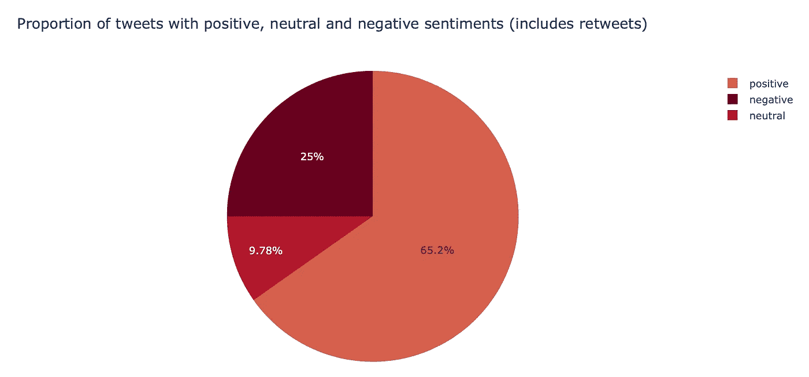
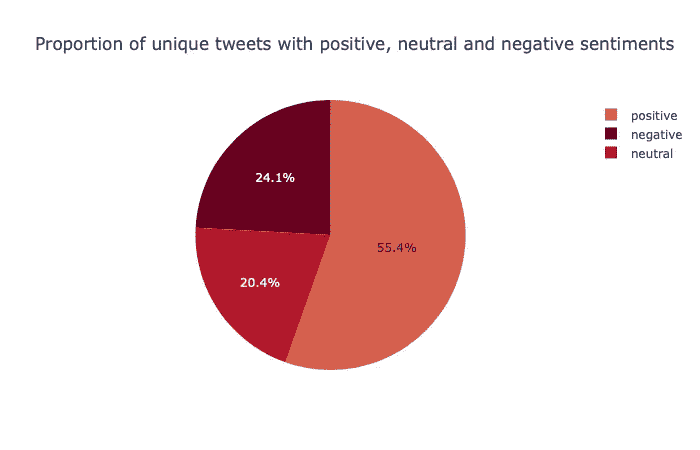
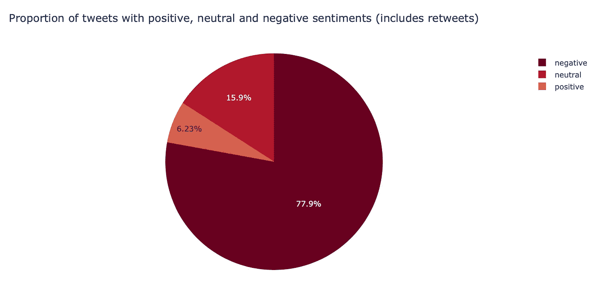
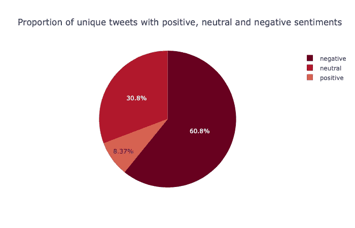

# 推特情绪是否反映了 2020 年新加坡大选的结果？

> 原文：<https://towardsdatascience.com/are-tweet-sentiments-reflective-of-the-results-in-the-2020-singapore-general-elections-421d07cf3c1a?source=collection_archive---------40----------------------->

## 利用 VADER 和伯特，我分析了与新加坡执政党在 2020 年大选前夕相关的推文情绪。

阿诺·杰格斯在 [Unsplash](https://unsplash.com?utm_source=medium&utm_medium=referral) 上的照片

一个多月前的 7 月 10 日，新加坡举行了第 14 届国会议员选举。作为第一次投票的选民，当你有很多空闲时间的时候，你会做什么？你进行了一项快速研究，分析推文的情绪，看看它们是否反映了选举的实际结果。好吧，我想我可能是唯一一个以这种方式思考的人(书呆子警告)，但无论如何，让我们直接进入它吧！

# 下载推文

使用 Tweepy API，并借助格里芬在这篇[文章](https://medium.com/@leowgriffin/scraping-tweets-with-tweepy-python-59413046e788)中使用的代码，我下载了使用“PAP #GE2020”作为搜索词的推文。

PAP 代表人民行动党，是新加坡的执政党。大多数在推特上发布关于 2020 年新加坡大选的人都使用 GE2020 标签。

我仔细考虑了一下什么是合适的搜索词——简单地使用#GE2020 不太正确，因为收集的推文也包括那些反映公众对反对党情绪的推文。虽然我使用的搜索词会排除那些没有提到人民行动党或使用标签 GE2020 但实际上是在谈论执政党的推文，但我觉得这是我能够最接近于隔离反映对执政党情绪的推文的方法。

我也选择了转发，因为我认为 Twitter 用户倾向于转发他们有共鸣的推文。我的数据集包括 7 月 6 日至 7 月 8 日之间发布的推文和转发，自投票日(7 月 10 日)即将到来以来，这里的在线政治讨论可能是最活跃的。顺便说一句，你可能想知道为什么 7 月 9 日被排除在外，因为这一天是[冷静日](https://www.gov.sg/article/what-happens-on-coolingoff-day)，在这一天禁止竞选活动，以便让选民在第二天前往投票站之前退一步思考问题。

我原本希望收集 50000 条推文和转发，但最终得到了大量重复的数据，可能是因为在短短 3 天内，没有多少推文符合我的搜索词标准(我还忘了，新加坡的公民人口约为 350 万(T1)，从一开始就不算多)。我的最终数据集包括 2504 条推文和转发，以及 406 条独特的推文。

现在，你可能会好奇这些推文中有哪些常用词。让我们创建单词云来了解一下吧！

推文和转发的词云

在包括推文和转发的词云中，一些可能令人感兴趣的术语包括“WP”，代表工人党，“Hougang”和“Aljunied”，这是目前由反对党控制的选区。在推特上频繁提到这些术语可能表明，工人党是最受关注的反对党，Hougang 和 Aljunied 选区可能是即将举行的选举中受到密切关注的选区之一。另外两个反对党，PSP(进步新加坡党)和 SDP(新加坡民主党)也经常在推特上被提及。

“仅用于推文的云”这个词怎么样？

仅用于推文的词云

我们观察到推文中常用的词汇种类要多得多，但工人党仍然是许多推文中的突出主题。

虽然词云允许我们在我们的数据集中挑选出推文中的常用词(到目前为止这并不太令人惊讶)，但我们不知道这些推文的情绪是什么样的。这就把我们带到了下一部分，我用 VADER 和伯特进行了情感分析。

# 使用 VADER 的情感分析

由[维克多·福加斯](https://unsplash.com/@sonance?utm_source=medium&utm_medium=referral)在 [Unsplash](https://unsplash.com?utm_source=medium&utm_medium=referral) 上拍摄的照片

我相信大多数人都非常熟悉 [VADER](https://pypi.org/project/vaderSentiment/) (化合价感知词典和情感推理器)，所以我不会在这篇文章中用冗长的解释来烦大家。相反，我将直接进入我的发现，在那里我展示了被分类为携带积极、消极或中性情绪的推文的分类。

推文和转发的推文情感分类

对于包含转发的数据集，VADER 将大多数推文分类为正面，四分之一为负面，略少于 10%为中性。

仅针对推文的推文情感细分

在排除转发后，VADER 将一小部分推文归类为正面，但这一比例仍略高于 50%，其余推文在负面和中性之间相当平均。

显然，VADER 不太擅长讽刺

我快速浏览了一下分类推文，意识到 VADER 在使用讽刺时往往无法察觉正确的情绪，这并不令人惊讶。在这个例子中，推文表达了对执政党的负面情绪，但 VADER 却表达了正面情绪。哇，尴尬，确实(抱歉，我没忍住)。

# 使用 BERT 进行情感分析

BERT(来自变压器的双向编码器表示)是 Google 开发的最先进的 NLP 模型， [Rani 的文章](/bert-explained-state-of-the-art-language-model-for-nlp-f8b21a9b6270)很好地解释了它的内容。

出于这项研究的目的，我将使用由 Preston 使用 [Kaggle 航空公司 Twitter 数据集](https://www.kaggle.com/crowdflower/twitter-airline-sentiment)微调的 BERT 模型，详见他的文章 [here](https://medium.com/@prestonlim/are-singaporeans-negative-nancies-a-sentiment-analysis-of-social-media-comments-using-bert-5a6e51b1c1e2) 。

伯特是如何对推文进行分类的？

推文和转发的推文情感分类

当转发被包括在内时，伯特将大多数推文归类为负面，这与 VADER 的分类大相径庭。

仅针对推文的推文情感细分

当只考虑推文时，BERT 将一小部分推文归类为负面，但它仍然是大多数人的观点。

还记得那条被 VADER 错误归类的讽刺性推特吗？让我们看看伯特是否能找到正确的情绪。

在这里，伯特很好地处理了讽刺性的评论

伯特成功检测出这条推文中的负面情绪！

但是伯特也不是完美的

我快速浏览了一些由模型分类的推文，意识到伯特有时很难发现正确的情绪。在这里，我们看到一个消极情绪的例子，但是伯特把它错误地归类为积极情绪。话又说回来，即使我作为一个人也发现有时很难正确识别情感，所以我们怎么能指望机器完美地完成工作呢？

# 实际的选举结果是什么样的？

总结 2020 年新加坡大选的实际结果，虽然人民行动党保持了在议会的绝对优势，但它失去了一个额外的选区(Sengkang ),输给了工人党。人民行动党的平均得票率下降到 61.24%，这是自 2011 年选举以来的最低得票率。

即使在存在讽刺的情况下，伯特也可能是正确分类情绪的更好模型，但鉴于它在 Twitter 上检测到的主要是负面情绪，我预计投票会更加激烈地偏离执政党。或许，在转向社交媒体表达政治观点时，存在一定程度的自我选择——在推特上发声更多的人往往是执政党的批评者，而执政党的支持者更有可能在社交媒体平台上保持沉默。

另一个可能的解释是 Twitter 用户的人口统计数据。[推特用户往往更年轻](https://mediaonemarketing.com.sg/social-media-marketing-singapore-guide/#:~:text=In%202020%2C%20there%20are%201.37,aged%2013%2B%20is%2026%25.)，这意味着即使没有表达政治观点的推特用户的自我选择，推特观点也只能代表新加坡人口的一个子集。

# 包扎

这项研究的一个有趣的延伸是对新加坡更突出的反对党，如 WP，PSP 和 SDP，进行同样的过程，然后比较情绪的比例与 PAP 的比例。

总而言之，我从这个无聊的宠物项目中获得了很多乐趣，所有相关的代码和文件都可以在 GitHub [这里](https://github.com/meredithwan/GE2020)找到！

*免责声明:本文观点完全属于我个人，绝不代表我所属组织的观点。*