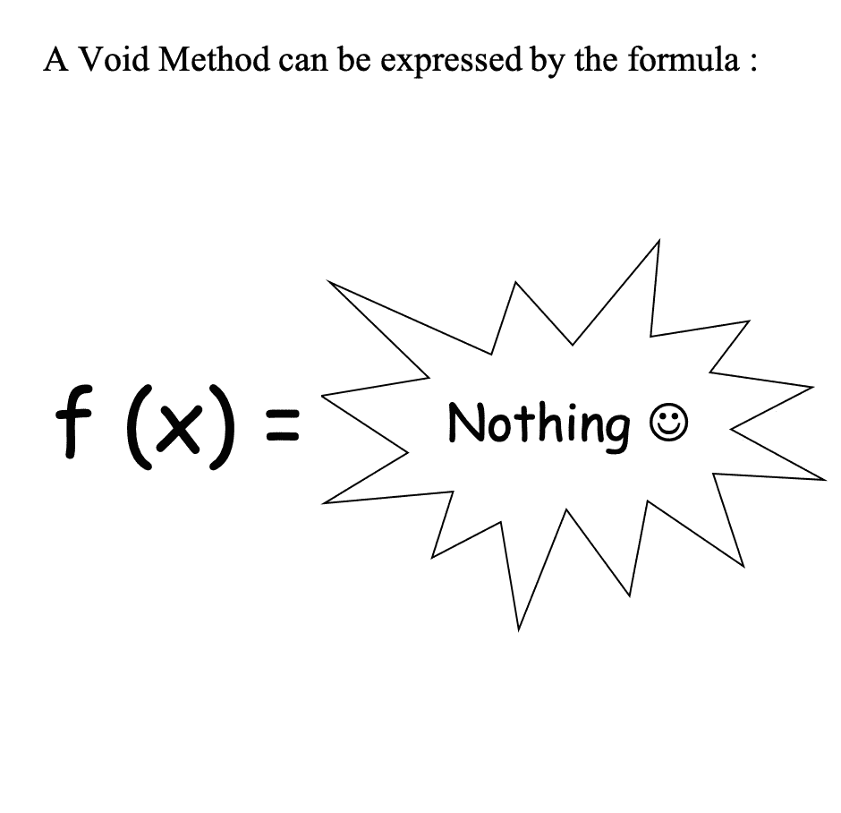

# Void 方法不好吗？

> 原文：<https://towardsdatascience.com/are-void-methods-bad-6d67dedc6600?source=collection_archive---------9----------------------->

## 编码最佳实践

## 为什么要避免它们，什么时候不要。

Void 方法定义(图片作者: [Pratick Roy](https://medium.com/u/d0e73ebdbb0c?source=post_page-----6d67dedc6600--------------------------------) )

# 元

*深入探究无效方法的本质和相关的副作用。为什么你应该尽量避免它们。以及那些你不该做的事。*

虽然我试图用标题来表达这篇文章的主题，但在上面的段落中，我还是添加了这篇文章的简短描述。这有两个目的。

1.  搜索引擎优化😅
2.  过去无数次，我点击了一个链接，读了几段才意识到那不是我要找的。所以作为一个好撒玛利亚人，我想给你一个快速的出口点，以防你来这里期待别的东西。

## *Tldr；有时间吗？阅读全文。否则搜索“*

*再次按照我自己的阅读模式，有时我想阅读并从帖子中吸取一些东西，但没有时间，或者有时，我大致理解并同意这个主题，所以不想费力地阅读所有文本，只是看看是否有任何新的信息或观点可以从中收集。结果整个帖子，我都标注了: ***键外卖*** *。*我鼓励你阅读整篇文章，但是如果你愿意的话，可以点击可信的 Ctrl/Cmd+F .:)*

*不返回任何东西的方法、函数(或者任何你想称之为它们的东西)，也就是具有 void 返回类型的方法、函数，是编程的主要部分。事实上，它是所有 Java 开发人员看到的第一个返回类型。*

*如果您不是 Java 开发人员，那么，*

> *你先生/女士，是一个没有勇气的恶棍，没有勇气，我说！😛*
> 
> *—约翰·奥利弗*

*但是不管您选择的是哪种编程语言，您肯定都遇到过 void 方法的概念。因为在我们的二元世界中，void 方法无处不在。这些方法如此普遍，我们如此熟悉，以至于我们很少停下来想一想，我敢说，它们是多么怪异，多么阴险。*

*因为想想看，一个 void 方法不提供任何输出。那么为什么会有人写一个方法，然后只为了不返回任何东西而调用它呢？对于 Ex 来说，*

*没有一个头脑正常的人会创造出这样的方法。我们不能用这种方法，来建造任何有价值的东西。我们可以用不同的值调用这个方法一百万次，但这无关紧要。 ***【关键外卖 1】****

> *就其本身而言，Void 方法是死代码。就像病毒一样。它本身不能“活”在编程的世界里。就像病毒需要宿主真正活着一样。无效方法需要副作用[1][2]才能真正存在。*

*现在让我们修改上面的代码，引入一些副作用。*

*现在让我们看看这段代码。每次调用`add()`时，作为副作用，加法器类的状态会改变，实例变量`cumulativeValue`会增加`value`*

*所以现在我们可以用这个来达到某种目的。在这种情况下，我用它来查找从 0 到 9 的所有数字的总和。因此再次重申。*

> *Void 方法本质上是依赖于副作用的方法。如果一个方法没有产出，没有副作用，没有人会写它，也没有人会调用它。*

*“嗯”，现在可能会说。“如果没有副作用，无效方法就没有意义。酷毙了。我只介绍副作用并加以利用”——说得对。标准编程语言[3]中没有任何东西会阻止你这样做。编译器会毫无疑问地通过它。但是你的代码审查员应该阻止你。**而如果审核人是我。那我会的！***

*你看，当你写一个 void 方法的时候，你实际上是在向世界声明**，这个方法是通过副作用工作的。**还有，**代码或者有状态编程中的副作用，就是代码味。这使得你的代码难以阅读，甚至更难调试和扩展。***

*所以推而广之，这就引出了一个问题，*

**void 方法不好吗，我们应该永远不使用它们吗？**

*— **井**、**是和否**一般是。如果你能写一个方法，它可以工作而没有副作用，那么你一定要写。在大多数标准编程中，你将能够完全避免空洞(看我是怎么做的，嗯..啊..没人吗？好吧)。但是，这很重要**，有些事情本质上是有状态的，当这种情况发生时，我不仅会认为 void 方法是可接受的，还会推荐它们。***

*现在，我明白了，上面的回答似乎有点混乱，在某种程度上自相矛盾。所以，让我们观察一些在行动中的虚空方法，并了解什么使好或坏。*

# *无效方法不正确*

*一般来说，坏的空是指底层操作不需要状态全满，或者引入副作用。为什么？为了理解这一点，让我们扩展一下我们的加法器类。*

*现在我们已经为我们的加法器类添加了一个简单的逻辑扩展。`reset()`。这个方法本质上是将`cumulativeValue`重置为 0，这样我们就可以再次使用加法器了。*

## *逻辑不是封装的*

*然而，即使在这个简单的例子中，我们也开始发现问题。在随后的`add()`之前没有调用`reset()`意味着错误的加法。*

*在这个例子中，错误很容易避免。但这是因为我们在这方面有明显的优势。我们完全了解代码的内部工作原理，并且我们是唯一的作者。现实生活中我们有多少次有这种优势？几乎没有。回想一下，*

**你关闭过的所有资源了吗？更重要的是，您是否总是知道资源是否需要关闭？**

*我想说的是，引入状态通常会导致客户必须负责任地使用您的代码，否则会导致问题。虽然我完全信任你的开发伙伴，但我自己也赞同这样的理念: ***【关键要点 2】***，*

> *为了按预期使用我的代码，越少人需要知道和理解我的代码，越好。你的截止日期快到了，你做了一个合理的假设，只是在这个案例中没有成功。我们都是人，都会犯错。在与我的代码交互时，我给你犯这个错误的机会越少，对产品、客户和代码库就越好。*

## *甚至代码错误也没有封装。*

*在这个特殊的例子中，假设引入了一个 bug，现在我们的 reset 方法看起来像这样。*

*现在，没有一种`add()`方法会像预期的那样工作。你看到问题了吗？ ***【关键外卖 3】****

> *void 方法的轻微误用和少量状态满性的引入意味着，甚至代码错误也变成了非封装的。一个方法中的错误会影响另一个方法的运行。最重要的是，这很可怕。*

*在我们的 30 行代码中，很容易找到这种外部依赖性。但是，**如果这一行隐藏在代码库的深处呢？**再者，**如果这个 bug 是公开直播的怎么办？当你从一根意大利面条摸索到另一根面条，试图找到并解决这个问题时，你的客户在他们所有的订单上都看到了错误的价格信息。***

*我不会责怪作者或评论家错过了这个 bug。对于添加的特性，代码可能是合法的，但是它在代码的其他部分导致了意想不到的后果，这甚至不是提交的一部分。*

*于是， ***【关键外卖 4】****

> *一个方法的影响应该尽可能保持在本地。做到这一点的一个好方法是不改变类/全局变量的状态或传递的参数的状态。这样做意味着，除非你返回一个输出，否则你的代码是没有意义的，因此，避免 void。*

# *好的无效方法*

*让我们评估几个场景。*

*   *在文件/数据库等中写入持久存储的数据。*
*   *渲染用户界面，使用干净的设计模式和框架，如 MVVM，React-Redux 等。*
*   *调用其他有副作用的方法。(你不应该这样做，但是全面禁止这种做法是不现实的)*
*   *等等。*

*所有这些场景都有一个共同点，**该方法的底层操作或意图是提交有状态行为。**这里我们绝对必须改变状态。它仍然有风险。外部变化，如数据库损坏，将导致我们的操作失败。我们应该进行合理的验证、幂等性检查和所有的工作来降低风险，但是我们不能消除有状态性，仍然构建我们的产品。*

*而在这种情况下，当你必须有副作用的时候，**不仅可以使用 void。你应该使用 void。**因为这凸显了一个事实，即正在讨论的方法有副作用，而且它被设计成有副作用。这做了两件事，*

*   *首先，它告诉读者所有非 void 方法都不会改变状态，所以可以肯定调用这个方法不会有任何意外的副作用。这是一个很好的能力，因为它本质上降低了我使用、扩展和调试代码所需的知识量。*
*   *第二，我确切地知道哪些方法将改变状态。如果我想用那种方法，我会小心的。这很重要。如果我们不遵循这一点，所有的方法都可能有意想不到的副作用，那么我在使用任何方法时都需要小心。而人类思维的运作方式，如果我们总是需要小心，那就永远不会小心。通过减少副作用，我们可以有效地与读者、客户和评论者进行沟通，在这种情况下，谨慎是应该的，关注是有保证的。*这就像在一篇文章中放入关键的外卖标记一样:)**

*于是，***【关键外卖 5】****

> *如果方法的潜在意图是提交有状态的行为，比如写入数据库，那么应该使用 Void 方法。它将纯函数方法与有副作用的方法分离开来，告诉我们哪里需要注意和小心，哪里可以假设调用时不会出现预期的副作用。*

*我省略了几个要点，其中最重要的是编写无状态方法对性能的影响。在许多情况下，有状态方法更具性能。典型的例子`Collections.sort()` [4]。通过就地对列表进行排序，无疑节省了内存，并且可能花费更少的时间。*

***在这里，我要说的是，在大多数情况下，我会毫不犹豫地接受这一业绩打击**。我已经在一篇文章中详细讨论过了，我不久前写的。因此，请检查一下，或者如果你喜欢直接讨论这个或任何其他事情，那么就给我留言吧！:)*

* [## 什么是好代码？

### 10 分钟可操作的介绍。

towardsdatascience.com](/what-is-good-code-an-actionable-introduction-1cad30551ad4)*  *[## 点击此处订阅:)

### 想在我写新东西时得到通知吗？每当我发布时收到电子邮件！

有两种作家，写得多的和写得少的。我是后者。我痴迷于创造价值，回避噪音。如果想看这样的内容，可以考虑订阅。](https://pratickroy.medium.com/subscribe)* 

# *来源、脚注和进一步阅读链接*

*   *关于副作用的一个很好的介绍维基:
    【1】[【副作用(计算机科学)】](https://en.wikipedia.org/wiki/Side_effect_(computer_science))，维基百科*
*   *一个很有见地的问题，强调了代码中副作用的经常是无意的后果:
    【2】[system . out . println()在 Java 中有副作用吗？](https://stackoverflow.com/questions/34552710/does-system-out-println-have-a-side-effect-in-java) (2016)，堆栈溢出*
*   *当我提到标准编程语言时，我指的是那些通常用于企业开发的语言。他们大多支持一个虚空的概念。但是另一类语言却不这样。建立在函数式编程范例之上的语言。现在重要的一点是，我并不是说这些语言不能用于构建大型产品，事实上，许多其他“标准”语言现在为虚拟编程的许多方面提供了本地支持，包括 Java。但你必须从某个地方开始旅程，我建议你从这里开始。
    【3】[https://www . Geeks forgeeks . org/functional-programming-paradigm/](https://www.geeksforgeeks.org/functional-programming-paradigm/)(2019)，极客为极客*
*   *`Collections.sort()`
    【4】[https://Docs . Oracle . com/javase/7/Docs/API/Java/util/collections . html # sort(Java . util . list)](https://docs.oracle.com/javase/7/docs/api/java/util/Collections.html#sort(java.util.List))、Oracle Docs*