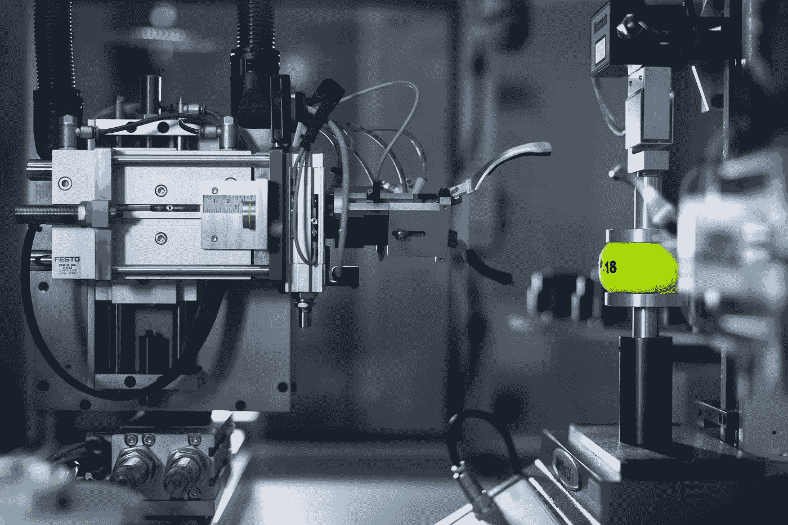

# 我们正在成为数据科学家还是数据科学工具专家？

> 原文：<https://towardsdatascience.com/are-we-becoming-a-data-scientist-or-data-science-tools-expert-51a07c902f2?source=collection_archive---------52----------------------->

## 当你提出正确的问题时，更容易找到答案。

在 [Unsplash](https://unsplash.com/s/photos/tools?utm_source=unsplash&utm_medium=referral&utm_content=creditCopyText) 上拍摄的 [ThisisEngineering RAEng](https://unsplash.com/@thisisengineering?utm_source=unsplash&utm_medium=referral&utm_content=creditCopyText)

数据科学没有严格的定义。一个非常简单而简明的定义是“数据研究”或“将科学应用于数据”。因此，数据科学家可以被描述为研究数据或将科学应用于数据的人。

但是为什么一个人要研究数据呢？数据科学的目标在解释它的重要性方面更占主导地位。目标是通过将科学应用于数据来解决问题、克服问题、回答问题或使事情变得更好、更容易。这些目标可以通过考虑以下问题的系统和结构化研究来实现:

*   问题是什么，怎么解决？
*   需要什么样的数据，如何收集？
*   我们需要如何处理数据？
*   数据告诉我们什么？
*   我们应该建立一个什么样的模型？
*   我们如何评估模型？
*   结论是什么？
*   我们如何告诉别人结果对别人意味着什么？

因此，数据科学是一个过程，而不是单一事件。这一过程的每一步都需要处理好，以取得显著和令人满意的结果。

研究数据并不总是容易的，尤其是当我们有大量数据的时候。就像外科医生、木匠、机械师使用工具来完成工作一样，数据科学家也需要工具。当然，这些工具有不同的形式。数据科学家使用计算机，使复杂的计算变得快速简单。有许多软件包和库以及现成的、经过测试的算法可以加快数据科学的进程。

这些工具非常方便和有用。然而，这些只是工具，不应该是数据科学家的唯一关注点。我觉得成为一名数据科学家与使用这些工具的能力是相关联的。数据科学家的突出特征不应该是他/她在使用 TensorFlow 或 PyTorch 方面有多好。主要目标是回答一个问题。工具可以让您更轻松、无缝地完成工作。

> 数据科学家的重点应该是找到用数据回答问题的方法。

这些工具帮助数据科学家像从事其他职业一样开展工作。考虑外科医生。他们在手术中使用柳叶刀，他们必须非常善于使用它们。然而，为了治愈一个人，外科医生需要的不仅仅是善于使用柳叶刀。他们必须了解人体的器官、静脉和非常复杂的结构。很好地使用柳叶刀并不能让你成为外科医生。

数据科学家需要 Python、R、Pandas、Scikit-learn、Theano、TensorFlow 等工具。但是，真正重要的不是你有多擅长使用这些工具。在一天结束的时候，如果你不能给桌子带来任何价值，这些工具就没有任何意义。就价值而言，我的意思是改进一个过程，建立一个准确的预测模型，增加企业的利润，让一些人的生活更容易，为使用机器学习的领域做出贡献，等等。

> 我们可以教一个人如何使用数据科学工具，但我们不能教他们如何成为数据科学家。

我们可以教一个人如何使用这些工具，但我们不能教他们如何成为一名数据科学家。我们可以引领他们，但作为一名数据科学家，需要的不仅仅是使用工具。

由 [Unsplash](https://unsplash.com/s/photos/idea?utm_source=unsplash&utm_medium=referral&utm_content=creditCopyText) 上的[克里斯托佛罗拉](https://unsplash.com/@krisroller?utm_source=unsplash&utm_medium=referral&utm_content=creditCopyText)拍摄的照片

数据科学家是:

*   好奇的
*   批判思想家
*   好辩的
*   不怕批评
*   寻找答案
*   还有更多…

这些是一些你无法从软件包中学到的技能或特征，但是对利用数据非常重要。我们可以掌握所有的深度学习框架，我们可以闭着眼睛编码。但是，如果我们不生产，又有什么意义呢？

如果我是一名招聘经理，正在面试一个数据科学家的职位，我的问题会倾向于了解候选人的观点、好奇心和批判性思维。我对掌握软件包或框架的能力不太感兴趣。

我们可以也应该学会如何使用工具，但我们的思维需要超越工具。我们应该能够从许多不同的角度看待数据，并从许多方面解读数据。我对有抱负的数据科学家的建议是，定义一个问题并尝试解决它。当你在解决问题时，你需要并学习如何使用工具。你甚至可以创建自己的工具，因为你会确切地知道你需要什么。

# **结论**

数据科学领域使用的工具是绝对必要的，非常感谢构建并让我们使用这些工具的社区。然而，工具不是答案。数据科学家是寻找答案的人。工具只是帮助他们达到目标。

感谢您的阅读。如果您有任何反馈，请告诉我。