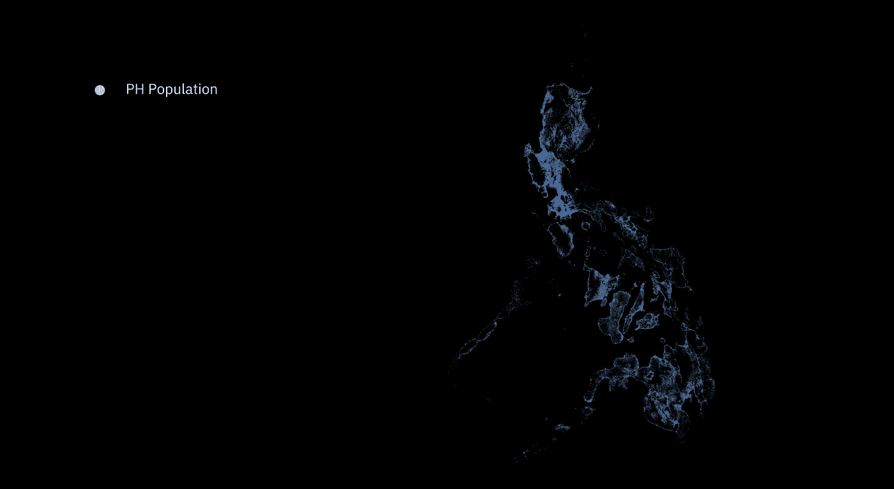
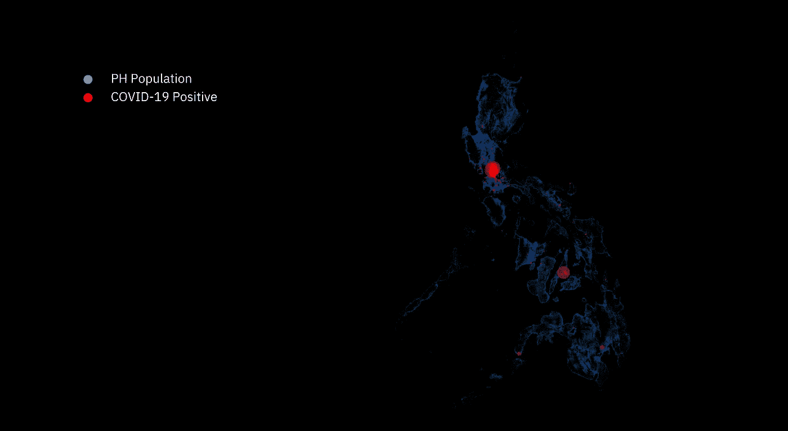
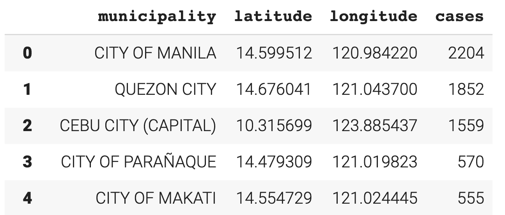
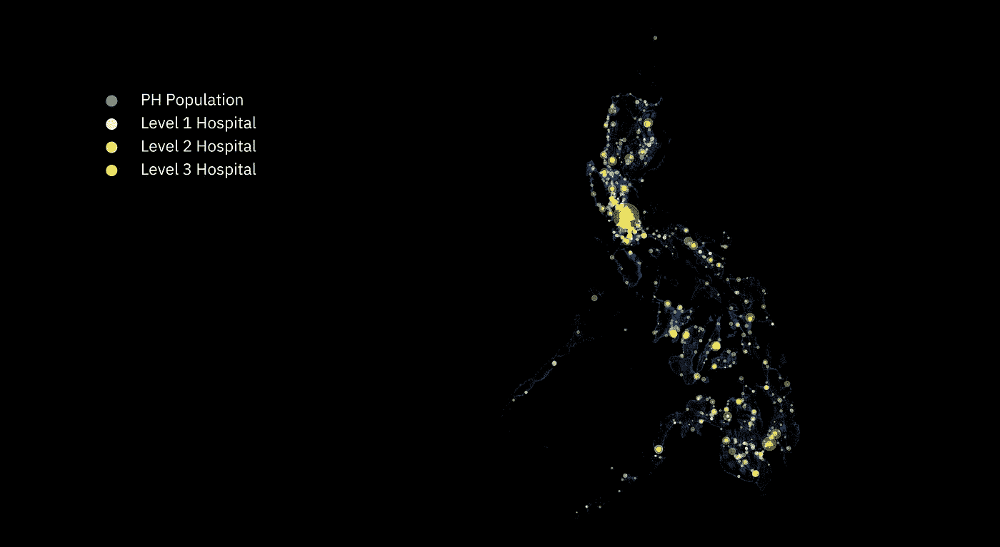
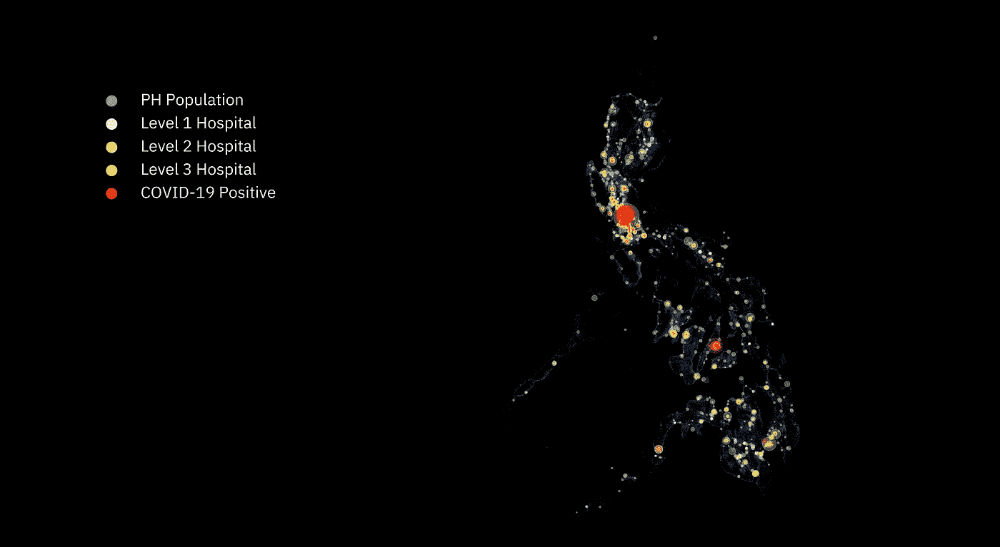
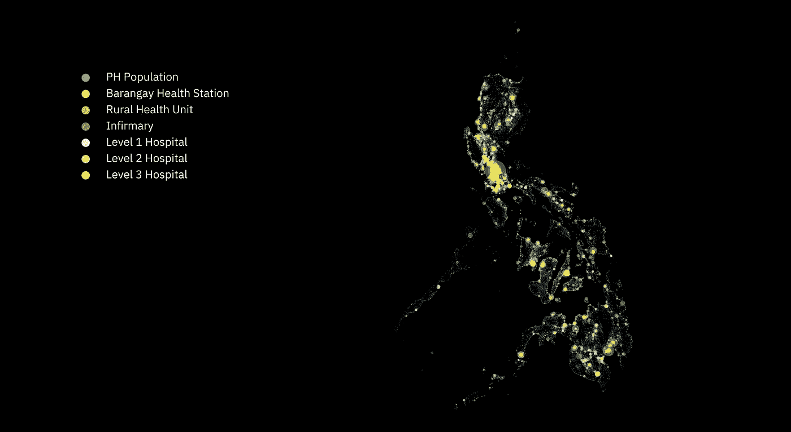
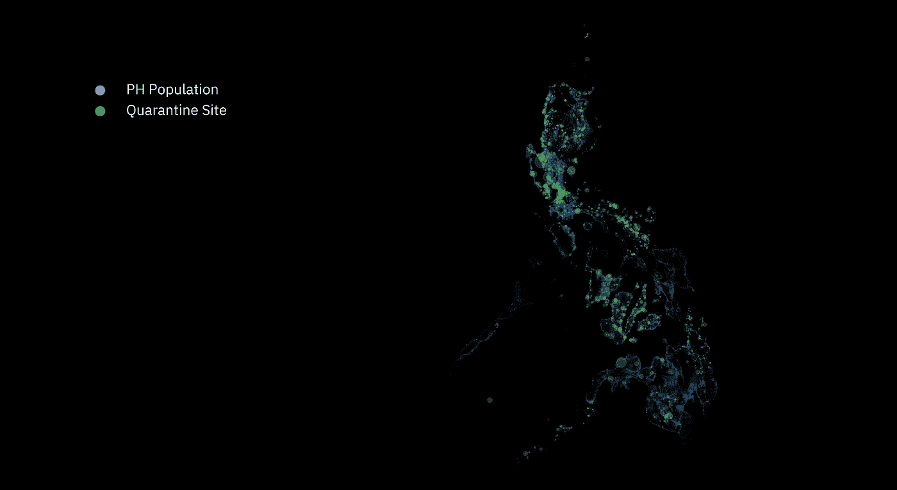
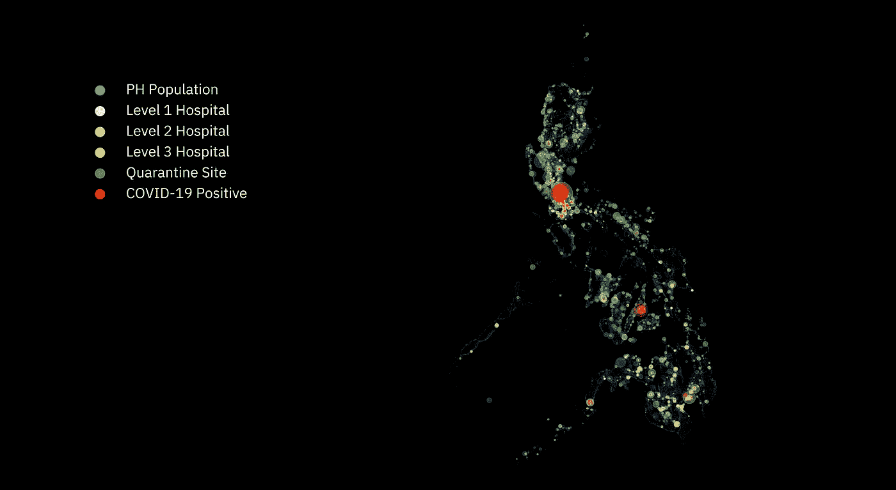
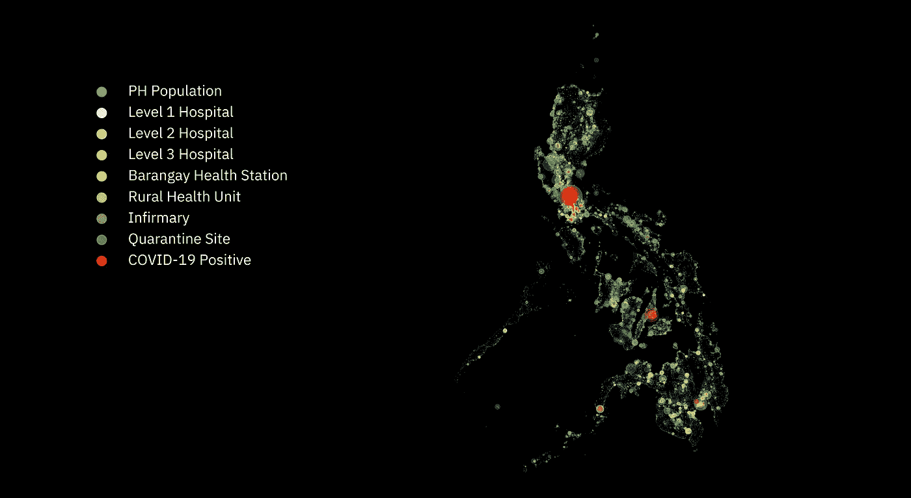

# 简单、直观的地理空间分析，帮助疫情做好准备

> 原文：<https://towardsdatascience.com/are-we-fcqd-dfea9e534eb1?source=collection_archive---------67----------------------->

## [深入分析](https://towardsdatascience.com/in-depth-analysis/home)

## 使用可视化技术和实时数据分析新冠肺炎时代的菲律宾医疗保健系统及其能力

*作者:* [阿德里安·塞拉皮奥](https://medium.com/u/f6a2c164890b?source=post_page-----dfea9e534eb1--------------------------------)，[康纳·g·曼努埃尔](https://medium.com/u/1d96995391c2?source=post_page-----dfea9e534eb1--------------------------------)，[兰斯·迪](https://medium.com/u/c68d22d73491?source=post_page-----dfea9e534eb1--------------------------------)，[蔡美儿](https://medium.com/u/70e234778a0f?source=post_page-----dfea9e534eb1--------------------------------)
*顾问* : [马丁·戈麦斯](https://medium.com/u/2ac053bfb570?source=post_page-----dfea9e534eb1--------------------------------)

非常时期需要非常的关注。在这篇文章中，我们对如何使用经典和创新的数据科学技术来帮助理解当前的疫情，并可能为未来做好准备的细节进行了仔细、细致和深入的关注。

# 我们是 FCQ 吗？

随着菲律宾从强化社区隔离(ECQ)向普通社区隔离(GCQ)的过渡，我们从多个视角来审视菲律宾与其他国家之间的差距。

> tldr 我们想快速了解我们是否完蛋了。最好的方法之一就是从鸟瞰的角度来看待事物。如果你想直接进入漂亮的图形和分析，请直接滚动到它。否则，请欣赏一些高中生的思考:

我们可以大胆地说，你来这里是因为这个部分的标题。这个曾经是讽刺性的问题已经变成了对我们减轻新型冠状病毒疫情影响的能力的严肃思考。我们制定有效和可持续的应对危机行动计划的能力受到质疑，这给已经不堪重负的医疗体系增加了更多压力。在撰写本报告时，新冠肺炎病已设法渗入全球 560 多万人的身体，其中至少 356，000 人已经死亡。正如我们所知，不幸的是，新冠肺炎已经侵入菲律宾领土，在整个群岛造成严重破坏。迄今为止，已经记录了超过 15，000 个病例，其中有 900 多人死亡。

随着菲律宾医疗保健的长期资金不足，人们开始担心我们国家应对每天数百起病例的能力。坦率地说，有理由担心感染的超载，因为目前似乎没有办法绕过这场危机。恕我直言，每个人都在努力减轻这种病毒造成的痛苦，成功击败新冠肺炎是一个相当大的挑战。如果在接下来的几个月里，新增病例持续超过痊愈病例，那么随之而来的额外并发症将是一颗难以下咽的药丸。医院和隔离设施将会人满为患。这可能会进一步增加传播，减少恢复，使医护人员不堪重负，并导致死亡人数急剧上升。

虽然政府已经实施强制隔离以“拉平流行病学曲线”，但随着病例数量每天继续增加，迅速遏制病毒传播的希望越来越渺茫。随着不断波动的数字给我们脸上打耳光，卫生部观察到的“曲线变平的模式”只证明了两件事:1。这场战斗远未结束。2.被指派这项工作的人需要一副新眼镜。

所以，让我们看看我们是否真的被彻底搞砸了。

*(剧透:前面好多图)。*

# 让我们首先想象一下菲律宾的人口。

将每个有代表性的人群标绘成一个点，使我们能够识别出人口更密集的地区，如城市和市区，在这些地区病毒更有可能传播。

**2020 年菲律宾人口。**数据来源:CIESIN 哥伦比亚大学脸书连接实验室和国际地球科学信息网络中心。2019 年 6 月 21 日更新。图片作者。

*   以上总计约 550 万的数据点由脸书的“良好项目数据”提供。脸书使用机器学习技术从商业卫星图像中识别建筑物。然后，他们与哥伦比亚大学合作，根据公开的人口普查数据和其他人口统计数据，叠加总人口估计值。生成的地图是援助和研究组织可用的最详细和最可行的工具。[更多信息](https://dataforgood.fb.com/docs/methodology-high-resolution-population-density-maps-demographic-estimates/)。
*   然而，我们没有直接使用脸书的高密度图像，而是使用提供的原始数据点来渲染我们自己的图像。这允许我们完全控制可视化。
*   在国家一级进行调整，使普查人口与联合国估计数相匹配。给定国家(或州/地区)的联合国估计数除以给定国家的总人口普查估计数。得出的调整系数乘以目标年的每个行政单位普查值。这保留了各行政单位的相对人口总数，同时与联合国总数相匹配。[更多信息](https://drive.google.com/file/d/1bJwLtvN--46NxoGJa4Jw0K6R3oNKoj96/view?usp=sharing)。

**我们怎么知道上面的可视化有意义？**在下面的谷歌地图上查看菲律宾的地形。几乎无人居住的地区要么是水域，要么是山区。

太棒了，不是吗？

那么为什么不全程使用谷歌地图呢？因为它被过度使用了，我们可以做更漂亮的东西。

***请注意*** *对于后续的可视化，我们将人口的绘图变暗，以使其他数据更加可见。其他数据来源在标题后注明。DOH 指的是菲律宾卫生部，NTF 指的是国家抗击新冠肺炎特别工作组。更新日期如下。*

## 让我们画出病毒在人群中的传播图。

每个红圈代表一个有确诊病例的市，每个圈的面积对应于病例数。

**新冠肺炎针对菲律宾人口的病例。**新冠肺炎病例(DOH2020.05.19).图片作者。

这种可视化使我们能够确定该国的哪些地区是当地的热点——在 NCR 和宿务市可以发现大量的病例，其中 NCR 的集中程度最高。

然而，重要的是要注意，虽然这是菲律宾政府报告的官方数据，但感染和病例的真实情况只有在大规模检测发生后才能知道。

## 为了解决这些问题，我们需要医疗设施！

让我们来看看菲律宾不同标准的医疗设施。首先是医院。卫生部将医院分为三级:

**一级**医院配备有提供基本医院功能的设备，满足仅需要轻微护理和监护的患者的需求。然而，L1 的医院有能力隔离病人。

二级和**三级**医院建立在 L1 医院的基础上。L2 和 L3 医院包括几个额外的设施，如更专业的临床服务。L2 和 L3 医院应对新冠肺炎的关键设施包括呼吸科和重症监护室(ICU)，这两个部门对有严重症状的新冠肺炎患者的生存至关重要。因此，卫生部规定 [L2 和 L3 医院不得拒绝 COVID 患者和 pui](https://www.doh.gov.ph/sites/default/files/health-update/dc2020-0070.pdf)。

我们用圆圈代表医院，根据医院的级别用颜色编码，面积与医院的床位容量相对应。

覆盖菲律宾人口的医院。医院(DOH2020.04.24).图片作者。

显然，更城市化的地区，如大马尼拉、宿务和达沃市，有更高的床位容量和更多的三级医院来满足患者的需求。

然而，民都洛省、巴拉望省、北三宝颜省、三宝颜省、西布盖省和南三宝颜省的情况就不一样了。由于床位不足，以及缺乏二级和三级医院，他们缺乏应对更严重疫情的能力。

将 COVID 病例与医院一起绘制会产生以下结果:

**新冠肺炎病例超过医院超过菲律宾人口。**医院(DOH2020.04.24).新冠肺炎病例(卫生部；2020.05.19).图片作者。

尽管在城市化程度更高的地区，医疗设施的容量有所增加，但考虑到其人口密度，它们仍倾向于成为当地的热点地区。请注意，由于大马尼拉地区有大量热点，*这些医疗保健系统很有可能会出现故障*，床位容量会根据单个新冠肺炎病例进行适当调整。此外，尽管宿务的医院容量和该市现有的二级和三级医院，新冠肺炎疫情可以很快淹没他们的医疗设施。

另一方面，人们可能倾向于认为人口密度较低的地区不容易爆发疫情。*然而，如果不加以控制，这些孤立的病例可能会迅速传播，尤其是在没有必要的医疗设施来减缓传播的情况下。*

## 由于菲律宾缺乏医疗专业人员、预算和设施，

更重要的是，为了满足轻度病例的需要，建立了地方政府卫生单位，包括镇卫生站和农村卫生单位，以补充医院现有的能力，并为更多的农村地区服务。

**镇卫生站**主要由镇卫生工作者组成，他们“在社区提供初级卫生保健服务”,如急救管理、生命统计数据收集、免疫援助和其他职责。

镇卫生站是农村卫生单位的卫星卫生设施。

**农村卫生单位**也被称为市级卫生中心，或在城市化程度更高的地区被指定为市级卫生中心，由一名市级卫生官员、公共卫生护士、助产士和一名卫生检查员组成。它们为市政当局/城市提供基本的临床和预防保健服务。

**医务室**是为伤病人员提供紧急治疗和护理以及母婴临床管理的医疗机构。他们在药物、非手术分娩和小手术方面提供最低到中级的护理和管理。

## 如果我们将菲律宾医疗机构的全部能力与全国人口进行对比，结果如下:

**针对菲律宾人口的医疗机构。**医疗机构(卫生部；2020.04.24).图片作者。

必须指出的是，镇卫生站、农村卫生单位和医务室没有治疗新冠肺炎病例的设备。相反，这些设施最有可能用于急诊和初级保健，从而减轻必须收治新冠肺炎阳性病例的医院的负担。

## 现在让我们观察一下这些卫生设施以及该国的新冠肺炎病例:

**新冠肺炎医疗机构诉菲律宾民众案。**医疗机构(卫生部；2020.04.24).新冠肺炎病例(卫生部；2020.05.19).图片作者。

显然，这些农村卫生设施在扩大全国范围内获得即时护理的机会方面发挥了很大作用。然而，这些不应被视为更全面的初级卫生设施的替代品。

## 为了减缓病毒的传播，菲律宾政府在全国各地设立了隔离区。

这些设施使轻度至中度冠状病毒患者能够得到治疗和隔离。许多这样的设施位于医院附近，以便在病人病情恶化的情况下方便病人转移。这是这些隔离区的示意图，同样用圆圈的大小来表示容量:

**针对菲律宾人口的隔离场所。**检疫地点(NTF；2020.04.22).图片作者。

## 为了更好地了解菲律宾当前应对新冠肺炎疫情的医疗能力，我们需要从以下几个方面来看待它:

**新冠肺炎针对菲律宾人群的隔离场所和医院案例。**医院(DOH2020.04.24).新冠肺炎病例(卫生部；2020.05.19).检疫地点(NTF；2020.04.22).图片作者。

虽然隔离设施能够补充更城市化地区的医院，但它们的设置对解决孤立病例的需求几乎没有作用，使诸如**巴拉望、萨马、莱特、**和**其他岛屿省份**等地区容易爆发疫情。

## 作为一个额外的奖励，这里有一个所有事情的情节！

**新冠肺炎病例遍及菲律宾人口的所有医疗设施和隔离场所。**医疗机构(卫生部；2020.04.24).新冠肺炎病例(卫生部；2020.05.19).检疫地点(NTF；2020.04.22).图片作者。

在本文的前几节中，我们说过我们可以使我们的工作变得漂亮。我们相信，我们所创造的东西既美观又实用，这是任何好的视觉化设计的目标。每一种颜色，每一个元素，每一个尺寸，都被合理化，以达到可以理解的视觉传达。

我们使用 Python 对其进行编码，使用 Google Research 的 Colab 对其进行处理，利用 Colab 的免费 GPU 渲染功能，使用经典的数据科学库，如 Pandas、Numpy、Matplotlib 和 Shapely。我们还想确保 GIS 的正确性，因此也加入了 GeoPandas。

# 现在，我们回到这个问题:我们完蛋了吗？

简而言之，我们医疗保健系统的现状并不乐观。假设传播速度继续保持目前的速度，用不了多久，医院和其他医疗保健中心就会不堪重负，这就意味着我们实际上彻底完蛋了。

那么，我们如何赶上来，以确保我们不会被搞砸，或者至少，下一次我们会松开自己？嗯，我们可以做一些事情来为下一次疫情做准备:

1.  首先，**以最紧急的方式处理任何医疗紧急情况**。它不需要先成为流行病或疫情。[比尔·盖茨说，我们每 20 年就会面临类似新冠肺炎冠状病毒的大流行](https://www.businessinsider.com/bill-gates-warns-coronavirus-outbreak-likely-every-20-years-2020-4)。然而，这并不意味着我们每 20 年才准备一次。我们必须时刻准备着。各国政府必须与私营部门合作，不断分配资金和资源，以确保我们为下一个疫情做好充分准备。这里的关键是要积极主动。[蒙古国就是这么做的](https://thediplomat.com/2020/05/practice-makes-perfect-mongolias-covid-19-outbreak-drill/)。正如前英特尔 CEO 安迪·格罗夫所说，“只有偏执狂才能生存”
2.  与此相关，政府和公众必须努力**改善卫生设施的质量和可获得性**，特别是在农村地区和省份，具体做法是实际建设卫生设施，并为此划拨更多预算。与城市医疗机构相比，农村医院的床位容量往往要小得多。因此，小医院有不堪重负的趋势，而且不是所有的病人都能得到服务。此外，由于小医院更加拥挤，患者感染医院获得性感染(HAIs)的机会也增加了。这可能会使情况更加复杂，耗尽医院的资源。尚未存在的设施有机会设计得更好，做得更好。
3.  最后，练习物理距离。这不仅适用于我们的现状，也适用于我们的日常生活。拥挤的区域是最好的病毒孵化器之一，对传染病的传播产生连锁反应。不用说，在这种情况下，传播率可能会激增。这与其他已知或未知病毒可能发生的情况没有什么不同。通过发挥物理距离的作用，接触同样受到限制，吸入污染液滴的机会更低，暴露于他人可能携带的病毒的可能性更小。例如，日本在没有强制隔离的情况下，实际上已经设法拉平了他们的新冠肺炎曲线，主要部分原因是日本人坚持物理距离。

因此，当我们都在为比吉斯的“生存”而努力时，让我们尽自己的一份力量来帮助遏制疫情，方法是呆在室内，保持适当的卫生习惯，保持身体距离，并与捐赠中心合作，为那些受我国灾难打击最严重的人提供援助。

## 还有一件事。

当今科技的一个奇妙之处在于，现在查看和分析实时数据变得非常可能。下面是一个实时仪表板，反映了来自卫生部的直接数据，使用 BigQuery 进行了新的处理，并使用 Google 的 Data Studio 进行了动态制作。

案例数据是最新的可用数据。能力数据基于 d-2 的数据。能力数据基于 d-2 数据，因为卫生设施能力报告略有延迟。这是为了确保下面的仪表板不会显示*无数据*。希望在不久的将来，我们将看到来自卫生机构，特别是二级和三级医院的能力的实时报告。

这是仪表板。对我们来说，当我们看到这个的时候，我们的疑问多于答案。你呢？

互动版在[https://data studio . Google . com/reporting/a 5572 DC 1-f966-45bf-8582-9 E0 AC 2d 43d 8 c](https://datastudio.google.com/reporting/a5572dc1-f966-45bf-8582-9e0ac2d43d8c)

# 对于普通人来说。

我们都是名为[Dashboard Philippine](https://www.dashboardphilippines.com/)的非盈利、纯志愿者组织和技术平台的一部分。

Dashboard Philippines 的举措之一是[医院分流系统](https://www.dashboardphilippines.com/maps/hospitals)。它显示了菲律宾主要医疗机构的最新床位利用率。它目前由华金·德卡斯特罗、安德鲁·戈·阿尔坎塔拉和赞德·西管理和维护。Joaq 即将进入 9 年级，Drew 即将进入 12 年级，Zand 即将进入 11 年级，他们都来自 Xavier 学校。

这些数据是通过卫生部的数据收集项目获得的，并通过卫生部的数据投放进行推送。

他们确保，如果病人需要房间来办理入住手续，特别是那些有紧急需求的病人，他们能够这样做。

尽情享受，注意安全！

# 作者

Adrian Dar Serapio 于 2020 年毕业于 Xavier 学校。由于新冠肺炎，他错过了闭幕式。Adrian 多次获得学校的最高奖项 Xavier Award，并且是 Jose Rizal 模范生获奖者。艾德里安有仆人式的领导能力。作为一名有抱负的医学博士，他是加州大学伯克利分校今年秋天的新生。

Conner G. Manuel 是加州大学伯克利分校的大二学生，主修数据科学和应用数学。他于 2019 年以最高荣誉毕业于泽维尔学校努瓦利分校。他目前是加州大学伯克利分校菲律宾科学家、建筑师和工程师协会的网站开发人员。他的 LinkedIn 可以在 linkedin.com/in/connermanuel/的[访问。](https://www.linkedin.com/in/connermanuel/)

**Lance Patrick Dy** 是 Xavier 学校 11 年级的新生。兰斯一直是一名优等生，也是一名有抱负的医学博士，他已被纽约科学院初级学院录取。他还以优异的成绩完成了伦敦卫生学院热带医学的流行病学课程，以及世界卫生组织的新冠肺炎管理课程。兰斯目前是泽维尔高中官方学生出版物《种马》的特写编辑。

Sean Eugene Chua 也是 Xavier 学校 11 年级的新生。作为 Dashboard Philippines 的一部分，Sean 负责自动处理和分析医院和医疗机构的数据。肖恩对数学、技术和工程充满热情，他最近完成了斯坦福大学的机器学习课程和吴恩达的深度学习专业，这两门课程都是班上的佼佼者。肖恩也是一个在大报马尼拉公报发表的作家。

马丁·戈麦斯也是泽维尔学院的校友，他是团队的顾问和导师。他的 LinkedIn 个人资料可以在[www.pmgomez.com](http://www.pmgomez.com)访问。

# **附加参考文献**

*   修正 2002 年第 70-A 系列行政命令:关于菲律宾医院和其他卫生设施注册、许可和运营的修订规则和条例，第 147 号行政命令，第 12 届国会。(2004).
*   DOH。(2015).NHFR 技术手册。从[https://nhfr.doh.gov.ph/nhfr.pdf](https://nhfr.doh.gov.ph/nhfr.pdf)取回。
*   诺娜托诉(2020 年)。没有足够的床位和医护人员来处理新冠肺炎病例，以防研究激增。检索自[https://www . one news . ph/not-follow-beds-health care-workers-to-address-新冠肺炎-cases-in-case-of-surge-up-research](https://www.onenews.ph/not-enough-beds-healthcare-workers-to-address-covid-19-cases-in-case-of-surge-up-research)。