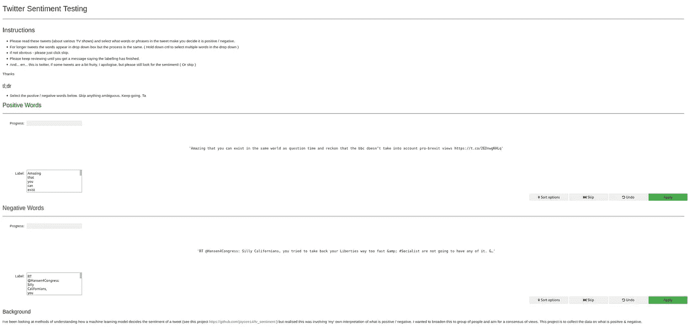
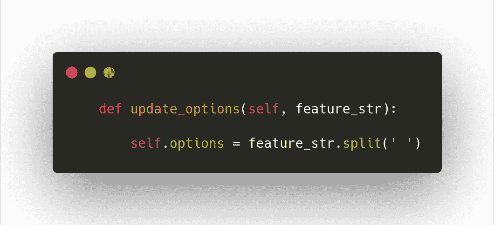
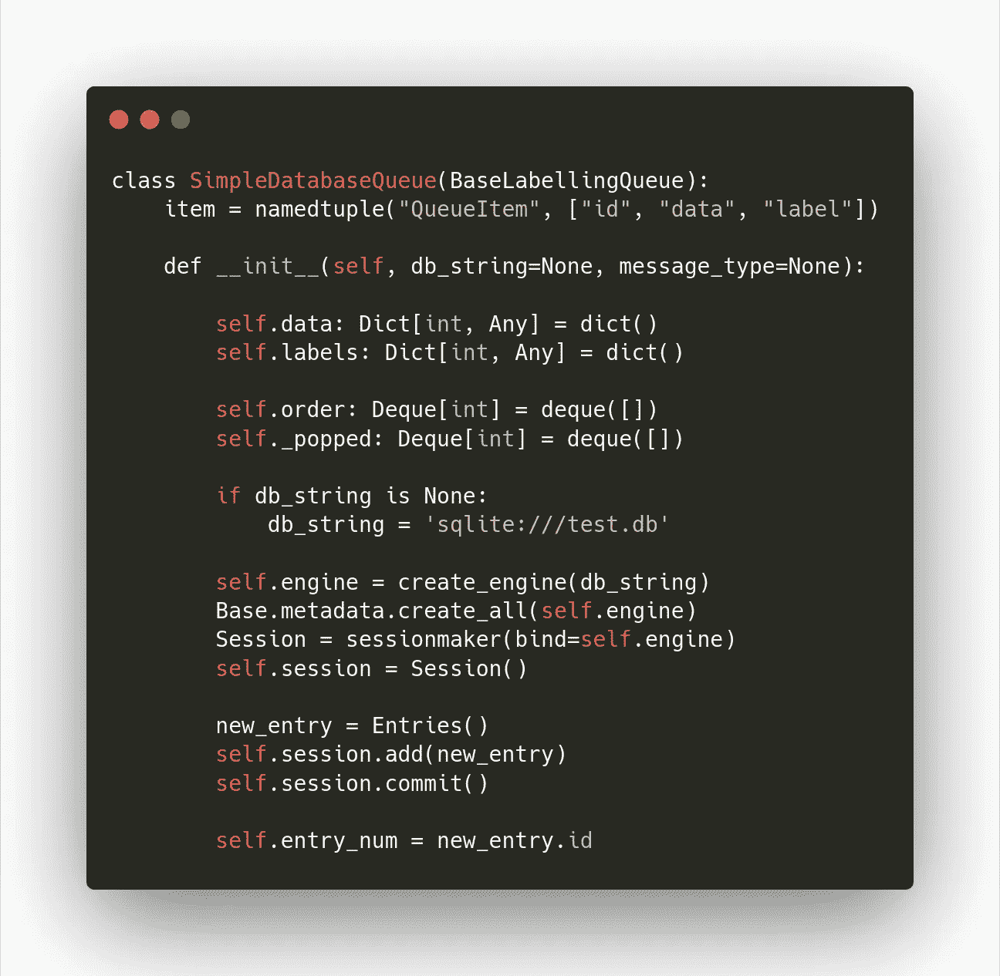
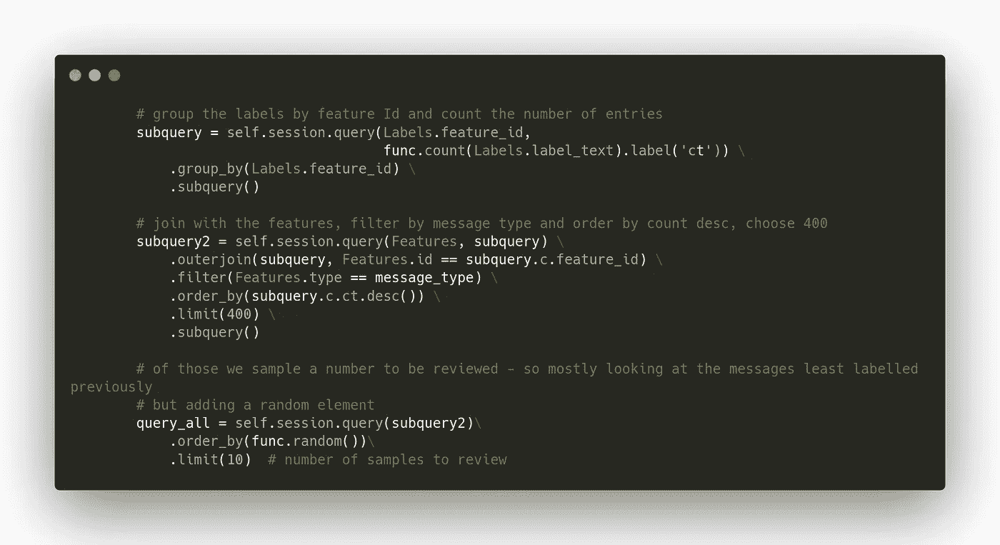
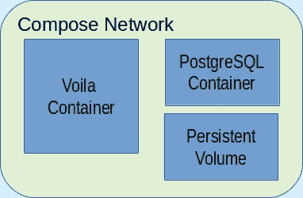

# 我们和他们想的一样吗？

> 原文：<https://towardsdatascience.com/are-we-thinking-what-theyre-thinking-d1224445bbb9?source=collection_archive---------73----------------------->

## 我们如何发现 NLP 模型是否像我们一样思考？第一部分


[수안 최](https://unsplash.com/@suanmoo?utm_source=medium&utm_medium=referral) 在 [Unsplash](https://unsplash.com?utm_source=medium&utm_medium=referral) 上拍照

机器学习模型看待语言的方式与我们不同吗，我们如何才能发现？这是在之前的一篇文章之后提出的问题，这篇文章是关于在 NLP 模型中查看哪些单词产生了输出，并问:为什么是这些单词？

当与其他数据科学家讨论这些结果时，我们会开始解释为什么每个词对模型都很重要；为什么一个词被认为是积极的，而另一个不是？例如，在一条关于网飞系列电影《虎王》的推文中，该模型会建议一些明显的词来表达积极的情绪(“被爱的”、“令人惊讶的”)，但也会建议像“纪录片”和“我”这样的词对积极的情绪也很重要。


由 NLP 模型突出显示单词的推文。绿色越亮，对情感的贡献越大。

我会犹豫地建议“嗯，纪录片很受欢迎”和“也许使用我们在更深层次上联系的人称代词，因此会对此持积极态度……”

顶多流行心理学。但它提出了一个问题。

随着 NLP 的发展，这一点可能很重要——你的自动化营销活动是否会对错误的信息做出反应？那个读股票预测的报告是否比你预期的使用了不同的短语？一种新的方言或互联网迷因会让你的模式发生变化吗？

因此，计划是测试这个想法，并比较人类如何对情绪和模型进行分类。但为此，我需要关于一个人如何解释一个句子的数据，我不想仅仅依靠我自己的观点，以防我的偏见或流行心理学妨碍我。因此，我打算开发一个工具，从更广泛的受众那里收集数据。这篇文章将讨论这个工具的构建和通过 docker 的部署。



成品工具。设计不是我的强项。

自从在 PyData London 2019 上看到作者[谈到](https://www.youtube.com/watch?v=W2bJH0iXTKc)它，我就想用[总监](https://superintendent.readthedocs.io/en/latest/index.html)。这是一个很棒的基于 Jupyter 笔记本的工具，通过它可以对 ML 数据进行主动标记，并且拥有我正在寻找的大部分演示元素，例如进度跟踪、跳过错误的样本、布局标签选项等。

这个界面随后被优秀的 [Voila](https://github.com/voila-dashboards/voila) 所改变，这是一个将笔记本变成独立网络应用的工具。一旦以网络形式出现，它将更容易分发给我所希望的许多用户。

再加上一个保存句子和回答的数据库，以及一个连接和运行不同部分的 docker 集群，我就完成了。

首先，我必须确认主管能适应我的需要。一个下午的黑客活动表明，通常使用的静态标签可以通过简单地分割输入文本并将其指定为该示例的标签选项，从给定的输入句子中动态创建。



随后，我需要一个数据库接口层位于管理者和数据库之间，以加载和保存数据。通过扩展现有的类，这主要是关于在创建时添加连接到数据库的调用，然后将提取的样本输入到现有的管理员队列中。



最后，从数据库中提取一些用户可以查看的样本。在这里，我想把重点放在最少被审查的样本上。



为了保持干净，我分叉原来的主管，并在那里做我的更新。所有的变化都可以在[这里](https://github.com/jaycee14/superintendent)找到。

docker 配置非常简单——一个运行 Voila 的容器和一个用于 PostgreSQL 数据库的容器。我为数据库数据使用了一个持久卷，这提供了灵活性，但在部署中产生了更多问题。



我已经包括了我的 docker 音量命令，因为这是最难得到正确的领域之一。

创建卷时使用

```
docker volume create postgres_db_nlp_compare
```

并且存在于*/var/lib/docker/volumes*

它们可以通过以下方式查看

```
docker volume ls
```

要添加到正常使用的合成文件中，请在 docker-compose.yml 文件中添加以下内容(注意*_ data*&*data*目录):

```
volumes:
   - /var/lib/docker/volumes/postgres_db_nlp_compare/_data: \       /var/lib/postgresql/data/
```

还可以使用以下命令将卷装载到合成网络之外的临时容器中:

```
docker run  \
--env-file database.env \
--volume postgres_db_nlp_compare:/var/lib/postgresql/data/ \
-p 5432:5432 \
--name temp_postgres_nlp postgres
```

这种方法允许您通过作为标准连接到数据库的笔记本向开发机器上的数据库添加数据。

或者，运行后，您可以登录到容器，通过命令行使用以下命令检查数据:

```
docker exec -it temp_postgres_nlp bashpsql -U user_name -h localhost -d database_name
```

可以使用以下命令删除临时容器，但是数据将保留在卷中。

```
docker rm temp_postgres_nlp
```

有了这个设置，我就能够在本地开发项目，直到它可以进行远程部署。在这里我研究了 docker-machine。

ocker 机器允许远程机器被视为本地机器。您可以在本地开发，翻转机器开关并运行相同的命令来远程运行。这使得部署一个魅力。

要进行设置，您需要一台安装了 docker 的服务器，您可以通过 ssh 以 root 身份访问该服务器。创建一个新用户(例如 *dockeradmin* )，并通过 visudo 工具授予他们 sudo 权限，而不需要本地密码(这是为了远程操作)。

```
# add following to /etc/sudoers using visudo
dockeradmin     ALL=(ALL) NOPASSWD: ALL
```

将用户添加到 docker 组:

```
sudo usermod -a -G docker dockeradmin
```

然后使用 ssh-copy-id 使用您的本地 ssh 身份远程登录，不需要密码。

```
ssh-copy-id dockeradmin@remote_host
```

然后，您可以使用以下信息登录:

```
ssh dockeradmin@remotehost
```

最后，使用以下命令创建远程机器:

```
docker-machine create -d generic \
  --generic-ip-address <remote_host_ip_address> \
  --generic-ssh-key $HOME/.ssh/id_rsa \
  --generic-ssh-user dockeradmin \
  --generic-ssh-port 22 \
  name_for_remote_machine
```

你可以检查它的运行情况

```
docker-machine ls
```

此后，您可以使用以下命令在本地和远程机器之间切换 docker-machine 的焦点:

```
# to run the commands on the remote machine
eval $(docker-machine env name_for_remote_machine)
```

现在 docker 命令的运行将在远程机器上执行。

```
# to switch back to the local machine
eval $(docker-machine env -u)
```

设置这个别名有助于区分 docker-machine 所指向的服务器。

```
alias de='env | grep DOCKER_'
```

如果 docker-machine 指向远程机器，随后运行' *de* '将返回终端信息，否则不返回。此外，要使 docker-compose 正常工作，还需要以下命令。

```
export COMPOSE_TLS_VERSION=TLSv1_2
```

因此，远程部署的完整顺序是:

```
# set up the alias
alias de='env | grep DOCKER_'# ensure correct encryption is used
export COMPOSE_TLS_VERSION=TLSv1_2# refocus to remote machine
eval $(docker-machine env name_for_remote_machine)# check!
de# build the same containers you have locally but remotely
docker-compose build# start the remote compose network
docker-compose up -d# refocus back to development box
eval $(docker-machine env -u)
```

如果已经部署并执行更新；在建造之前，你可能也想跑

```
docker-compose down
```

这个序列将使用本地资源远程构建一组 docker 容器。如果需要，将复制本地文件，下载图像。就好像在本地机器上一样…但是那个卷呢？

这是最难解决的问题。最终这对我有用:

```
docker run --rm -v postgres_db_nlp_compare:/from alpine ash -c \
    "cd /from ; tar -cf - . " | \
    ssh dockeradmin@<remote_host_ip_address> \
    'docker run --rm -i -v postgres_db_nlp_compare:/to alpine ash -c "cd /to ; tar -xpvf - "'
```

我首先手动登录到远程机器，并使用上面显示的相同命令创建了一个同名的卷，这不是绝对必要的，但这意味着我不必为本地和远程创建不同的 docker-compose.yml 文件。

然后，该命令将:在本地创建一个临时容器，将该卷装载到该临时容器，记录数据内容，并通过 ssh 将该数据传输到另一个已将远程卷装载到其自身的远程临时容器，并取消记录数据。唷！

有了以上内容，我就能够创建并部署我的工具来捕捉其他人对之前被 NLP 模型分类的推文的想法。下一步是尽可能多的联系一些人，请他们做一些评论。

然后，这些数据将被用来比较用户如何解释推文和模型如何解释推文。当心第二部分。

所有文件都可以在这里找到，这个 T2 项目解释了我使用的推特数据的来源。