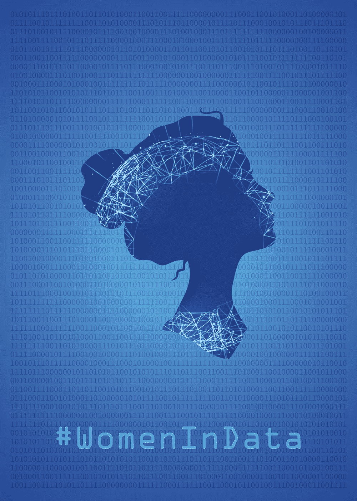
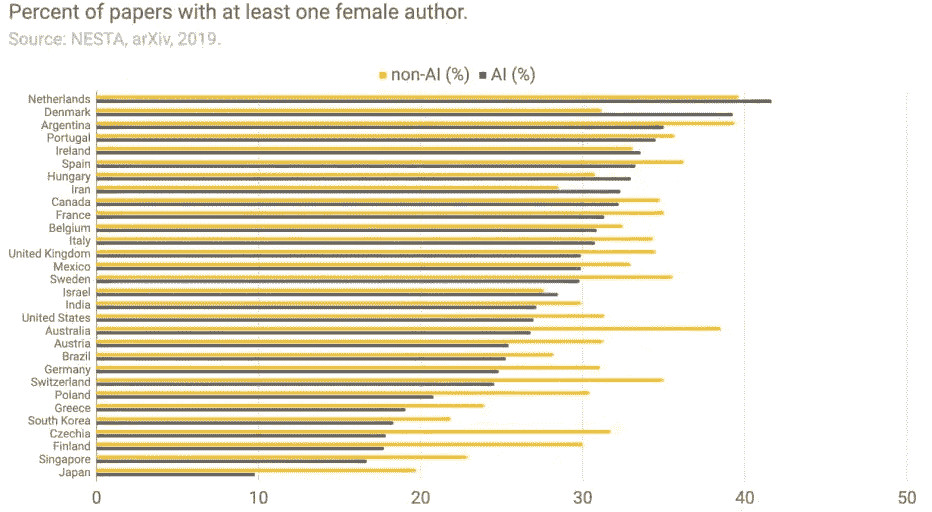
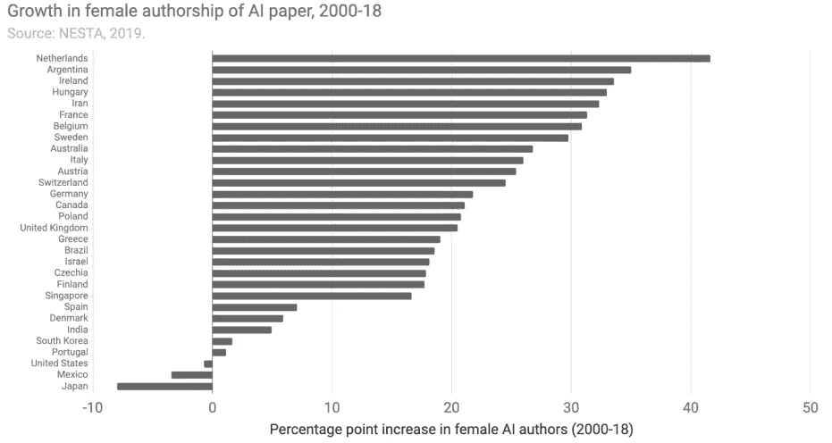
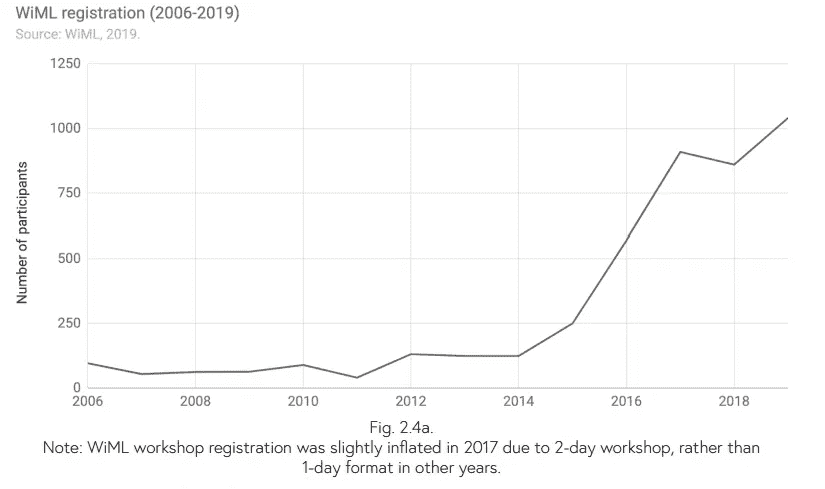
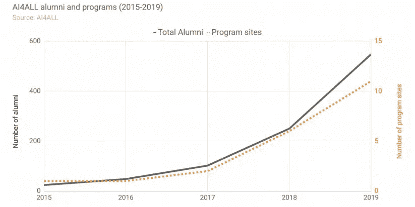
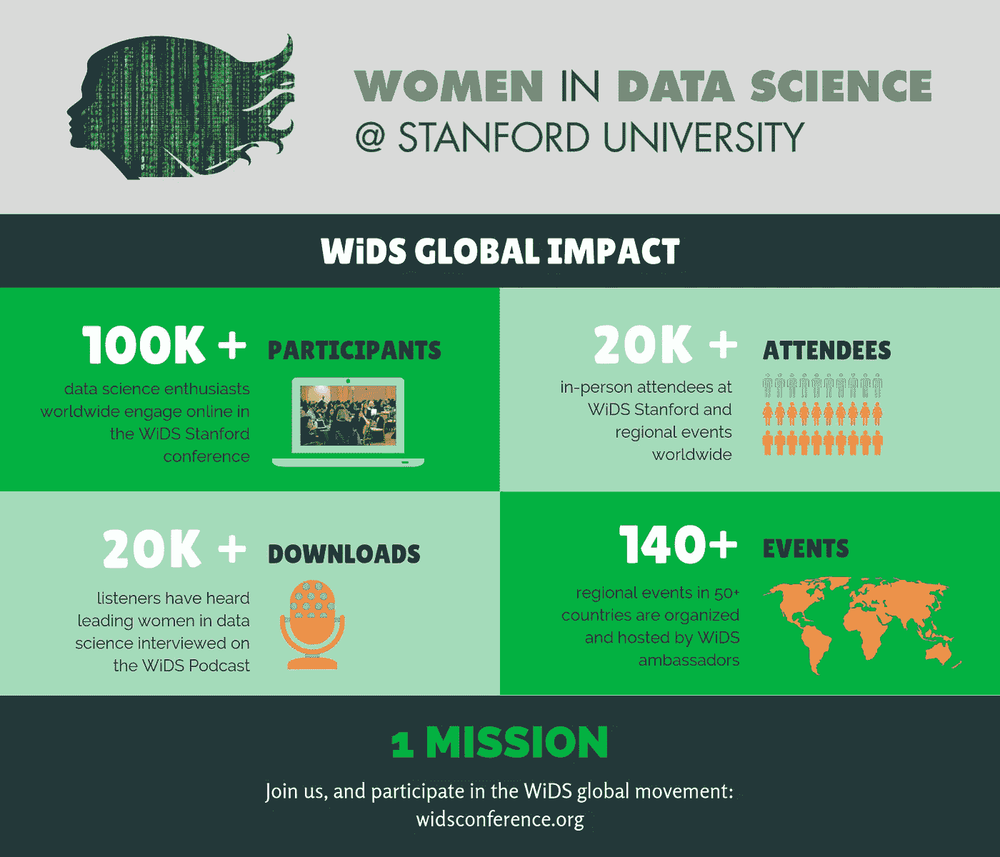
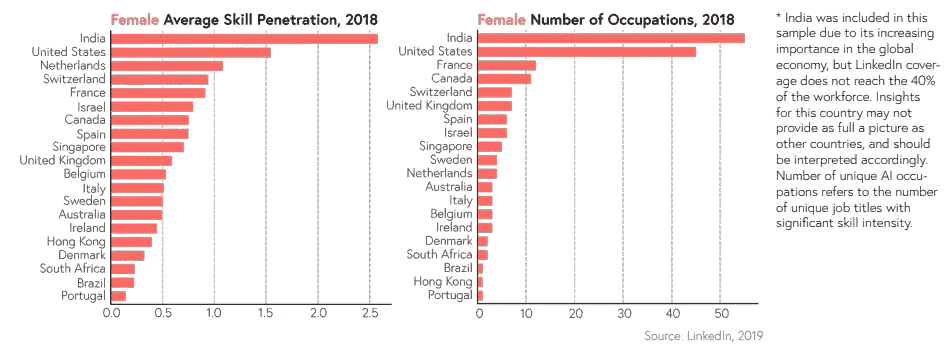
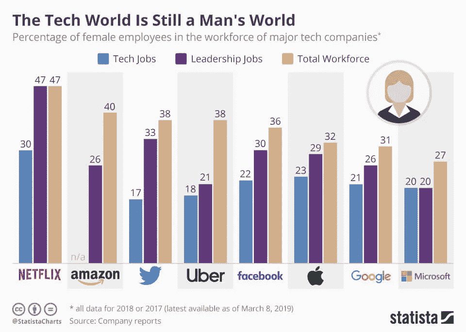
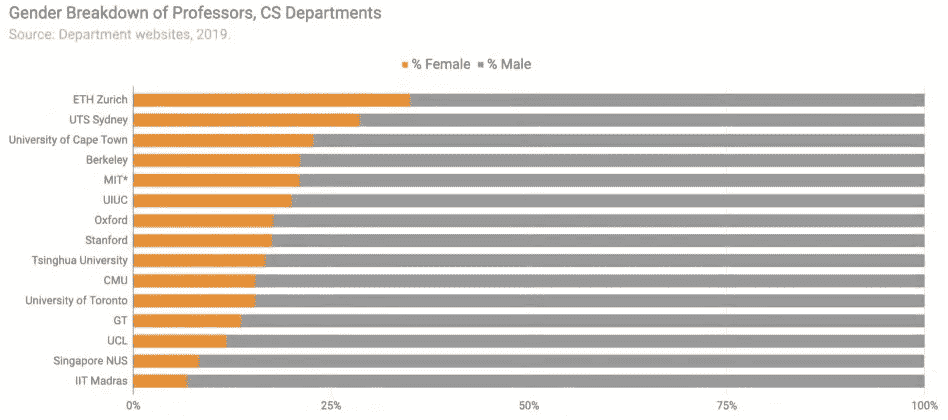

# 女性正在打破数据科学和相关领域的性别差距吗？

> 原文：<https://towardsdatascience.com/are-women-crushing-the-gender-gap-in-data-science-and-related-fields-3ab7ae299b4b?source=collection_archive---------25----------------------->

## 人工智能学术界和工业界的包容性和多样性。

数据海报中的女性由**穆罕默德·阿古利**在商店[Displate.com](https://displate.com/displate/1789304?art=5e27730cab3b6)

技术领域为女性和男性提供了广泛的机会。作为其中的一部分，人工智能和分析在过去几十年中也有了大幅增长。关于兴趣爆发的更多细节可以在附加的文章中找到:

 [## 人工智能死了吗？

### 先说 AI 状态的统计。

towardsdatascience.com](/is-artificial-intelligence-dead-ceb3830033a1) 

如此重要的发现带来了许多相关的问题，其中之一是关于性别差距。虽然这不是一场男人和女人的战斗。但是，统计数据总是提供了一个清晰的视野领域的情况，如果有任何“进入的障碍。”低百分比通常是一个大的危险信号。那么女性在数据科学及相关领域的地位如何呢？

# 女性在研发中的份额是多少？

研究和开发是学术界和工业界最重要的领域之一。妇女在这样一个充满活力的领域中的存在是一个重要的指标。

在人工智能领域，基于 arXiv 上的出版物进行了一项分析，以跟踪至少有一名女性作者的论文的百分比。

**作为人工智能研究的世界领导者之一，中国被排除在样本之外，原因是对按名称标注作者性别的信心较低，并且在 arXiv 上发表文章少于 5，000 篇的国家不在此分析之列。

至少有一名女性作者的论文百分比——资料来源:NESTA，arXiv，2019 年。

*   荷兰超过 41%的人工智能论文和丹麦超过 39%的人工智能论文至少有一名女性合著者。
*   只有 10%和 16%的日本人和新加坡人有女性合著者。
*   与非人工智能论文相比，马来西亚、丹麦、挪威和以色列的人工智能研究中女性的比例更高。

在整个 2000-2018 年期间，来自欧洲的女性作者的人工智能出版物有了显著增长。一些国家的 arXiv 人工智能论文中有超过 30%的作者是女性，包括阿根廷、加拿大、伊朗和许多欧洲国家(葡萄牙、西班牙、法国、比利时、意大利、荷兰、丹麦、爱尔兰、匈牙利)。在美国，人工智能领域女性作者的比例在此期间略有下降。

# 会议参与呢？

为了研究女性参与会议的情况，我们挑选了全球知名的例子作为例证。第一个是由一个致力于支持妇女参与机器学习的组织主办的年度研讨会(WiML)，第二个是旨在增加人工智能多样性和包容性的人工智能教育倡议(AI4ALL)。

WiML 注册-资料来源:WiML，2019 年

AI4ALL 校友和项目-来源:AI4ALL，2019

在过去的几年里，这两个项目的注册人数都有了显著的增长。WiML 研讨会的参与者比 2014 年增加了 738%，AI4ALL 的校友比 2015 年增加了 2000%。这些增长反映了将妇女和代表性不足的群体纳入人工智能领域的持续努力。

第三项举措是数据科学中的女性(WiDS ),始于 2015 年 11 月，为期一天的技术会议。这个全球会议吸引了来自学术界、工业界、政府和非营利组织的数百名女性。在其头五年中，成千上万的人参加了妇女参与发展。

数据科学统计中的女性。资料来源:妇女参与发展倡议

# 就业市场？

男性技能渗透率和职业数量-来源:LinkedIn，2019 年

女性技能渗透率和职业数量-来源:LinkedIn，2019 年

数据显示了以下趋势:

*   在样本中的所有国家，男性往往比女性拥有更多人工智能职业。
*   男性的高人工智能技能渗透率并不意味着女性的高人工智能技能渗透率。一些国家在只考虑女性时的排名明显高于考虑男性时的排名。

大型科技公司员工中女性的比例。

据 Adeva IT 称，截至 2018 年，女性仅占科技行业所有工作的 25%，尽管女性占总劳动力的近一半。

# 教师多元化。

数据显示，男性构成了人工智能系教师的绝大多数，在全球几所领先的计算机科学大学中，平均占人工智能教授的 80%。

*   比例最高的是苏黎世联邦理工学院，为 35%。
*   比例最低的是 IIT 马德拉斯，为 7%。

全球不同地区的性别差异并不明显，教师性别差异与院系规模之间也没有任何关联。

虽然妇女仍然没有接近平等代表性，特别是在就业市场，但正在加大努力，以便在学术界和工业界建立包容性和多样性。由于在全球传播意识和教育的多种现有举措，人工智能和相关领域的性别差距正在缓慢但肯定地缩小。缩小这种性别差距的另一个重要因素是，女性目前因其在该领域的杰出成就而得到认可，无论她们是企业主、研究人员，还是在该行业中担任任何职务。

女性和男性应该有平等的**机会**进入人工智能领域，为他们提供这种权利是共同的责任。

**关于作者:**

Hajar 是一个数据驱动的人，致力于帮助企业从他们的数据中获得关键的洞察力。三年多的科技志愿者。一个永远充满热情的学生，他愿意不断改进并帮助社区进步。可以在[LinkedIn](https://www.linkedin.com/in/hajarkhizou/)&[Twitter](https://twitter.com/HajarKhizou)上找到她。

**参考:*部分提及的统计数据摘自斯坦福大学 2019 年 HAI 年度报告。*