# 乔氏民主党人和沃尔玛共和党人

> 原文：<https://towardsdatascience.com/are-you-a-trader-joes-democrat-or-a-walmart-republican-a7b156131435?source=collection_archive---------13----------------------->

## 使用连锁店模拟美国选举

如果你所在的*县*的一元树商店比星巴克还多，你很可能是共和党人。如果你所在的县只有一家乔氏商店，你可能是民主党人。

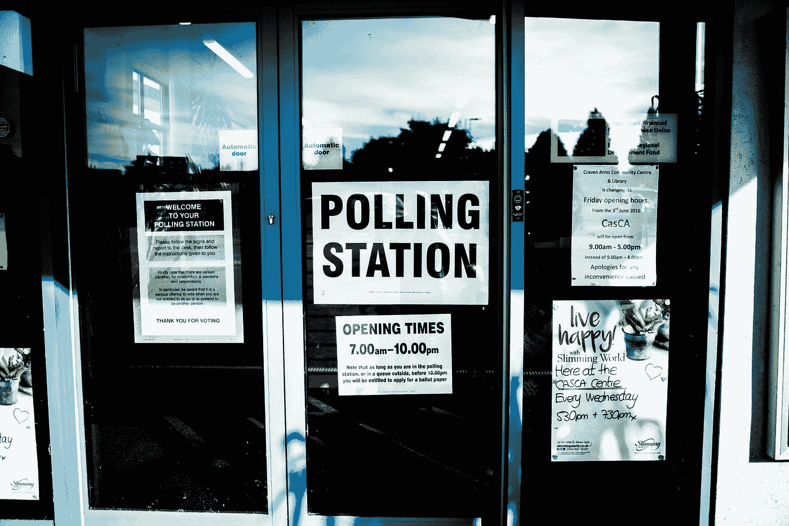

由[埃利奥特种马](https://unsplash.com/@eagleboobs?utm_source=medium&utm_medium=referral)在 [Unsplash](https://unsplash.com?utm_source=medium&utm_medium=referral) 上拍摄的照片

在一个社区中发现的连锁店可以告诉我们许多关于住在那里的人的情况。想想塔吉特和沃尔玛；你与哪个政党有联系？我想调查一下这种看法，所以我建立了一个选举模型，只基于你所在地区的连锁店数量。

我的假设是，连锁店的总数将与民主投票的增加相关，因为连锁店在城市地区更频繁。此外，这些品牌(将在本文后面介绍)表明共和党或民主党选民倾向于某一特定党派。

# 我的选举数据

为了研究这个问题，我决定利用 2018 年中期选举的选举结果建立一个分类模型。

这个项目的选举数据来自麻省理工学院选举实验室的杰出人士。我用政治边界文件(geojson)和来自[data.gov](https://catalog.data.gov/dataset/u-s-county-boundaries)的其他县信息补充了县信息，以便我可以使用 Plotly 创建地图。

我选择看县级数据。美国有 3000 多个县，我觉得这足以建立一个强大的机器学习模型，而不是查看州或国会选区的数据。我根据所有政党候选人(包括当地和全国)的总票数将每个县指定为民主党或共和党。不幸的是，阿拉斯加没有包括在我的选举数据中(我向阿拉斯加的行政区道歉)。

# 关于美国各县

在美国，大多数州被划分为政治和行政区，称为县。美国 3000 多个县中的大部分都是共和党的，这使得我的数据集一开始就有偏差。民主国家大约有 600 个，通常集中在大城市及其周边。

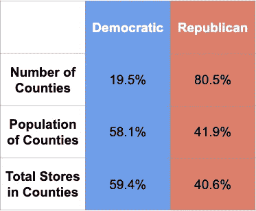

虽然民主县只占总县数的 20%，但美国近 60%的人口居住在其中。这也是我们在这个项目中发现大多数零售点的地方。

# 连锁店数据

在做了一些关于品牌政治的研究后，我发现已经有很多关于这个主题的文章了，我推荐看看其中的一些( [NBC](https://www.nbcnews.com/storyline/business-of-the-holidays/liberal-or-conservative-where-you-shop-reveals-how-you-vote-n831536) 、 [Time](https://time.com/3559482/stores-politics/#491) 、 [Washington Post](https://www.washingtonpost.com/blogs/in-the-loop/wp/2014/11/08/what-do-your-local-shopping-options-say-about-your-areas-politics/) 和 [The New York Times](https://www.nytimes.com/interactive/2020/02/27/upshot/democrats-may-need-to-break-out-of-the-whole-foods-bubble.html) )。

我根据研究中发现的信息选择了 20 个特征(零售连锁店)，还有一些是出于我自己的好奇。我调查的商店如下图所示(最终模型中未使用的功能显示为灰色)。

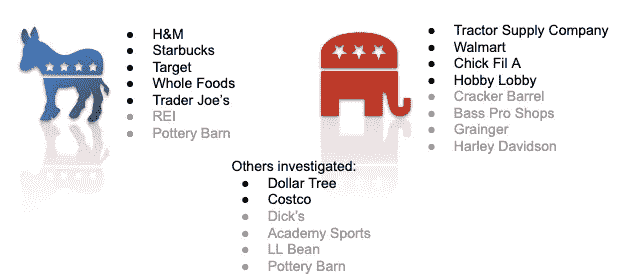

为我的项目选择的功能

所有功能都是全国连锁，已经扩展到几乎或所有的美国。根据我的研究，我的目标是在感知的共和党和民主党倾向商店之间取得平衡。

现在我所需要的是每家商店的位置，我可以认真地开始这个项目了。有些数据很容易从 Kaggle 和类似的网站上获得，但是对于许多连锁商店来说，我不得不求助于创造性的和合乎道德的网络搜集来编辑位置数据。这部分花了我比我愿意承认更多的时间；网络抓取有时是一项具有挑战性的运动。

总之，我从 20 家连锁店收集了超过 45，000 家店铺的经纬度信息。使用我从 data.gov 和 Python 的 Shapely 库中获得的形状文件，我能够确定每个商店的正确县，并编译一个包含美国每个县的每个连锁店数量的数据集。然后，我添加了选举数据，以确定这些县在 2018 年的投票方式。

在下面的图表中，我们可以看到我选择的所有品牌，以及它们大多数商店的所在地。

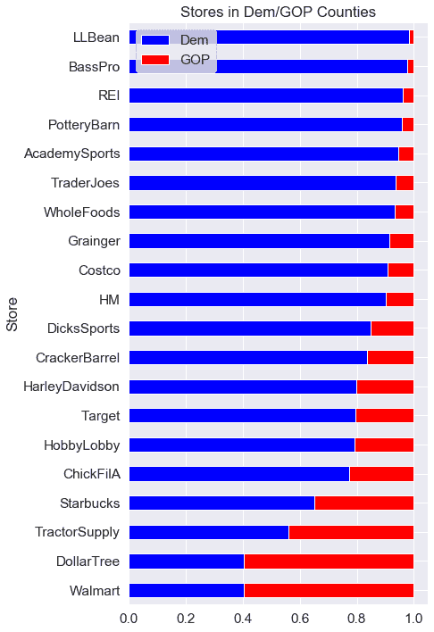

每个连锁店的红/蓝分布

# 初步测绘

首先，我在 choropleth 地图上绘制了 2018 年选举的结果。不出所料，民主党(蓝色)的县主要集中在人口集中的地方，尤其是沿两岸。蓝点点缀着美国中部的共和党红色海洋，但大多数大城市呈现出一片蓝色。

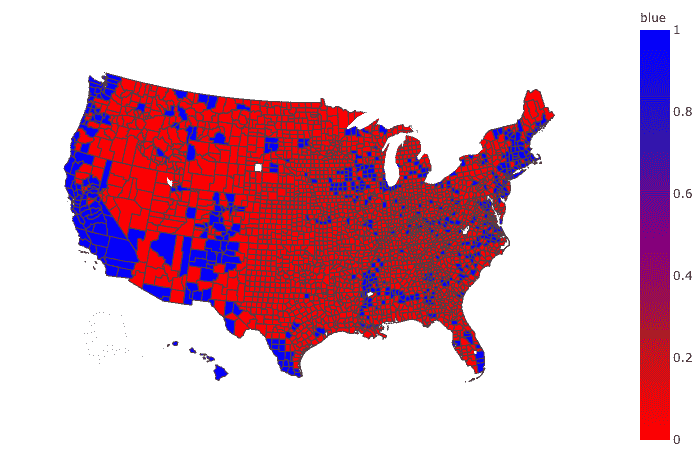

美国中期选举(2018 年)

我还绘制了 choropleth 地图，显示了所有县的每个连锁店的密度。下面两幅图显示了商店分布的极端情况。超过 93%的全食超市位于主要人口中心的民主县。此外，像库克县(芝加哥)这样的大都市地区拥有美国 500 家全食超市中的 15 家。洛杉矶县有 26 个。

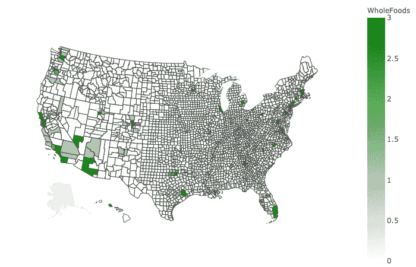

全食超市购物地图

相比之下，1900 年拖拉机供应公司的位置似乎一直覆盖整个农村地区，只有最低限度的渗透到城市市场。如果你从未听说过或去过拖拉机供应公司的商店，很可能你住在一个大城市地区。芝加哥的库克县没有一家拖拉机供应公司的商店，而人口 1000 万的洛杉矶县只有一家。——*相比之下，内布拉斯加州林肯市(人口 33 万)有三个。*

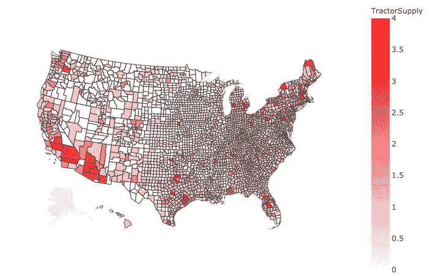

拖拉机供应 Choropleth

在城市和农村地区代表过多或不足的某些连锁店。由于我们的政治分歧至少部分归因于这种城乡分歧，这些特征应该对我们的模型有用。

# 我们的模型

为了简化模型并考虑到每个县不同的物理和人口规模，我计算了每个县单位面积的商店数量。该模型不是基于商店的数量，而是每平方英里的商店数量。这使得我的数据是连续的，并且更容易建模。当你向西看时，这也是一些相当大的县的原因。(类似的方法是计算每个人口的商店数量)

## 模型一览:

*   随机森林(基于树的算法)
*   使用 Boruta Python 库算法选择的 10 个要素
*   加权以考虑红/蓝县的不平衡
*   调整以达到最大的准确性
*   使用 0.25 的测试/训练分割

最终的模型达到了 85.7%的**准确率。**

## 特征重要性

最重要的功能如下所示。当查看随机森林模型中的单棵树时，我确定了特征的方向(这个特征更多地指示红色还是蓝色状态？).如果更多商店的存在有助于区分一个县是共和党的，它们周围有一个红框(蓝色代表民主党)。

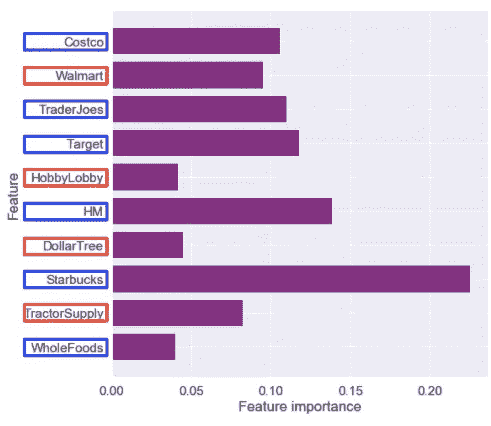

前四个特征是用于识别民主县的特征。最重要的“共和党”特色是沃尔玛，最重要的“民主”特色是星巴克。一般来说，商店越多，功能越有利于模型。

我们的模型重视民主党的“高端”品牌(星巴克、Trader Joe's 和 Whole Foods)，以及共和党的“价值”品牌(Dollar Tree、沃尔玛、拖拉机供应公司)。

## 混淆矩阵

当使用测试数据(n=776)进行预测时，我们看到该模型有点倾向于预测共和党。92%的共和党县被正确识别，相比之下，民主党县只有 52%。民主国家占少数，因此我们预计这将是该模型更困难的任务。

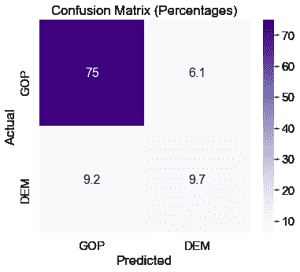 [## 不要使用随机猜测作为你的基线分类器-机器学习掌握

### 我最近通过电子邮件收到了以下问题:嗨，杰森，问个小问题。一个阶层失衡的案例:90 例…

machinelearningmastery.com](https://machinelearningmastery.com/dont-use-random-guessing-as-your-baseline-classifier/) 

上面的链接给出了一个很好的方法来**简单地**衡量你的模型的有效性。如果我们以 81%到 19%的比率(Dem/GOP 的实际百分比)随机猜测每个县的政治，我们只能达到 69%的准确性。我们的模型通过机器学习获得了额外的 17%。

# 模型预测法

我们的模型正确预测了几乎 86%的县。让我们看看地图，看看我们错过了什么，并确定我们的模型中的弱点。

## 我们的模型预测:

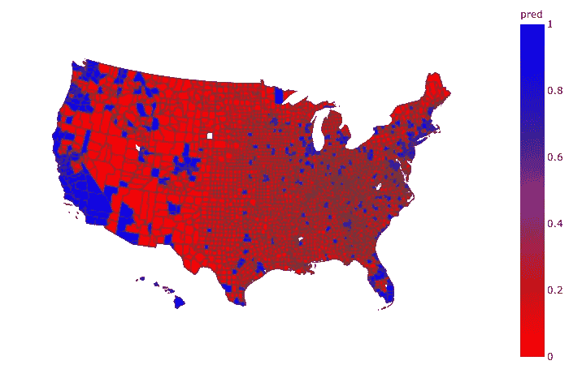

2018 年中期选举的模型预测

## 实际结果:

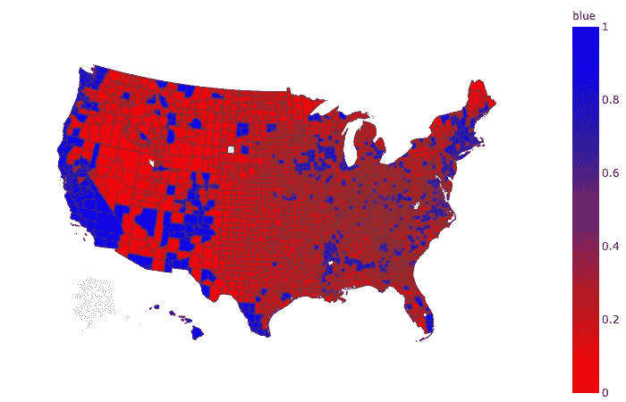

## 模型遗漏的地方:

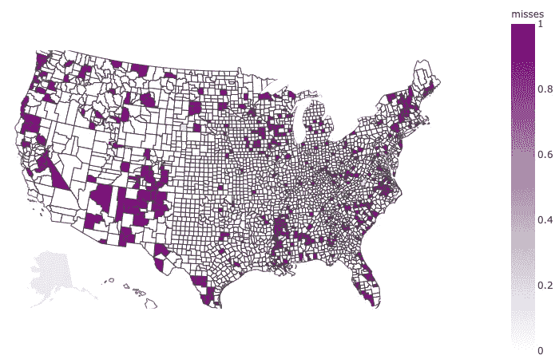

我们模型的不正确预测

我们的地图上有清晰的区域，这个模型漏掉了大量的县。一些领域非常突出:

*   在新英格兰地区，特别是佛蒙特州和新罕布什尔州，民主党人的表现明显优于该模式。这些州的农村地区倾向于民主党，这与假定农村地区是共和党的模式相反。

 [## 欢迎来到新罕布什尔州，在这里农村地区投蓝色票，郊区投红色票，而…

### 如果民主党人依靠多元化的大城市在全国其他地方取得胜利，他们将一无所获…

www.bostonglobe.com](https://www.bostonglobe.com/2020/02/06/opinion/yes-newhampshiresowhite-also-newhampshiresoweird/) 

*   新墨西哥州是个例外。这是白人选民占少数的三个州之一。新墨西哥州的拉美裔选民近年来对民主党表现出了热情的支持。
*   密西西比州西部是美国非洲裔选民最集中的地区之一，他们压倒性地(90%)支持民主党。阿拉巴马州的部分地区也存在类似的人口统计数据，这可能是这些失误的原因。
*   该模型还忽略了太平洋西北部和南部腹地的一些县，在这些地方，保守主义和人口统计学在投票习惯中发挥了巨大作用。
*   其他重大失误发生在摇摆州佛罗里达和威斯康星，这两个州的政治倾向是分裂和不稳定的。

《华盛顿邮报》的这篇文章很好地报道了 2018 年大选前各州的政治。

 [## 美国的 50 个政治州

### 政治分析根据包括数据在内的证据对新闻进行严密解读，并预测如何…

www.washingtonpost.com](https://www.washingtonpost.com/graphics/2020/politics/united-states-political-geography/) 

# 结论

在过去的几年里，品牌比以往任何时候都更加政治化，每天都有新的公司决定试水，让他们的政治理念为人所知。看看像耐克、本杰里、业余爱好游说团、福乐鸡快餐店和巴塔哥尼亚这样外表政治化的公司就知道了。我们似乎无法将购物和政治分开，而且人们认为，随着政治分歧的加剧，这种商店和品牌的二元分类很可能会加强。像这样的模型可能会随着时间的推移而改进。

该模型和方法的优势在于独立于任何普查或投票。这是一种“基于基本面”的方法。这些数据也很容易获得，并且比人口普查数据更新得更频繁，这使得一个政党能够灵活地应对自然灾害、气候迁移和快速变化的经济带来的人口变化。资本主义，随着商业的开放和关闭，对市场变化做出快速反应，一个政党可以利用这一点。

在 85.7%的情况下，该模型可以帮助政党确定他们在哪些领域的表现低于预测模型。这些确定的地区可能需要干预和投资，因为它们是潜在的危险地区。

# 后续步骤

这种方法可以通过以下方法进行改进:

*   基于区域或更同质的投票区(中西部、亚利桑那州/新墨西哥州、加利福尼亚州、西北太平洋地区、佛罗里达州等)建立几个较小的目标模型。)
*   使用类似的方法评估州级、国会选区级或辖区级的数据。国会选区级别的初步模型预测美国众议院选举的准确率超过 80%。
*   针对我们模型的缺点添加或更改功能。找到在错过的县流行的业务。
*   建立模型专门识别紫色区域，在那里进一步投资可能产生政治席位。

该项目的代码可以在下面的回购中找到。感谢阅读！

 [## 科学研究/DSC-mod-3-项目-v2-1-在线-ds-sp-000

零售连锁选择模型回购。github.com](https://github.com/sciencelee/dsc-mod-3-project-v2-1-online-ds-sp-000)