# 你是民主党人还是共和党人？让你的推文定义你…

> 原文：<https://towardsdatascience.com/are-you-democrat-or-republican-let-your-tweets-define-you-4aa4cadf4bea?source=collection_archive---------19----------------------->

## 当你在短短几秒钟内分析数百条推文，并自动获得话题、观点和情绪等信息时，感觉就像是魔法一样。


玛利亚·奥斯沃特在 [Unsplash](https://unsplash.com/s/photos/republican-democrat?utm_source=unsplash&utm_medium=referral&utm_content=creditCopyText) 上拍摄的照片

最近，我有一次关于政治和下一届 2020 年美国**总统选举的谈话。引起我注意的是，人们对此的态度变得极端对立。他们开始说: ***“你听起来就像一个民主主义者！”*** 或 ***“你是反共和党的吗？”*** 。通过武力，你开始有理由捍卫自己的立场。所以我很快去做了一些在线测试，试图回答这个问题:**“你是民主党人还是共和党人？”****

不幸的是，我没有被说服，所以我想找到一种新的方式，谢天谢地，我们有了 Twitter 的世界作为我们的数据集！

在这项研究中，我将尝试寻找以下问题的答案:

*   民主党人和共和党人**在他们的推特上使用最多的词是什么？**
*   谁得到的转发和喜欢更多？
*   我们可以对提取的推文进行**情感分析**吗？
*   我们能否使用**机器学习**算法来训练一个模型，并确定这条推文是由**民主党**还是**共和党**候选人写的？
*   一个**神经网络(RNN)** 会帮我决定我的**推特**账号更**民主党/共和党**吗？

# 数据收集:

首先，我们需要弄清楚哪些推特账户是**民主党**或**共和党**。推特上的国会议员目录[***TweetCongress.org***](http://www.tweetcongress.org/tweeters)，列出了网站上的 **101 名共和党人**和 **57 名民主党人**。每个政党大多由几个**推特**超级明星支撑着(像**民主党** [**参议员克莱尔·麦卡斯基尔**](https://twitter.com/clairecmc?ref_src=twsrc%5Egoogle%7Ctwcamp%5Eserp%7Ctwgr%5Eauthor) 和**共和党** [**参议员约翰·麦凯恩**](https://twitter.com/senjohnmccain?lang=en) )，但是国会**共和党**总体上有更多的追随者和更频繁的推特。

另一个选择是直接查看 Twitter 上的 [@TheDemocrats](https://twitter.com/TheDemocrats/lists/house-democrats/members) 和 [@HouseGOP](https://twitter.com/HouseGOP/lists/house-republicans/members) 成员列表。在浏览列表之后，您可以看到我们可以提取所有的**全名**和**用户名**类元素。我们还将保存头像图像的 URL，供以后使用。

我将使用 [**美汤**](https://www.crummy.com/software/BeautifulSoup/bs4/doc/) 提取手柄。这是一个用于解析 HTML 和 XML 文档的 Python 库。当 HTML 或 XML 文档格式不良时(例如，如果它缺少结束标签)， **Beautiful Soup** 提供了一种基于启发式的方法，以便在不产生错误的情况下重建语法树。

提取句柄后，我将结果导出到**。csv** 文件，看起来像这样:

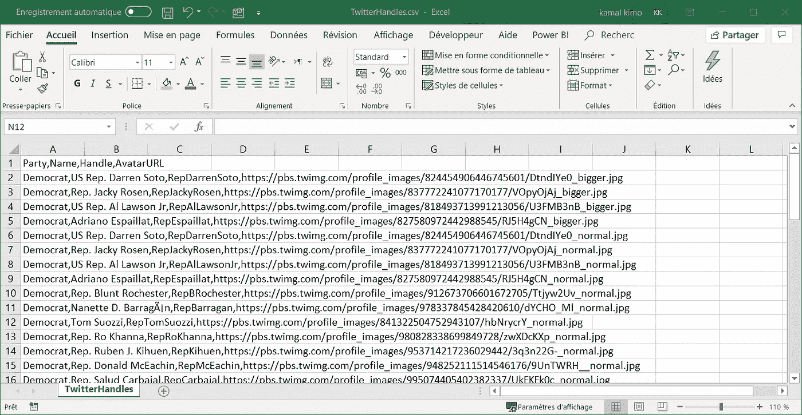

然后，我需要创建一个数据集，其中包含这些成员与 2018 年美国国会选举相关的推文。我收集了 2018 年 1 月 22 日*和 2019 年 1 月 3 日*J**之间的推文从 **Twitter API** 使用 [**社交 Feed Manager**](https://gwu-libraries.github.io/sfm-ui/) 。有关收集日期、账户和查询中使用的标签，请参见每个收集的[自述文件](https://github.com/chouhbik/Sentiment-Analysis-of-Tweets/blob/master/election-filter-README.txt)。**

**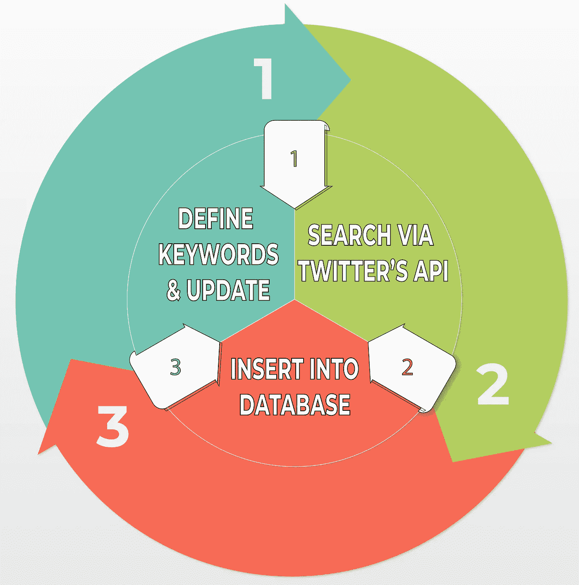**

**数据收集法**

# **探索性数据分析(EDA):**

**该数据集包含与 2018 年美国国会选举相关的 **86，460** 条推文(共和党的 **44392** ，民主党的 **42068** )。我们可以说，在训练数据集中，民主党和共和党的比例大致相当。**

**我将从美国**的**民主党**和**共和党**议员的推文开始快速探索。这个初始分析的主要目的是可视化他们两个使用的标签。****

****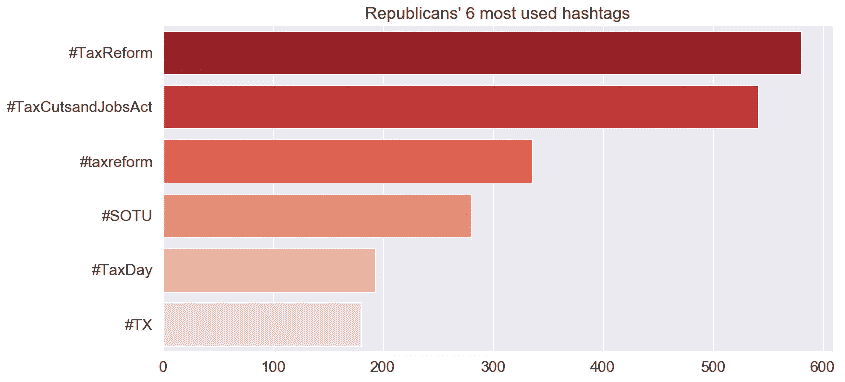********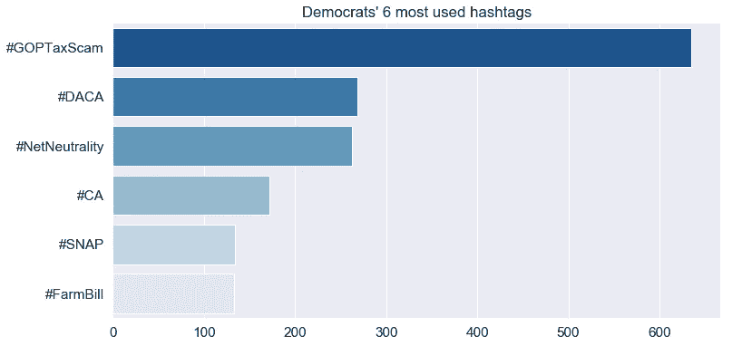****

****这越来越有趣了。我们现在可以看到**共和党**党*(红衣)*吹捧他们的政策(例如 **taxcutsandjobsact** )。对于那些不太熟悉美国政治的人来说，共和党控制着总统职位和国会两院，因此能够相对不受限制地实施他们的议程。另一方面，对于**民主党**来说，我们看到了一些明显的痛苦(例如 **goptaxscam** )。****

****此外，我将探讨不同党派使用的词汇。这将通过清理 tweets，将它们解析为单词的**向量，移除常见的**停用词**，通过计数聚合单词，并使用**条形图**绘制最频繁的结果来实现。停用词的选择有时很关键。我认为最好从***【word cloud】***库中选择**停用词**，因为它们包含了所有停用词的平均列表。******

****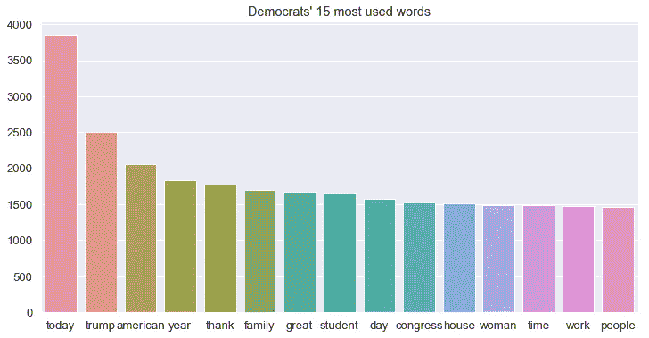****

****比如民主党人发的推文中使用次数最多的就是**【今天】** (3850 次)这个词。然后我们找到**【川普】** (2502 次)**【美国】** (2053 次)。****

****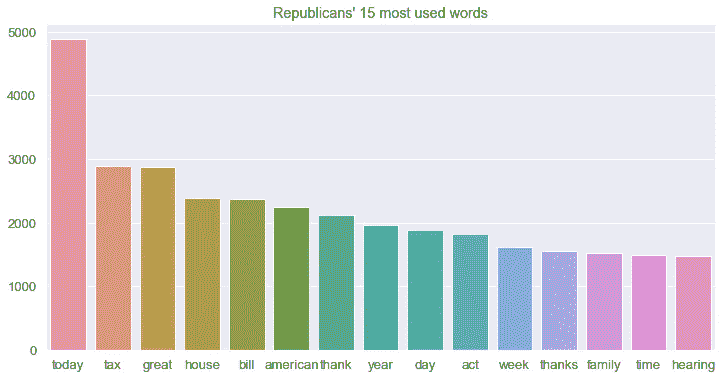****

****如果我们看一下有共和党观点的人的推文，这个词**【今天】** (4883 次)再次位于第一位，**【税收】**位于第二位，**【伟大】**位于第三位。****

****我还将词频分为 5 类:****

*   ****如果一个词的使用少于 **50** ，它就在**极低**组。****
*   ****如果在 **50** 和 **200** 之间使用，则处于**低**组。****
*   ****如果在 **200** 和 **750** 之间使用，则属于**中等**组。****
*   ****如果在 **750** 和 **1500** 之间使用，则在**高**组。****
*   ****如果一个词的使用量大于 **1500** ，它就在**极高**组。****

****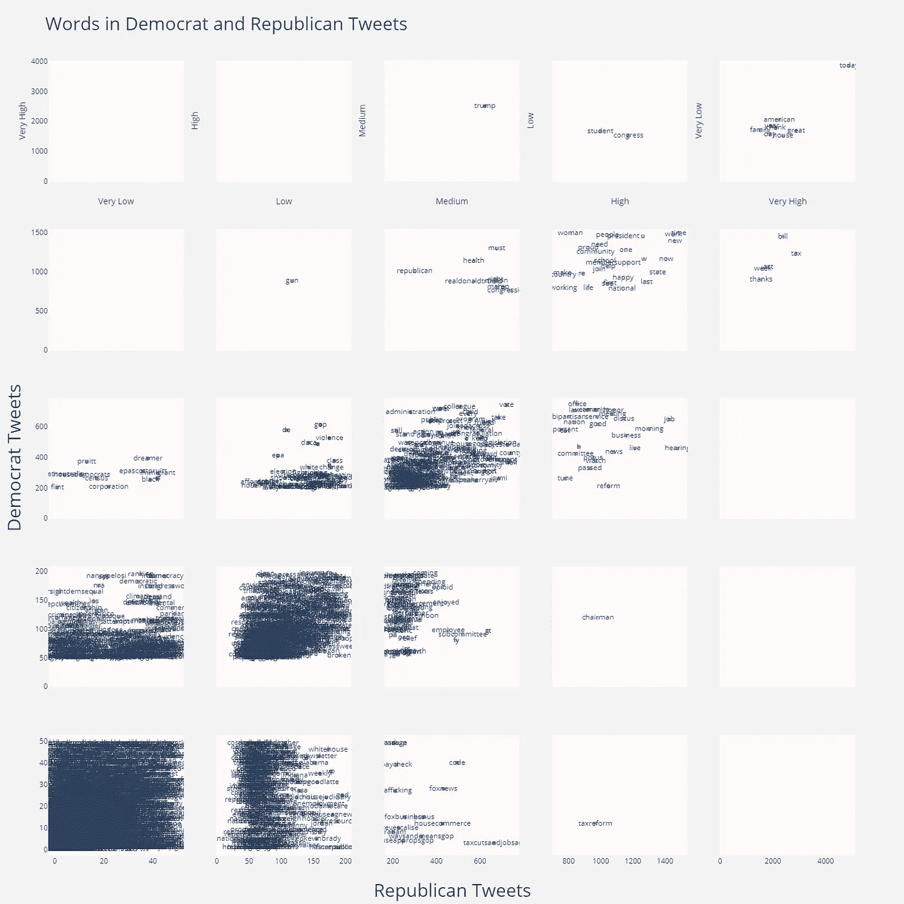****

****用[精心制作](https://plot.ly/)****

## ****解释:****

****我试图绘制一个矩阵，其中**‘X’**轴指的是**共和党推文**的词汇使用频率，而**‘Y’**轴指的是同一事物，但与**民主党**有关。****

****例如，单词**“tax reform”**被共和党人使用了 966 次，所以它被放在他们的高类别中。然而，民主党人只用了这个词 12 次。另一个例子是**【枪】**字。它在民主党推文中被使用了 876 次，在共和党推文中被使用了 117 次。****

****也没有词，当共和党人使用非常高，民主党人使用中等，低或非常低的水平。和民主党人一样。**“今天”、“美国人”、“伟大的”、“房子”、“年”、“家庭”、“日子”和“感谢”**这些词被**民主党人**和**共和党人**高度使用。****

## ****离差图:****

****我在数据集中选择了一些单词，以便绘制一个图表，显示单词在文本中的分布。这几个词分别是**【投票】【民主】【自由】【美国】【美国人】【税收】【特朗普】****【克林顿】**。****

******民主党推文剧情******

****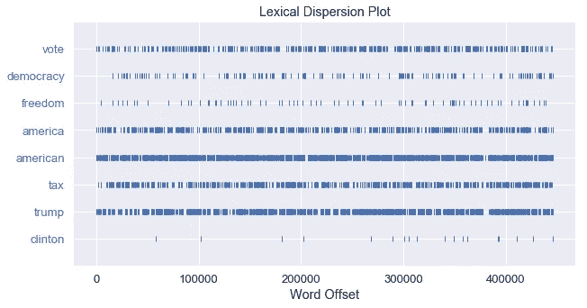****

******共和党推文剧情******

****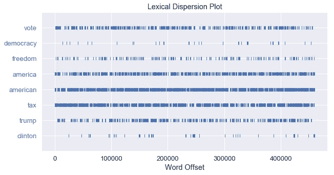****

# ****情感分析****

****在这里，我将尝试使用不同的文本分类器将推文分类为有组织的团体或团体，此外还有**情感分析**以了解给定推文对给定主题是正面还是负面的谈论。****

****所以我开始将双方的推文集合转换成一个令牌计数矩阵，使用来自**[***sk learn***](https://scikit-learn.org/stable/index.html)**的 [**计数矢量器**](https://scikit-learn.org/stable/modules/generated/sklearn.feature_extraction.text.CountVectorizer.html) 函数。**然后我应用 ML 算法进行分类**:**[**random forest**](https://scikit-learn.org/stable/modules/generated/sklearn.ensemble.RandomForestClassifier.html)，[**logistic regression**](https://scikit-learn.org/stable/modules/generated/sklearn.linear_model.LogisticRegression.html)， [**Multi-NB**](https://scikit-learn.org/stable/modules/generated/sklearn.naive_bayes.MultinomialNB.html) ， [**决策树**](https://scikit-learn.org/stable/modules/generated/sklearn.tree.DecisionTreeClassifier.html) ， [**AdaBoost**](https://scikit-learn.org/stable/modules/generated/sklearn.ensemble.AdaBoostClassifier.html)******

****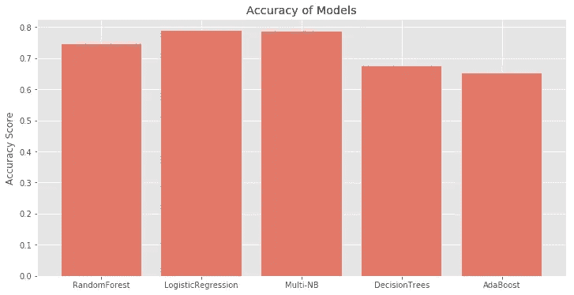****

****之后，我试图确定每一方的态度或情绪，即它是积极的还是消极的还是中立的。所以我使用了著名的 Python 库[**text blob**](https://textblob.readthedocs.io/en/dev/)**，它返回 2 个重要指标:******

*   ********极性**分数在 **[-1.0，1.0】**范围内浮动。它代表了一个句子所表达的情感。 **1** 表示**正**声明， **-1** 表示**负**声明。******
*   ********主观性**在**【0.0，1.0】**范围内浮动，其中 **0.0** 非常**客观****1.0**非常**主观**。它指的是个人的观点、情感或判断。******

```
********Democrat_Tweets :**
Sentiment(polarity=0.16538325109722254, subjectivity=0.4649093199451984)**Republican_Tweets:** Sentiment(polarity=0.19837398561739605, subjectivity=0.4590746992419168)******
```

# ******简单神经网络分类******

******现在让我们尝试用一个简单的神经网络**来回答最后一个问题“如果我的 **Twitter** 账号更**民主党/共和党】**。**我将利用 [**Keras**](https://keras.io/) 深度学习库，为**序列分类**开发一个 **LSTM** 和**卷积神经网络**模型。******

****让我们从导入该模型所需的类和函数开始，并将随机数生成器初始化为一个常量值(例如 7)，以确保结果可以重现。****

****然后，我们分割数据集，根据政党变量分层，以便在整个数据集中分别具有大约相似比例的**民主党** & **共和党*****培训&测试*** 集合。该设置将基于那些 ***推特手柄*** ，因为我们不希望任何单独的推特出现在两个 ***训练&***设置中。****

****实际上，就单词而言，tweets 不具有相同的长度，但是在 **Keras** 中执行计算需要相同长度的向量。这就是为什么我们需要截断和填充输入 tweets，以便它们在建模时长度相同。该模型将了解到零值不携带任何信息。****

****我们现在可以定义、编译和拟合我们的 LSTM 模型:****

*   ****第一层是**嵌入的**层，它使用 32 个长度向量来表示每个单词。****
*   ****我们在**嵌入**层之后添加一个一维 **CNN** 和一个**最大池**层，然后将合并后的特征提供给 **LSTM** 。****
*   ****下一层是 **LSTM** 层，带有 **100** 记忆单元(智能神经元)。****
*   ****最后，因为这是一个分类问题，我们使用一个具有单个神经元的**密集**输出层和一个 **sigmoid** 激活函数来为两个类别**民主党/共和党**做出 **0** 或 **1** 预测。****

****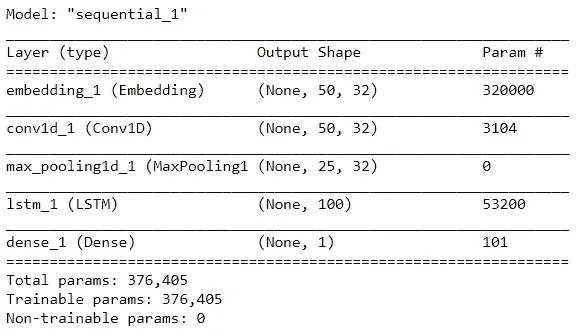****

****我使用 **epochs=10** 和 **batch_size=64** 来拟合模型。一旦拟合完成，我们就可以评估模型在看不见的推文上的表现:****

****我得到了一个**74.52%的整体准确率。一条推文被错误分类并不罕见，所以也许我们应该考虑每个人推文的整体分类。******

****通过这种调整，我们得到了 **~93%** 的准确度。****

# ****结论:****

****文本分类不仅有趣，而且是从非结构化数据中提取价值的强大工具。 **Twitter** 是一个非常受欢迎的社交媒体平台，有数百万用户使用，发布的推文有时可以用来了解公众对某个问题的看法。当你在短短几秒钟内分析数百条推文，并自动获得话题、观点、情绪等信息时，感觉就像变魔术一样****

****经过这次研究，我发现我们可以对人们进行分类，看看他们是**民主党**还是**共和党**，结果在某种程度上是准确的。如果情感分析算法得到改进，我们可以用它们来预测今年的下一次总统选举结果。****

****尽管如此，开发出来的模型仍然有 **2** 的主要障碍:****

*   ******讽刺**是所有**情感分析算法**的另一个弱点，我们的模型在这个阶段也无法检测到**讽刺**。****
*   ****由于**推文**可以由任何人发布，并且可能包含拼写&语法错误，拼写错误的关键词可能会被我们的算法错误地分析。****

## ****笔记本:****

****[](https://github.com/chouhbik/Sentiment-Analysis-of-Tweets/blob/master/Tweets%20Analysis%20DemvsRep.ipynb) [## chouhbik/推特情感分析

### permalink dissolve GitHub 是 4000 多万开发人员的家园，他们一起工作来托管和审查代码，管理…

github.com](https://github.com/chouhbik/Sentiment-Analysis-of-Tweets/blob/master/Tweets%20Analysis%20DemvsRep.ipynb) 

# 参考资料:

*   **TweetCongress.org:**http://www.tweetcongress.org/tweeters
*   **美汤:**https://www.crummy.com/software/BeautifulSoup/bs4/doc
*   **社交供稿经理:**[https://gwu-libraries.github.io/sfm-ui/](https://gwu-libraries.github.io/sfm-ui/)
*   **Scikit-learn:**https://scikit-learn.org/stable/index.html

如果你设法来到这里，恭喜你。感谢阅读，我希望你喜欢它。关于机器学习的个人接触或讨论，请随时在 [**LinkedIn**](https://www.linkedin.com/in/kamal-chouhbi/) 上联系我，别忘了在 [**GitHub**](https://github.com/chouhbik) 和 [**Medium**](https://medium.com/@chouhbik) **上关注我。**

[](https://github.com/chouhbik) [## chouhbik —概述

### 在 GitHub 上注册你自己的个人资料，这是托管代码、管理项目和构建软件的最佳地方…

github.com](https://github.com/chouhbik)****