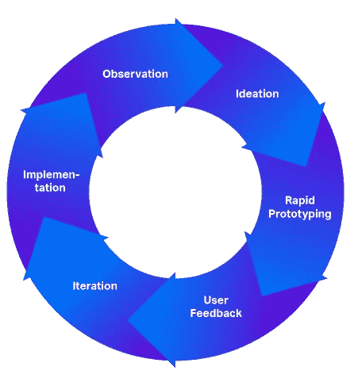

# 以人为中心的数据解决方案设计方法

> 原文：<https://towardsdatascience.com/are-you-designing-for-the-people-5ae3674b65f9?source=collection_archive---------48----------------------->

## 你是在为人民设计吗？

本·斯威特在 [Unsplash](https://unsplash.com/s/photos/people-circle?utm_source=unsplash&utm_medium=referral&utm_content=creditCopyText) 上的照片

2004 年，美国银行聘请设计公司 IDEO 帮助他们吸引更多的客户。当 IDEO 开始参与时，他们做了一些意想不到的事情，他们没有走进美国银行的办公室，而是去实地观察人们如何处理金钱，并记录他们的消费习惯。他们发现，人们将支出四舍五入是因为 1)这更容易计算，2)他们感到安全，因为这增加了储蓄的缓冲。然而，人们仍然在努力存钱。

这种见解启发 IDEO 设计了“保持变化”计划。每次顾客用美国银行的借记卡进行交易时，购买的东西都会被取整，零钱就会进入储蓄账户。每次存入零钱时，银行也会在储蓄账户中存入一部分。通过这个项目节省了 20 多亿美元。统计数据显示，自 2005 年 9 月推出以来，已有 1230 多万客户注册了该计划。那么，IDEO 做了什么？

IDEO 没有试图改变银行内部的战略，或者根据假设设计不同的营销策略来吸引客户，而是从客户的角度来看待问题。他们观察并接触客户，了解他们的习惯，感受他们的痛苦，并利用这些知识来设计一个非常规的解决方案。这种设计解决方案的方法被称为以人为中心的设计。

# 这种设计方法有什么好处？

以人为中心的设计方法将人置于中心，使设计师能够更接近他们为之设计的人，了解他们所描述的条件背后的实际问题，产生想法并快速构建原型以进行测试、学习和重新定义。

以人为中心的设计过程( [IDEO](https://www.usertesting.com/blog/how-ideo-uses-customer-insights-to-design-innovative-products-users-love) )

它鼓励设计师实践同理心
**观察阶段鼓励设计师放下所有先入为主的观念，与用户同理心——感受他们的体验，知道他们所做事情背后的动机。当设计者从用户的角度看问题，而不偏向于预先确定的解决方案时，他们可以找到用户描述的问题的根源。这有助于针对根本原因，而不是治疗症状。**

**它在每个阶段都把人联系起来。设计师在观察阶段与用户密切合作，他们在构思阶段从用户那里获得关于草图解决方案概念的反馈，并在实施阶段让用户参与测试和体验真正的解决方案。通过将人们包括在观察-构思-实现阶段，这种方法将所有权给予他们，并让他们对影响他们的转换有发言权。**

****培养信任和信心** 在每个阶段都让用户参与进来，听取他们的反馈并减少所有顾虑，培养组织对设计师的信任。设计师对解决方案更有信心，因为这些解决方案是基于不断的反馈反复构建和测试的。它确保解决方案在组织中被接受，并且人们会使用它们。**

****它非常适合现代技术和实践** 像云这样的现代技术平台允许企业动态构建资源，消除管理和维护资源的开销，从而实现快速原型开发。成本是基于使用的，所以实验可能非常便宜，这鼓励了迭代。敏捷方法可以应用于产品开发，它的建立是为了支持变化并提供比传统方法更大的灵活性。这使得设计人员可以快速、持续地发布变更。**

# **为什么这种方法在设计数据解决方案时至关重要？**

**2019 年进行的一项[调查](http://newvantage.com/wp-content/uploads/2018/12/Big-Data-Executive-Survey-2019-Findings-Updated-010219-1.pdf)显示，在 77.1%的公司中，采用大数据和人工智能解决方案仍然是一项重大挑战，高管们表示，这些挑战中有 95.0%源于文化变化(人员和流程)，只有 5.0%与技术有关。**

**众所周知的事实是，业务战略和数据战略之间的不一致导致了几个项目的失败，而业务、数据和 It 之间缺乏沟通导致了用户想要的和他们得到的之间的巨大差距。造成这种情况的主要因素之一是 ***解决方案不能解决用户面临的问题*** 。**

**除非将数据放入环境中，否则它对业务没有任何意义。设计师必须通过与业务及其人员密切合作来理解这种背景。许多设计决策是基于过去的经验 或应用以前项目的模板做出的，这降低了解决方案在不同环境中工作的机会。此外，用预先确定的解决方案来解决问题会分散设计者对实际问题的注意力，将他们的注意力转移到产品或服务上。**

**数据解决方案只有当设计者超越印刷的要求，发现没有陈述的内容时才会成功。 ***设计师应该在人员、流程和技术之间建立联系***——这要求他们放眼全局，思考的不仅仅是分类、整合和存储数据。设计师必须赋予每个用户(以及整个组织)知识和洞察力，帮助他们做出正确的商业决策。**

# **数据解决方案设计师如何应用这种方法？**

**在实践中，数据解决方案项目有不同的形式和规模，它们有自己的动力，并按照一套通常与特定组织(或部门)相一致的既定原则运行。因此，将这种方法应用于每个项目可能会很棘手。然而，有一些原则，设计师可以在任何环境下遵循，这将有助于以人为本的方式形成解决方案。**

1.  **解决问题时，忘掉以前的项目。用新鲜的镜头看问题。**
2.  ****与用户产生共鸣** —了解他们描述的是原因还是症状。**
3.  ****在了解根本原因之前，不要提出解决方案。**在理解问题之前谈论解决方案会在设计思维过程中制造界限，甚至会分散用户讲述他们故事的注意力。**
4.  ****使用视点(POV)方法生成有意义且可行的问题陈述**。
    【用户…】*需要*【需要…】*因为*【洞察…】
    例子:
    —数据科学家/s(用户)*需要*一个沙箱*因为*他们要运行机器学习实验。
    —数据分析师(用户)*每天早上*都需要*数据仓库中的最新数据，因为*他们向外部客户发送每日报告。**
5.  ****提出“我们如何可能”的问题来产生想法**。如果你发现用户不信任数据，比如说*“我们如何培养用户对数据的信任”*，产生尽可能多的想法，而不是建议像“实施数据质量工具”这样的解决方案，或者排列产品。**
6.  **将复杂的问题分解成更小的、可管理的部分。分析每个部分，构思并将不同的想法综合成可能的解决方案。**
7.  ****涉及用户**。在构建解决方案之前，听取他们对不同概念的反馈。这可以节省时间。**
8.  **[**构建、测量、学习**](http://theleanstartup.com/principles)Eric Ries 提出了精益创业方法论中的构建-测量-学习概念。它指出*“创业公司的基本活动是将想法转化为产品，衡量客户的反应，然后学习是转向还是坚持。”*同样的概念也适用于此。小规模构建，向用户寻求反馈，学习并重新定义，如果需要的话。**

# **记住更大的图景**

**数据解决方案项目通常是企业级数据策略的结果。因此，在设计底层解决方案的同时，设计师也应该记住更大的图景。应用治理方法来审查与业务战略的一致性，并确保较小的解决方案能够很好地解决企业规模的数据管理难题，这一点很重要。**

**如果目的是 ***“为人民而设计”，*** 关于数据和人工智能解决方案采用的令人担忧的统计数据将朝着有利于成功实施的方向变化，为企业创造价值，并塑造一个更好的连接组织。**

**点击阅读更多关于以人为中心的设计[。点击](https://www.usertesting.com/blog/how-ideo-uses-customer-insights-to-design-innovative-products-users-love)阅读美国银行的故事和更多[。](https://www.designbetter.co/design-thinking/empathize)**

***连接上*[*LinkedIn*](http://www.linkedin.com/in/sandipanbhaumik)*。***