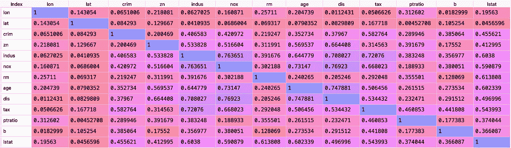
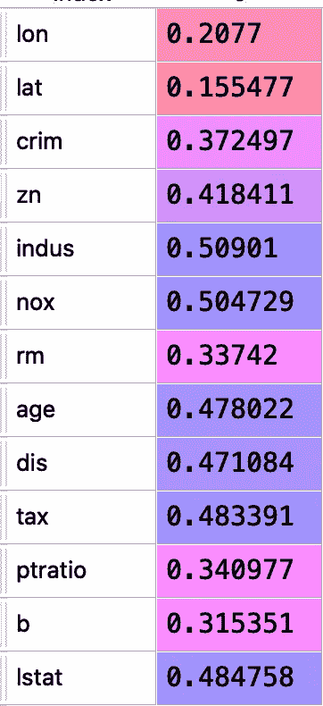
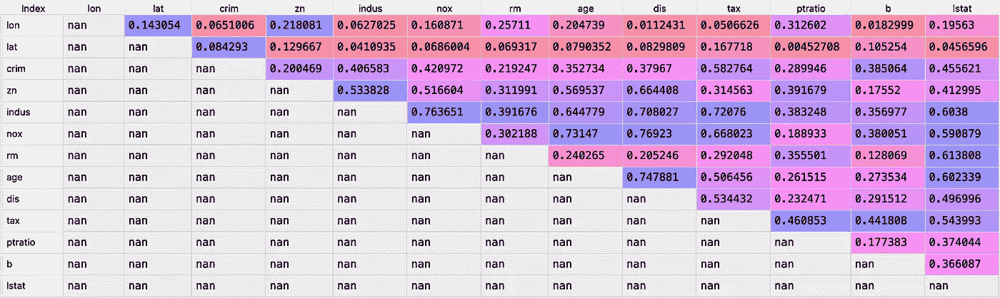
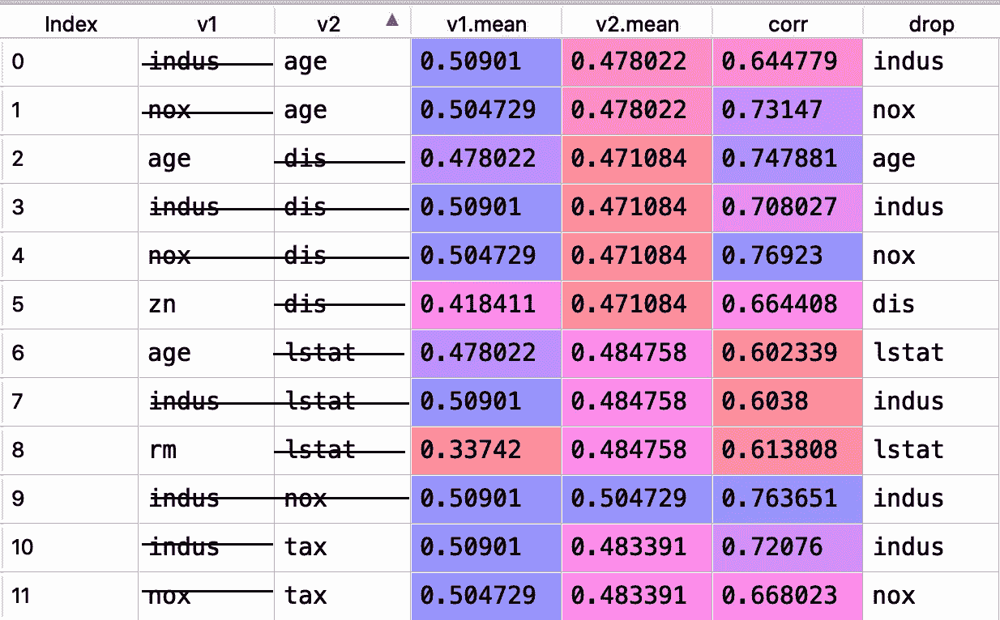
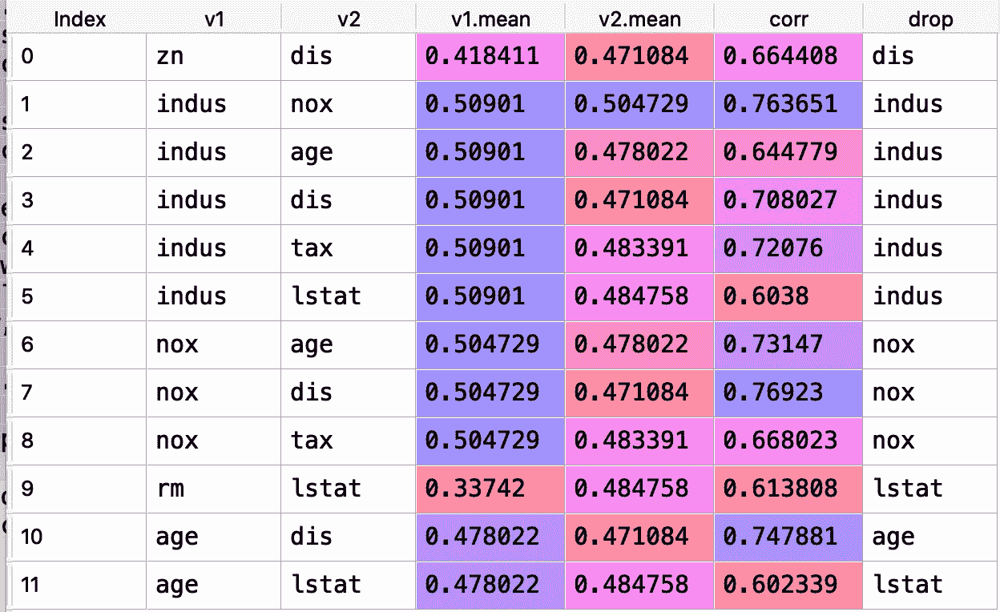
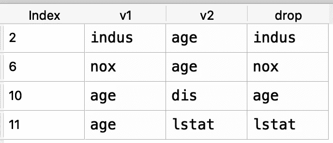

# 你是否丢弃了太多相关的特性？

> 原文：<https://towardsdatascience.com/are-you-dropping-too-many-correlated-features-d1c96654abe6?source=collection_archive---------7----------------------->

## 对当前方法的分析和建议的解决方案

卡拉·里维拉在 [Unsplash](https://unsplash.com?utm_source=medium&utm_medium=referral) 上的照片

**更新**:本文描述的更新后的 Python 关联函数可以在 PYPI 上的 [exploretransform](https://pypi.org/project/exploretransform/) 包中找到。

# **总结**

一些常用的相关滤波方法倾向于丢弃比所需更多的特征。随着数据集变得越来越大，并且随着更多的成对相关性超过特定阈值，这个问题变得更加严重。如果我们丢弃了不必要的变量，那么可用的信息就会减少，从而可能导致模型性能不佳。在本文中，我将展示当前方法的缺点，并提出一个可能的解决方案。

# **示例**

让我们来看一个例子，当前的方法是如何删除本应保留在数据集中的要素的。我们将使用波士顿住房修订数据集，并用 R 和 Python 展示示例。

**R:** 下面的代码使用 caret 包中的 findCorrelation()函数来确定应该删除哪些列。

该功能确定[ 'indus '，' nox '。lstat '，' age '，' dis' ]应根据 0.6 的相关临界值删除。

**Python** : Python 没有 findCorrelation()这样的内置函数，所以我写了一个叫 corrX_orig()的函数。

我们得到与 R: drop 列[ 'indus '，' nox '相同的结果。lstat '，'年龄'，' dis' ]

# 不幸的是，两者都不正确。年龄一栏不应该被删除。我们来探究一下原因。

**这些功能是如何工作的？** 首先创建一个相关矩阵。这些数字代表所有数值变量组合的成对相关性。

波士顿住房的相关矩阵

然后，计算每个变量的平均相关性。这可以通过取每行或每列的平均值来实现，因为它们是相等的。

列和行的平均相关性

之后，矩阵的下三角和对角线被屏蔽。我们不需要下面的三角形，因为相同的信息存在于对角线的两边(见上面的矩阵)。我们不需要对角线，因为它代表变量和它们自身之间的相关性(它总是 1)。

下三角形和对角线被遮罩的矩阵

下面是伪代码来演示该函数的其余部分是如何工作的。我将 0.6 硬编码为本例的相关截止值:

**现在到了你期待已久的部分**。**为什么功能不会老化？**

下面的表格显示了我从原始函数中捕获的变量。还记得函数告诉我们去掉[ 'indus '，' nox '吗。lstat '，' age '，' dis' ]。所以我们手动从表中删除[ 'indus '，' nox '，' lstat '，' dis' ]。正如您在表中看到的，没有其他变量可以与年龄进行比较来做出放弃决定。因此年龄不应该下降。

**但是为什么会这样呢？**

由于 R 和 python 函数的顺序性质，它们无法整体考虑所有变量的状态。删除变量的决定按顺序发生，并且是最终决定。

如何证明年龄属于数据集中？

我们可以从下拉列表中删除 age，得到[ indus，nox，dis，lstat]，然后从原始数据集中删除这四列。当我们重新运行这个变量子集时，如果它应该被删除，我们将期望“age”作为输出。如果我们没有输出，这意味着“年龄”应该留在集合中。

**如下图所示，这两个函数都没有输出。年龄应该留下来。**

**R**

**Python**

**简要回顾**

在这个例子中，我们已经证明了常用的相关过滤函数夸大了删除列的数量。我的断言是，这是由于相关矩阵中的每个单元如何被评估和丢弃的顺序性质。

# **那么解决办法是什么呢？**

1.  根据原始逻辑记录变量状态
2.  使用日志计算最后要删除的变量
3.  **原始**:原始解决方案顺序地、立即地、最终地删除列。

1.  **修改后的**:捕捉变量状态而不落入数据帧 res

**2。修订后的**:使用 res 计算要删除的变量

下面是 res 的输出，包含变量状态和变量定义

**v1，v2** :被分析的行和列
v1，v2【T27。mean] :每个 v1 和 v2 的平均相关性
**corr**:v1 和 v2 的成对相关性
**drop** :初始 drop 决定下降(v1.mean，v2.mean)中的较高值

捕获的可变状态

**修改了跌落计算中的(2)个步骤**

我鼓励读者使用上面的捕获变量状态(res)图来手动完成下面的步骤。我还嵌入了 calcDrop()函数中每一步的代码。整个函数在这一节的末尾。

**第一步:** all_vars_corr **=** 所有超过相关临界值 0.6 的变量。因为我们的逻辑将捕获满足这个条件的变量，所以这将是上面 res 表中 v1 + v2 列中的唯一变量集。

**结果** : ['tax '，' indus '，' lstat '，' rm '，' zn '，' age '，' nox '，' dis']

**第二步:** poss_drop **=** 来自 drop 列的唯一变量。这些最终可能会也可能不会被放弃。

**结果** : ['indus '，' lstat '，' age '，' nox '，' dis']

**步骤 3:** 保持 **=** 来自 v1 和 v2 的变量不在 poss_drop 中。本质上，任何不可能被删除的变量都将被保留

**结果** : ['zn '，' tax '，' rm']

**步骤 4:** drop =来自 v1 和 v2 的变量出现在与 keep 相同的行中。如果我们知道要保留哪些变量，那么任何与这些变量配对的变量都将被丢弃。

**结果** : ['lstat '，' nox '，' dis '，' indus']

**第五步** : poss_drop =从 poss_drop 中移除 drop 变量。我们正在删除我们知道会从可能性列表中删除的变量。

**结果** : ['年龄']这是可能性中剩下的最后一个变量。

**步骤 6** :将数据帧子集化，仅包含 v1 和 v2 中的 poss_drop 变量。我们想知道是否有任何理由降低年龄。

步骤 6 的结果

**Step7** :删除 drop 变量在 v1 或 v2 中的行，存储 drop 列中的唯一变量。将结果存储在 more_drop 中。在这里，我们删除了包含要删除的变量的行。在这个较小的例子中，我们将得到一个空集，因为所有的行都包含我们知道要删除的变量。这是正确的结果:年龄不在这个集合中。

**结果**:设定()

**第 8 步**:添加更多 _drop 变量到 drop 并返回 drop

**结果** : ['lstat '，' nox '，' dis '，' indus']:手动完成 res 表**上的步骤后，more_drop 不包含年龄，这正是我们所期望的**

**下面是完整的 calcDrop()函数:**

**简要回顾**

在本例中，我们展示了一对基于相关性过滤变量的修正函数。这些函数的工作方式如下:

1.  **corrX_new** :记录基于原始逻辑的变量状态
2.  **calcDrop** :计算要删除的变量

# **最终示例**

让我们使用来自 R 的 caret 包的(mdrr)数据集，它包含许多相关的特性。我们将在本节中使用新旧函数，因为我们已经介绍了一般的测试例程，所以不会太冗长。

**R(原始)**

findCorrelation()删除了 203 列

**Python(原创)**

corrX_orig()删除 203 列

**Python(修订版)**

有 9 列被识别为不应该从数据集中删除。我们用 R 和 Python 来确认一下。

**R**

当 python 所标识的列被添加回 R 中的主集中时，没有删除任何列。

**Python**

Python 中的结果是相同的。最初不应该删除列['DDI '，' ZM1V '，' X2v '，' piPC05 '，' VAR '，' SPAN '，' QYYe '，' GMTIV '，' X5sol']。

# **结论**

在本文中，我们已经展示了常用的相关滤波方法是如何不必要地丢弃特征的。我们已经展示了当数据变大时，问题会如何加剧。尽管我们没有给出证据，但可以合理地假设，不必要的特征移除会对模型性能产生负面影响

我们还提供了有效的解决方案，包括代码、解释和示例。在以后的文章中，我们将扩展这个解决方案，将目标相关性添加到过滤决策中。

请随时在 LinkedIn 上联系我。