# 你是否正确地评估了你的模型的性能？

> 原文：<https://towardsdatascience.com/are-you-evaluating-your-model-performance-correctly-dcbb378ab489?source=collection_archive---------53----------------------->

## 你的模型真的 95%准确吗？

在 [Unsplash](https://unsplash.com?utm_source=medium&utm_medium=referral) 上 [engin akyurt](https://unsplash.com/@enginakyurt?utm_source=medium&utm_medium=referral) 拍摄的照片

作为一个机器学习者，你应该知道如何评估你的分类模型。您应该知道用于显示分类和预测得分的不同指标。

这个故事包括以下几点

1.  准确性如何误导？
2.  分类标准的构建模块
3.  其他分类指标精度和召回率是什么？
4.  如何轻松记住精确和回忆的区别？
5.  如何在多类(2 类以上)分类上找到精度和召回率？

准确性是广泛用于评估分类模型预测的度量标准。

精确度是

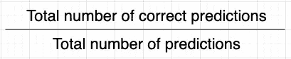

在许多情况下，精确度指标都很有效，如狗与猫的分类、MNIST 数据集等。但是在一些情况下，准确性度量可能会欺骗您。

让我们分析一个这样的场景。

> 您已经建立了一个人工智能模型，通过实时更新来检测您的 web 服务器上的入侵和网络攻击。只要有攻击，你的模型就会启动警报。

**我们的分类指标将使用四个构件。**

1.真正
2。真负
3。误报
4。假阴性

这个分类场景有两个类。
1。正面类:网络攻击，警示用户。
2。负类:没有网络攻击，不提醒用户。

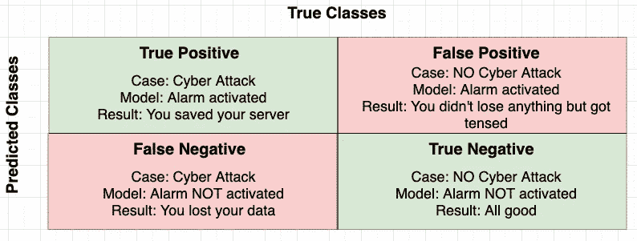

**真阳性**:模型预测为阳性类别，实际类别也为阳性。*表示模型正确预测了正类。*

**真阴性**:模型预测为阴性类别，实际类别也为阴性。*表示模型正确预测了负类。*

**假阳性**:模型预测为阳性类别而实际类别为阴性。*表示模型错误地将负类预测为正类。*

**假阴性**:模型预测为阴性类，而实际类为阳性。*表示模型错误地将正类预测为负类。*

> 注意:假阳性和假阴性容易混淆。所以要多关注他们。

# 准确(性)

如上所述，准确度是正确预测的总数除以预测的总数。

对于二元分类:

精确度是

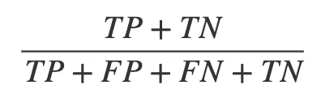

精确度公式

我将以上述网络攻击模型为例，解释准确性有时会产生误导。

我们在 100 次观察中测试了该模型，以下是结果。

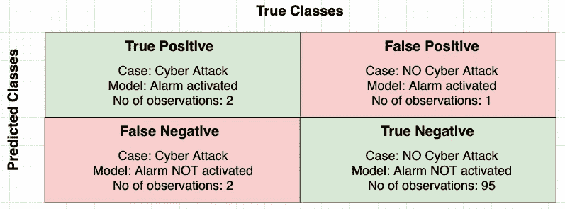

精确度为(2 + 95 ) / (2 + 1 + 2 + 95) = 0.97

97%的准确率。干得好。

在 100 起案件中，有 4 起网络攻击(TP 和 FN)和 96 起非网络攻击(FP 和 TN)。

在 96 次非网络攻击中，有 95 次被正确预测。但在 4 次网络攻击中，只有 2 次被正确识别。 ***不好。***

> 如果一个模型总是预测每个样本都是非网络攻击，那么我们也会有 96%的准确率，这是误导。在这种情况下，模型没有学到任何东西。
> 
> ***这是一种不平衡数据集的情况，其中一个类(大量观察值)压倒了另一个类(少量观察值)。)***

# 精确度和召回率

精确度和召回率是用于定义分类模型有效性的另外两个度量。

这两个术语很多时候会变得混淆，但是如果你记得下面的公式推导过程，它可能会帮助你记住这两个术语。

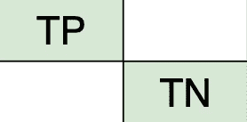

第一条对角线只包含****真*** 值。*

*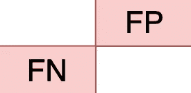*

*第二条对角线只包含 ***假*** 值。*

*第一行只包含正值，第二行只包含负值。*

# *精确*

*公式为 ***真阳性除以第一行的和，即(真阳性+假阳性)****

*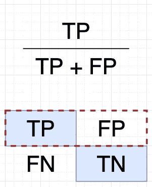*

*假阳性意味着实际值/类别为负，但预测值/类别为正。*

> ***Precision 告诉我们在所有阳性预测样本中有多少样本是实际阳性的。***

# *回忆*

*公式为**真阳性除以第一列，即(真阳性+假阴性)***

*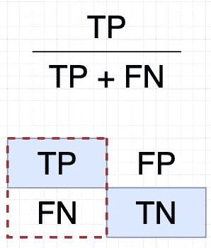*

*假阴性意味着实际值/类为正，但模型预测它为负。*

> ***召回告诉我们在所有实际阳性样本中检测到多少个阳性样本。***

# *多类分类中的精度和召回率*

*我们已经建立了一个水果分类模型，我们有 3 类/水果苹果，猕猴桃和橘子。*

*让我们找到每种水果的精确度和召回率。*

## *苹果*

*精度= 5 / (5 + 2 + 1) = 0.625*

*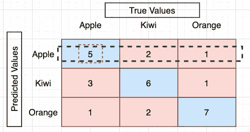*

*精密——苹果*

*回忆= 5 / ( 5 + 3 + 1) = 0.56*

*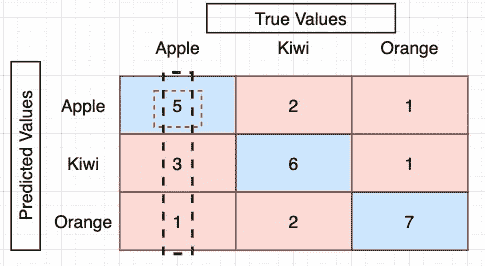*

*召回—苹果公司*

## *猕猴桃*

*精度= 6 / ( 3 + 6 + 1) = 0.6*

*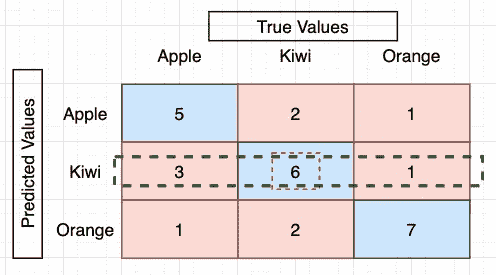*

*精密——猕猴桃*

*回忆= 6 / ( 6 + 2 + 2) = 0.6*

*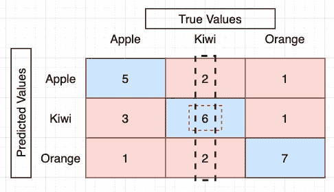*

*回忆—猕猴桃*

## *柑橘*

*精度= 7 / ( 1 + 2 + 7 ) = 0.7*

*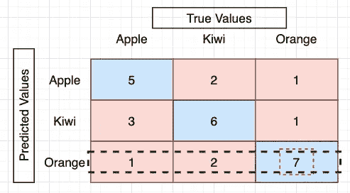*

*精确—橙色*

*回忆= 7 / ( 1 + 1 + 7 ) = 0.77*

*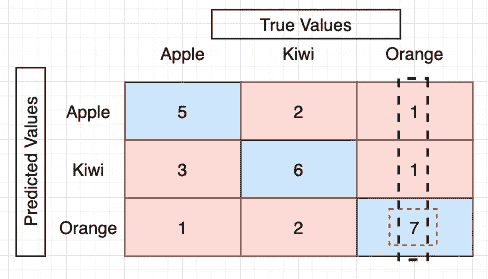*

*召回—橙色*

**

# *看看我的其他故事。*

1.  *[接下来该抽哪种大麻？获得 AI 推荐](https://medium.com/datadriveninvestor/which-weed-should-you-smoke-next-get-recommended-by-ai-c38959f1054)*
2.  *[如何赋予聊天机器人情商？](https://medium.com/ai-in-plain-english/how-to-give-emotional-intelligence-to-a-chatbot-72a0500095b8)*
3.  *[池层—短而简单](https://medium.com/ai-in-plain-english/pooling-layer-beginner-to-intermediate-fa0dbdce80eb)*

**

> *感谢您的阅读。继续学习！*