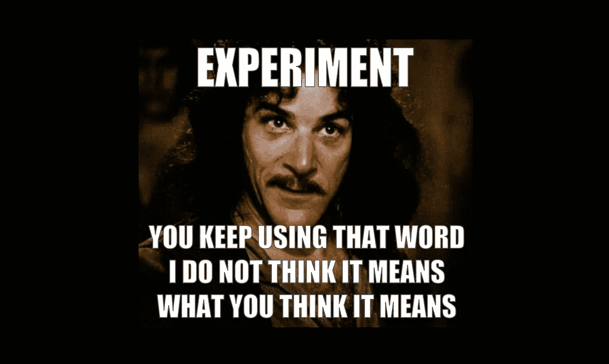
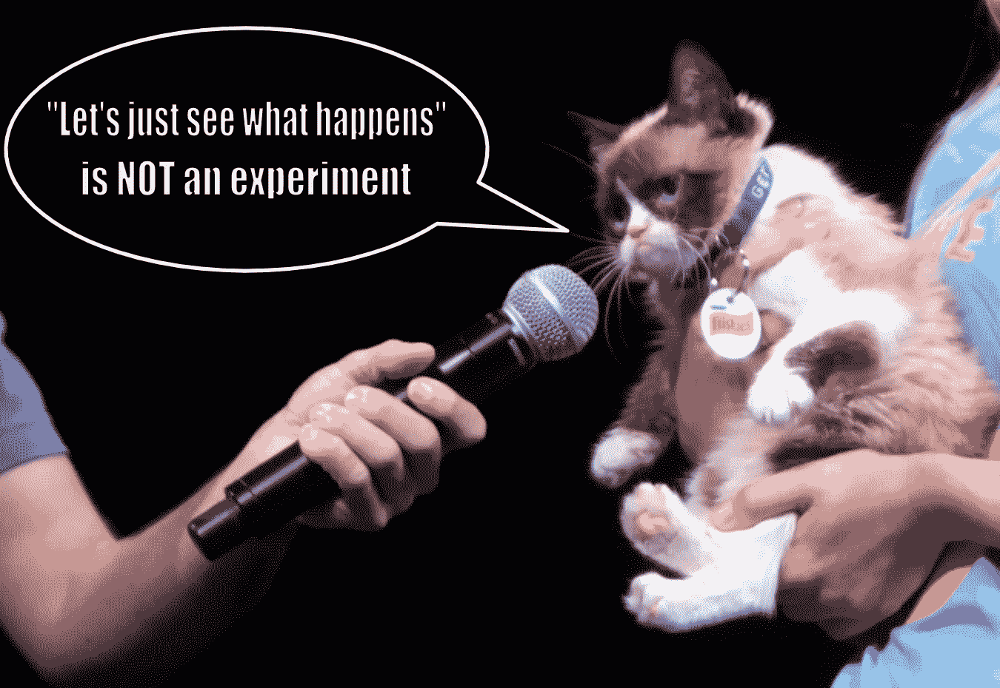
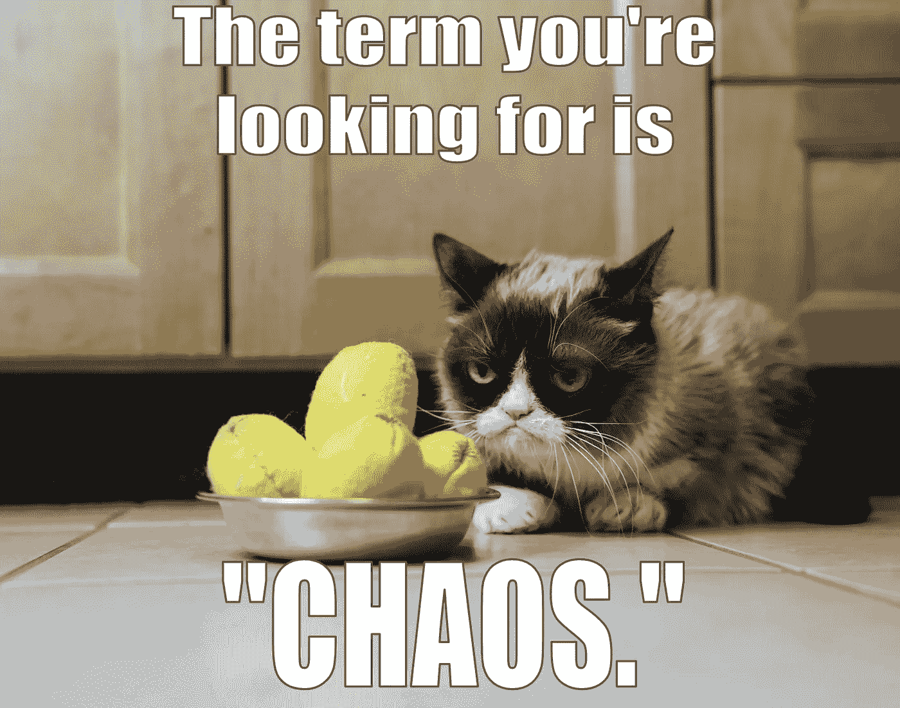
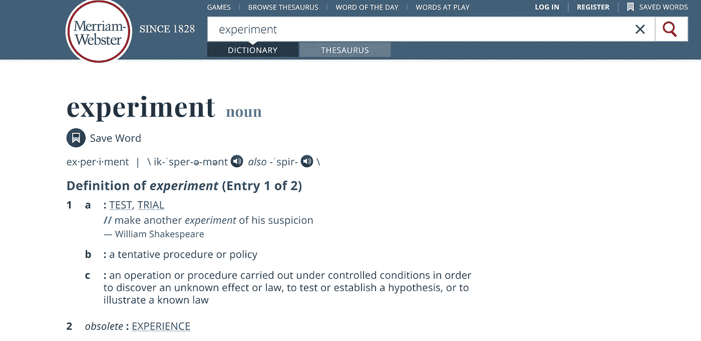
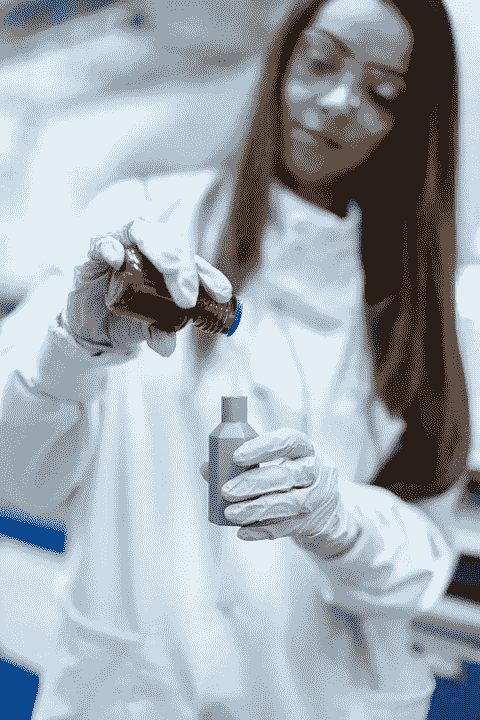
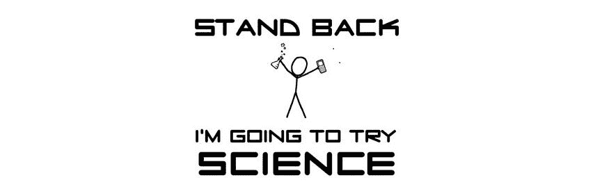
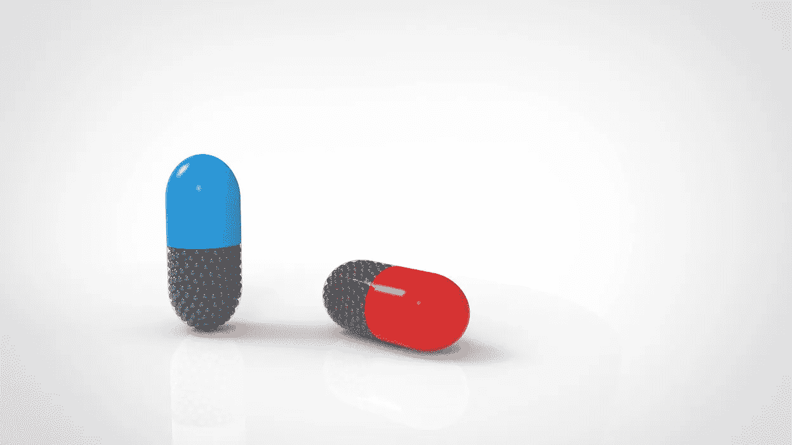
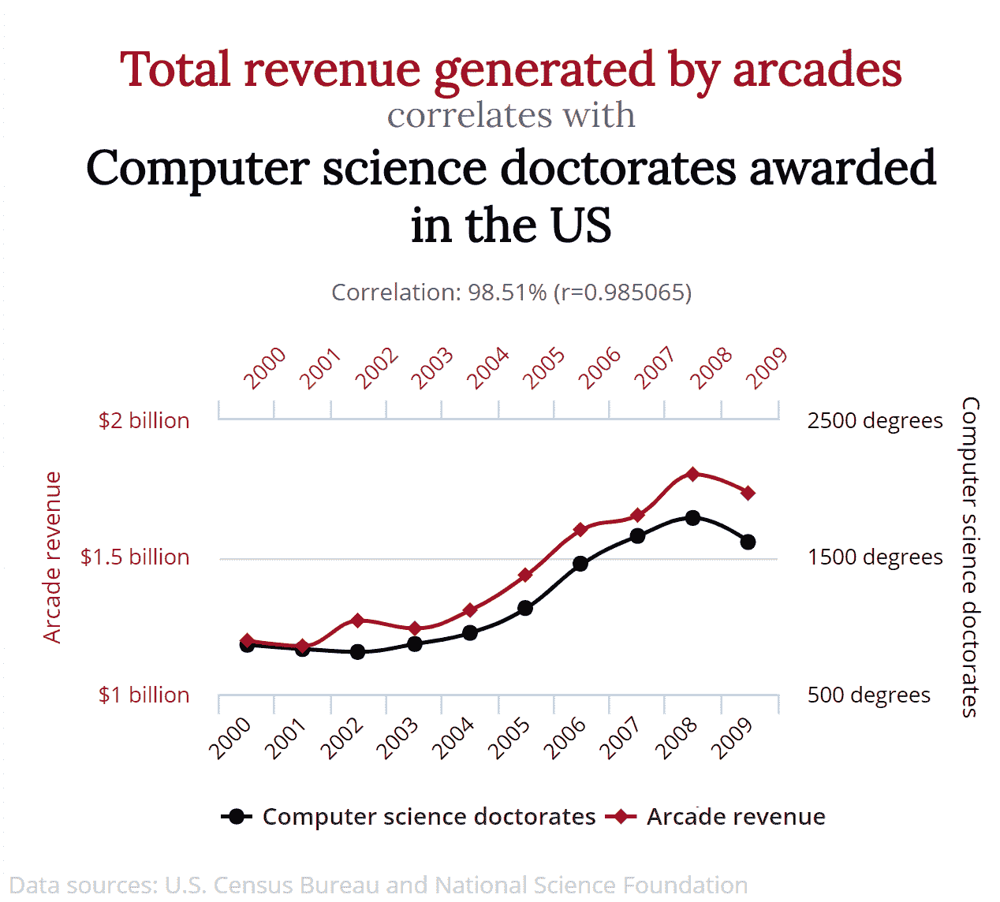

# 错误使用“实验”这个词，你是否有罪？

> 原文：<https://towardsdatascience.com/are-you-guilty-of-using-the-word-experiment-incorrectly-9068baeab7a4?source=collection_archive---------12----------------------->

## 谈论因果的三个要求

电影《公主新娘》的模板。

*“实验”*是一个被滥用的词。它有多重含义，所以你必须仔细听上下文。这个词是随便用的吗，小孩子用的方式？还是指在成年人的对话中回答有关因果关系的问题的科学黄金标准？

就像“树皮”一样，“实验”有多重含义。与“树皮”不同，混淆它们会产生危险的后果。

# 滥用(语义)关系

当科学家使用这个词时，它指的是理解事物本质的圣杯。难怪你想通过告诉每个人你也“做了一个实验”来给他们留下深刻印象。令人印象深刻！实验是唯一合法的工具，它给了你在礼貌谈话中使用*“因为”*这个词的许可。

> 实验允许你谈论什么导致了什么。

想想一个科学家在看到你写了“实验”这个词的文件时的情绪——保持我们的小心脏！我们要打开生日礼物了！我们要去看看什么导致什么！！！我们太激动了！

当我们发现你所谓的“实验”就是这个时，你能想象我们有多么失望吗？

“让我们看看会发生什么。”

图片修改自[维基共享](https://upload.wikimedia.org/wikipedia/commons/a/a0/Grumpy_Cat_%2814349262900%29.jpg)。

你伤了我的心。

作为一名统计学家，我被训练对术语保持精确，但当别人错误地使用他们的话时，我也相当放松。只要没有危险的后果，而且我们或多或少相互理解，我不介意。

这就是为什么我想借此机会把我所有的优惠券花在这个词上:*实验*。滥用它会导致致命的后果。(尤其是在[新冠肺炎](http://bit.ly/quaesita_covid10)的时代。)

# 安全单词

如果你把*“让我们看看会发生什么”**“实验”*叫做“让我们看看会发生什么”，并且你已经超过 10 岁了，请把你文档中的这个词替换成别的词。

这个怎么样？

原创模因模板:[来源](https://i.pinimg.com/originals/dd/0c/c0/dd0cc00602b9c3c38d93c4f33ffd1053.jpg)。

“混乱。”或者，如果这太苛刻的话，我给你提供了*“让我们看看会发生什么”*的七个同义词，就科学而言，它们远没有那么沉重。它们是安全词，从某种意义上说，如果你说它们而不是 T2 实验 T3，你的 T4 统计学家 T5 就会停止伤害你。

> 如果“实验设计”的意思只是“让我们看看会发生什么”，为什么专业人士会把它放在简历上呢？

前三个是****学习*** *，*****调查*** *，*****分析****——你可以用那些做任何事情。当有疑问时，就把一切都称为“学习”****

> ***“学习”这个词可以指任何古老的事物——你可以随意使用这个词。***

***如果要稍微行话起来，*的专业术语是****观察研究*** *。******

**你也可以称你所做的为****试运行****或****试用****，如果你不介意暗示你打算以后回来做一些设计得更严谨的东西。******

******

***尽量不要点燃你随便调查的东西。***

***最后，*“让我们看看会发生什么”*的第七个词是…***

**……”***发射！*****

****

**如果你想像孩子一样用这个词来指代一个试探性的程序，那么请不要在讨论商业、科学或政策等成人问题的人面前这样做。对他们来说，实验是一种可靠的、精心设计的、有控制的尝试，以了解什么导致什么。他们在讨论诸如“这种疫苗真的有效吗？”这样的问题时会提到实验误解可能会造成巨大损失的问题。如果你不确定你是否在处理一个真实的实验，避免这个词。**

# **什么是实验？**

**什么是科学意义上的实验，为什么它带有合法化的含义？**

****

**通过主动控制(并消除)替代解释，实验是进行因果推理的最佳科学工具。如果您要在[数据](http://bit.ly/quaesita_hist)的上下文中使用该词，那么请确保以下所有组件都存在:**

*   **应用不同的处理**
*   **随机分配的治疗**
*   **科学假设得到验证(见我的解释[这里](http://bit.ly/quaesita_damnedlies)**

## **假设**

**一个假设不足以让一项研究成为一项实验。例如，我可能有[零假设](http://bit.ly/quaesita_damnedlies)成年人的真实平均身高超过 3 米，然后我可以[收集数据](http://bit.ly/quaesita_provenance)，这将使我得出结论，这个零假设[看起来很可笑](http://bit.ly/quaesita_fisher)。我将只剩下科学理论:一个 10 英尺高的巨人将超过人类成年人的平均水平。耶，科学！附近没有任何实验！**

> **一个理论就是一个假设长大后变成的样子。**

**顺便说一下，你注意到我在那里使用了“理论”这个词吗？是的，理论是科学能做出的最好的东西。就是一个[假设](http://bit.ly/quaesita_damnedlies)长大后变成的样子。(人们混淆了这两者，认为理论不如假设。它不是。)**

****

**原图来自 [xkcd](https://store.xkcd.com/products/try-science) 。**

**我没有说“科学事实”,因为这是表明你不知道科学如何运作的一种快捷方式。科学家不崇拜信息，他们只愿意抓住理论不放，直到更好的理论出现，那时他们会像扔烫手山芋一样扔掉旧理论。与此同时，公众在接下来的几年里虔诚地继续在它身上烧钱，*[*因为科学*](http://bit.ly/quaesita_scientists)***

***但是让我们回到正题。一个假设不足以让某件事成为一个实验，但是你应该有一个…否则你将不知道如何应用治疗。***

## ***不同的治疗***

***实验最特别的地方在于，我们不再只是被动地观察数据。相反，我们将把我们的意志强加于现实！Bwahahaha—***

***总之。***

***要做一个实验，我们必须对宇宙的不同部分做出不同的改变。我们做的各种事情被称为治疗。(即使实验与医学无关。)我们不做任何额外工作的治疗称为*控制。我们假装做某事而实际上什么也没做的对照被称为安慰剂。****

****

## **随机分配**

**如果在我们开始之前，实验单元(对象或受害者，呃，我的意思是*参与者*)之间有任何变化，那么这不是一个真正的实验，除非这些单元被随机分配到治疗组。**

**随机化加上足够大的**样本量是使实验成为因果推断有效工具的秘方。**

****

# **相关性不是因果关系**

**如果我们有了这三个组成部分，我们就真正有了一个实验。有牙齿的那种。我们能够谈论什么导致什么…甚至在不确定的情况下！这太神奇了。没有实验，你所拥有的只是*相关性*。[相关性](http://bit.ly/quaesita_correlation)是一种很好的表达方式*“两种模式似乎在一起移动，但是如果我们用这个来得出一个导致另一个的结论，我们会被嘲笑。”***

**例如，如果一项观察研究发现喝红酒的人更长寿，那只是一种相关性。没有人会随意给一些人强行灌酒，而让其他人远离。可能是因为其他原因，更健康/更富有/更法国化的人活得更久，而且碰巧也喝更多的红酒。没有实验，没有证据表明红酒会让你更健康。**

****

**虽然这些事情高度相关，但我希望你能和我一起怀疑这两者互不因果。更多关于虚假相关性的有趣内容，请查看我发现这个例子的有趣网站[。](http://www.tylervigen.com/spurious-correlations)**

# **实验为什么有效？**

**如果你有兴趣看到一个实验的运行，以理解为什么它们作为因果推论的工具，看看你能做的最简单的实验之一背后的逻辑:[A/B 测试](http://bit.ly/quaesita_ab)。**

> **随机处理是使实验成功的秘方。**

**如果你想让我向你解释一下 A/B 测试，请阅读我的文章[*A/B 测试是如何工作的？*](http://bit.ly/quaesita_ab)**

# **致命的错误**

**当没有太多利害关系时，漂亮的观点是好的，但在一些情况下，不做实验就下结论是危险的。**

**如果没有真正的实验，对任何人用*“因为”*这个词来解释复杂现象之间的联系要持非常怀疑的态度。那个人真正想说的是，*“我有一个自己认为合理的观点，但我并没有真正做足功课去排除其他的解释。* [*我喜欢我的故事*](http://bit.ly/quaesita_confirmation) *而且我在坚持。”***

**五个例子(众多例子中！)在这里，我建议你在下结论之前要求进行一次真正的实验:**

1.  **这种疫苗*会导致*人在接触病毒时不生病吗？**
2.  **这种最新的节食和健身时尚会带来你所期望的任何改善吗？**
3.  **这个 [ML/AI](http://bit.ly/quaesita_simplest) 系统*是否导致* [改善结果](http://bit.ly/quaesita_dmguide)？**
4.  **这种开放式办公室会让的员工更有效率吗？**
5.  **这项政策会给公民带来更好的条件吗？**

**看一下最后一项，你会想起有时候做实验太难/太贵/太不道德了。当然，有时候我们买不起好东西(比如使用单词*的许可证，“因为”*而不是*“我希望”*)。**

> **没有实验，我们的行动是基于希望而不是证据。**

**如果生活如此不公平，以至于你*不能*做实验，这并不意味着你有资格跳到假装你*做了*实验的那一部分。相反，承认你在黑暗中盲目地四处摸索，并且要格外小心。**

# **感谢阅读！喜欢作者？**

**如果要说谢谢，我很欣赏分享和[转发](https://twitter.com/quaesita/status/1258809215038246912)。如果你渴望阅读更多我的作品，这篇文章中的大部分链接会带你去我的其他思考。**

**如果你在这里玩得开心，并且你正在寻找一个为初学者和专家设计的有趣的应用人工智能课程，这里有一个我为你制作的娱乐课程:**

**在这里欣赏整个课程播放列表:[bit.ly/machinefriend](http://bit.ly/machinefriend)**

## **脚注**

*** *因果推断*是统计学的一个子领域，它试图在没有实验的情况下得出因果关系的结论。请注意，要让这些方法有效，你必须愿意接受堆积如山的假设，所以不是每个人都相信它们。他们也倾向于非常依赖于*“我们想到了一切”*这种想法，考虑到我们这个物种美丽的易错性，是相当牵强的。在大样本中利用随机性的精心设计的实验更有说服力。**

*** *总有一天，我会写关于功耗分析和如何设计实验的文章，但与此同时，你可以在我的其他文章[[1](http://bit.ly/quaesita_statistics)&[[2](http://bit.ly/quaesita_bo)]中找到定义。**

# **与凯西·科兹尔科夫联系**

**让我们做朋友吧！你可以在 [Twitter](https://twitter.com/quaesita) 、 [YouTube](https://www.youtube.com/channel/UCbOX--VOebPe-MMRkatFRxw) 和 [LinkedIn](https://www.linkedin.com/in/kozyrkov/) 上找到我。有兴趣让我在你的活动上发言吗？使用[表格](http://bit.ly/makecassietalk)取得联系。**