# 你生活在一个快乐的国家吗？下面就用 Power BI 来了解一下吧。

> 原文：<https://towardsdatascience.com/are-you-living-in-a-happy-country-lets-find-out-with-power-bi-17e1549a950f?source=collection_archive---------24----------------------->

## 采用微软 Power BI 的数据科学

## 使用微软商务智能分析世界幸福报告的逐步指南

由[edu·劳顿](https://unsplash.com/@edulauton)在 [Unsplash](https://unsplash.com?utm_source=medium&utm_medium=referral) 上拍摄的照片

准备好一个关于世界幸福的数据分析仪表板了吗？我将向您展示如何分析幸福报告这个词，并使用 Power BI 可视化它，而无需任何代码。

但首先对《世界幸福报告》做一个小小的介绍:

> 《T4 世界幸福报告》是联合国可持续发展解决方案网络的年度出版物。它包含了一些文章，以及根据受访者对他们自己生活的评价而进行的国民幸福度排名。
> ——[维基百科](https://en.wikipedia.org/wiki/World_Happiness_Report)

如果你想了解更多关于这份报告的信息，有一个官方网站可以给你提供大量的见解。

# 获取数据

我们使用的是 2017 年世界幸福报告的数据。csv 格式。虽然有更新的数据可用，但这一个远未过时，而且确实有良好的结构和完整的数据。

您可以下载。来自我的 [Github 库](https://github.com/sebastianzolg/world-happiness-report)的 csv。如果你不熟悉 Github 和 git，不要担心，有一个下载选项。点击**克隆或下载**并选择**下载 ZIP** 。把数据提取到你电脑的某个地方。开始分析吧。

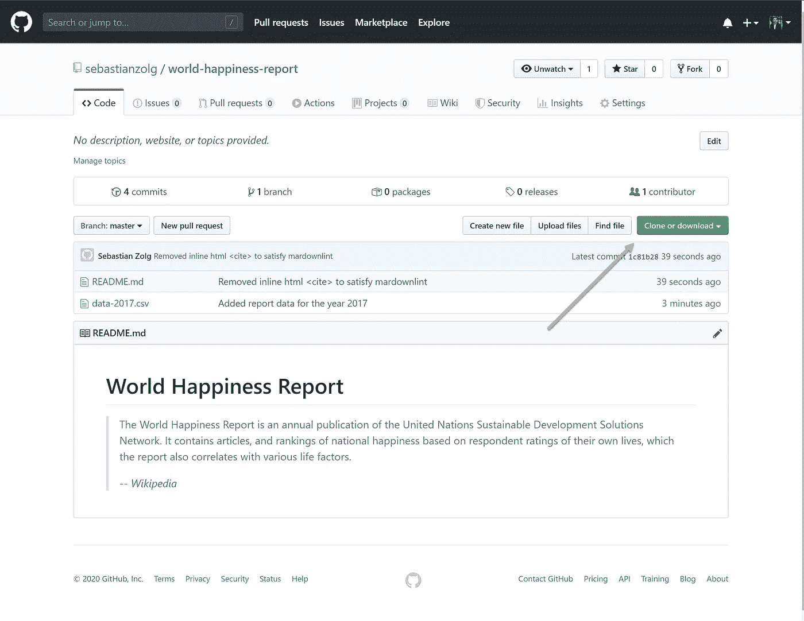

# 获得 Microsoft Power BI 桌面

微软商务智能桌面是免费下载的，可以在[的 Windows 商店](https://aka.ms/pbidesktopstore)买到。那些喜欢独立安装程序而不是从 Windows 商店下载的人可以从[这里](https://www.microsoft.com/en-us/download/details.aspx?id=58494)下载。

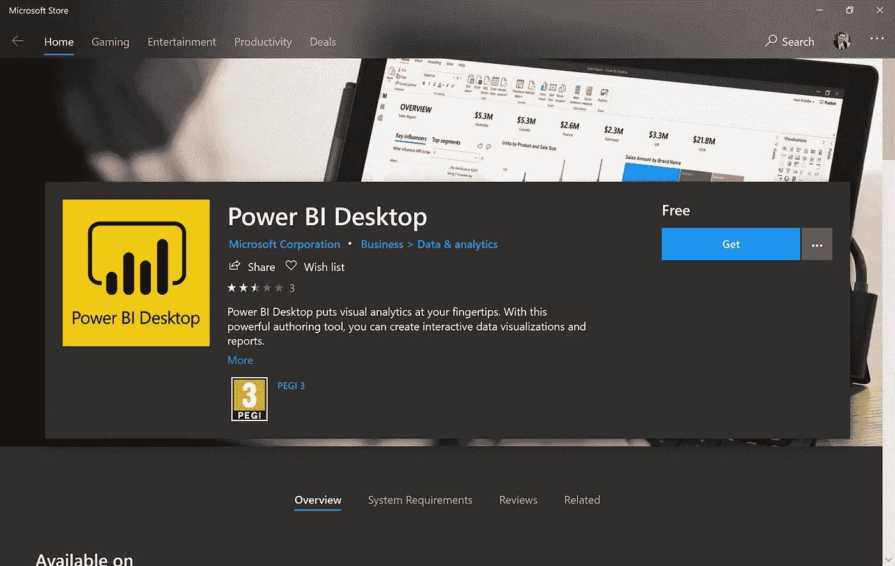

# 世界幸福报告分析

现在，我们已经准备好接触分析和 Power BI 桌面。为此，我们遵循 [**提取、转换、加载** ( **ETL** )](https://en.wikipedia.org/wiki/Extract,_transform,_load) 的一般过程。

## 提取数据

启动 Power BI Desktop，随意注册或点击注册表下方的**已经拥有 Power BI 帐户**链接。

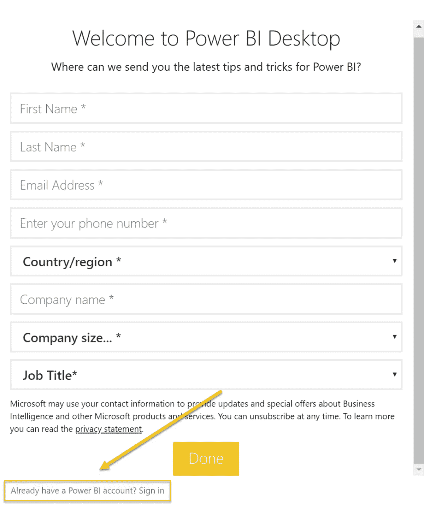

在那里，您可以登录或创建一个 Power BI 帐户并免费试用。

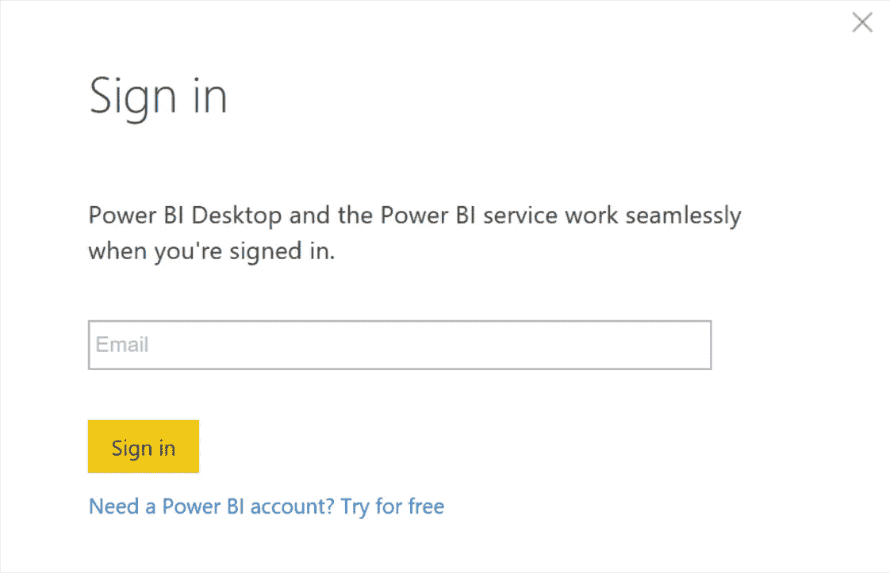

现在从入门窗口点击**获取数据**，选择 **Text/CSV** 作为数据源。

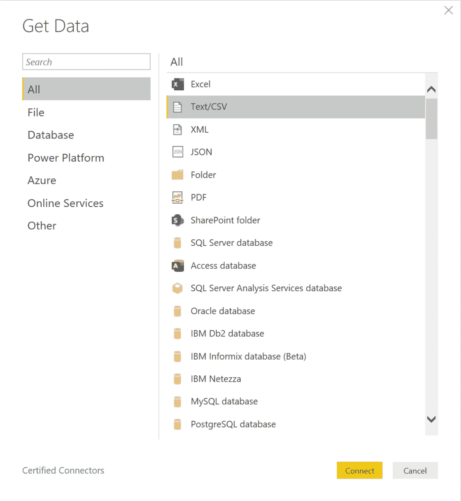

找到之前下载过的 **data-2017.csv** 文件。

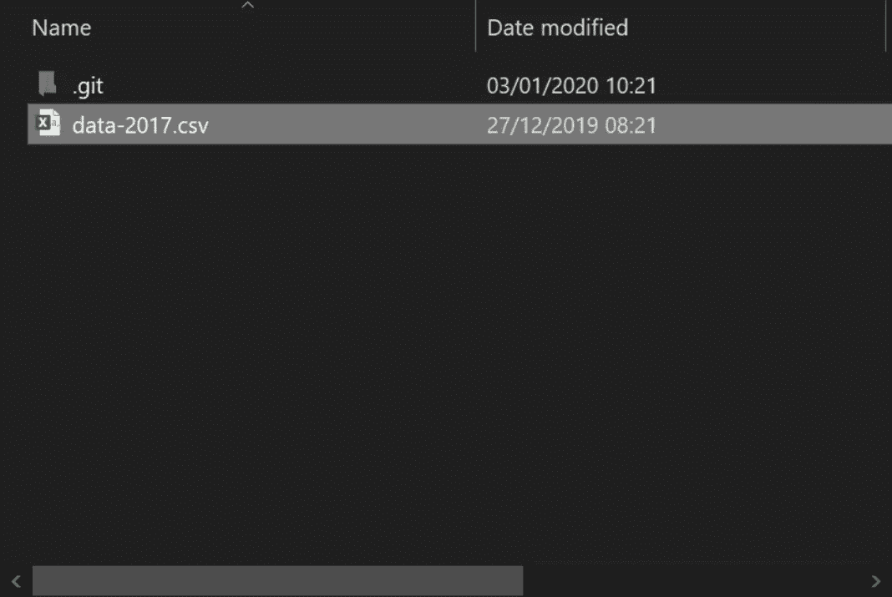

接下来，我们从**数据类型检测**下拉列表中选择**不检测数据类型**，并点击**转换数据**。

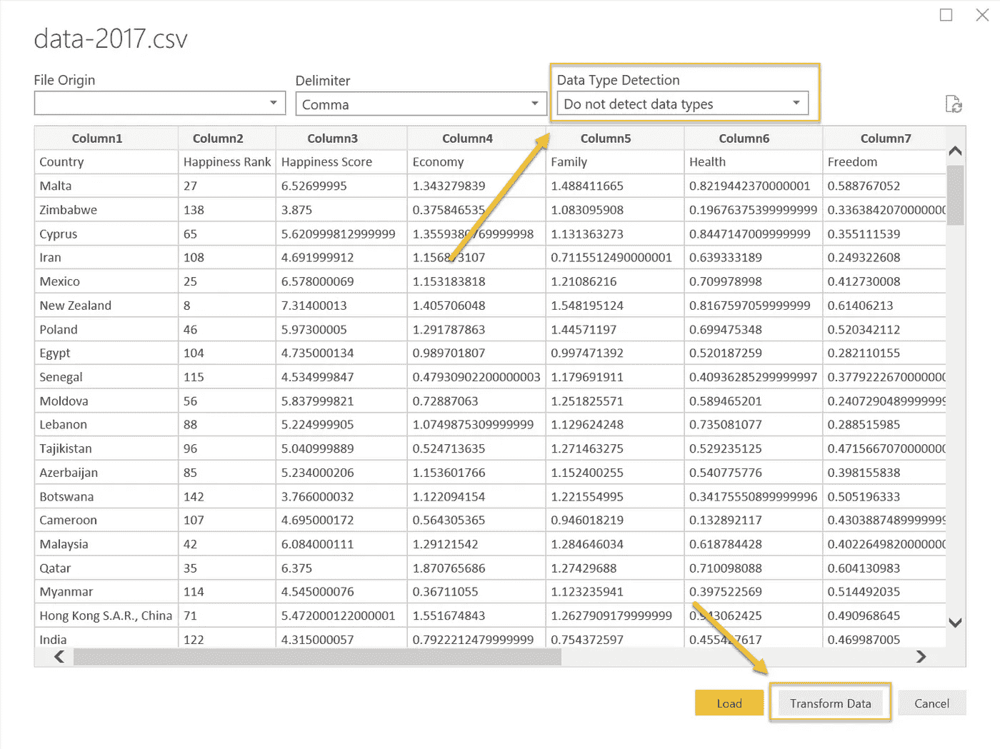

***为什么不自动检测数据类型？*除此之外，我们将学习如何手动完成这一重要步骤，这是数据分析工具箱中的一项重要技能。**

## 转换数据

现在我们已经从。csv 文件我们要转换它。

您可能已经发现，我们数据的第一行包含实际的标题(在数据分析中也称为**特性**)。为了使用第一行作为标题，我们通过点击命令功能区**上的**使用第一行作为标题**来应用我们的第一个转换步骤。**

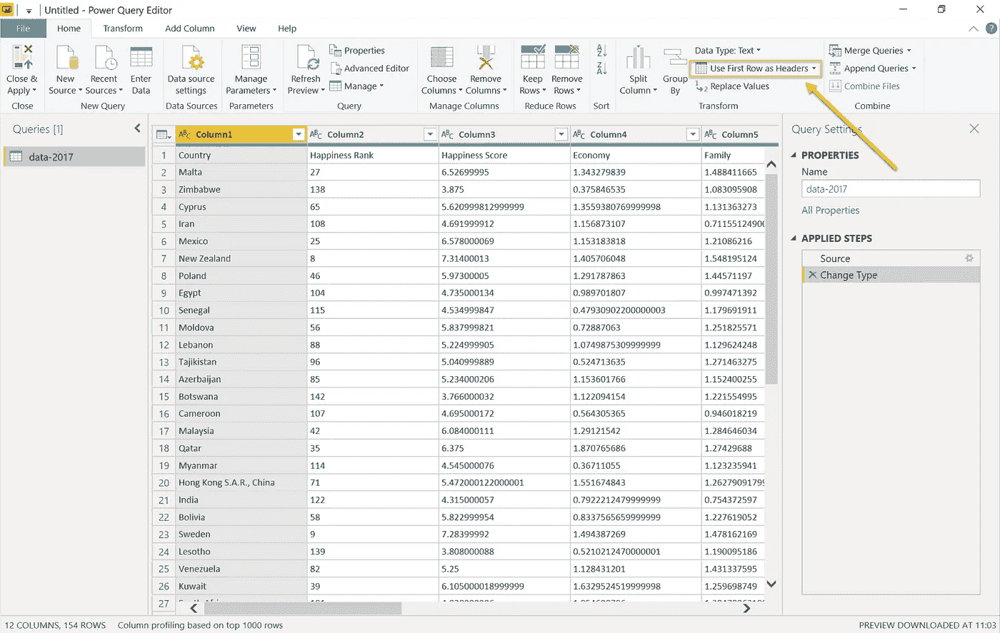

注意第一行是如何被提升为数据标题的。

事实上，这个动作实际上应用了*两个*步骤:您可以在右侧的**应用步骤**面板中观察到这一点。除了**提升头**这一步，Power BI 试图(再次)推断每个特征的数据类型，没有做好*我的案例*。

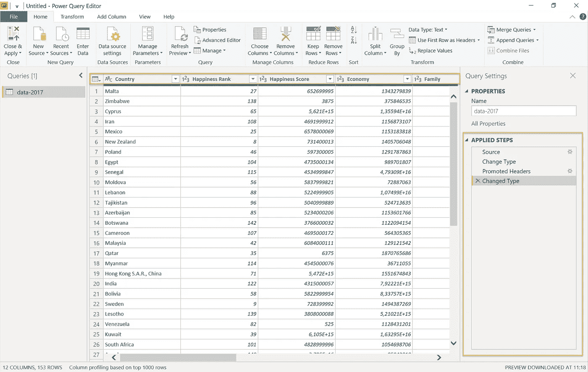

***为什么我会得到错误的数据类型？*** *数据类型的检测可能出错的原因有很多。最常见的是您正在使用的设备的区域设置。如果您的设备具有不同于英语(美国)或英语(英国)的区域设置，则值得在 Power BI 中更改区域设置以匹配您的数据。就我而言，我不得不从英语(瑞士)——这是一种非常不常见的环境——切换到英语(美国)。这很容易做到，你可以遵循这里的建议***。**

*要撤销 Power BI 应用的**更改类型**步骤，只需点击它旁边的 **X** 图标。*

*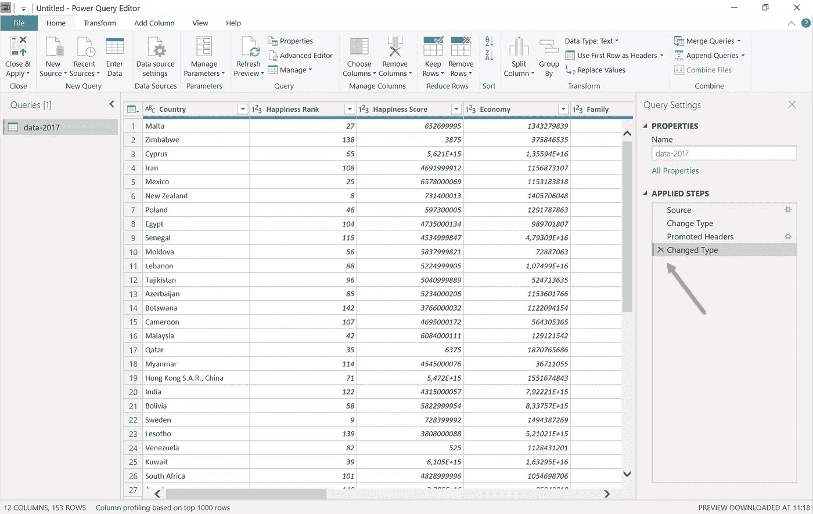*

*我们在这里学习了一个非常重要的 Power BI 概念:您所做的所有转换都可以被视为一系列步骤，这些步骤一个接一个地应用于底层数据。这样，您可以保持原始数据不变(未修改),并动态地添加/删除转换步骤。记住这种行为，因为它使数据转换变得非常强大和灵活。*

****我能看到每个步骤对我的数据做了什么吗？*** *是的，你只需点击* ***应用步骤*** *面板中的一个步骤，就可以在你的变换步骤之间来回跳转。这样，您可以监控您的转换步骤实际上对数据做了什么。**

*现在是手工定义数据类型的时候了。选择总体**快乐评分**功能，并观察其当前数据类型。该特征应为数据类型**十进制数**，但目前被分配给数据类型**文本**。这由特征名称旁边的小 **ABC** 图标或**数据类型**控件上的值表示。*

*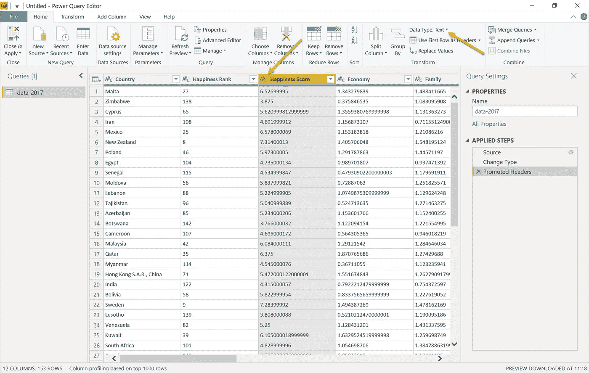*

*让我们通过点击**数据类型**控件并选择**十进制数**来改变它。*

*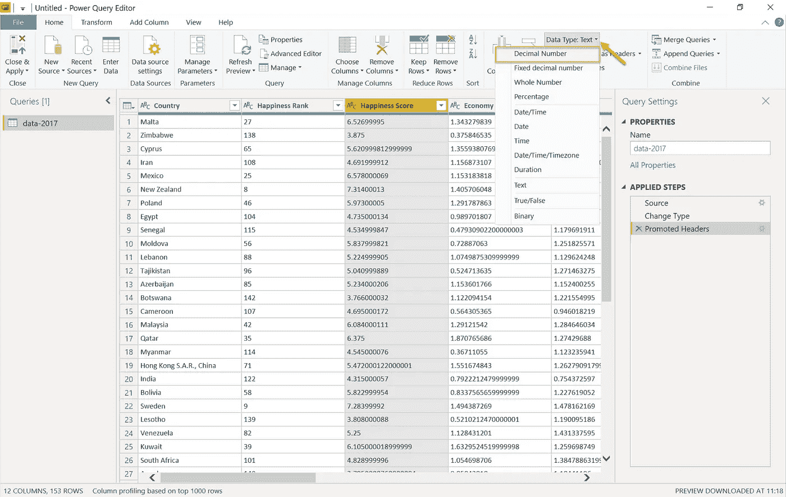*

*查看列中的数据如何变化(根据您的区域设置)以及 **1.2** 图标如何指示新的数据类型。*

*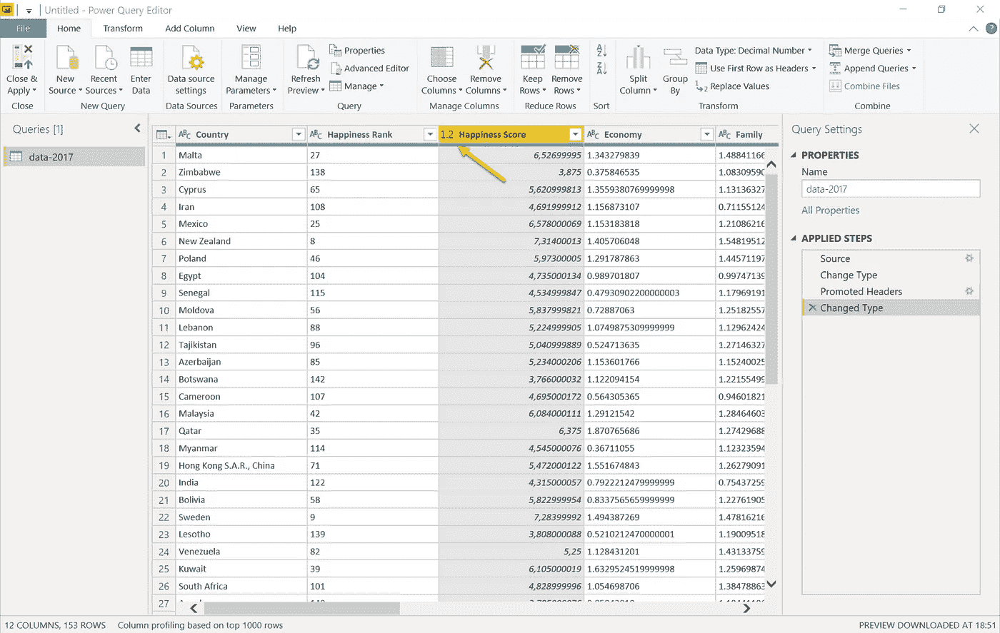*

*对数据中的每个特征重复此步骤*，并根据下表将其设置为相应的功率 BI 数据类型。**

*现在我们已经设置了正确的数据类型，我们可以继续并稍微清理一下数据。数据分析中的典型任务是检查缺失值，如空值、NaN 值或 n.a .值。*

*如果数据包含缺失值，Power BI 已经为您提供了一个很好的可视化指示。您可以在**工作满意度**功能上找到这样的指示。悬停指示器并点击**移除空值**从我们的数据中清除丢失的值。*

*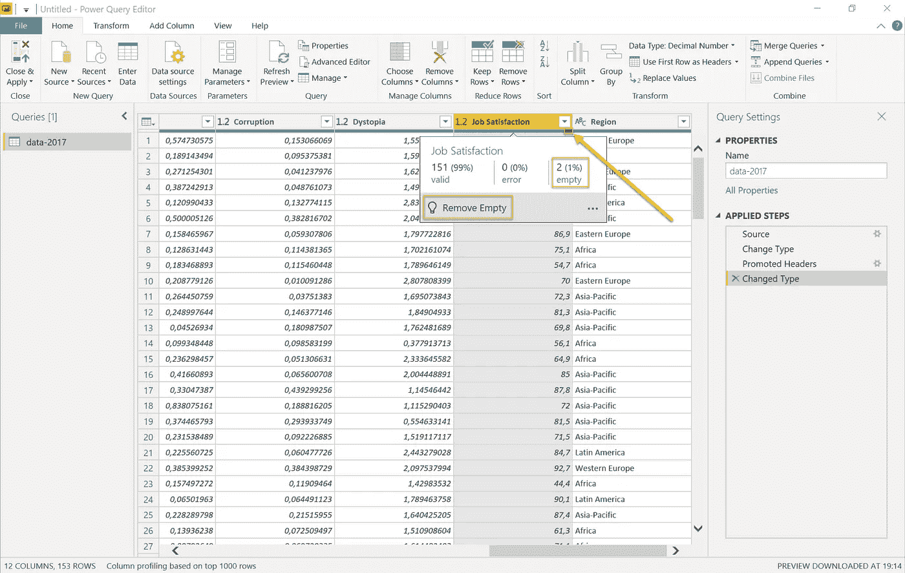*

****我们的数据中有哪些缺失值？*** *没有关于北塞浦路斯和南苏丹的***工作满意度数据，如* ***南*** *值所示。通过删除这些数据，我们删除了两个国家的完整条目。换句话说:这些国家不会出现在我们的分析中。***

**作为我们的最后一步，点击**关闭&应用**，并使用**保存**图标随意保存您的工作。**

**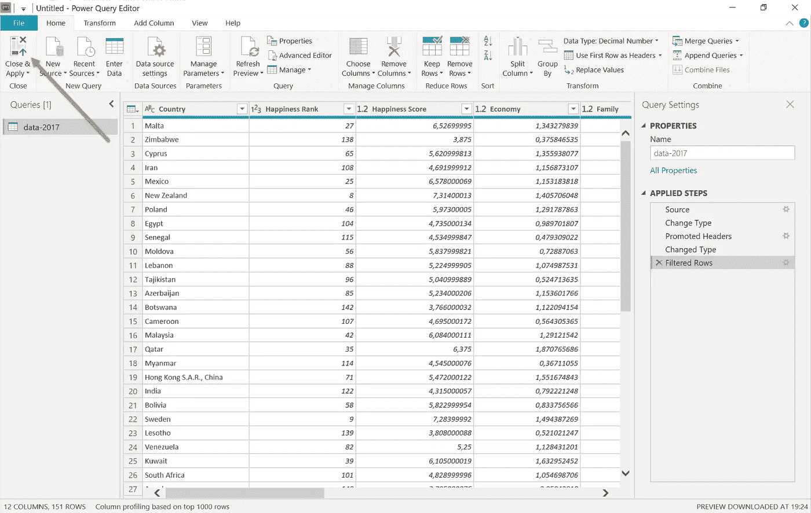**

**既然我们已经转换和清理了我们的数据，我们准备好可视化它并回答我们的主要问题:**你生活在一个快乐的国家吗？****

# **可视化我们的数据**

**我们将想象出最幸福的 10 个国家和最不幸福的 10 个国家。此外，我们将使用 Power BI QnA visual 来回答有关我们数据的其他问题。**

**让我们点击**可视化**面板上的图标，添加一个**堆积条形图**可视化。**

**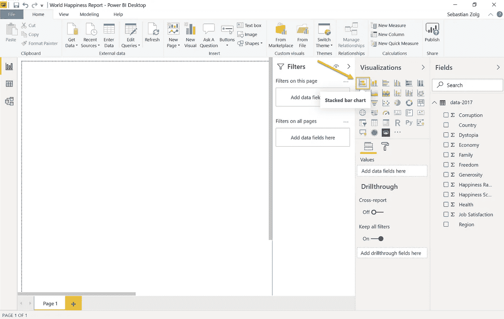**

**当视觉仍处于选中状态时，从**字段**面板中检查**国家**和**幸福分数**字段。这将添加**国家**作为**轴值**和**幸福分数**作为**值**，给我们一个按**幸福分数排序的所有国家的视图。****

**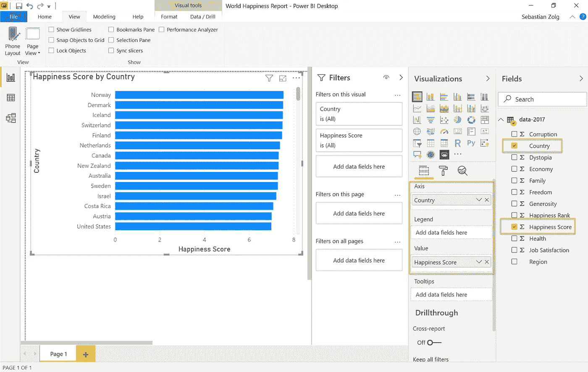**

**让我们把范围缩小到前 10 个国家。选择视觉，展开**滤镜**面板上的**国家是(全部)**滤镜，从**滤镜类型**下拉列表中选择**前 N 名**。将其设置为**前 10 位**下**显示**项**项。****

***来多了？*详情见下面截图。**

**最后，将**快乐分数**字段从**字段**面板拖放到过滤器的【按值 面板，然后点击**应用过滤器。****

**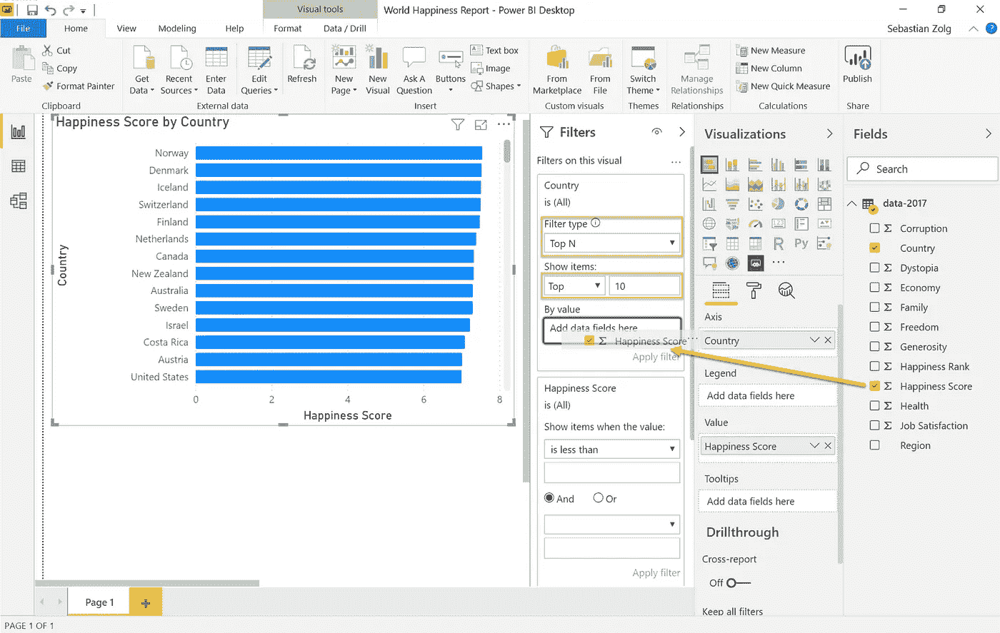**

***再次重复*这些步骤，为最不快乐的国家添加一个*第二视觉*。这次你选择**底部 10** 而不是**顶部 10** 作为过滤器。**

**相应地为你的两个画面设置标题。为此，选择视觉效果，点击**格式**图标，并将**标题文本**设置为*最幸福的 10 个国家*和*最不幸福的 10 个国家*。**

**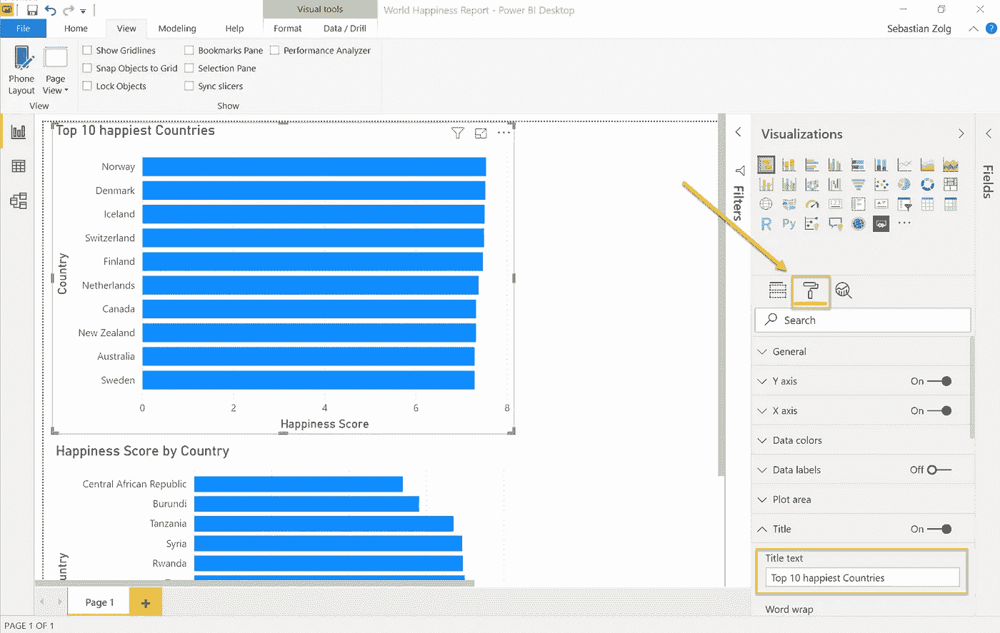**

**要对结果进行升序排序，请单击图像右上角的小 **…** 图标。**

**作为最后一步，我们将**地图**和 **QnA** 视觉添加到我们的页面。对于**地图**，像之前一样在**字段**面板中目视检查**国家**。**

**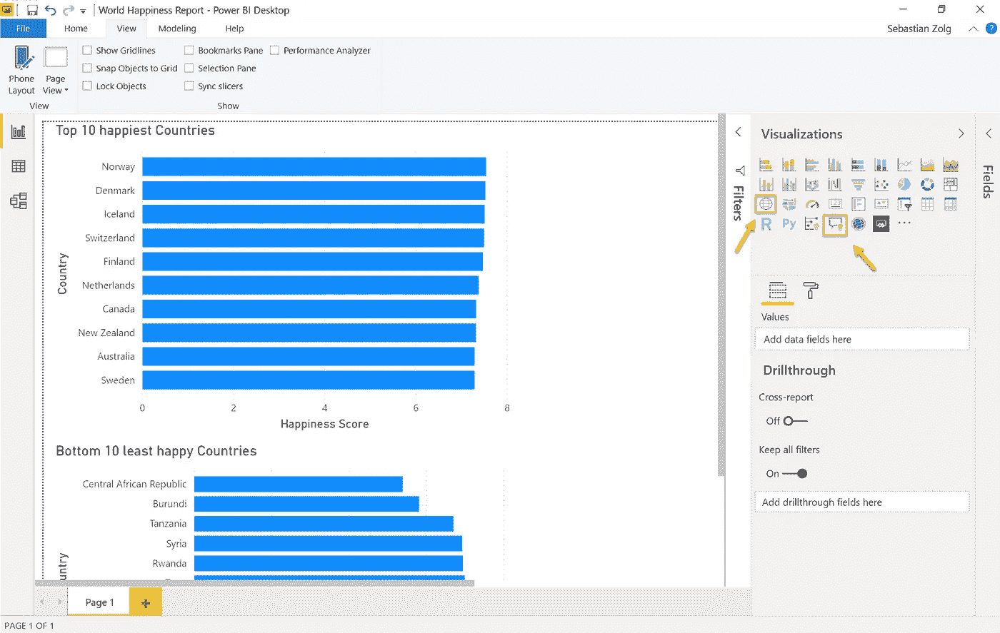**

**我们已经完成了第一份数据报告的设计！您的最终视图应该类似于下面的屏幕。**

****

# **你生活在一个快乐的国家吗？**

**我们来问问权力 BI QnA！我住在德国，所以我想知道我的国家的幸福排名。**

**点击进入**询问一个关于你的数据的问题**框，简单地说出类似德国的*幸福排名。***

**这立刻给了我排名 **#16** 。因此，德国不在前 10 名之内，但它的排名相当不错。你的国家怎么样？**

**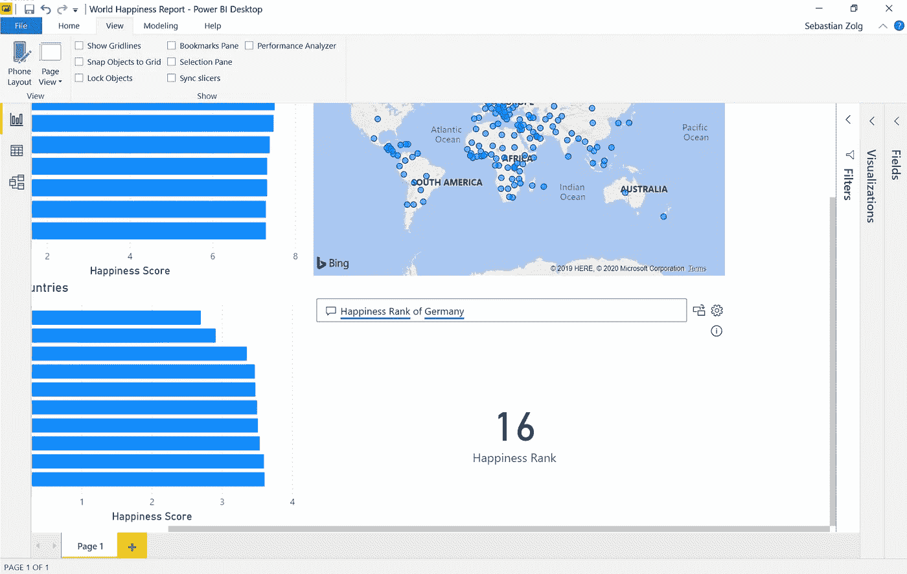**

**让我们将您的分析导出为 PDF 文件，与朋友或同事分享。转到**文件**并点击**导出为 PDF** 。**

**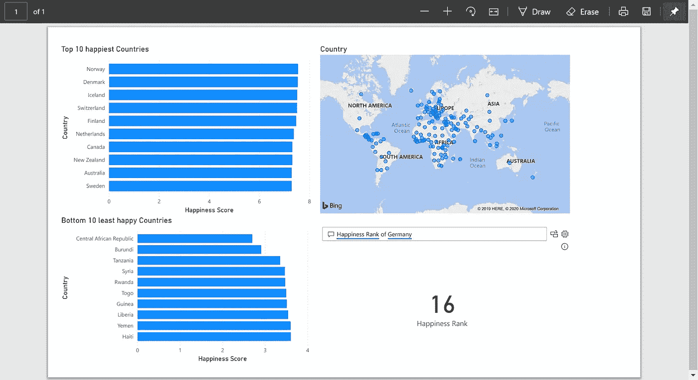**

****恭喜你！**您已经从一个. csv 文件中提取了数据，转换了数据，清理了数据，并最终可视化了数据，给出了对数据的见解，并回答了我们最初的问题。**

**就这样吧。
—塞巴斯蒂安**