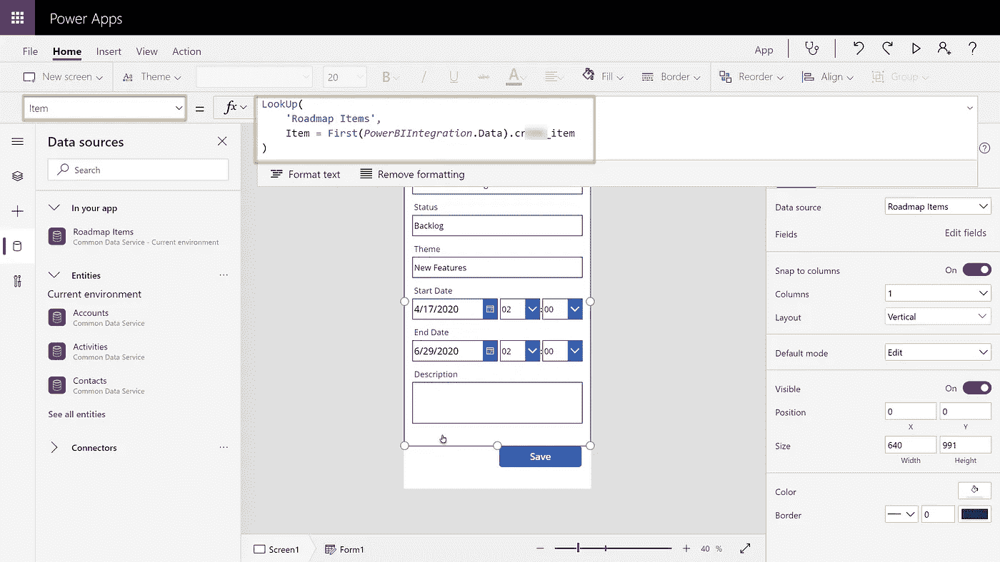

# 你在轨道上吗？—在没有代码的交互式路线图上传达您的战略主题。

> 原文：<https://towardsdatascience.com/are-you-on-track-communicate-your-strategic-themes-on-an-interactive-roadmap-with-no-code-b844fddf5bc5?source=collection_archive---------9----------------------->

## 微软 POWER 平台解决方案

## 一张图胜过千言万语，路线图也是如此。让我们用 Microsoft Power BI 和 Power Apps 构建一个

当谈到调整你的组织或项目团队时，没有什么比一个清晰的、视觉上吸引人的路线图更好的了。

所以，如果你想要这个**仪表盘**👇那么这个故事是给你的！


**但是等等！** **有问题……**

**…路线图**通常是与您的团队和利益相关者合作的结果。虽然我们有一堆很好的工具来可视化东西，但我们没有一个工具可以即时处理数据。

有了*微软 Power BI* 和 *Power Apps* 的组合，我们可以自己构建这样一个解决方案。

最棒的是:**不需要编码技能！**

# 设置公共数据服务

首先，我们需要一个存储路线图数据的地方。通常，这会导致在另一台服务器上建立另一个数据库。

幸运的是，微软 Power 平台附带了一个叫做[公共数据服务](https://docs.microsoft.com/en-us/powerapps/maker/common-data-service/data-platform-intro) (CDS)的东西，它可以让你安全地存储和管理你的业务应用程序所使用的数据。

我已经准备了一套示例路线图项目来帮助您开始，并将它们打包到一个**中。csv** 文件，可以从我的 Github 库下载。

[](https://github.com/sebastianzolg/roadmap-in-powerbi) [## sebastian zolg/动力路线图 bi

### 使用 Power BI 和 Power Apps 构建路线图仪表盘-sebastianzolg/Roadmap-in-Power BI

github.com](https://github.com/sebastianzolg/roadmap-in-powerbi) 

让我们开始在 CDS 中创建我们的**路线图项目**实体。确保你至少有一个[微软电力应用](https://powerapps.microsoft.com/en-us/build-powerapps/)和[微软电力商务智能](https://powerbi.microsoft.com/en-us/get-started/)的试用账户。

在浏览器中打开[电力应用](https://make.powerapps.com)，打开**实体**，点击**获取数据**。


有几种方法可以将数据载入光盘。我们选择**文本/CSV** 。


将**产品路线图 Items.csv** 从我的 Github 仓库上传到你的 OneDrive *或者*将[这个要点的 URL](https://raw.githubusercontent.com/sebastianzolg/roadmap-in-powerbi/master/Product%20Roadmap%20Items.csv)复制到**文件路径**文本框中，点击**下一步**。


检查数据是否正确加载，并点击**下一步**。


基于我们的样本数据，我们现在可以对我们的**路线图项目**实体进行建模。根据下面的截图对其建模，并确保您已经将所有的**目标字段类型**设置为**文本、**，除了**描述**字段，它应该保持为**多行文本**。

准备好之后，点击**下一步**。


我们可以选择定期刷新数据源中的数据，但目前我们坚持手动刷新。

点击**创建**，等待将您的数据载入 CD 的过程。


回到**实体**视图，我们可以搜索新创建的**路线图项目**实体，并确保它已被创建。


*就是这样！*我们的数据现在在云中，由 CDS 管理，我们可以在任何我们想要的业务应用程序中使用这些数据。

# 加载数据

现在我们已经将路线图数据保存在 CD 中，我们可以轻松地在 Power BI 中使用这些数据，以进行进一步的 ETL。

打开 Power BI 桌面，点击**获取数据**。


从可用数据源列表中选择 **Power 平台**并选择**公共数据服务。**点击**连接**继续。


现在我们必须输入公共数据服务的根 URL。这个是每个账户唯一的，所以你要先自己查一下。

在 Power Apps 门户中，转到**设置(齿轮图标)>高级设置。**

复制根 URL，如下图所示。这是您的 CD 的 URL。


回到 Power BI Desktop，将 URL 粘贴到**服务器 Url** 字段，然后单击**确定**。


可能会提示您使用您的帐户登录。成功签名后点击**连接**。


如果一切顺利，您可以在导航器中搜索**路线图**。请注意，名称前缀会有所不同，因为每个帐户都是唯一的。

勾选 **RoadmapsItems** 表格图标旁边的方框，点击**加载**。


# 添加时间线视觉效果

现在，我们已经从光盘中加载了数据，是时候可视化我们的路线图了。我们将使用 Power BI Marketplace 中的**作为时间线**自定义视觉效果。

点击**可视化**面板中的 **…** 图标，并选择**从市场导入**。


搜索**作为时间线**，点击**添加**。


将空的**作为时间轴**添加到我们的页面后，我们现在可以将必要的字段从 CDS 数据源拖放到数据面板。查看下面的屏幕截图，看哪个字段放在哪里。


为了使它在视觉上更吸引人，选择时间线视觉，点击**格式**图标并设置如下属性。


```
Appearance > Y-Axis label length:   0
Appearance > Element height:        22
Overlay text options > xxx_item:    Center
Overlay text options > xxx_item:    14
Title:                              Off
```

结果是在你的 CDS 数据上建立了一个看起来相当不错的时间线。**干得好！抓紧了！**

# 添加一个 Power 应用程序来处理数据

我们已经有了最重要的可视化工具，所以现在是时候更进一步，通过允许直接从仪表板更改数据，使我们的仪表板真正具有交互性。我们通过在仪表板上添加一个 Power 应用程序来实现这一目标。

为此，从**可视化**面板点击 **Power App** 图标，并从**字段**面板检查 **xxx_item** 。最后，在 Power App visual **中点击**新建**。**


这将在您的浏览器中启动 Power App 门户。点击**确定**确认该重定向。


新创建的 Power 应用程序已经包含了一个我们想要去掉的图库控件。点击图库控件旁边的 **…** 图标，并选择**删除。这给了我们一块空白的画布和很多空间来完成我们自己的工作😎。**


从控制功能区，点击**表单>编辑**。


现在我们在画布**、**上有了一个空的**编辑表单**，我们可以连接到与 Power BI 仪表板相同的 CDS 数据源。点击**数据库图标**，搜索**路线图项目**。你应该看到你的 CDS 实体被列出。单击它，它将作为数据源添加到您的应用程序中。


选中空的**编辑表单**，从**数据源**下拉列表中选择**路线图项目**。这将把**编辑表单**绑定到我们的数据源。


接下来，我们告诉**编辑表单**我们想要显示哪些字段并使其可供编辑。点击**编辑字段**链接打开**字段**面板。


点击 **+添加字段**，将所有必要的字段添加到**编辑表单**中。您可以使用拖拽&对字段进行重新排序。


**形态好看！**现在我们有了一个可以显示和编辑值的表单，我们需要一个按钮来写回对 CDS 数据源的更改。

从控制功能区添加一个**按钮**，双击它并将文本更改为*保存*。


选择新按钮时，从公式栏中选择 **OnSelect** 动作，并粘贴下面的公式。

```
SubmitForm(Form1);
PowerBIIntegration.Refresh();
```

该公式只是将更改写回 CDS 数据源，并刷新 Power BI 连接。

*注意* `*PowerBIIntegration.Refresh()*` *命令有一些限制，超出了这个故事。你可以在这里* *读起来* [*。*](https://docs.microsoft.com/en-us/powerapps/maker/canvas-apps/powerapps-custom-visual#limitations-of-the-power-apps-custom-visual)


接下来，我们需要告诉**编辑表单**要显示哪个特定的项目。该信息通过使用`PowerBIIntegration`对象及其**数据**属性直接来自 Power BI。

下面的公式将从我们的数据源中查找项目，方法是将其名称与 Power BI 仪表板中的选定项目进行匹配。

```
LookUp(
    'Roadmap Items',
    Item = First(PowerBIIntegration.Data).crXXX_item
)
```



现在我们必须保存我们的工作。点击**文件。**


选择**另存为**，将应用程序命名为类似*路线图项目编辑器的名称。*点击**保存**。


回到我们的 Power BI 报告，Power 应用程序视觉效果应该已经自动刷新。通过点击时间轴上的单个项目来验证它的工作，并注意我们的**编辑表单**如何加载相应的细节。


好吧。让我们改变一些数据。单击时间线上的任何给定项目，并修改其开始日期和描述。点击**保存**按钮，并点击控制功能区上的**刷新**以查看您的时间线更新。


**就是这样！我们需要的所有功能都有了。是时候让它看起来性感一点，并加入著名的**黑暗主题🕶.了****

# 黑暗主题和更多视觉效果

回到 Power Apps，点击**主题**，选择**暗黄色**。


为了匹配我们 Power BI 仪表板即将推出的背景颜色，将应用程序的背景设置为`#333333`。


别忘了**保存并再次发布**你的 Power App。变化*应该*立即反映在您的 Power BI 仪表盘上。

在 Power BI Desktop 中，从控制功能区点击**开关主题**，选择**太阳能**主题。


这给了我们正确的调色板，我们可以开始调整它甚至更多。以下是我推荐的一些设置。

**动力匕页**

```
Page Background > Color > Custom Color: #333333
Page Background > Transparency: 0%
```

**电力 App 可视化**

```
Background: Off
```

**时间线视觉**

```
Background: Off
Appearance > Scale Color: White
```

通过拖放添加更多的视觉效果后，你的最终结果应该如下图所示。


**恭喜！**你做得很好，这是一个非常好的仪表板，你现在可以用各种格式分享。考虑将其导出为 PDF，使用 Power BI 在您的组织内部发布，或者向您的利益相关者发送每周报告。

# 总结和想法

现在我们已经解锁了**微软** **Power BI** 和 **Power Apps** 的组合 *power* ，我们可以实现更高级的场景。

添加一个按钮，将您的路线图项目导出到您组织中与特雷罗、吉拉或 Azure DevOps 合作的任何团队的*看板*板上，怎么样？

还有其他想法吗？祝你自己试用愉快。

就这样吧！

—塞巴斯蒂安