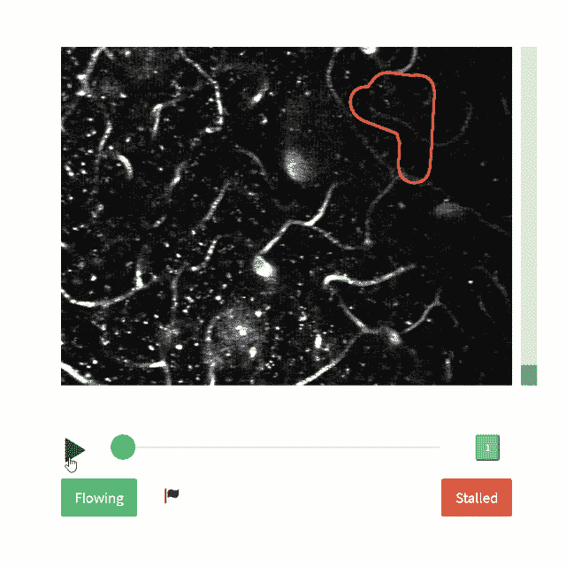
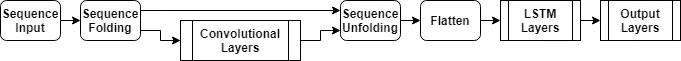
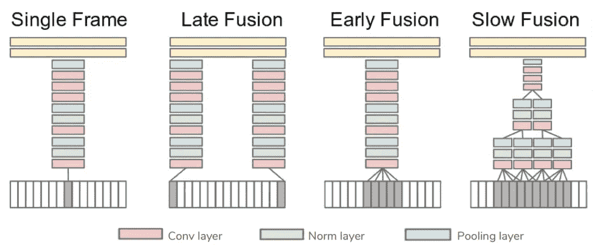
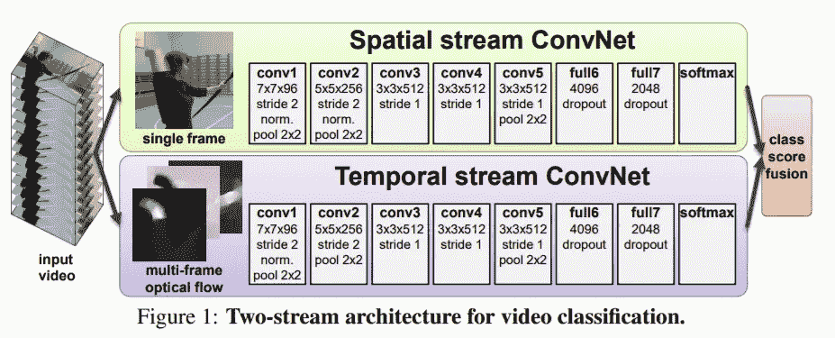
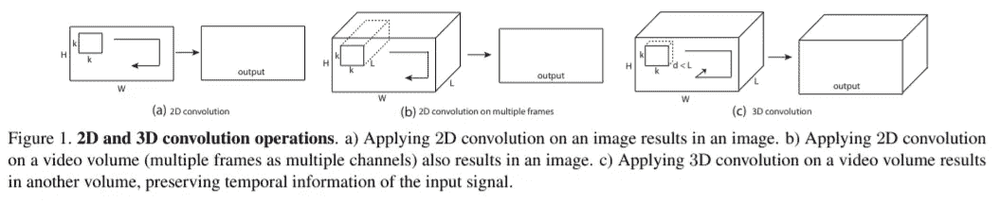

# 你准备好迎接视频分类挑战了吗？

> 原文：<https://towardsdatascience.com/are-you-ready-for-a-video-classification-challenge-d044e3b202b6?source=collection_archive---------26----------------------->

## 阿尔茨海默氏症研究面临的数据科学挑战

## 视频分类准备指南

图像源([失速捕捉器](https://stallcatchers.com/main))

为了帮助您在家工作时学习新技能并赢得一些在线奖金，MathWorks 推出了一项数据科学竞赛。

***预告:***Datathon 将于五月上线。注册[驱动数据](https://www.drivendata.org/)账户，接收发布公告。在这里申请免费的 MATLAB 许可证:[用失速捕捉器推进老年痴呆症的研究](https://www.mathworks.com/academia/student-competitions/advance-alzheimers-research.html)

该数据集将由取自活鼠大脑的图像堆栈(3D 图像)组成，显示血管和血流。每个堆栈都有一个围绕目标血管段绘制的轮廓，并将被转换为. mp4 视频文件。问题是将目标血管段分类为流动的或停滞的。挑战将在网上进行，全球均可参加，并可免费参与。你可以用任何方法来解决这个问题。

在这个故事中，我将谈谈我在设置这个问题时学到的概念和方法。我还会给你指出你可以参考的文件，开始准备挑战。

# 使用数据

## **视频数据**

处理视频是处理图像的扩展；我们还必须考虑视频的动态特性，而不是图像的静态特性。视频可以定义为一堆图像，也称为按特定顺序排列的帧。每一帧都有意义，但顺序也很重要。因此，需要测量帧的空间和时间内容。

所以，第一步是从视频中提取帧。确保帧应该同时具有序列建模和时间推理。

## **过程数据**

处理视频的另一个挑战是数据集的庞大。在 MATLAB 中，您可以使用*数据存储库*的概念，为太大而无法放入内存的数据集合创建一个存储库。*数据存储*允许您将存储在磁盘、远程位置或数据库上的多个文件中的数据作为一个实体进行读取和处理。

*参考文件:*

*   了解数据存储的概念:[数据存储入门](https://www.mathworks.com/help/matlab/import_export/what-is-a-datastore.html)
*   为图像、文本、音频、文件等创建不同的数据存储。[不同文件格式或应用的数据存储](https://www.mathworks.com/help/matlab/import_export/select-datastore-for-file-format-or-application.html)
*   直接使用内置的数据存储库作为深度学习网络的输入:[用于深度学习的数据存储库](https://www.mathworks.com/help/deeplearning/ug/datastores-for-deep-learning.html)
*   为基于文件的数据实施自定义数据存储:[开发自定义数据存储](https://www.mathworks.com/help/matlab/import_export/develop-custom-datastore.html)
*   质询的数据将使用存储在 AWS 中的数据。因此，[学习如何从 S3 桶中访问数据](https://www.mathworks.com/help/matlab/import_export/work-with-remote-data.html)

# 视频分类方法

一旦数据准备就绪，您可以使用以下 5 种方法中的任何一种进行分类。我将从基本的非深度学习方法到高级方法来谈论最常用的视频分类方法。但是由于数据的规模，我会鼓励你使用深度学习方法，并及时从每一帧中提取特征。

> **经典计算机视觉方法**

## 方法 1:光流、目标跟踪和级联分类器

光流、活动识别、运动估计和跟踪是您可以用来确定视频相邻帧中的类别及其运动的关键活动。

*参考资源:*

*   要了解如何使用算法 Horn-Schunck 方法、Farneback 方法和 Lucas-Kanade 方法实现[光流](https://www.mathworks.com/discovery/optical-flow.html)请查看本教程视频:[计算机视觉训练、运动估计](https://www.mathworks.com/videos/motion-estimation-120840.html)
*   关于[跟踪&运动估计](https://www.mathworks.com/help/vision/object-detection-using-features.html?category=tracking-and-motion-estimation)的更多示例和文档
*   要学习使用基于直方图的跟踪来跟踪物体，使用[卡尔曼滤波器](https://www.mathworks.com/discovery/kalman-filter.html?s_tid=srchtitle)来跟踪遮挡或隐藏的物体，请查看本教程视频:[计算机视觉训练，物体跟踪](https://www.mathworks.com/videos/object-tracking-120841.html)
*   举例说明如何对视频中的运动对象进行自动检测和基于运动的跟踪:[基于运动的多对象跟踪](https://www.mathworks.com/help/vision/examples/motion-based-multiple-object-tracking.html?s_tid=srchtitle)

另一种方法是使用[局部特征](https://www.mathworks.com/help/vision/ug/local-feature-detection-and-extraction.html)，比如图像的斑点、角落和边缘像素。级联分类器支持局部特征，如 Haar、局部二元模式(LBP)和梯度方向直方图(HOG)。

*参考资源:*

*   [计算机视觉使用特性](https://www.mathworks.com/help/vision/object-detection-using-features.html)
*   [训练一个级联物体探测器](https://www.mathworks.com/help/vision/ug/train-a-cascade-object-detector.html)
*   [用视觉词包进行图像检索](https://www.mathworks.com/help/vision/ug/image-retrieval-with-bag-of-visual-words.html)
*   [用视觉单词包进行图像分类](https://www.mathworks.com/help/vision/ug/image-classification-with-bag-of-visual-words.html)

> **深度学习方法**

## 方法二:卷积神经网络(CNN) +长短期记忆网络(LSTM)

在这种方法中，您使用预先训练的[卷积神经网络](https://www.mathworks.com/help/deeplearning/ug/introduction-to-convolutional-neural-networks.html)从每一帧中提取特征，将视频转换为一系列特征向量。然后在序列上训练一个[长短期记忆(LSTM)网络](https://www.mathworks.com/help/deeplearning/ug/long-short-term-memory-networks.html)来预测视频标签。最后一步，将两个网络中的图层组合起来，组成一个直接对视频进行分类的最终网络。

要了解这个完整工作流程的步骤，请查看这个文档:[使用深度学习对视频进行分类](https://www.mathworks.com/help/deeplearning/ug/classify-videos-using-deep-learning.html)

图片来源( [MATLAB 文档](https://www.mathworks.com/help/deeplearning/ug/classify-videos-using-deep-learning.html) t)

## 方法 3:用 CNN 进行大规模视频分类

如果视频分类像图像分类，为什么不直接用卷积神经网络？

要回答这个问题，记得我说过视频的时间成分。因此，为了捕捉时间和空间方面，你可以使用 CNN，但你需要以不同的方式构建网络。

来自斯坦福大学的论文[使用卷积神经网络进行大规模视频分类](http://vision.stanford.edu/pdf/karpathy14.pdf)，讨论了基本 CNN 对视频的挑战。它进一步阐述了您可以使用的所有不同的 CNN 模型，以融合来自多个帧的特征。

图片来源:[研究论文](http://vision.stanford.edu/pdf/karpathy14.pdf)

## 方法 4:双流 CNN

研究人员在本文中解释的另一种方法:[用于视频中动作识别的双流卷积网络](https://arxiv.org/pdf/1406.2199.pdf)，是两个分别用于空间和时间方面的 conv 网络。

图片来源:[研究论文](https://arxiv.org/pdf/1406.2199.pdf)

*在 MATLAB 中开发 CNN 架构要参考的文档:*

*   [定义自定义深度学习层](https://www.mathworks.com/help/deeplearning/ug/define-custom-deep-learning-layers.html)
*   [指定卷积神经网络的层数](https://www.mathworks.com/help/deeplearning/ug/layers-of-a-convolutional-neural-network.html)
*   [设置参数，训练卷积神经网络](https://www.mathworks.com/help/deeplearning/ug/setting-up-parameters-and-training-of-a-convnet.html)
*   [训练深度学习神经网络的选项](https://www.mathworks.com/help/deeplearning/ref/trainingoptions.html)
*   [深度学习技巧和窍门](https://www.mathworks.com/help/deeplearning/ug/deep-learning-tips-and-tricks.html)

## 方法 5:使用 3D 卷积网络

3D ConvNets 是视频分类的首选，因为它们固有地在 3D 空间中应用卷积和最大池。在本文中:[用 3D 卷积网络学习时空特征](https://arxiv.org/pdf/1412.0767.pdf)，研究人员提出了一种具有紧凑特征和高效计算的 C3D(卷积 3D)。

图片来源:[研究论文](https://arxiv.org/pdf/1412.0767.pdf)

*要参考的文件:*

*   使用 MATLAB 中的 [image3dInputLayer](https://www.mathworks.com/help/deeplearning/ref/nnet.cnn.layer.image3dinputlayer.html) 、 [convolution3dLayer](https://www.mathworks.com/help/deeplearning/ref/nnet.cnn.layer.convolution3dlayer.html) 、[maxpool3d layer](https://www.mathworks.com/help/deeplearning/ref/nnet.cnn.layer.maxpooling3dlayer.html)等函数设计 3D-ConvNet
*   使用[深度网络设计器](https://www.mathworks.com/help/deeplearning/ug/build-networks-with-deep-network-designer.html)设计网络
*   点击这里查看 MATLAB 中深度学习层的完整列表:[深度学习层列表](https://www.mathworks.com/help/deeplearning/ug/list-of-deep-learning-layers.html)
*   处理 3d 医学图像的示例:[使用深度学习的 3d 脑肿瘤分割](https://www.mathworks.com/help/deeplearning/ug/segment-3d-brain-tumor-using-deep-learning.html)

## 后续步骤

如果您没有 MATLAB 许可证，请从这里申请免费的 MATLAB 许可证开始准备:[用拖延战术推进老年痴呆症研究](https://www.mathworks.com/academia/student-competitions/advance-alzheimers-research.html)。

请继续关注进一步的更新，在我五月份的下一篇博客中，在比赛启动日。该博客将是所有其他细节问题的基准代码。

请在下面的评论中给出您的反馈或任何问题。