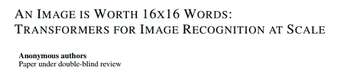
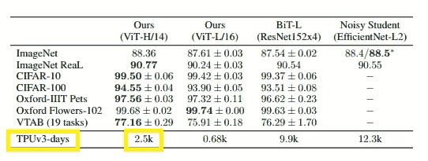
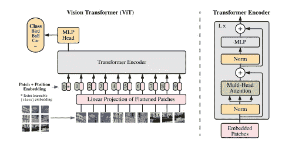

# 你准备好接受视觉变形器(ViT)了吗？

> 原文：<https://towardsdatascience.com/are-you-ready-for-vision-transformer-vit-c9e11862c539?source=collection_archive---------4----------------------->

## “一幅图像相当于 16x16 个字:大规模图像识别的变形金刚”可能会给计算机视觉带来又一次突破

达里娅·谢夫索娃在 [Unsplash](https://unsplash.com/s/photos/death?utm_source=unsplash&utm_medium=referral&utm_content=creditCopyText) 上的照片

地球上的生命面临着兴衰循环。它不仅适用于生物，也适用于技术。数据科学中的技术充满了炒作和有偏见的成功故事。说到这里，有一些技术导致了数据科学的发展:**卷积神经网络(CNN)** 。自 2012 年 AlexNet 以来，不同架构的细胞神经网络已经为实际的商业运作和学术研究带来了巨大的贡献。[**【ResNet】**](https://arxiv.org/abs/1512.03385)由微软研究院在 2015 年带来了构建“深度”CNN 的真正突破；然而，这项技术即将光荣退休。神经网络之父、2018 年图灵奖得主之一杰弗里·辛顿(Geoffrey Hinton)多年来一直在提及 CNN 的缺陷。可以找他的一个研讨会“ [**卷积神经网络**](https://www.youtube.com/watch?v=Jv1VDdI4vy4) **怎么了？**“2017 年。CNN 的一个主要缺陷存在于合并图层中，因为它丢失了许多有价值的信息，并且它忽略了图像的局部与整体之间的关系。代替 CNN，Geoffrey Hinton 和他的团队在 2018 年发表了一篇关于 [**胶囊网**](https://openreview.net/forum?id=HJWLfGWRb) 的论文；然而，它还没有取代 CNN。

# 目录

1.  一幅图像的简介相当于 16x16 个字:大规模图像识别的变形金刚
2.  为什么视觉转换器(ViT)很重要？
3.  关闭
4.  进一步研究的材料

# 一幅图像的简介相当于 16x16 个字:大规模图像识别的变形金刚

我是从安德烈·卡帕西 2020 年 10 月 3 日的推特上得知这篇论文的。

作者截图。这条推文是由 Andrej Karpathy 创作的。

安德烈·卡帕西(Andrej Karpathy)是特斯拉人工智能的高级主管，他曾在 2016 年教过一堂课 [**CS231n**](https://www.youtube.com/watch?v=LxfUGhug-iQ) ，内容涵盖了斯坦福大学计算机视觉方面的主题。尽管内容已经过时，他还是表现出了用简单的语言表达复杂概念的高超技巧。我从他的课上学到了很多东西。

这篇文章的目的是给那些不了解 Transformer 的机器学习工程师和数据科学家提个醒，让他们在“创新科技公司”为 Vision Transformer 推出 GitHub 知识库之前做好准备。

***这篇论文是谁写的？***

作者截图。出处是论文上的扉页“一个图像抵得上 16x16 个字。”

我一般会在阅读前查看作者/机构的名字，以鉴别论文的可信度。这篇名为 [**一幅图像抵得上 16x16 个字:图像识别的变形金刚**](https://openreview.net/forum?id=YicbFdNTTy) 的论文于 2020 年 9 月 28 日提交，由于论文正在进行双盲评审，作者姓名尚未透露。我不会明确提到公司的名字。然而，你可以做出一个有根据的猜测，谁能花得起 2500 个 TPU 日来训练一个模型(下面突出显示)，还有另一个线索表明，该模型是在 JFT-300M 上训练的，这是一个拥有 3 亿张图像的私人数据集。

作者截图。来源是“一幅图像相当于 16x16 个单词”这篇论文中的表 2

# ***为什么视觉转换器(ViT)很重要？***

这不是第一篇将 Transformer 应用于计算机视觉的论文。脸书 2020 年 5 月发布[**【DETR】**](https://ai.facebook.com/blog/end-to-end-object-detection-with-transformers/)；然而，DETR 与 CNN 联合使用了《变形金刚》。ViT 是 Transformer 对于计算机视觉最成功的应用，这项研究被认为做出了三点贡献。

***训练精度高，计算时间少***

与 [**吵闹的学生**](https://arxiv.org/abs/1911.04252v4) (由谷歌于 2020 年 6 月发布)相比，ViT 减少了 80%的训练时间，尽管 ViT 已经达到了与论文(上图)中表 2 所示大致相同的准确度。Noisy Student 采用了 EfficientNet 架构，我将写另一篇关于 EfficientNet 的博文，以帮助读者了解自 ResNet 以来，CNN 在不久的将来走了多远。

***无卷积网络的模型架构***

变压器架构背后的核心机制是**自我关注**。它提供了理解输入之间的联系的能力。当变压器应用于 NLP 时，它以双向方式计算单词之间的关系，这意味着输入的顺序不像 RNN 那样重要。具有 Transformer 架构的模型使用自关注层的堆栈而不是 CNN 和 rnn 来处理可变大小的输入。你可以在我的上一篇文章中了解更多关于 Transformer 的知识，这篇文章是用通俗易懂的语言写给商务人士的，“假装你熟悉 BERT 的最低要求”。

将没有 CNN 的变形金刚应用到图像的一个主要挑战是在像素之间应用自我关注。如果输入图像的大小是 640x640，那么模型需要计算 409K 个组合的自我关注度。此外，您可以想象，图像一个角上的像素不太可能与图像另一个角上的另一个像素有有意义的关系。ViT 通过将图像分割成小块(如 16x16)克服了这个问题。句子的原子是一个单词，这项研究将碎片定义为图像的原子，而不是像素，以有效地梳理模式。

作者截图。来源是纸上的图 1“一个图像抵得上 16x16 个字。”

***小贴片变压器的功效***

通过分析多头注意的中间结果，分析了 ViT 的内部表征。本文发现，该模型能够在位置嵌入的相似性中编码面片的距离。另一个发现是，论文发现 ViT 整合了整个图像的信息，甚至在《变形金刚》中的最低层。作为旁注，ViT-Large 有 24 层，隐藏大小为 1，024 和 16 个注意头。该论文引用的内容是“我们发现一些头部已经注意到最底层的大部分图像，这表明模型确实使用了全局整合信息的能力。”

定性分析模型性能通常与定量分析一样重要，以了解预测的稳健性。我通常使用 [**类激活图**](http://cnnlocalization.csail.mit.edu/) (麻省理工学院于 2015 年发布)来验证模型性能的稳健性，方法是查看来自具有正确预测、假阳性和假阴性的图像的类激活图，以创建和测试不同的假设。

# 关闭

我很少阅读正在接受审查的论文，因为提交的论文内容会被修改，其中许多甚至会被期刊拒绝。但是，我写了这篇文章，因为内容真的很有创意，而且我也喜欢这篇论文富有诗意的标题！当论文正式发表时，我计划对这篇文章做一些更新。

**更新:2020 年 12 月 4 日**

[视觉变形金刚的官方仓库准备好了](https://github.com/google-research/vision_transformer)。享受 ViT 的生活！

# 进一步研究的材料

1.  你可以阅读提交的论文，[在 OpenReivew.net，谷歌一幅图像值 16x16 字:大规模图像识别的变形金刚](https://openreview.net/forum?id=YicbFdNTTy)。
2.  Jay Alamer 的《变形金刚》插图是理解《变形金刚》如何一步一步工作的最佳材料，其中的图片非常有用。
3.  如果你想在没有数学的情况下理解 Transformer 的应用，我的博客文章[假装你熟悉 BERT](/minimal-requirements-to-pretend-you-are-familiar-with-bert-3889023e4aa9) 的最低要求将会帮助你，因为我的读者是商务人士和初级数据科学家。
4.  如果你对视觉变形器统治这个领域之前，谷歌大脑和研究团队(截至 2021 年 2 月)使用 CNN 的计算机视觉的艺术模型感兴趣，你可以在[中看到没有数学的解剖学简单的复制粘贴是计算机视觉问题的游戏改变者](/simple-copy-paste-is-a-game-changer-for-computer-vision-5858a9445caa)。
5.  最后一个材料与学习 Transformer 的概念没有直接关系，但读者曾问我如何实现 Transformer。如果你已经对变形金刚有了基本的了解，首先你可以从这篇文章中学习如何使用 PyTorch，[通过一个例子了解 PyTorch:一个分步教程](/understanding-pytorch-with-an-example-a-step-by-step-tutorial-81fc5f8c4e8e)，然后你可以通过 [HuggingFace 的快速入门](https://huggingface.co/transformers/quickstart.html)来创建你的第一个变形金刚模型。享受变形金刚！