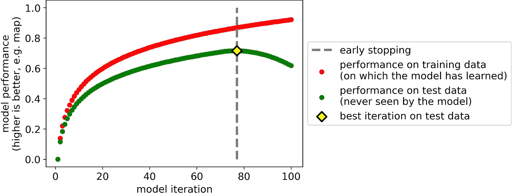
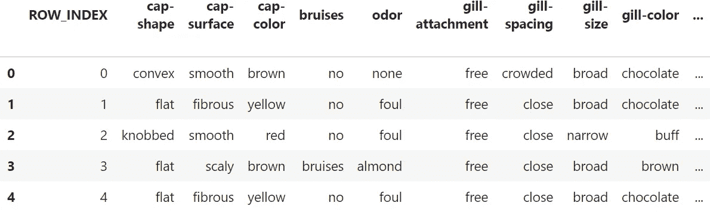
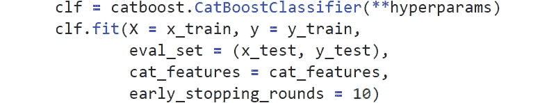
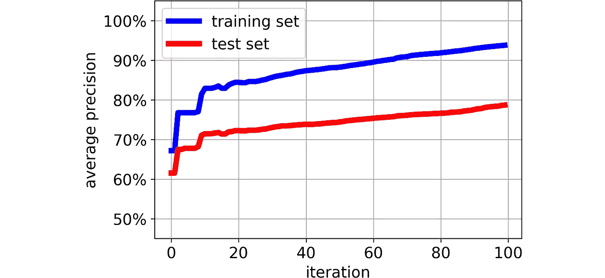
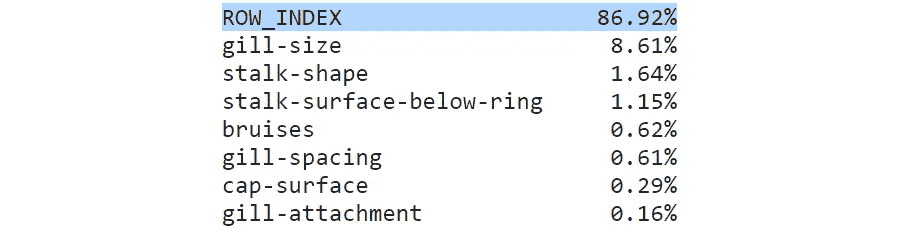
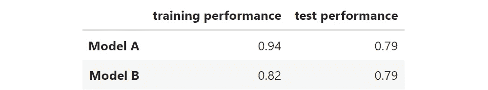

# 你真的在照顾过度合身吗？

> 原文：<https://towardsdatascience.com/are-you-really-taking-care-of-overfitting-b7f5cc893838?source=collection_archive---------59----------------------->

## 如果你的回答是“是的，我使用过提前停止”，你可能想看看这个

过度合身就像试着穿一套为别人量身定做的衣服。图片来源: [Freepik](https://www.freepik.com/free-photo/yellow-tape-measure-blue-background_4886566.htm#page=1&query=tape%20measure&position=17)

Y 你坐在一个满是数据科学家的酒吧里，无意中听到了下面这段对话:

> -等一下！你解决了过度装配的问题了吗？
> 
> -是的，我用过早停。

即使你对机器学习一无所知，但你会说英语，你也能推断出两件事。首先，存在一种叫做“过度拟合”的不好的东西。第二，过度拟合可以用一种叫做“提前停止”的方法来克服。

这不仅仅是酒吧里的谈资。如果你翻阅[深度学习的圣经](https://www.amazon.com/Deep-Learning-Adaptive-Computation-Machine/dp/0262035618/ref=as_li_ss_tl?_encoding=UTF8&qid=&sr=&linkCode=sl1&tag=inspiredalgor-20&linkId=e4e32749958369afb667e7e4323d65ba&language=en_US)，在第 425 页你会读到“早停应该几乎普遍使用”(Goodfellow)。在数据科学中，并不是每天都能听到“普遍”这个词。所以，你可能会相信提前停止是适配过度的哲人之石。但是，不幸的是，[尼可·勒梅](https://harrypotter.fandom.com/wiki/Nicolas_Flamel)从未致力于机器学习。

> 提前停止是机器学习实践者最大的错觉之一。

事实上，许多人认为，通过使用这种技术，他们变得对过度拟合免疫。遗憾的是，事实并非如此。事实上，经常发生的情况是，你使用早期停止，但是你最终得到一个严重过度拟合的模型。

在本文中，我将使用著名的蘑菇数据集(可在 [Kaggle](https://www.kaggle.com/uciml/mushroom-classification) 上获得)来展示这是多么容易发生。此外，我们将观察过度配合在实践中会造成什么样的损害。

以下是段落列表:

1.  **什么是过度拟合？**
2.  **什么是提前停止？**
3.  **树林中的数据科学家**
4.  **约翰尼·德普谬论**
5.  **德怀特家的晚餐**
6.  **收尾**

# 1.什么是过度拟合？

> 过度拟合是预测模型无法将它从一些数据 A(“训练数据”)学到的东西推广到一些新数据 B(“测试数据”)。

例如，假设你给一个模型 100，000 张猫的肖像和 100，000 张狗的肖像(训练数据),让它学会区分猫和狗。然后，你拿一万张新的猫狗肖像(测试数据)，让模型给它们贴上标签。如果模型在测试数据上的表现不如在训练数据上的表现，则意味着您的模型不能进行归纳。

现在，如果一个预测模型不能很好地处理新的(看不见的)数据，那么拥有一个预测模型首先有什么意义呢？如果不危险的话，过度拟合会使模型无用。这就是为什么它是任何数据科学家都必须处理的最大问题之一。

但是数据科学家是聪明人，所以他们已经找到了防止过度拟合的方法。这些方法被称为“正则化技术”。

# 2.什么是早停？

早期停止是一种用于对抗过度拟合的正则化技术。它是“**大概是深度学习中最常用的正则化形式***”*([深度学习](https://www.amazon.com/Deep-Learning-Adaptive-Computation-Machine/dp/0262035618/ref=as_li_ss_tl?_encoding=UTF8&qid=&sr=&linkCode=sl1&tag=inspiredalgor-20&linkId=e4e32749958369afb667e7e4323d65ba&language=en_US)，247 页)*。它是如此简单、有效且无副作用，以至于 Hinton、Bengio 和 LeCun 称之为“[一顿美好的免费午餐](https://aiatadams.files.wordpress.com/2016/02/bengio-lecun-20151207-deep-learning-tutorial-nips.pdf)”。*

此外，早期停止可以应用于通过后续迭代训练的任何预测模型，例如具有梯度下降的逻辑回归、梯度推进算法、神经网络等。

让我们看一个在迭代培训过程中培训和测试 *(*)* 表现的典型例子。

说明提前停止是如何工作的

可以看出，训练数据的性能不断提高。这是为什么呢？因为——随着迭代一个接一个地成功——模型对训练数据越来越“定制”。相反，测试数据的性能会提高到一定程度，然后开始下降。

提前停止的功能正是利用了这种行为。提前停止意味着**在测试集**上获得最佳分数时(在这种情况下，在第 77 次迭代时)采用该模型。通过这样做，我们将不会浪费时间进行不必要的迭代，我们将拥有一个在看不见的数据上工作良好的模型。

很神奇，不是吗？嗯，提前停止是强大的，但并不可靠。我们来看看为什么。

*(*)为了简单起见，在本文中，我将不适当地使用术语“测试”数据来代替“验证”数据*

# 3.树林中的数据科学家

Dwight 是一名数据科学家。由于他计划下周末去采蘑菇，他已经从 Kaggle 下载了[蘑菇数据集](https://www.kaggle.com/uciml/mushroom-classification)。Dwight 的目标是提出一个预测模型，能够根据蘑菇的特性告诉他蘑菇是否有毒。

数据集由 8124 个蘑菇组成。对于每种蘑菇，记录了 22 种不同的特征(如气味、菌盖形状、菌盖颜色等)。目标变量是蘑菇是可食用的还是有毒的。该数据集有一些特点:

*   所有 22 个特征都是绝对的；
*   它们都由少数独特的价值观组成。

这使得数据集几乎不会过度拟合。

德怀特意识到，如果他建立了一个糟糕的模型，他可能会因蘑菇中毒而住院。因此，他希望他的测试集非常可靠。因此，他只将 33%的数据放在训练集中，其余 67%放在测试集中。

德怀特数据帧的形状

这是德怀特的训练集的样子:

训练数据帧的前五行和前十列

是的，你没看错。德怀特**不小心忘记了特征中的行索引**！这个男孩如此心不在焉。然而，这个错误应该不会造成太大的伤害。事实上，由于 Dwight 将使用一些正则化技术，模型应该自动忽略“ROW_INDEX ”,因为它会导致过多的过拟合。

由于所有的特征(除了一个)都是分类的，Dwight 选择使用 [Catboost](https://catboost.ai/) ，这是一种非常强大的算法，正是为了处理分类特征而诞生的。为了使模型防弹，德怀特还决定包括早期停止，他认为这应该足以避免过度拟合。

在设置了一些他认为合适的超参数后，Dwight 启动 catboost 分类器:

Dwight 用于训练其模型的 Python 脚本

# 4.约翰尼·德普谬论

这就是 Dwight 的模型在每次迭代中对训练数据和测试数据的表现。

Dwight 模型在每次迭代中的训练和测试性能

这个数字是一个明显的例子，说明为什么早停并不像许多人认为的那样不可战胜。

> 早期停止着眼于测试性能发生了什么，但它没有说训练性能。然而，过度拟合是由两者之间的关系给出的。

事实上，在最后一次迭代中，该模型在训练集和测试集上的平均精度分别达到了 94%和 79%。这两个数字之间存在巨大差异，这是**过度拟合**的一个非常明显的迹象。

但德怀特不在乎。“毕竟——他认为——79%的测试成绩并没有那么糟糕”。他是这么看的:

> “唯一重要的是测试集上的性能。谁在乎超配，只要我能有个好的考试成绩就行了？”

我打赌你以前听过这种说法。事实上，在机器学习的世界里，存在一种普遍的倾向，即只关注测试表现，而完全忽视训练表现。这就是我所谓的“T2”约翰尼·德普谬论“T3”。

这和强尼·德普有什么关系？

想象你是一个电影制片人。你的下一部电影需要一名男主角，你开始四处寻找，直到你有了一个想法:约翰尼·德普将是那个角色的完美人选。因为你是彻底的家伙，所以你做足了功课，查了他的一些电影的票房，比如《Mortdecai》(4700 万美元)、《Black Mass》(1 亿美元)、《独行侠》(2.6 亿美元)。现在，你可能会想“哇，那可是一大笔钱啊！约翰尼·德普绝对是个不错的选择。”

但是你没有考虑电影预算。换句话说，这项投资值得吗？事实上，约翰尼·德普已经连续两年成为“T4 片酬最高的演员”。这意味着与他的电影票房相比，他的片酬太高了。如果你只关注票房，你就看不到真正重要的东西:投资回报。

这如何应用于机器学习？

正如电影行业一样，在机器学习中，考虑投资回报也很重要。在机器学习中，**“预期回报”是用训练集上的表现来表示的，而实际的“投资回报”是看不见的数据(测试集)上的表现**。

德怀特对模特的期望很高。事实上，该模型“承诺”交付 94%的平均精度(训练性能)。然而，结果非常令人失望，仅达到 79%(测试性能)。这种模式就像是一种无法偿还投资者的资产。

# 5.德怀特家的晚餐

你可能认为票房和机器学习的类比有点鲁莽。好吧，如果你仍然不相信约翰尼·德普谬误在机器学习中与在电影行业中一样危险，那就看看德怀特模型的特征重要性吧:

德怀特模型的特征重要性。行索引是最重要的特性。这没有任何意义！

“ROW_INDEX”是模型中最重要的特性。基本上，Dwight 主要根据数据集中蘑菇的行索引来决定他要吃哪些蘑菇，这只是一个随机数！如果你不是俄罗斯轮盘赌爱好者，我会在接受他的晚餐邀请前三思。

当然，这只是一个玩具例子。在现实世界的应用中，模型要比这复杂得多。你不知道哪些功能应该是重要的，哪些功能不应该是重要的(如果你知道，你会从一开始就放弃这些功能)。这正是仔细观察训练和测试表现如此重要的原因。

例如，您可能最终拥有以下两种模型:

同样的考试成绩，不同的训练成绩

如果你是约翰尼·德普谬误的受害者，你可能会得出结论，模型 A 和模型 B 基本上是相同的，因为它们在测试数据上获得了相同的结果。然而，如果你有完整的图片，你会注意到模型 B 比模型 A 好得多，因为模型 A 显然是过度拟合的。

有很多原因可以解释你为什么要避免过度拟合:

1.  当你有一个过拟合的模型时，很可能*可行*找到一个更好的模型(即训练性能较低和/或测试性能较高的模型)，这就是:从模型 A 转移到模型 b。
2.  机器学习模型意味着学习模式。过度拟合模型是学习了许多*错误模式*的模型。
3.  过度合身的模特很快就会变老。如果你的意图是随着时间的推移使用你的模型，那么你将遭受更多的[概念漂移](https://machinelearningmastery.com/gentle-introduction-concept-drift-machine-learning/)。

# **6。结束**

在本文中，我们使用了 Kaggle 上最不“过度适应”的数据集之一:蘑菇数据集。仍然不满足于此，我们还包括了在训练阶段提前停止。

但这是徒劳的:无论如何，我们最终得到了一个饱受过度拟合之苦的模型。这证明了**对付过度拟合的灵丹妙药并不存在**。

与过度拟合密切相关的是我们所称的“约翰尼·德普谬误”:**忽视训练表现而只关注测试表现的诱惑**。当然，测试性能很吸引人。但是，正如我们所看到的，这只是硬币的一面。

总之，**处理过度拟合并不意味着仅仅使用早期停止(或任何其他正则化方法)，而是意味着检查模型在训练集和测试集上的表现**。这是评估给定模型泛化能力的唯一方法。

使用[这款笔记本](https://github.com/smazzanti/are_you_really_taking_care_of_overfitting)可以重现上述所有结果。

笔记本上的任何错误都是德怀特的错。

感谢您的阅读！我希望你喜欢这篇文章。

相反，如果你非常喜欢它，请留下掌声，并跟随我在 Medium 上阅读更多关于数据科学的帖子。也可以在 [Linkedin](https://www.linkedin.com/in/samuelemazzanti/) 上和我联系。