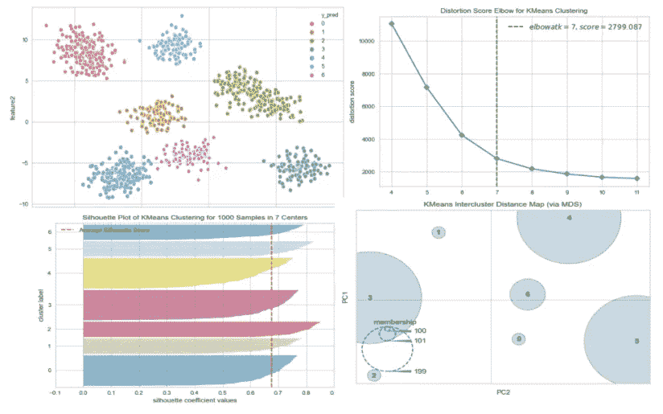
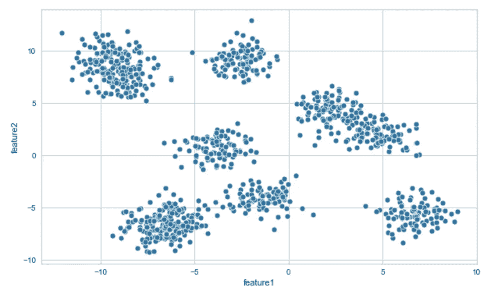
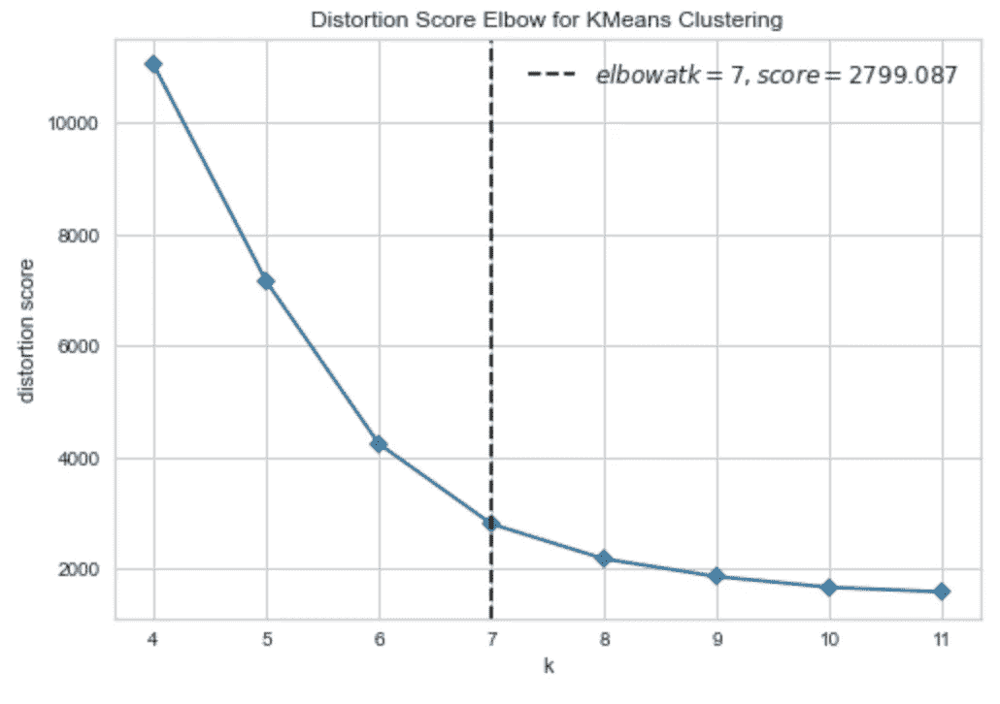
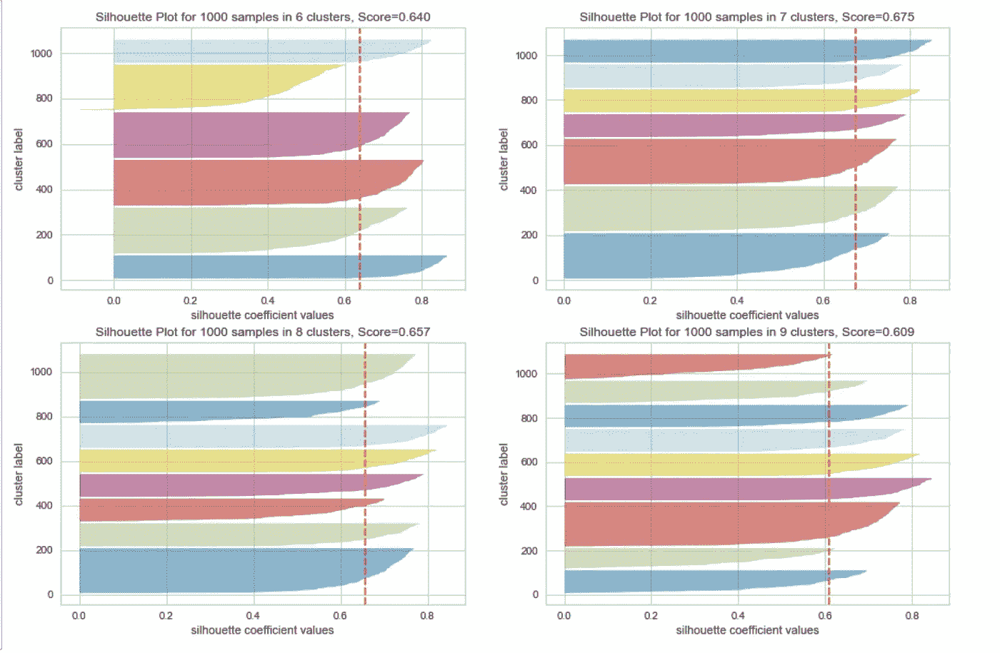
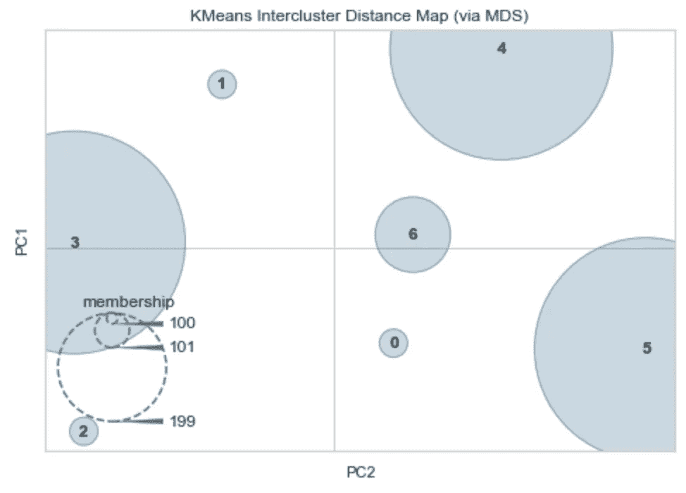
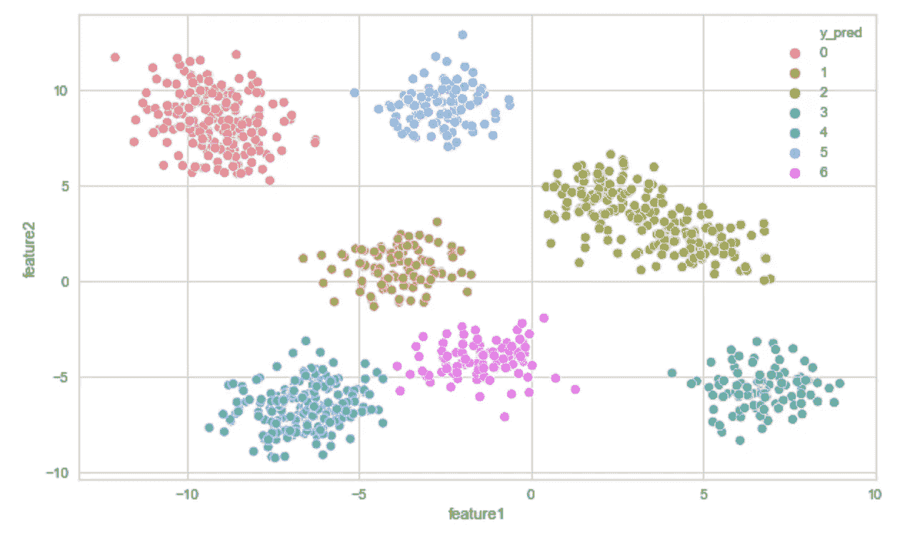

# 你正在使用 K-Means 解决 ML 聚类问题吗？

> 原文：<https://towardsdatascience.com/are-you-solving-ml-clustering-problems-using-k-means-68fb4efa5469?source=collection_archive---------12----------------------->

## 绘制肘部曲线、轮廓曲线、簇间距离的一行程序，并了解 sci kit——了解可以改进模型的技巧。



来源:作者图片

K-Means 是无监督机器学习问题中最常用的聚类算法，它对于找到相似的数据点和确定数据的结构非常有用。在这篇文章中，我假设您对 K-Means 有一个基本的了解，并将更多地关注于您如何能够-

*   使用不同的方法，如*肘形曲线、Sillhouette 曲线和簇间距离，找到 K (簇数)的**值。***
*   一个伟大的可视化库 **YellowBrick** ，它可以帮助你用仅仅 **1 行代码**来绘制这些曲线。
*   不同的 sci kit-学习技巧，以改善您的 K 均值模型。

> 如果你是新手，网上有很多很棒的文章可以帮助你理解 K-Means。我会推荐浏览博客，从 [Imad Dabbura](https://medium.com/u/793eeb87d3ee?source=post_page-----68fb4efa5469--------------------------------) 、 [K-means Clustering:算法、应用、评估方法和缺点](/k-means-clustering-algorithm-applications-evaluation-methods-and-drawbacks-aa03e644b48a)和 [Azika Amelia](https://medium.com/u/50e1cd76b649?source=post_page-----68fb4efa5469--------------------------------) 、 [K-Means Clustering:从 A 到 Z](/k-means-clustering-from-a-to-z-f6242a314e9a) 涵盖了大部分内容。你也可以参考 Scikit-Learn [的文档来了解集群](https://scikit-learn.org/stable/modules/clustering.html#clustering)的情况，这些文档很好地展示了集群。

让我们开始，看看如何能做到这一点。

# 求 K-均值中的 K。

要使用 K-Means，我们需要指定 K 的值，这是我们想要将数据分组到的聚类数。大多数情况下，我们不知道数据中会出现多少组，找到 k 的最佳值变得很困难。幸运的是，不同的方法可以帮助我们找到正确的值。

在这里，我将通过 4 种不同的方式。

1.  肘部曲线。
2.  轮廓曲线。
3.  星团间距离图。
4.  使用其他聚类算法。

## 数据集详细信息

为了更好地演示，我将使用 Scikit-Learn 的 make_blobs API 创建一个数据集，该 API 用于通过将每个类分配给一个或多个正态分布的点聚类来创建多类数据集。

看看我创建的笔记本，它有更多的细节，可以随意下载并导入到您的环境中，然后在周围玩玩-

[](https://github.com/ankitgoel1602/data-science/tree/master/clustering-projects/K-Means%20Example) [## ankitgoel 1602/数据科学

### 这个库提供了一个如何应用 K-Means 和使用 Yellowbrick 生成肘形曲线的例子…

github.com](https://github.com/ankitgoel1602/data-science/tree/master/clustering-projects/K-Means%20Example) 

这里，我们使用 make _ blobs 创建了一个包含 10 个中心的数据集。

```
from sklearn.datasets import make_blobs# Generate synthetic dataset with 10 random clusters in 2 dimensional space
X, y = make_blobs(n_samples=1000, n_features=2, centers=10, random_state=42)
```

虽然我们创建了 10 个随机簇，但下图显示了一些簇之间存在重叠，我们将看到 Elbow 方法如何告诉我们获得最大增益的簇的确切数量。



来源:作者图片

## 肘形曲线

如[维基百科](https://en.wikipedia.org/wiki/Elbow_method_(clustering))所述-

> **肘方法**是一种用于确定数据集中聚类数量的启发式方法。该方法包括将解释的变化绘制为聚类数的函数，并选取曲线的拐点作为要使用的聚类数。

肘形曲线背后的直觉是，所解释的变化会快速变化，直到数据中的组数增加，然后它会变慢，导致图表中出现肘形，如下所示。拐点是您应该用于 K-Means 算法的聚类数。

最近我发现了一个名为[**yellow brick**](https://www.scikit-yb.org/en/latest/)**的库，它可以帮助我们只用一行代码就绘制出肘部曲线。它是 Scikit-Learn 的包装器，因此可以很好地与之集成。**

```
# Import ElbowVisualizer
from yellowbrick.cluster import KElbowVisualizermodel = KMeans()
# k is range of number of clusters.
visualizer = KElbowVisualizer(model, k=(4,12), timings=False)visualizer.fit(X)        # Fit the data to the visualizer
visualizer.show()        # Finalize and render the figure
```

**上面的代码将生成这个包含所有细节的漂亮图形。默认情况下，它使用“失真分数”作为度量，计算每个点到其指定中心的平方距离之和。您也可以尝试这里提到的其他指标。**

****

**图片:作者来源**

**一些聚类问题可能不会导致肘形结构，而可能会导致连续下降的图形，从而难以选择 k 值。在这种情况下，我们可以使用其他方法，如下一小节所述。**

## **轮廓曲线**

**通常，我们在聚类问题中没有基础事实(标签)，评估需要使用模型本身来完成。剪影系数通过基于平均聚类内距离和由最大值归一化的该样本的平均最近聚类距离之间的差为每个样本生成分数来计算聚类的密度。我们可以通过为不同的 K 值生成图并根据聚类的分配选择得分最高的一个来找到 K 的最佳值。**

**下面，我画出了 K = 6，7，8，9 的轮廓图，你可以看到我们用肘方法得到的 K = 7 的分数最高。这也有助于我们识别类别不平衡，因为聚类的宽度显示了该聚类中的样本数量，如果您看到 K=9 的图表，我们有许多小聚类。**

****

**来源:作者图片**

**我用 Yellowbrick 生成了上面的图。下面的代码将为 K=7 生成一个 Sillhouette 图，你可以参考我的笔记本，了解如何通过它循环生成多个图。**

```
model = KMeans(7, random_state=42)
visualizer = SilhouetteVisualizer(model, colors='yellowbrick')
visualizer.fit(X)        # Fit the data to the visualizer
visualizer.show()        # Finalize and render the figure
```

## **集群间距离图**

**尽管这可能无法直接帮助找到集群的数量。它有助于评估 K-Means 算法，因为它给出了聚类的相对重要性。默认情况下，Yellowbrick 使用 MDS(多维缩放)作为嵌入算法来嵌入到二维空间中。你可以在这里阅读更多相关信息[。](https://www.scikit-yb.org/en/latest/api/cluster/icdm.html#module-yellowbrick.cluster.icdm)**

```
model = KMeans(7)
visualizer = InterclusterDistance(model, random_state=0)visualizer.fit(X)        # Fit the data to the visualizer
visualizer.show()        # Finalize and render the figure
```

**上面的代码会生成下面的图-**

****

**来源:作者图片**

## **使用其他算法**

**我们可以尝试的另一件事是使用其他聚类算法，如亲和传播，它不需要您提供 K 的值，并使其成为学习过程的一部分。这些算法可能不适用于大型数据集。因此，在某些情况下，我们需要在数据子集上尝试它们，然后使用 K-Means 中的值。下面的代码预测了 10 个与我们使用的中心数量相匹配的集群。**

```
from sklearn.cluster import AffinityPropagation# Creating Affinity Propagation model instance
affinity_propagation = AffinityPropagation(random_state=None, damping=0.90)# number of clusters found by Affinity propagation
len(affinity_propagation.cluster_centers_indices_)
```

## **决赛成绩**

**现在，当我们用不同的方法评估时，我们得到的 K 的最佳值是 7。让我们应用 K=7 的 K-Means 算法，看看它如何对我们的数据点进行聚类。**

```
model = KMeans(n_clusters=7)# fit X
model.fit(X)# predict labels 
data['y_pred'] = model.predict(X)# plot results
sns.scatterplot(x='feature1', y='feature2', hue='y_pred', data=data)
```

****

**来源:作者图片**

# **sci kit-学习技巧**

**Scikit-learn 为我们可以利用的 K 均值提供了不同的配置。你可以在这里找到[的完整名单](https://scikit-learn.org/stable/modules/generated/sklearn.cluster.KMeans.html)。我将介绍其中的几个，它们有助于改进我们的模型。**

## **init='k-means++ '**

**K-Means 算法很大程度上取决于你如何初始化质心(聚类的中心)。Scikit-Learn 提供了可以使用的不同的 init 值，但一般来说，k-means++比其他的更突出，因为它试图初始化质心，使其(一般来说)彼此远离，从而导致可证明的更好的结果。**

## **使用降维算法**

**K-Means 使用欧几里得距离来计算点之间的距离。据观察，在非常高维的空间中，欧几里德距离往往会爆炸，并且不太管用。因此，如果您有大量的特征，在 k-means 之前使用 PCA 等降维算法可以克服这个问题，并加快计算速度。**

## **小批量 K-均值**

**对于大型数据集，K-Means 可能需要很长时间才能收敛。如 [Scikit-Learn 文档](https://scikit-learn.org/stable/modules/clustering.html#k-means)所述-**

> **MiniBatchKMeans 是 KMeans 算法的变体，它使用小批量来减少计算时间，同时仍然试图优化相同的目标函数。小批量是输入数据的子集，在每次训练迭代中随机采样。这些小批量极大地减少了收敛到局部解所需的计算量。与其他减少 k-means 收敛时间的算法相比，小批量 k-means 产生的结果通常只比标准算法稍差。**

**因此，如果您有一个大型数据集，一定要查看 MiniBatchKmeans。**

## **聚类度量**

**大多数开始机器学习的人都知道准确性、精确度和召回率等指标。我们倾向于认为，如果没有标签，我们如何衡量结果。Scikit-Learn 提供了不同的聚类指标，如同质性、完整性、v-measure 或我们在这里讨论的剪影系数。这些指标可以帮助我们评估模型。虽然其中一些遵循半监督学习方法，并要求您有几个数据点的目标标签，但至少其他方法不需要任何标签。请点击这里查看 Scikit-Learn 中所有可用的集群指标[。](https://scikit-learn.org/stable/modules/clustering.html#clustering-performance-evaluation)**

## **缩放数据集**

**您必须在应用 k-means 之前缩放数据集，因为它会影响距离计算。**

## **不均匀的形状(限制)**

**由于 K-Means 的工作方式，它通常适用于具有像球形一样的**均匀形状**的星团。如果您知道您的数据遵循不均匀的形状，那么最好使用其他聚类算法，如适用于不均匀聚类的 DBSCAN。**

**K-Means 是一种强大而简单的算法，适用于大多数无监督的机器学习问题，并提供了相当好的结果。我希望这篇文章能帮助您解决集群问题，并为将来的集群项目节省时间。还有，你在 Scikit-Learn 里用的是 Pipeline 吗？如果没有，请查看我的另一篇文章[这里](/are-you-using-pipeline-in-scikit-learn-ac4cd85cb27f)，它可以帮助你改进你的机器学习工作流程。**

**注意安全！！！继续学习！！！**