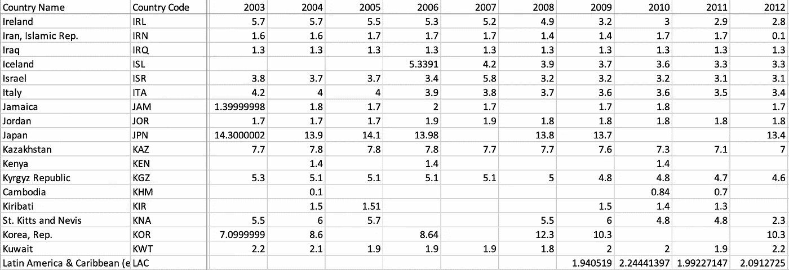
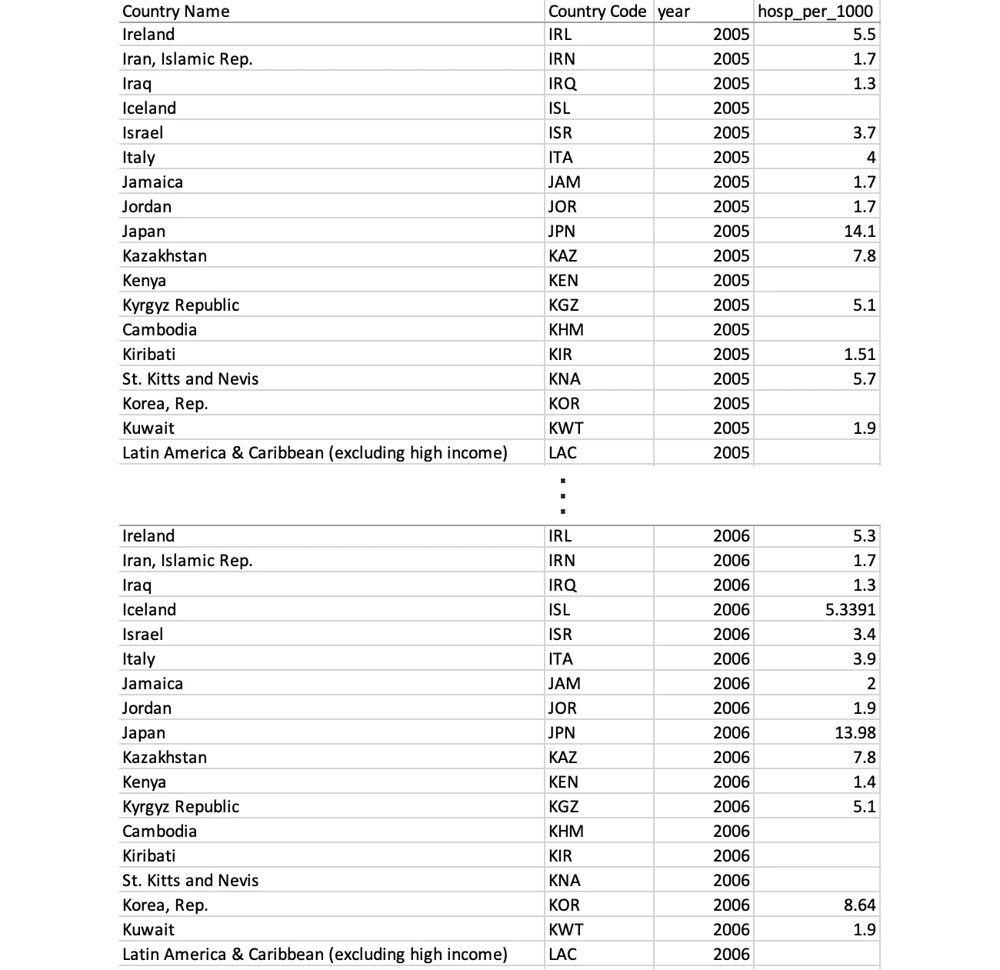
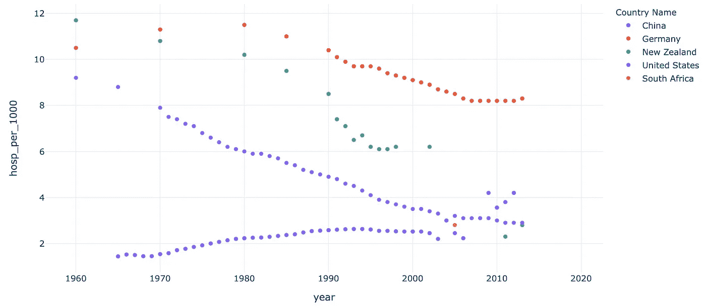
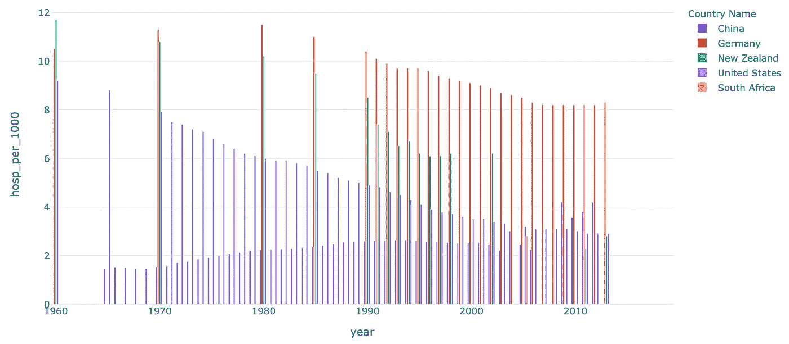

# 你仍然没有使用“整洁”的数据集吗？—以下是您应该这么做的原因

> 原文：<https://towardsdatascience.com/are-you-still-not-using-a-tidy-dataset-here-s-why-you-should-5c4b79d5c9bc?source=collection_archive---------20----------------------->

## 什么是整洁的数据集，它们的好处，以及如何用 Python(带代码)将杂乱的数据转换成整洁的数据


照片由[埃德加·恰帕罗](https://unsplash.com/@echaparro?utm_source=unsplash&utm_medium=referral&utm_content=creditCopyText)在 [Unsplash](https://unsplash.com/s/photos/organized?utm_source=unsplash&utm_medium=referral&utm_content=creditCopyText) 拍摄

所以你有一个数据集。它可能是您自己生成的，也可能是您组织内的另一个部门交付给您的。你们中的一些人甚至可能刚刚从 Kaggle 等地方下载了它。

你通常用它做的第一件事是什么？(嗯，在您加载了它的内容并验证了数据是您所期望的之后。)

你们中的许多人可能已经回答了探索性数据分析——我认为这是一种伟大的本能。

话虽如此，我还是想说，实际上我们应该首先考虑将我们的数据转换成“整洁”的数据。但首先，我们来说说什么是整齐的数据。

(如果你希望跟随我的例子，我在[我的 GitLab repo 这里](https://gitlab.com/jphwang/online_articles)，在`tidy_your_data`下面包括我的代码和例子)

## 在开始之前

我假设您熟悉 python。即使你相对较新，这个教程也不应该太难。

你需要`pandas`和`plotly`。用一个简单的`pip install [PACKAGE_NAME]`安装每一个(在您的虚拟环境中)。

# 数据怎么整理？

数据科学中提到的“整洁”数据是指数据的特定排列。请看一下[这个来自](https://data.worldbank.org/indicator/SH.MED.BEDS.ZS)[世界银行](https://data.worldbank.org/)的特殊数据集，它显示了各个国家的病床数量:



“杂乱”数据的例子

这个数据集是“混乱”数据的一个例子，为什么会混乱？这和缺失值的数量，不同的小数位数，或者任何排序都没有关系。

简单来说，tidy data 排列信息，使得*每一行对应一个观察值*，每一列对应一个变量。

同样的数据，经过整理后，看起来像这样:



数据，但要让它整洁

看到那里发生了什么吗？在杂乱的数据集中，每一行都包括多个观察值，因为一个变量(年份)的变化由列表示。而在下面的 tidy 数据集中，每个观察值都有自己的行，并且 year 变量在每一行中都有表示。

这确实是它的范围。整齐的数据将每一行限制为仅一个观察值，并且将列限制为变量。凌乱的数据是…字面上任何不是整齐的数据。

(一个更严格的定义出现在哈德利·威克姆的一篇论文中，题目很恰当，叫做“整洁数据”。)

尽管如此，那又怎样？你为什么要关心，我为什么要写这个？让我们来了解一下以这种方式排列数据的好处:

# 我为什么要关心整洁的数据？

在这一节中，我们将通过一些简单的练习，用一个杂乱的数据集和等价的整齐数据集进行比较和对比。两者都加载:

```
messy_df = pd.read_csv('srcdata/demo_messy.csv', skiprows=4)
tidy_df = pd.read_csv('srcdata/demo_tidy.csv', index_col=0)
```

## 提取/过滤

只是提醒一下，这个数据集包括了各个国家的人均医院床位数(每 1000 人)。假设我们只想获得几个国家的数据，比如中国、德国、新西兰、南非和美国。

在这两种情况下，这样做都很简单:

```
countries_list = ['China', 'Germany', 'New Zealand', 'South Africa', 'United States']
messy_df_sm = messy_df[messy_df['Country Name'].isin(countries_list)]
tidy_df_sm = tidy_df[tidy_df['Country Name'].isin(countries_list)]
```

“国家”数据基本上是一个整洁的格式。如果我们想通过多年的观察来筛选呢？

在我们研究精确解之前，让我们停下来，看一下包含在混乱数据集中的列。他们在这里:

```
['Country Name', 'Country Code', 'Indicator Name', 'Indicator Code', '1960', '1961', '1962', '1963', '1964', '1965', '1966', '1967', '1968', '1969', '1970', '1971', '1972', '1973', '1974', '1975', '1976', '1977', '1978', '1979', '1980', '1981', '1982', '1983', '1984', '1985', '1986', '1987', '1988', '1989',
       '1990', '1991', '1992', '1993', '1994', '1995', '1996', '1997', '1998', '1999', '2000', '2001', '2002', '2003', '2004', '2005', '2006', '2007', '2008', '2009', '2010', '2011', '2012', '2013', '2014', '2015', '2016', '2017', '2018', '2019']
```

您将看到包含各个年份的列列表。为了过滤某些年份，需要保留相关的年份列，而拒绝其他年份。

但这正是数据不整洁成为问题的地方。在杂乱的数据中，每一行都包含多个观察值，一些列(如“国家代码”)与所有这些观察值相关，而另一些列(如“2010”)只与其中一个观察值相关。

因此，在这种情况下，过滤掉数据将需要保留那些引用该行上所有观测值的列，以及那些引用相关年份的列。

这实际上意味着什么？两件事之一，真的。删除引用不相关年份观察值的列，或者筛选相关年份的数据，然后添加可变列。

在代码中，它可能是这样的:

```
year_list = ['1995', '2000', '2005', '2010']
var_list = ['Country Name', 'Country Code', 'Indicator Name', 'Indicator Code']
messy_df_sm2 = messy_df[var_list + year_list]
```

而对于整齐的数据，您应该运行:

```
year_list = ['1995', '2000', '2005', '2010']
tidy_df_sm2 = tidy_df[tidy_df['year'].isin(year_list)]
```

我们可以开始看到这两个数据集中所需的工作量有所不同。随着查询复杂度的增加，差异可能会增加。看一看数据操作。

## 处理混乱(-y 数据集)

如何生成整个数据集的平均值？这对于我们整洁的数据来说是微不足道的:

```
print(tidy_df['hosp_per_1000'].mean())
```

就是这样！我们所做的只是简单地从列中抓取所有的数据(观察值),并将其平均。

在杂乱的数据集中，我们需要从包含观察值的所有列中获取所有数据，然后生成一个平均值。由于一些值是 null (nan)值，这就更加复杂了。

获取每一列的平均值，然后再获取一个平均值是行不通的，因为空值的存在意味着每一列的权重不同。

所以这可能是一种方法。

```
all_years = ['1960', '1961', '1962', '1963', '1964', '1965', '1966', '1967', '1968', '1969', '1970', '1971', '1972', '1973', '1974', '1975', '1976', '1977', '1978', '1979', '1980', '1981', '1982', '1983', '1984', '1985', '1986', '1987', '1988', '1989', '1990', '1991', '1992', '1993', '1994', '1995', '1996', '1997', '1998', '1999', '2000', '2001', '2002', '2003', '2004', '2005', '2006', '2007', '2008', '2009', '2010', '2011', '2012', '2013', '2014', '2015', '2016', '2017', '2018', '2019']
messy_df_obs = messy_df[all_years]
messy_avg = np.sum(messy_df_obs.sum()) / sum(sum(messy_df_obs.notna().values))
```

可以想象，处理混乱的数据集所增加的复杂性可能会导致更多的错误。这是一个像取平均值一样简单的运算——你可以想象，随着数据或运算的复杂性增加，差异只会增加。

(哦，使用整齐的数据可能也有速度上的优势，但是除非你的数据集很大，否则这很难理解)。

那么——我们如何将杂乱的数据转换成整齐的数据呢？

# 创建整洁的数据

正如他们所说，有一个应用程序可以做到这一点。准确地说，是一种功能。

Pandas 包含了一个`[.melt](https://pandas.pydata.org/pandas-docs/stable/reference/api/pandas.melt.html)`功能，可以将杂乱的数据转换成整洁的形式。用 pandas 文档自己的话来说，这个函数将一个“宽的”(杂乱的)数据帧转换成一个“长的”(整齐的)数据帧，可选地留下标识符。

在我们的例子中，这些标识符是变量列表:

```
var_list = ['Country Name', 'Country Code', 'Indicator Name', 'Indicator Code']
```

创建一个整洁的数据帧就像`messy_df.melt(var_list)`一样简单——看看这个例子:

如果您要构建一个新的示例，只需确保每行只包含*一个*观察。让我们假设我们需要遍历数据并创建一个数据帧。您可能会这样做:

```
# With loops
data_list = list()
for i, row in messy_df.iterrows():
    for yr in [str(i) for i in list(range(1960, 2020))]:
        temp_dict = {k: row[k] for k in var_list}
        temp_dict['year'] = yr
        temp_dict['hosp_per_1000'] = row[yr]
        data_list.append(temp_dict)
tidy_df_2 = pd.DataFrame(data_list)
```

这需要一些时间来适应，但是一旦你习惯了，它就会成为你的第二天性。

在我们开始之前——让我们来看看一些可视化选项，这些选项打开了整洁的数据。

# 数据可视化——但要保持整洁。

整洁的数据也更容易可视化。还记得我们之前提到的哈雷·威克姆吗？嗯，他是`ggplot2`的创造者，也是整洁数据的最大拥护者之一。因此，ggplot2 更好地迎合整洁数据也就不足为奇了。

类似地，在 Python 中，像 [Plotly Express](https://plotly.com/python/plotly-express/) 这样的包被编写为使用整齐的数据，专注于使语法简洁和一致。

因此，一旦 Plotly 被导入:

```
import plotly.express as px
```

绘制散点图:

```
fig = px.scatter(tidy_df_sm, y='hosp_per_1000', x='year', color='Country Name', template='plotly_white')
fig.show()
```



简单散点图

或者条形图

```
fig = px.bar(tidy_df_sm, y='hosp_per_1000', x='year', color='Country Name', template='plotly_white', barmode='group')
fig.show()
```



简单分组条形图

可以用基本相同的一行函数调用语法来完成，除了几个特定于图形类型的参数。

我想继续讨论可视化整齐的数据集，特别是与探索性数据分析相关的，但现在可能已经足够了。

(在 [twitter](https://twitter.com/_jphwang) 上关注我，或者点击这里获取更新！)

我希望这篇文章有助于你熟悉什么是整洁数据，它的好处是什么，以及它们是如何产生的。由于这是一个相当简单的概述，我确信有比我展示的更好的好处的例子。请在这里或者在[推特](https://twitter.com/_jphwang)上告诉我你的进展如何——如果你有任何建议的话！

下次再见，注意安全！

ICYMI，我也写了这些文章，你可能会感兴趣:

[](/build-a-web-data-dashboard-in-just-minutes-with-python-d722076aee2b) [## 使用 Python 在几分钟内构建一个 web 数据仪表板

### 通过将您的数据可视化转换为基于 web 的仪表板，以指数方式提高功能和可访问性…

towardsdatascience.com](/build-a-web-data-dashboard-in-just-minutes-with-python-d722076aee2b) [](/how-to-visualize-hidden-relationships-in-data-with-python-analysing-nba-assists-e480de59db50) [## 如何用 Python 可视化数据中的隐藏关系 NBA 助攻分析

### 使用交互式快照、气泡图和桑基图操纵和可视化数据，使用 Plotly(代码和数据…

towardsdatascience.com](/how-to-visualize-hidden-relationships-in-data-with-python-analysing-nba-assists-e480de59db50)