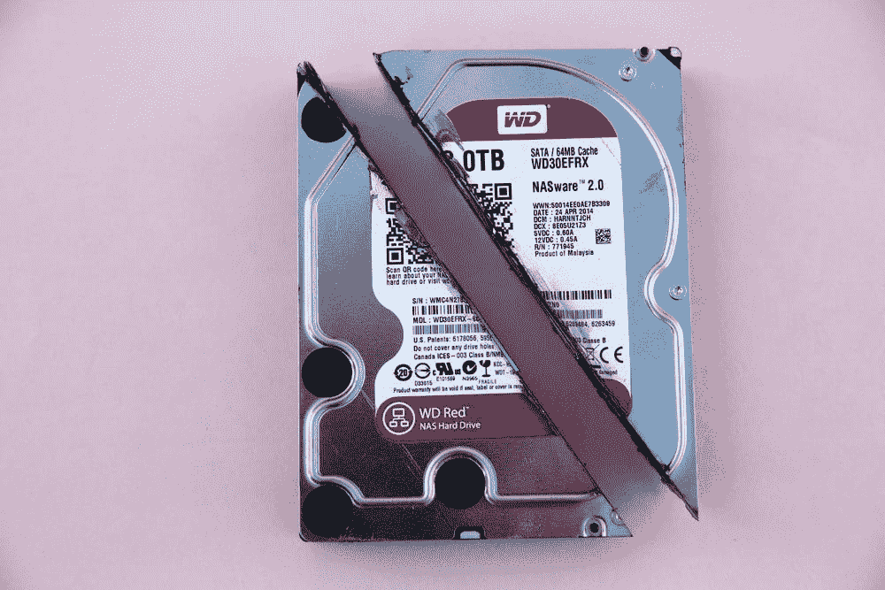
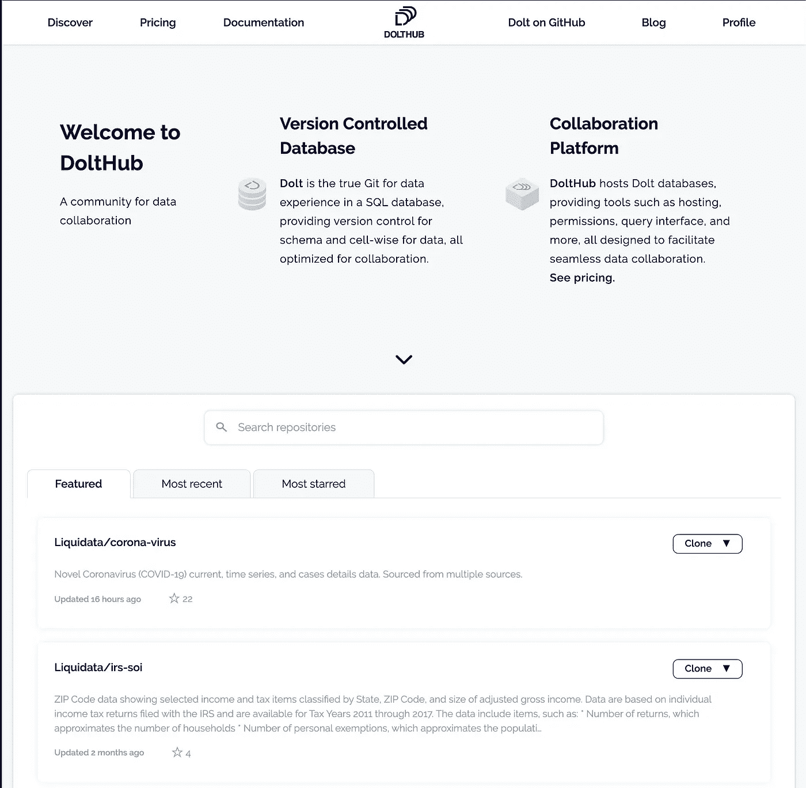
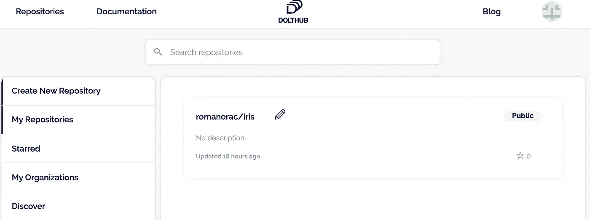
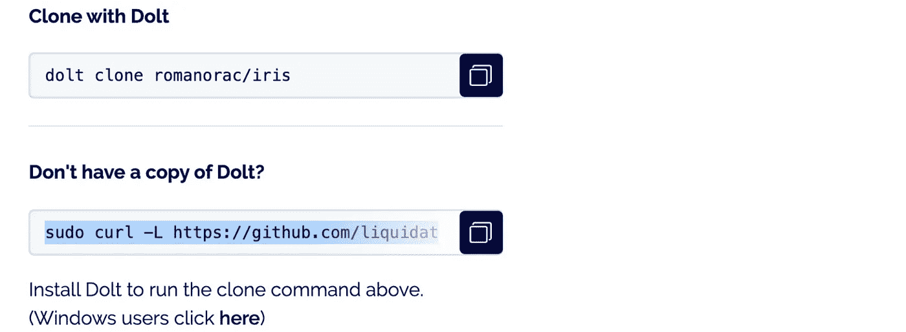
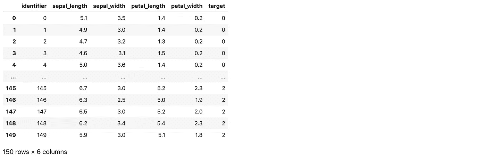
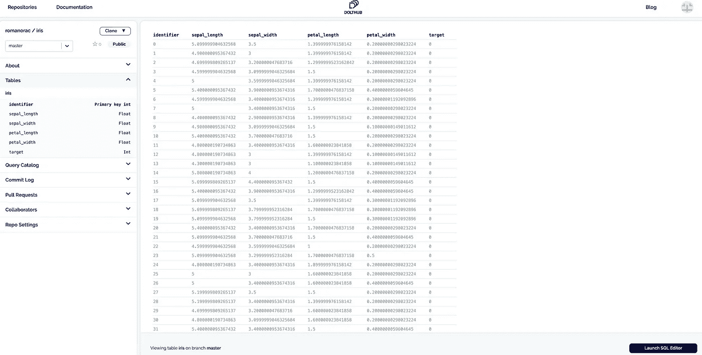
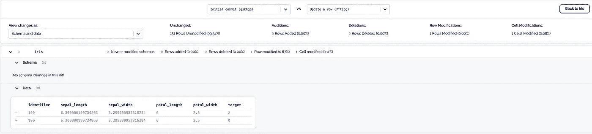

# 你仍然没有对数据使用版本控制吗？

> 原文：<https://towardsdatascience.com/are-you-still-not-using-version-control-for-data-d79a8b004c18?source=collection_archive---------24----------------------->

## 什么是数据的版本控制？该不该用？你可以去哪里试试？我做了调查所以你不用做了。



马库斯·斯皮斯克在 [Unsplash](https://unsplash.com/s/photos/backup?utm_source=unsplash&utm_medium=referral&utm_content=creditCopyText) 上的照片

最近，在一次公司会议上，我的一个同事问道:我们对数据使用某种版本控制吗？我惊讶地看了他一眼。你是指代码的版本控制吗？我的同事坚持说，不要数据。我从来没有听说过或想过数据的版本控制，但它让我思考，所以我就这个主题做了一些研究。在帖子的最后，我也分享一下我的看法。

**这里有几个你可能会感兴趣的链接:**

```
- [Labeling and Data Engineering for Conversational AI and Analytics](https://www.humanfirst.ai/)- [Data Science for Business Leaders](https://imp.i115008.net/c/2402645/880006/11298) [Course]- [Intro to Machine Learning with PyTorch](https://imp.i115008.net/c/2402645/788201/11298) [Course]- [Become a Growth Product Manager](https://imp.i115008.net/c/2402645/803127/11298) [Course]- [Deep Learning (Adaptive Computation and ML series)](https://amzn.to/3ncTG7D) [Ebook]- [Free skill tests for Data Scientists & Machine Learning Engineers](https://aigents.co/skills)
```

*上面的一些链接是附属链接，如果你通过它们购买，我会赚取佣金。请记住，我链接课程是因为它们的质量，而不是因为我从你的购买中获得的佣金。*

> 有没有产品提供数据的版本控制？有必要吗？让我们找出答案。

我在谷歌上输入任何改变游戏规则的产品想法，市场上已经有十个成熟的产品了——这是一个充满活力的时代。在谷歌上搜索数据的版本控制没有区别。引起我注意的产品是 [dolt](https://www.dolthub.com/) 。


Gif 来自 [giphy](https://giphy.com/gifs/earth-mindblown-kepler-Um3ljJl8jrnHy)

# dolt 是什么？

> Dolt 是 SQL 数据库中数据体验的真正 Git，为模式提供版本控制，为数据提供单元级控制，所有这些都针对协作进行了优化。使用 Dolt，您可以查看上次收到的数据与这次收到的数据之间的人类可读差异。在部署新数据之前，您可以很容易地看到意料之外的更新并解决问题。

作者说，它就像 Git，但不是数据。它是一个具有 Git 风格版本的开源 SQL 数据库。在从事数据科学项目时，我们自己对数据集进行版本化。很多时候我们不记得 v5 和 v6 有什么区别。当我们将代码提交到存储库时，Dolt 会存储提交日志，这样更容易返回并查看更改。

## 存储库托管在哪里？

就像 Github 之于 Git，DoltHub 之于 Dolt。 **DoltHub 只对在 DoltHub 上公开的数据集免费。**价格为每月 50 美元，用于托管私人存储库。

## 数据的版本控制有哪些用例？

这是一个百万美元的问题，我一直在问自己。作者声称，指导性用例是在互联网上共享数据。Dolt 允许您共享数据库，包括模式和视图，允许您删除所有用于传输数据的代码。

> DoltHub 允许你“先试后买”数据。您可以在 web 上运行 SQL 查询来查看数据是否符合您的需求。数据提供者甚至可以构建示例查询来指导消费者的探索。通过提交日志，您可以看到数据更新的频率。您可以看到谁更改了数据以及更改的原因。

# 怎么才能试试？



[https://www.dolthub.com/](https://www.dolthub.com/)

DoltHub 对公共数据集是免费的。您可以使用 Google 帐户登录。我创建了一个新的公共存储库，名为 iris(数据科学家知道我所说的数据集)。



带虹膜数据集的 Dolthub

然后，您可以像 wit Git 一样克隆存储库——这一切感觉如此熟悉。但是，在克隆 repo 之前，您需要安装 dolt CLI。开发人员考虑到这一点，所以他们将 install 命令放在 clone 旁边。

```
sudo curl -L https://github.com/liquidat
```



安装 dolt 后，您需要使用 CLI 工具登录，将密钥与您的帐户相关联。这将在 web 浏览器中打开页面。

```
dolt login
```

现在，您可以克隆存储库了。

```
dolt clone romanorac/iris
```

让我们放一些数据进去。我从 sklearn 上获取了虹膜数据集，将其转换为 pandas DataFrame 并保存为 CSV 格式。

```
import numpy as np
import pandas as pd
from sklearn import datasetsiris = datasets.load_iris()
df = pd.DataFrame(data=np.c_[iris['data'], iris['target']],
                  columns=iris['feature_names'] + ['target'])
df.target = df.target.astype(int)
df = df.reset_index()df = df.rename(
    columns={
        'index': 'identifier',
        'sepal length (cm)': 'sepal_length',
        'sepal width (cm)': 'sepal_width',
        'petal length (cm)': 'petal_length',
        'petal width (cm)': 'petal_width'
    })
df.to_csv('~/Downloads/iris/iris.csv', index=False)
```



要将 CSV 文件放入 Dolt，您需要创建 SQL 表。

```
dolt sql -q "create table iris ( identifier int, sepal_length float, sepal_width float,petal_length float ,petal_width float, target int, primary key (identifier) )"
```

然后，您只需导入该表。

```
dolt table import -u -pk=identifier iris iris.csv
```

导入表后，您需要添加文件，编写提交消息并将其推送到存储库——就像使用 Git 一样。

```
git add .
dolt commit -m "Initial commit"
dolt remote add origin romanorac/iris
dolt push origin master
```

让我们来看看数据在 DoltHub 中的样子。我们看到了熟悉的虹膜数据集。



现在，让我们改变一个虹膜样本，看看不同的行动。

```
dolt sql --query 'UPDATE iris SET target=0 where identifier = 100'git add .
dolt commit -m "Change sample 100"
dolt push origin master
```



我们换了 100 排的班级。DoltHub 很好地将它可视化。

# 我的看法

作为一名数据科学家，我知道管理多个版本的数据集可能会很麻烦。尤其是对于已经在生产中的模型和多个数据科学家正在研究的模型。在这里我看到了 Dolt 的潜力。diff 功能看起来对较小的数据集很有用，但我不确定它对较大的数据集有什么帮助，因为在较大的数据集里，每一行都是变化的。我还必须用更大的数据集(几千兆字节的数据)对 Dolt 进行压力测试。它会随着时间变慢吗？

我认为 Dolt 和 DoltHub 的真实用例是共享数据。出售数据的公司可以记录每一个变化，因此客户可以透明地观察变化。DoltHub 还在冠状病毒流行期间展示了它的可用性，因为您可以使用分支管理具有相同模式的不同质量的提要。

# 在你走之前

在 [Twitter](https://twitter.com/romanorac) 上关注我，在那里我定期[发布关于数据科学和机器学习的](https://twitter.com/romanorac/status/1328952374447267843)。


由[考特尼·海杰](https://unsplash.com/@cmhedger?utm_source=medium&utm_medium=referral)在 [Unsplash](https://unsplash.com/?utm_source=medium&utm_medium=referral) 拍摄的照片