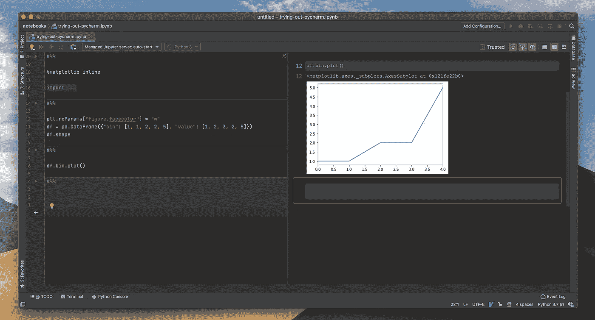
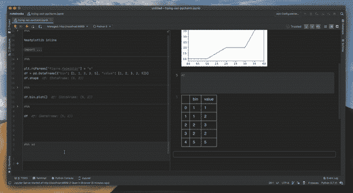
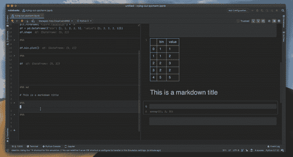
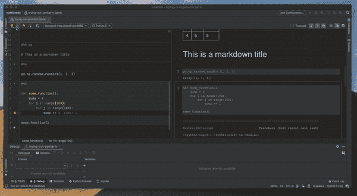
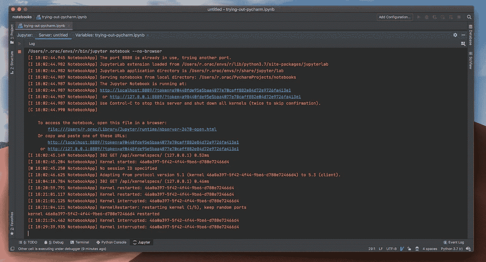

# 你还在用 JupyterLab 吗？

> 原文：<https://towardsdatascience.com/are-you-still-using-jupyterlab-ce1a4339c0a9?source=collection_archive---------2----------------------->

## 数据科学城推出了一款新的高端产品。它有超强的编码辅助，调试等等……值得切换吗？


约书亚·索蒂诺在 [Unsplash](https://unsplash.com?utm_source=medium&utm_medium=referral) 上拍摄的照片

我喜欢它们或者讨厌它们，有一件事是肯定的——Jupyter 笔记本已经成为从事数据科学的事实标准。虽然这产品不错，但也有它的缺点。JupyterLab 解决了其中的许多问题，增加了**选项卡**、**扩展管理器**、**主题**和**快捷方式编辑器**。作为一个重度 JupyterLabs 用户，我 80%的时间花在 JupyterLab 上(另外 20%花在 SQL 编辑器上)，所以编辑器必须是好的。有更好的选择吗？

> Jupyter 笔记本已经成为从事数据科学的事实标准

**这里有几个你可能会感兴趣的链接:**

```
- [Complete your Python analyses 10x faster with Mito](https://trymito.io/) [Product]- [Free skill tests for Data Scientists & ML Engineers](https://aigents.co/skills) [Test]- [All New Self-Driving Car Engineer Nanodegree](https://imp.i115008.net/c/2402645/1116216/11298)[Course]
```

你愿意阅读更多这样的文章吗？如果是这样，你可以点击上面的任何链接来支持我。其中一些是附属链接，但你不需要购买任何东西。

# 认识一下 PyCharm 的笔记本



PyCharm 中的 Jupyter 笔记本支持。编辑器在左边，演示视图在右边。

PyCharm 最近获得了另一个超级能力——[对 Jupyter 笔记本的原生支持](https://www.jetbrains.com/help/pycharm/jupyter-notebook-support.html)。这使得 PyCharm 处于与 JupyterLab 竞争的最前线。但是有一个问题——**Jupyter 笔记本支持只在 PyCharm 的专业版中提供，**但是你可以免费试用。

# 主要特点是什么？

PyCharm 将**编辑和查看结果分成两个独立的窗格**(看上面的图片)，而在 Jupyter 笔记本中，我们得到了两者的混合。当编写 markdown 或 LaTeX 方程时，这种分离非常有效，因为它可以实时呈现。



编写 markdown 时的实时预览

PyCharm 的杀手级特性是**编码辅助**。虽然 JupyterLab 有某种代码补全功能，但它很快就会丢失。代码完成只需与 PyCharm 一起工作。它显示了所有可用的方法，该方法采用了哪些参数，并突出显示了错误。这就是 PyCharm 领先 JupyterLab 多年的地方。



使用 PyCharm 完成代码

> PyCharm 笔记本的杀手锏是编码辅助

PyCharm 远胜于 JupyterLab 的另一个领域是调试。祝 JupyterLab 调试方法好运。我试过 pdb 和 ipdb 包，但感觉很笨重。PyCharm 有一个优秀的调试查看器，您可以在其中列出对象并观察其变量的所有值。



在 PyCharm 中调试笔记本

我也喜欢开箱即用的代码格式化和强大的扩展支持——不需要像 JupyterLab 那样安装代码格式化扩展。PyCharm 还有一个很棒的扩展 IdeaVim，它比当前 JupyterLab 的 Vim 扩展更好。这主要是因为浏览器的限制，比如复制粘贴和 ctrl+n 和 ctrl + p 快捷键——Vim 用户会知道我在说什么。

# 它在幕后是如何工作的？

PyCharm 只是在端口 8889 上启动自己的 Jupyter 笔记本服务器，这样就不会与已经运行的 Jupyter 服务器发生冲突。

```
jupyter notebook --no-browser
```



# 如何试用 PyCharm 的笔记本？

PyCharm 的专业版有 1 个月的免费试用期，任何人都可以试用。如果你是学生，JetBrains(py charm 背后的公司)为一些大学提供免费的教育许可。

# 值得转行吗？

虽然毫无疑问 PyCharm 笔记本支持优于 JupyterLab，但它也不是免费的。我要说，如果你把大部分时间都花在编辑 Jupyter 笔记本上，那还是值得一试的。询问你的公司或大学是否能给你提供许可证。决不，我会说 PyCharm Jupyter 笔记本支持是一个必须使用的工具。我在 JupyterLab 工作多年，效率很高。

> 我在 JupyterLab 工作多年，效率很高

# 在你走之前

在[推特](https://twitter.com/romanorac)上关注我，在那里我定期[发关于数据科学和机器学习的推特](https://twitter.com/romanorac/status/1328952374447267843)。


照片由[Courtney hedge](https://unsplash.com/@cmhedger?utm_source=medium&utm_medium=referral)在 [Unsplash](https://unsplash.com/?utm_source=medium&utm_medium=referral) 上拍摄