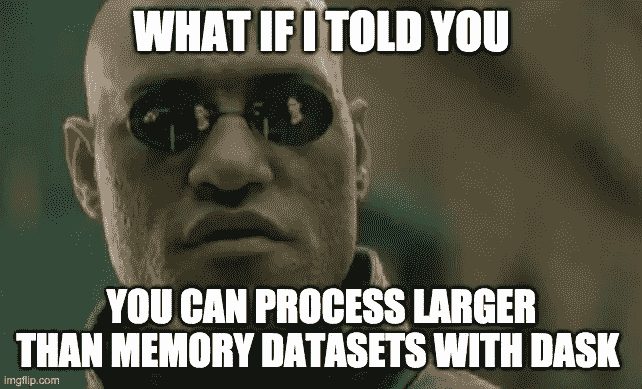
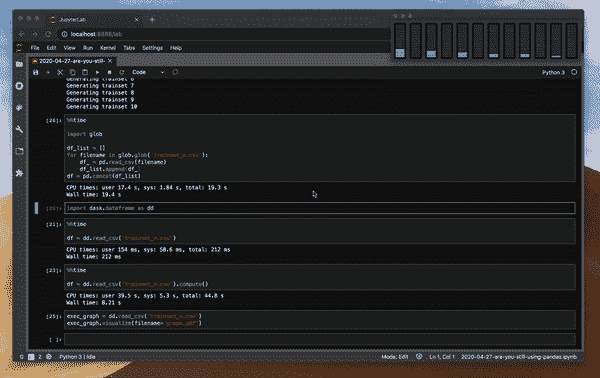
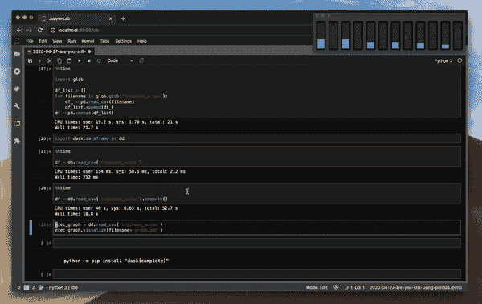
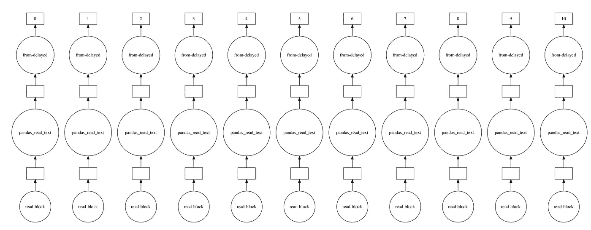

# 你还在用熊猫做大数据吗？

> 原文：<https://towardsdatascience.com/are-you-still-using-pandas-for-big-data-12788018ba1a?source=collection_archive---------1----------------------->

## Pandas 不支持多重处理，处理大数据集时速度很慢。有一个更好的工具可以让这些 CPU 内核发挥作用！


克里斯·库里在 [Unsplash](https://unsplash.com/s/photos/panda?utm_source=unsplash&utm_medium=referral&utm_content=creditCopyText) 上的照片

谈到[探索性数据分析](/exploratory-data-analysis-with-pandas-508a5e8a5964)，Pandas 是最好的工具之一。但这并不意味着它是每项任务的最佳工具，比如大数据处理。我花了太多时间等待熊猫读取一堆文件，或者聚合它们并计算特征。

最近，我花时间找到了一个更好的工具，它使我更新了我的数据处理管道。我使用这个工具处理大量数据——比如读取多个 10gb 数据的文件，对它们应用过滤器并进行聚合。当我完成繁重的处理后，我将结果保存到一个较小的“熊猫友好”CSV 文件中，并继续对熊猫进行探索性数据分析。

**这里有几个你可能会感兴趣的链接:**

```
- [Complete your Python analyses 10x faster with Mito](https://trymito.io/) [Product]- [Free skill tests for Data Scientists & ML Engineers](https://aigents.co/skills) [Test]- [All New Self-Driving Car Engineer Nanodegree](https://imp.i115008.net/c/2402645/1116216/11298)[Course]
```

*你愿意多看一些这样的文章吗？如果是这样，你可以点击上面的任何链接来支持我。其中一些是附属链接，但你不需要购买任何东西。*

# 见见达斯克


来自 [Dask **的 dask 标志。组织**](https://dask.org/)

Dask 为分析提供了先进的并行性，为您喜爱的工具提供了大规模性能。这包括 numpy，熊猫和 sklearn。**它是开源的，可以免费获得。**它使用现有的 Python APIs 和数据结构，使得在 Dask 支持的等价物之间切换变得容易。

> Dask 让简单的事情变得简单，让复杂的事情变得可能

## 熊猫大战达斯克

我可以继续描述 Dask，因为它有如此多的特性，但是，让我们看一个实际的例子。在工作中，我通常会收到一堆需要分析的文件。让我们模拟我的工作日，创建 10 个 100K 条目的文件(每个文件有 196 MB)。

```
from sklearn.datasets import make_classification
**import** pandas **as** pdfor i in range(1, 11):
    print('Generating trainset %d' % i)
    x, y = make_classification(n_samples=100_000, n_features=100)
    df = pd.DataFrame(data=x)
    df['y'] = y
    df.to_csv('trainset_%d.csv' % i, index=False)
```

现在，让我们一起阅读那些有熊猫的文件，并测量时间。Pandas 没有本地 glob 支持，所以我们需要循环读取文件。

```
%%timeimport globdf_list = []
for filename in glob.glob('trainset_*.csv'):
    df_ = pd.read_csv(filename)
    df_list.append(df_)
df = pd.concat(df_list)
df.shape
```

熊猫读文件花了 16 秒。

```
CPU times: user 14.6 s, sys: 1.29 s, total: 15.9 s
Wall time: 16 s
```

现在，想象一下如果这些文件大 100 倍——你甚至不能用熊猫来读它们。



用 [imgflip](https://imgflip.com/memegenerator) 创建的迷因

Dask 可以通过将数据分成块并指定任务链来处理不适合内存的数据。让我们测量一下 Dask 加载这些文件需要多长时间。

```
import dask.dataframe as dd%%time
df = dd.read_csv('trainset_*.csv')CPU times: user 154 ms, sys: 58.6 ms, total: 212 ms
Wall time: 212 ms
```

Dask 需要 154 毫秒！这怎么可能呢？嗯，不是的。 Dask 有延迟执行范式。它只在需要的时候计算东西。我们定义执行图，这样 Dask 就可以优化任务的执行。让我们重复这个实验——还要注意 Dask 的 read_csv 函数本身就接受 glob。

```
%%timedf = dd.read_csv('trainset_*.csv').compute()CPU times: user 39.5 s, sys: 5.3 s, total: 44.8 s
Wall time: 8.21 s
```

compute 函数强制 Dask 返回结果。Dask 读取文件的速度是熊猫的两倍。

> Dask 原生缩放 Python

## 熊猫与 Dask CPU 使用率

Dask 使用您购买的所有内核吗？我们来比较一下熊猫和 Dask 在读取文件时的 CPU 使用情况——代码同上。



读取文件时熊猫的 CPU 使用率



读取文件时 Dask 的 CPU 使用情况

在上面的屏幕记录中，当读取文件时，pandas 和 Dask 在多重处理上的差异是显而易见的。

# 幕后发生了什么？

Dask 的数据帧由多个熊猫数据帧组成，这些数据帧通过索引进行拆分。当我们用 Dask 执行 read_csv 时，多个进程读取一个文件。

我们甚至可以可视化执行图。

```
exec_graph = dd.read_csv('trainset_*.csv')
exec_graph.visualize()
```



读取多个文件时的 Dask 执行图。

# Dask 的缺点

你可能会想，如果达斯克这么伟大，为什么不一起抛弃熊猫呢？嗯，没那么简单。只有熊猫的某些功能被移植到 Dask。其中一些很难并行化，比如对值进行排序和对未排序的列设置索引。Dask 不是灵丹妙药——建议只对不适合主存的数据集使用 Dask。由于 Dask 是建立在熊猫的基础上的，所以在熊猫中慢的操作在 Dask 中也会慢下来。就像我之前提到的，Dask 是数据管道过程中的一个有用的工具，但是它不能取代其他库。

> **Dask 仅推荐用于不适合主存的数据集**

# 如何安装 Dask

要安装 Dask，只需运行:

```
python -m pip install "dask[complete]"
```

这将安装整个 Dask 库。

# 结论

在这篇博文中，我只触及了 Dask 库的皮毛。如果你想更深入地研究，请查看令人惊叹的 [Dask 教程](https://github.com/dask/dask-tutorial)和 [Dask 的数据框架](https://docs.dask.org/en/latest/dataframe.html)文档。对 Dask 支持哪些 DataFrame 函数感兴趣？检查[数据帧 API](https://docs.dask.org/en/latest/dataframe-api.html) 。

下载 [Jupyter 笔记本](https://romanorac.github.io/assets/notebooks/2020-04-27-are-you-still-using-pandas.ipynb)跟随示例。

# 在你走之前

在 [Twitter](https://twitter.com/romanorac) 上关注我，在那里我定期[发布关于数据科学和机器学习的](https://twitter.com/romanorac/status/1328952374447267843)。


由[考特尼·海杰](https://unsplash.com/@cmhedger?utm_source=medium&utm_medium=referral)在 [Unsplash](https://unsplash.com/?utm_source=medium&utm_medium=referral) 拍摄的照片