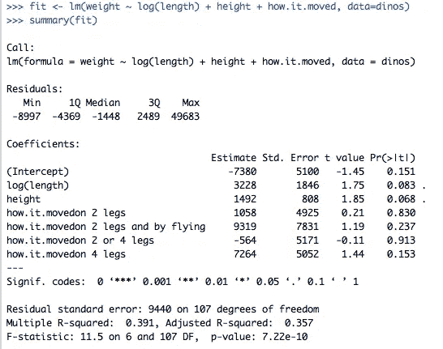
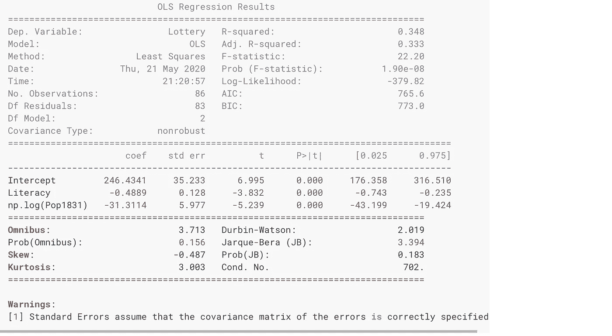

# 你还在用 sklearn 做回归分析吗？

> 原文：<https://towardsdatascience.com/are-you-still-using-sklearn-for-regression-analysis-fb06bb06ce96?source=collection_archive---------24----------------------->

## 当谈到 Python 中的经典机器学习算法时，sklearn 是第一个要去的包——还有其他你应该知道的。


安东·达利斯在 [Unsplash](https://unsplash.com?utm_source=medium&utm_medium=referral) 上的照片

对于大多数数据科学家来说，当谈到 Python 中的经典机器学习算法时，sklearn 是第一个首选包。但是这并不意味着没有其他优秀的软件包可以用来建模。我在本文中展示的软件包主要与回归分析有关，许多数据科学家不合理地将回归分析与简单化的建模联系起来。

**这里有几个你可能会感兴趣的链接:**

```
- [Labeling and Data Engineering for Conversational AI and Analytics](https://www.humanfirst.ai/)- [Data Science for Business Leaders](https://imp.i115008.net/c/2402645/880006/11298) [Course]- [Intro to Machine Learning with PyTorch](https://imp.i115008.net/c/2402645/788201/11298) [Course]- [Become a Growth Product Manager](https://imp.i115008.net/c/2402645/803127/11298) [Course]- [Deep Learning (Adaptive Computation and ML series)](https://amzn.to/3ncTG7D) [Ebook]- [Free skill tests for Data Scientists & Machine Learning Engineers](https://aigents.co/skills)
```

上面的一些链接是附属链接，如果你通过它们进行购买，我会赚取佣金。请记住，我链接课程是因为它们的质量，而不是因为我从你的购买中获得的佣金。

> 大多数认为他们需要高级人工智能/人工智能的公司实际上只需要对清理后的数据进行线性回归。罗宾·汉森发推文。

虽然我在上面的推文中感觉到了讽刺，但掌握线性回归的主要假设远远不是简单的(例如，多重共线性，多元正态性，同方差性等)。).许多数据科学家不知道的另一件事是，线性回归和逻辑回归是同一算法家族的一部分——广义线性模型(GLM)。

# 认识统计模型

我一直很喜欢 R 在训练一个回归模型后给你一个详细的输出。一个提供类似输出的 Python 包是[stats models](http://statsmodels)——一个用于估计许多不同统计模型，以及进行统计测试和统计数据探索的包。



r 中训练的回归模型的详细摘要。

在下图中，我们可以观察到用 statsmodels 训练的回归模型的摘要。看起来和 r 里面的差不多，甚至还会显示警告，这是相对于 sklearn 的另一个优势。



使用 statsmodels 训练的回归模型的摘要。

# 广义线性模型

如上所述，逻辑回归和线性回归是广义线性模型的一部分。GLM 通过链接函数将线性模型与响应变量相关联，并允许每个测量值的方差大小是其预测值的函数，从而推广了线性回归。广义线性模型由约翰·内尔德和罗伯特·威德伯恩提出，作为一种统一各种其他统计模型的方式，包括线性回归、逻辑回归和泊松回归。

想更多地了解 GLM，请听一听伟大的吴恩达的演讲:

吴恩达关于广义线性模型的讲座

GLM 让你使用概率分布作为建模的基础。让我们看一个使用 statsmodels 的逻辑回归的例子:

```
import statsmodels.api as smmodel = sm.GLM(y_train, x_train, family=sm.families.Binomial(link=sm.families.links.logit()))
```

在上面的例子中，逻辑回归是用二项式概率分布和 Logit 链接函数定义的。注意，y_train 是一个带有目标变量的数组，x_train 表示一个特征数组。

默认情况下，statsmodels 中不添加截距列(1 的列)。我们可以添加以下内容:

```
sm.add_constant(x_train)
```

要用线性回归(普通最小二乘回归)代替逻辑回归，我们只需要改变家族分布:

```
model = sm.GLM(y_train, x_train, family=sm.families.Gaussian(link=sm.families.links.identity()))
```

另一种常用的回归是泊松回归，它假设目标变量具有泊松分布。它被用来模拟计数变量，比如在学校患感冒的人数。同样，使用 statsmodels，我们只需要更改家族分布:

```
model = sm.GLM(y_train, x_train, family=sm.families.Poisson())
```

虽然 sklearn 中有[线性回归](https://scikit-learn.org/stable/modules/generated/sklearn.linear_model.LinearRegression.html)、[逻辑回归](https://scikit-learn.org/stable/modules/generated/sklearn.linear_model.LogisticRegression.html)和[泊松回归](https://scikit-learn.org/dev/modules/generated/sklearn.linear_model.PoissonRegressor.html#sklearn.linear_model.PoissonRegressor)，但我真的很喜欢 statsmodels API 的实现方式。它还提供了许多定制，我将在下一篇关于 statsmodels 的文章中谈到这些。

# 下降趋势

在 sklearn 上使用 statsmodels 的一个缺点是它不支持稀疏矩阵。这使得用许多稀疏特征来训练模型是不可行的，例如用单词包方法转换的文本特征。

sklearn 文档优于 statsmodels 文档。

总的来说，sklearn 似乎比 statsmodels 更优化。

# 参考

*   [1] [广义线性模型](https://en.wikipedia.org/wiki/Generalized_linear_model)

# 在你走之前

在 [Twitter](https://twitter.com/romanorac) 上关注我，在那里我定期[发布关于数据科学和机器学习的](https://twitter.com/romanorac/status/1328952374447267843)。


由[考特尼·海杰](https://unsplash.com/@cmhedger?utm_source=medium&utm_medium=referral)在 [Unsplash](https://unsplash.com/?utm_source=medium&utm_medium=referral) 拍摄的照片