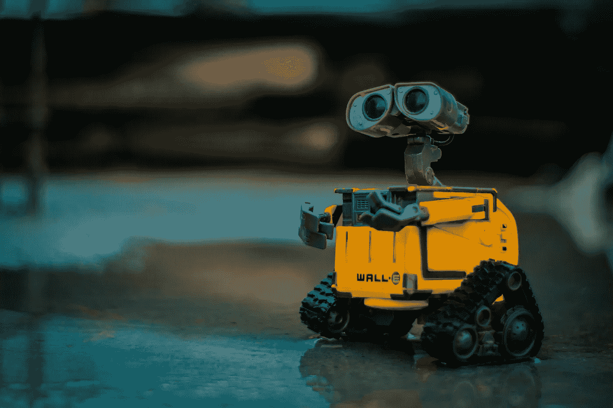
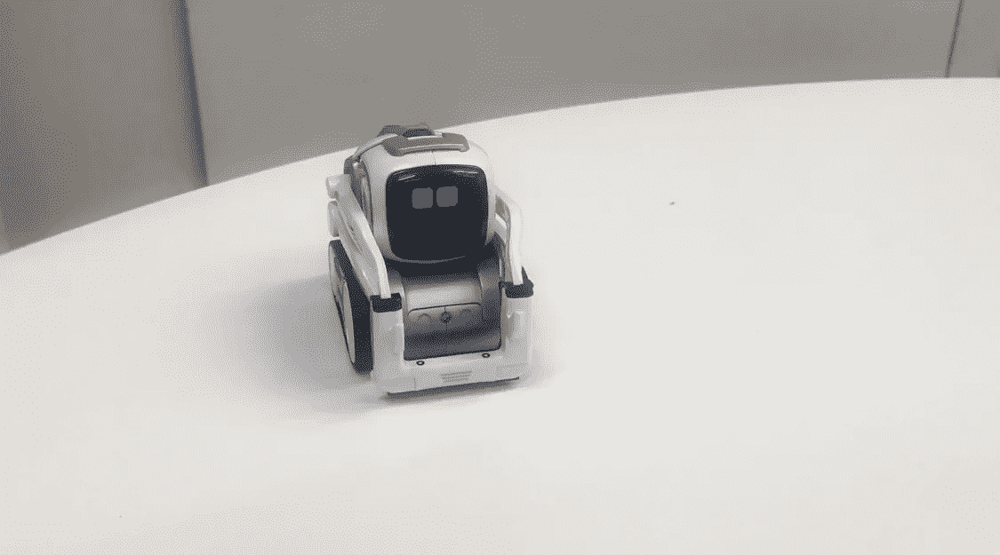
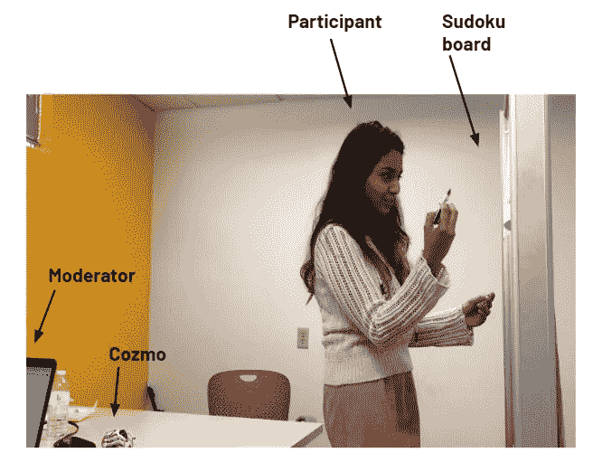
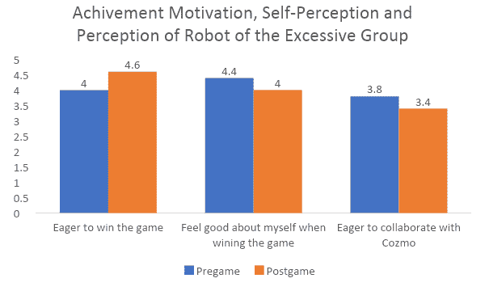
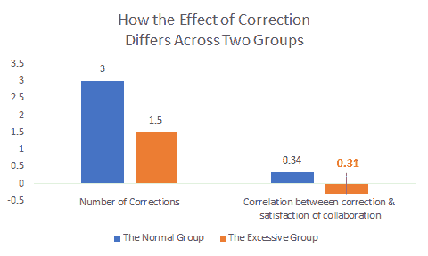
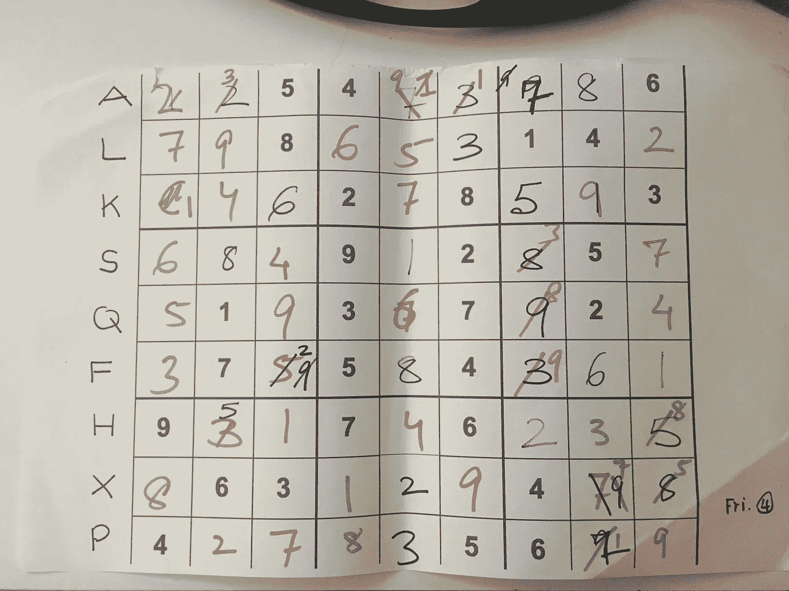
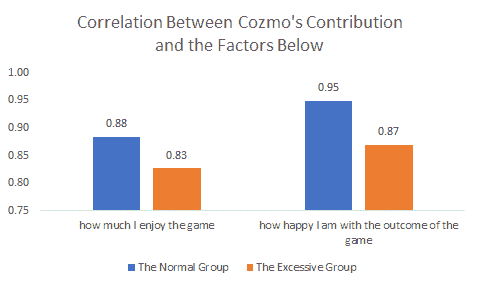
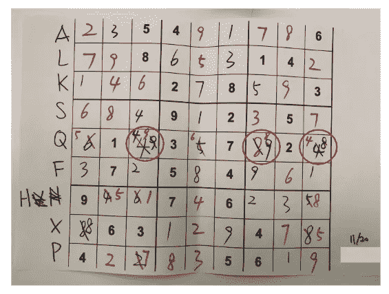

# 当你的机器人队友完成更多工作时，你会感到不安吗？

> 原文：<https://towardsdatascience.com/are-you-upset-when-your-robot-teammate-gets-more-work-done-202b5184523e?source=collection_archive---------42----------------------->

## 与机器人合作测量人类的成就感

列宁·艾斯特拉达在 [Unsplash](https://unsplash.com/s/photos/robot?utm_source=unsplash&utm_medium=referral&utm_content=creditCopyText) 上的照片

作为一名受人类心理学好奇心驱使的研究人员，我一直想探索更多关于用户的自我感知和成就感。在卡内基梅隆大学学习人机交互课程期间，我设计了一个项目，并带领另外两名队友探索**人机合作如何影响人类的成就感**。

> 在整个研究过程中，我发现当机器人做的工作比他们多得多时，人们对自己的自我表现不满意，尤其是如果机器人纠正了他们！

# 动机:为什么是成就感？为什么要共享任务？

因为人类是复杂的…机器人可以帮助我们更快更容易地完成工作，但当机器人做得比我们更多更好时，我们是否还会自我感觉良好，就像我们自己做时一样(即使我们对机器人的工作结果感到满意)？

# 假设

**在人-机器人协作场景中，机器人参与程度的提高会导致人类成就感的降低。**

# 研究设计

**2x1 研究**:每个参与者和一个 Cozmo 组成的团队玩一个 9x9 的数独游戏。在游戏过程中，参与者和科兹莫轮流填写答案，每轮持续 30 秒。轮流是为了确保他们都有平等的机会做出贡献，他们可以根据需要使用尽可能多的回合来完成游戏。由于 Cozmo 能力有限，其答案由语音宣布，由参与者填写。答案用颜色编码以区分玩家，整个研究过程被录像。

**条件**:

1.  正常情况:Cozmo 作为参与者输入了相同数量的答案
2.  过度条件:Cozmo 作为参与者输入了两倍的输入数。

**独立变量:**coz mo 的输入/转数

**因变量:**参与者的成就感

**测量**:

1.  定量研究——调查(预测试调查和赛后调查)；
2.  定性研究——赛后访谈、观察。

# 测量人类的成就感

成就感被定义为“**当个人受到挑战并意识到结果将反映他们个人的成功或失败时，他们会被激励去实现目标**”(Smith，R. L .，2015)。在设计调查时，我“借鉴”了一些心理测量方法:

*   need(N)——非常想达到某个目的；
*   成功的希望(HOS)——在成功实现之前期待成功；
*   成功感受(SF)——成功后的良好感受；

**赛前调查**

*人口统计:*

1.  你多大了？
2.  你的性别是？
3.  你想获得哪个教育学位？
4.  你以前和机器人交流过吗？

请用 1-5 分来评定您对以下陈述的同意或不同意程度(1-完全不同意，5-完全同意)。

*熟练度:*

1.  我精通数独。

*成就动机:*

1.  我渴望赢得这场比赛。
2.  我渴望看到我在比赛中的表现。
3.  如果我赢了这场比赛，我会自我感觉良好。

*关于与机器人合作的感知*

1.  我渴望在游戏中与 Cozmo 合作。

**赛后调查**

请用 1-5 分来评定您对以下陈述的同意或不同意程度(1-完全不同意，5-完全同意)。

成就感:

1.  这个游戏对我来说很有挑战性。
2.  我喜欢这项运动的挑战。
3.  我对比赛的结果很满意。

成就动机的变化:

1.  如果我下次再玩，我会渴望赢得这场比赛。
2.  赛后自我感觉良好。
3.  我认为游戏结果反映了我对游戏的熟练程度。

对与机器人合作的看法

1.  我对科兹莫在比赛中的贡献感到满意。
2.  我对我和科兹莫在比赛中的配合很满意。
3.  如果下次再玩的话，我很想和 Cozmo 再次合作。
4.  游戏中你会如何在 Cozmo 的贡献和你的贡献之间分配 10 分？
5.  如果 Cozmo 纠正了你在游戏中的输入，你对此作何感想？

除了调查之外，**半结构式访谈**和**观察**也补充了我的研究发现。

# 激动人心的部分…我发现了什么？

以下发现基于 16 名在校园招募的参与者的结果。性别分布和游戏水平分布是相等的。与机器人互动体验的比例为 9(是):7(否)。

## 一.关于成就

> 当人们需要帮助时，他们会重视机器人的输入。但是当机器人做了这个人本来可以做的那部分工作时，他/她的成就感很可能会降低。

在赛前和赛后比较以下 3 个要素时，正常组无显著性差异(P>0.05)。

然而，过度组明显增加了赢得游戏的欲望，降低了自我认知，减少了合作的欲望(P <0.05), which showed that **他们在游戏后变得更具竞争性，他们不像以前那样自我感觉良好，他们也不那么渴望与 Cozmo** 合作。

这些发现得到了以下观察到的行为的支持:

*   轮流抢着写更多的答案😣
*   甚至在回合即将结束的时候，匆忙写下最后一个答案🤯
*   预测了科兹莫的答案，表明他们知道答案😒
*   冲着科兹莫大喊“站住！!"😫
*   发誓“啊，XXCK！Cozmo！”🤬

## 当机器人纠正人类时会发生什么…

在正常组中，Cozmo 纠正参与者越多，他们对自己的合作越满意。在过度组中，当 Cozmo 纠正他们时，参与者不太满意。**当机器人以一种流畅的方式纠正人们时，这是完全可以接受的，甚至是有帮助的。但是当机器人本身具有攻击性时，人们会强烈地消极地看待纠正。**

一个参与者的黑板上写满了更正

> “我很沮丧，因为科兹莫不喜欢我的答案，他几乎纠正了一切。”
> 
> “我觉得自己不够聪明，无法独自解决这个游戏”

当有人有机会纠正一个机器人时(我们在遥控 Cozmo 时犯了一个错误……)，这个人说**“那很有趣。那真的很有趣。”**🤣— **这向我们展示了一个人的自信可以通过纠正一个机器人来重建**。

## 二。关于信任

> **在人机协作任务中，人们依赖机器人的贡献。但他们的信任可能会随着时间的推移而建立起来。**

## 科兹莫是一个令人满意的队友吗？

两组人都认可 Cozmo 的贡献，Cozmo 贡献越多，越多人对游戏结果感到高兴。

## 人们信任科兹莫的能力吗？

总的来说，当 Cozmo 纠正参与者的答案时，有两种反应。

首先，一些参与者立即信任了 Cozmo。

> “我会盲目地信任他，因为他是一个机器人，我会假设他有完美的程序来解决世界上任何数独难题。”

其次，对于其他参与者来说，信任需要时间来建立。

> “起初我不相信，但这些数字是合理的，所以我知道他是对的”

一名参与者将科兹莫的答案更正回他的答案

# 限制

一如既往，还是有局限性的。

首先，轮流设置很棘手。它给参与者增加了更多的竞争氛围，但也可能会打断他们的思维过程，就像他们在玩数独时通常会做的那样——不过我确实认为利大于弊。在真正的人-机器人协作任务中，花费的时间是一个重要的衡量标准，因为我们希望优化成本和效率。

第二，让参与者填写 Cozmo 的答案需要更多的认知努力，这对他们来说更困难。

第三，我们需要一个更加多样化的小组和大量的参与者来获得有统计学意义的发现。

## 参考

史密斯，R. L. *《成就动机的情境测量:对咨询研究的意义》* (2015) *。*