# 你用够优惠券了吗？

> 原文：<https://towardsdatascience.com/are-you-using-enough-coupons-d18c2d18dd5f?source=collection_archive---------10----------------------->

## 建立模型来预测优惠券的兑现和设计更好的促销活动

图片取自[giphy.com](https://giphy.com/gifs/memecandy-Lqs62MVUrUWAC3R9TL)

我喜欢好的销售。在网上商店的收银台点击购买按钮之前，看到总价打折是如此令人满意。此外，我定期购买家庭用品或我的狗和猫的药物和补充剂，我需要定期获得更多的折扣。我们会收到关于特别优惠和优惠券的通知和电子邮件，我们有时会等待交易来进行大额采购和购买礼物，如黑色星期五。

优惠券营销策略有很多好处。优惠券吸引新客户，重新激活老客户。使用优惠券的促销活动可以吸引客户尝试新产品或相关产品并购买更多产品，从而创造非常有效的广告机会。[例如，亚马逊 2019 年的 Prime Day 的销售总额超过了 2018 年黑色星期五和网络星期一的总和。](https://www.inc.com/jason-aten/amazon-just-announced-prime-day-data-staggering-numbers-beat-black-friday-cyber-monday-combined.html)

为了衡量促销活动是否成功以及如何改进，调查优惠券的兑现情况以及影响优惠券兑现行为的因素非常重要。在这篇文章中，我想介绍我的项目对预测优惠券赎回使用机器学习技术。通过构建模型，我们还可以了解哪些因素会影响客户兑换优惠券，以及我们是否可以提出一些建议来设计更好的促销活动。

这篇文章将主要集中在总结这个过程——我如何以及为什么选择在每个步骤中使用的特定方法和技术，以及我如何解释建模结果。

# 关于数据集

以下是该网站的部分描述:

> ABC 促销活动通过各种渠道共享，包括电子邮件、通知等。许多此类活动包括为特定产品/产品系列提供的优惠券折扣。零售商希望能够预测客户是否会兑现跨渠道收到的优惠券，这将使零售商的营销团队能够准确地设计优惠券结构，并制定更精确和更有针对性的营销策略。
> 
> 此问题中的可用数据包含以下信息，包括活动样本和先前活动中使用的优惠券的详细信息-
> 
> 用户人口统计详细信息
> 
> 活动和优惠券详情
> 
> 产品详情
> 
> 以前的交易
> 
> 根据过去 18 次活动的交易和绩效数据，预测每个优惠券和客户组合的测试集中接下来 10 次活动的概率，客户是否会兑现优惠券？

**请注意，我只使用了包含 18 个活动信息的训练数据集，将该数据集分为两组——训练集和测试集，因为它具有已知的目标变量值。**

数据从 [Kaggle](https://www.kaggle.com/vasudeva009/predicting-coupon-redemption) 获得，由 6 个表格组成。

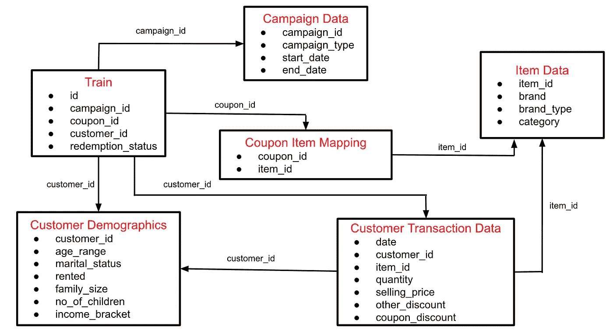

来自 [Kaggle](https://www.kaggle.com/vasudeva009/predicting-coupon-redemption) 的数据库模式

目标变量是*序列*中的 *redemption_status* ，预测变量从其余特征中创建。该网站描述的最初任务是使用训练数据集训练模型，这是大多数功能不言自明的结果，所以我只想说明其中一些功能并不明显。但是你可以访问[我的 GitHub 库](https://github.com/YeonjooSmith/CouponRedemption)或者[ka ggle 站点](https://www.kaggle.com/vasudeva009/predicting-coupon-redemption)来获得每个特性的定义。*活动数据*中的特征 *campaign_type* 为匿名活动类型(X 或 Y)；例如，像半年一次或一年一次的定期销售和像季节性活动这样的不定期销售可以归类为 X 类型，而其他不一致的活动可以归类为 Y 类型。客户人口统计表中的 *income_bracket* 表示一个标签编码的收入等级，较高的收入对应于较高的数字。

# 数据理解

我在这些数据中发现了三大特征。

首先，目标变量*、redemption_statuse、*是分类变量，0(否)或 1(是)用于息票兑现，因此这是一个分类问题。

第二，目标变量不平衡。用数据准备步骤前的原始数据，赎回率为 0.93%！很难为一小部分人正确训练模型，因为预测 100%的“未赎回”将产生超过 99%的准确性。

第三，表格需要仔细合并，需要创建更多的功能。上面的模式显示它是一个关系数据库，除了客户交易数据之外，所有的表都有一个主键，这个主键是表中每个数据点的惟一值。表中包含“id”的模式的列表中的第一个功能是主键，但是客户事务数据没有唯一的事务 id。因此，为了使用此表中的数据，需要按关键字聚合数据，例如使用客户人口统计数据和客户交易数据中的 customer_id 的每个客户使用的优惠券折扣数。

# 数据准备

我不会重复我所经历的每个数据准备过程，但我会强调主要步骤。你可以访问我的 GitHub 库来查看整个过程和代码。

为了处理不平衡类问题，实现了 SMOTE(综合少数过采样技术)重采样方法。它在训练数据中生成了更多的正类(1，“已兑换”)数据点，这些数据点具有与原始数据点“相似”的属性。由于我们正在干预模型的训练方式，过采样数据的大小应该尽可能小。在图 1 中，当少数类与多数类之比大于 0.33 时，ROC 曲线下面积(AUC)值彼此相似，这是为重采样过程选择的。

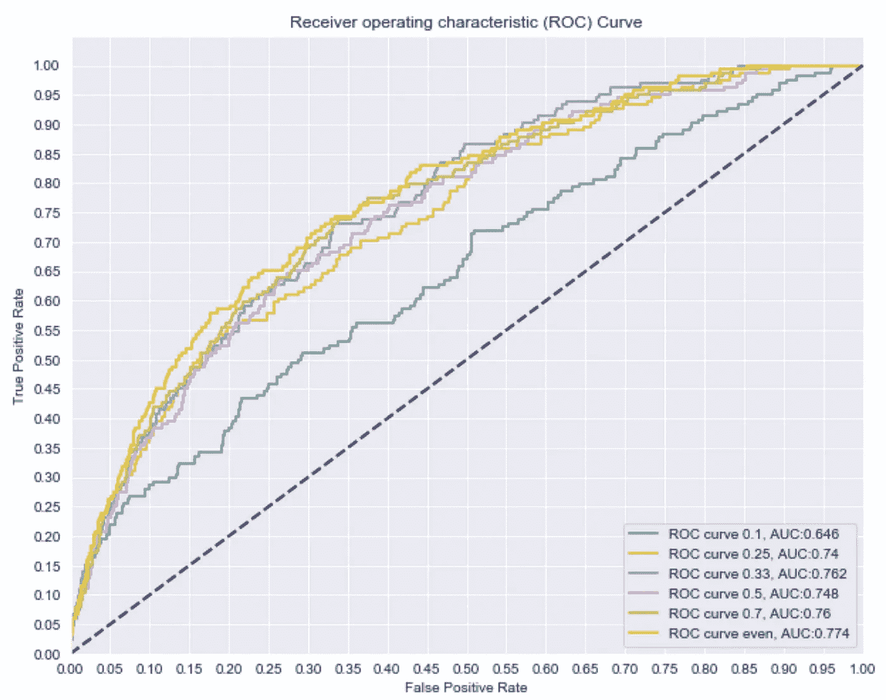

图一。测试数据集预测的 ROC 曲线。训练数据集随着少数类(1，赎回)与多数类(0，未赎回)的不同比率而变化。曲线离直线越远(AUC 值越大)，模型拟合越好。

注意，SMOTE 方法很容易使用`imblearn`包在 python 中实现。

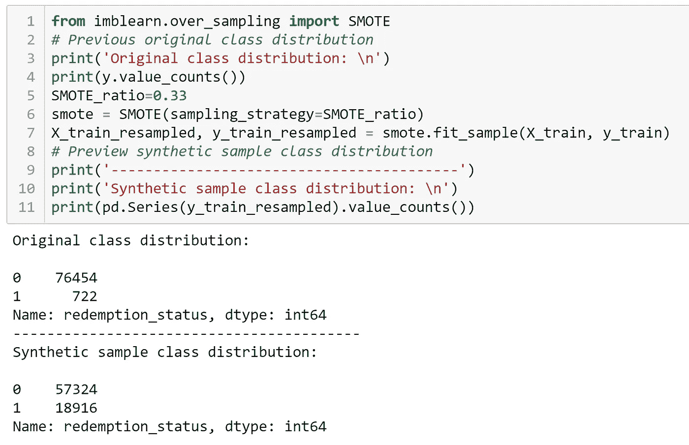

图 2。SMOTE 方法的示例代码。在 SMOTE_ratio = 0.33 的情况下，两个类别之间的比率变为大约 1:3。

此外，数据准备的最大部分之一是组合来自多个表的信息的特征工程。例如，如果我们要从客户交易数据中获得关于商品的信息，我们需要通过 *item_id* 聚集交易表。我们可以使用`pandas.pivot_table`功能创建列表中描述的新特征。

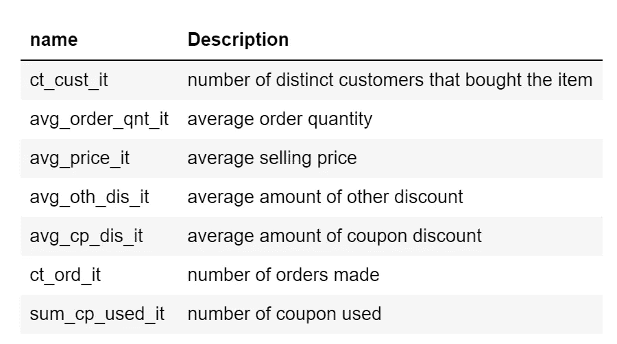

表 1。通过聚合客户交易数据中的列创建的新功能。

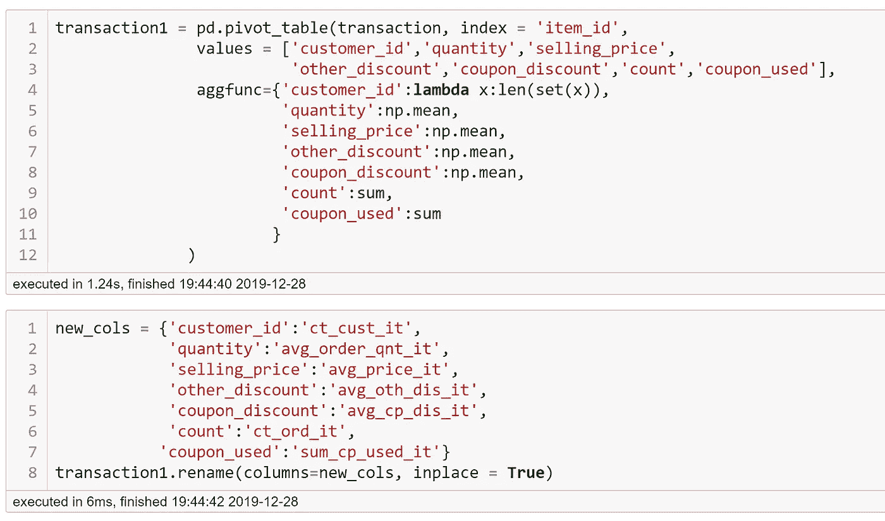

图 3。由`pivotting tables`汇总数据的示例代码

例如，我无法组合上表中与项目相关的特性列表，因为它们不包括训练和测试数据中的 *item_id* 。所以`transaction1`是通过来自客户交易数据的数据聚合(代码中的`transaction`)用新特性创建的。然后合并到*物品数据表和*优惠券物品映射表。最后，合并的表中的特征通过 *coupon_id* 聚集，其是训练和测试数据集*中的列之一。*重复数据聚合和两个表的合并，以提取尽可能多的信息，将它们与训练和测试数据集相结合，作为新特征。

# 模型建立的过程

在我们进入数据分析和建模之前，我们需要对这个项目的建模有一个清晰的预期。我发现询问和回答这些问题对于选择模型的类型和度量模型性能的标准非常有帮助。

—我想从建模中得到什么？

我想知道是什么影响顾客不使用或使用优惠券，这样我就可以设计有效的促销活动，让更多的顾客参与进来。这意味着我希望模型具有解释哪些预测变量对预测目标变量值影响更大的特征重要性。我选择使用逻辑回归、随机森林和梯度推进方法，因为它们都可以提供特征重要性，并且这三种方法在寻找预测变量和目标变量之间的关系时彼此有很大不同。

—在目标变量(息票兑现状态)的两个类别之间，预测哪个(或曾经哪个)更重要？

由于给定数据集中的大多数交易没有使用优惠券来获得折扣(因此是不平衡的数据集)，我希望模型了解优惠券兑换交易的条件。因此，我想专注于预测积极的类权利，并通过专注于回忆分数来检测它们中的大多数；在已知的正类总数中，预测的正类数所占的比率。准确度分数仍然很重要。然而，如前所述，即使大多数正类都是错误的，仍然会产生高精度的模型，而这并不是判断模型的最有用的度量。只要准确度“稍微”高，我们就将模型调成具有高召回分数。

—预测错误的后果(成本)是什么？精准评分怎么样？

在这种情况下，具有相对高数量的假阳性从而具有低精度分数的后果不是很严重。与信用卡欺诈检测或疾病检测问题不同，包括许多假阳性只是意味着基于该模型的下一次推广将针对更广泛的条件。此外，请注意，召回分数和精确度分数是相反的关系。为了增加召回分数，挑选肯定类的规则将是宽松的，并且将接受更多的假肯定，因此精度分数下降。

通过回答以上问题，我的计划变成了:

1.  使用逻辑回归、随机森林和梯度推进方法建立模型，
2.  调整侧重于召回分数的模型，
3.  分析模型结果和特征重要性。

# 模型评估和结果

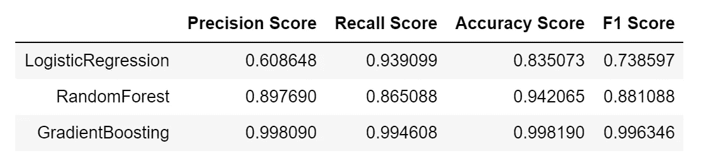

表二。不同模型在列车组上的评估分数

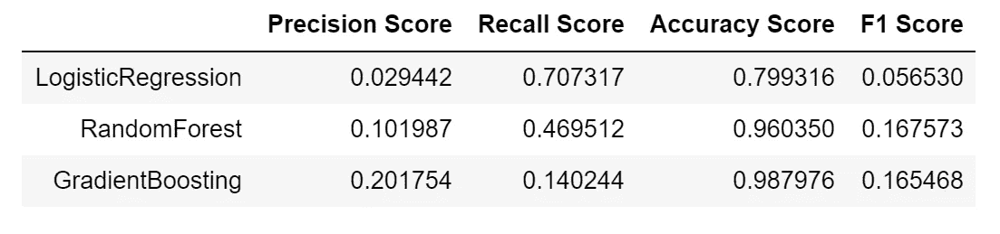

表 3。不同模型在测试集上的评估分数

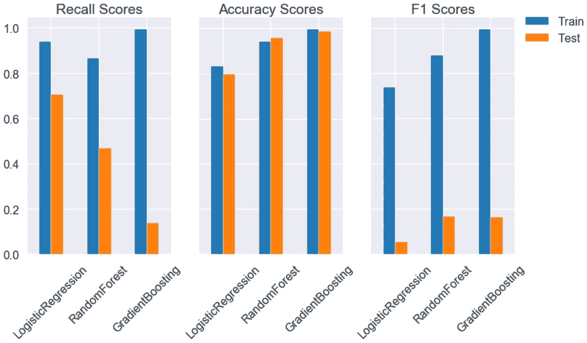

图 4。通过图比较训练集和测试集之间的评估分数

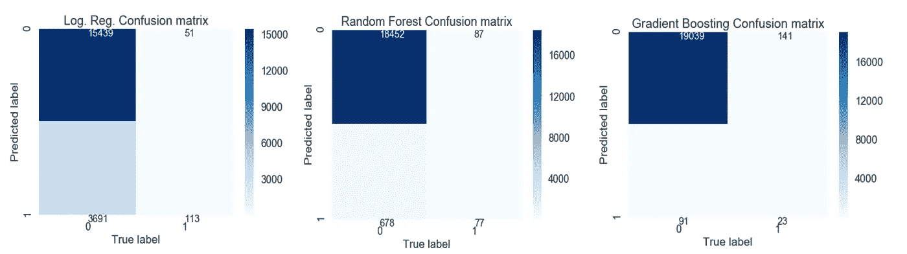

图 5。三种模型的混淆矩阵比较:随着真阳性(右下值)数量的增加，假阴性数量减少。

对于这三种数据，准确度分数表明模型没有过度拟合——训练数据和测试数据之间的准确度分数差异不是太大。然而，训练和测试数据集之间的召回分数的差异更大，尤其是梯度增强模型。正如我们之前所讨论的，当一个模型具有较高的回忆分数(尤其是对于次要肯定类)时，它具有相对较低的 F-1 分数和准确性分数，因为精确度分数较低。对于我们的需求，我们应该选择哪种模式作为最佳模式？嗯，检测更多的正类比预测的准确性更重要。所以我会选择逻辑回归模型和随机森林模型，而不是梯度推进模型。在这两个模型之间，尽管逻辑模型的准确度分数比随机森林模型的分数低大约 16%,但是其召回分数比随机森林模型的高大约 14%。因此，在分析以前的促销活动时，逻辑模型将是我依赖其特征影响的模型。另一方面，我会使用随机森林模型来估计促销活动设计时优惠券兑换的结果，因为它的准确性和 F1 分数高于具有相对较高回忆分数的先前模型。但是现在，让我们分析和比较所有三个模型的特性重要性和我们心目中模型的排序。在下面的图中值得注意的一件事是，从一个图到另一个图，有许多特征是一致的。事实上，随机森林模型中前 10 个重要特征中的每一个特征都在梯度增强模型中的列表上，只是在等级上有所不同。

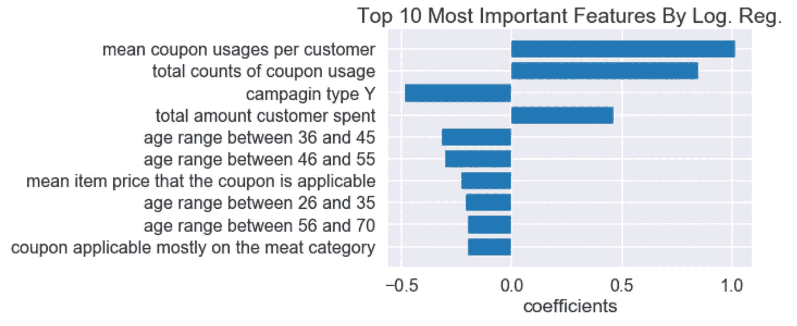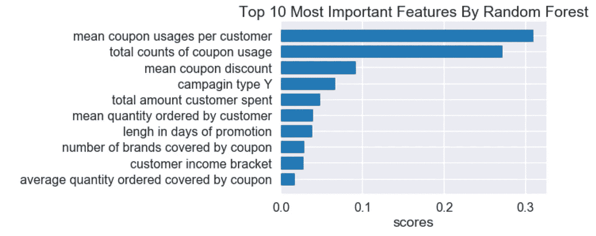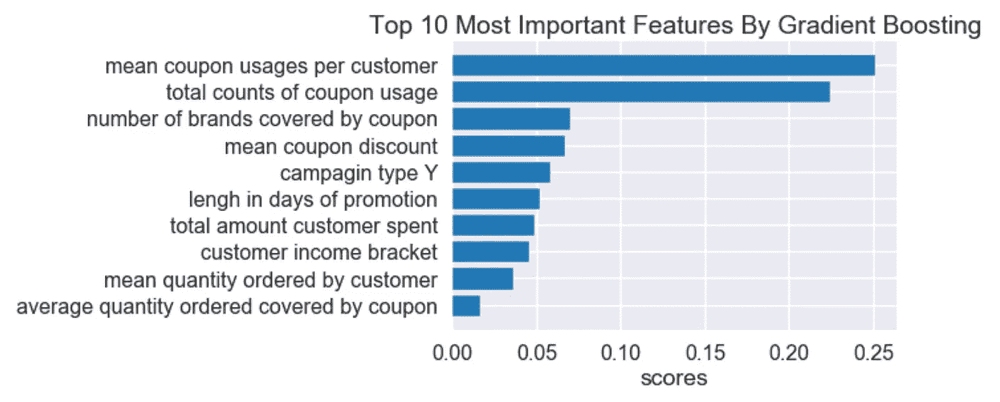

图 6。每个模型的前 10 个最重要的特征:顶部)逻辑回归，中间)随机森林，底部)梯度增强。请注意，衡量每个模型重要性的系数和分数的尺度是不同的，因为它们的计算方式因模型而异。

首先，请注意，从模型到分级特征的系数和分数是不同的尺度，因为计算这些数字的公式因模型而异。此外，来自最后两个模型的分数现在确实指示每个特征是否对目标变量具有负面或正面影响，不像逻辑回归模型的系数那样假设预测变量之间的线性关系。我使用上述图中的特性重要性列出了解释和建议

## 客户特征分析

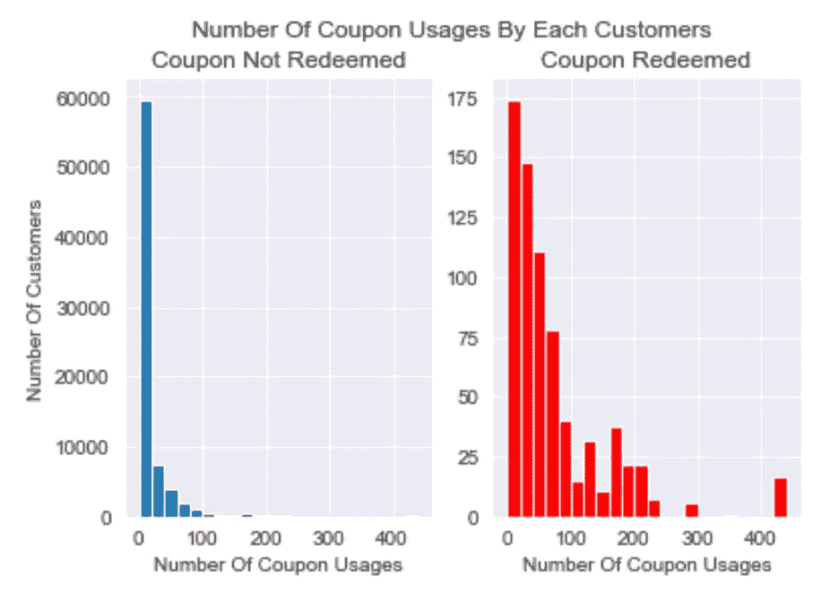

图 7。按优惠券使用次数统计的客户数量:兑换优惠券的大多数客户都不止一次使用过优惠券。

*   每位客户的平均优惠券使用量:平均使用很多优惠券的客户可能会使用更多优惠券:通过改善促销/优惠券广告的来源来鼓励客户使用更多优惠券
*   客户消费总额:在整个交易历史中具有高消费水平的客户，即忠诚客户或挥金如土的人，更有可能使用优惠券——想办法培养和保持忠诚客户，如启动奖励计划。
*   年龄范围:任何年龄范围特征都有负面影响，所以我们应该在相对意义上比较年龄范围相关特征。—调查 36 岁至 55 岁年龄段的客户不太可能使用优惠券的原因，并想办法鼓励他们参与促销活动。

## 促进

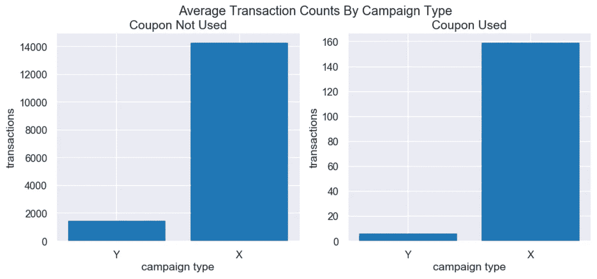

图 8。按活动类型统计的平均事务数:平均而言，X 类型活动期间的事务数要高得多。

*   活动类型 Y(-):虽然有 14 个 Y 类型促销和 4 个 X 类型促销，但 X 类型的交易和优惠券兑换的数量远远大于 Y 类型。通过观察两种类型的频率，X 类型的活动似乎是季节性销售，通常是大销售，而 Y 类型的活动在给定的数据时间内定期进行。对这一特征的负面影响可以被认为是，客户将预期在 X 类型活动期间使用更多优惠券，并且将较少关注通过电子邮件等渠道发送给他们的 Y 类型活动的优惠券。—通过将 type_Y 促销更改为 type_X 促销，在根据随机森林模型增加了 660%的测试数据集中，优惠券兑现率从 0.85%更改为 6.5%。这一预测表明，增加 X 型促销的规模可以导致息票兑现率的增加。另一方面，零售商可能会想出更好地宣传 Y 类促销的方法。

## 优惠券

*   优惠券使用总数:过去受欢迎的优惠券将有更高的机会被兑换。—调查使某些优惠券受欢迎并推广其他优惠券的因素。
*   优惠券覆盖的品牌数量:不同品牌的广泛适用优惠券更有可能被兑换。—制作不太针对品牌的优惠券

# 未来方向和局限性

虽然我能够提出有见地的结论和建议来提高息票兑现率，但这个建模工作有一些局限性。

模型通过最小化或最大化数学公式(如损失函数或信息增益公式)来导航和预测结果。他们没有关于这个数据集的业务理解或背景信息。因此，当我们从一个对我们没有意义的模型中得到结果时，我们必须以正确的方式分析它们。例如，根据逻辑回归模型，平均息票折扣对息票赎回有负面影响；顾客拥有的折扣券越多，他/她使用优惠券的可能性就越小。嗯，对我来说没什么意义。但我们可以看到它是平均优惠券折扣。如果每张优惠券的折扣值不像钟形曲线那样分布在中间，它们的平均值就不是表示数据集的最佳方式。这些值的中值或众数可能更好。

此外，虽然实现了三种方法来创建模型，但是可能有更好的方法来再现数据的行为。如果 XGBoost 库可以构建一个提供更好结果的模型，我以后会尝试使用它。

我希望这篇文章对你有用。我试图告诉你整个故事，而不是集中在一个特定的主题或技术。我将真诚地感谢您的评论和问题。