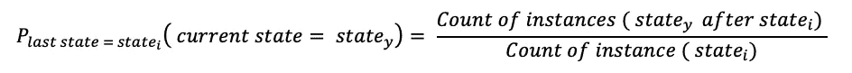
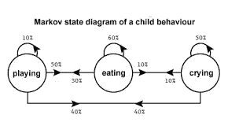
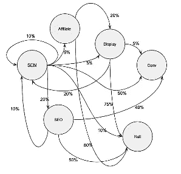

# 你使用马尔可夫链解决多渠道归因的方法正确吗

> 原文：<https://towardsdatascience.com/are-you-using-markov-chains-to-solve-multi-channel-attribution-the-right-way-53b204412e0b?source=collection_archive---------54----------------------->

马库斯·温克勒在 [Unsplash](https://unsplash.com?utm_source=medium&utm_medium=referral) 上的照片

## 多渠道归属没有一站式解决方案

在过去的一年里，我花了一些时间研究多渠道归因问题。在这个旅程中，我被马尔可夫链解决这个问题的潜力所吸引。由于某些原因，马尔可夫链背后的数学概念非常容易理解，它的实现也很容易理解。然而，这并不是所有情况下的解决方案，我认为，在关于这个主题的文章中，并没有充分考虑到解决多渠道归因的设置是否符合使用马尔可夫链的必要条件。

在这篇文章中，你会发现一个快速演示的条件，需要尊重使用马尔可夫链作为工具来做多渠道归因。

# 多渠道归因问题:

问题很简单，当有一个涉及多个渠道(广告、网站页面、社交媒体帖子)的营销设置旨在推动客户转化时，我们如何评估每个渠道对转化的整体影响？

为了理解马尔可夫链在多渠道归因环境中的局限性，我们需要快速回顾一下。

# 马尔可夫链 101:

马尔可夫链是由两组参数定义的数学对象:状态和这些状态之间的转移概率。

*对于多渠道归因问题，状态由您想要建模的流程/设置定义，这些是客户在“转换”之前可以采取的各种渠道/步骤(展示、社交媒体、谷歌广告等)。*

转移概率是从一个状态转移到另一个状态的概率。它们可以用下面的公式计算。

另一个用例示例是使用马尔可夫链对儿童一天的活动进行建模。这些状态就是活动，比如玩、吃和哭。转移概率是一个活动接一个活动的概率。

路易斯·福克在 Quora

根据定义，马尔可夫链是**内存小于**，这意味着它只考虑当前状态来评估最可能的下一个状态。它带有**强假设**，即当前状态拥有关于下一个状态的所有信息。

如果你想了解更多关于马尔可夫链及其用例的知识，这篇文章是一个很好的起点。

# 多渠道归因的马尔可夫链

多渠道属性的马尔可夫链表示如下:

杰里米·纳尔逊在 Dev

## 马尔可夫链在哪些情况下可以用来做多渠道归因？

只要客户端从一个状态移动到另一个状态**而没有任何中断**，使用马尔可夫链进行多通道归因是有意义的，从而尊重无记忆假设。

假设您想要解决多渠道归因问题的设置由以下两个组件组成。首先，广告、文章和社交媒体文章的目标是增加你登陆页面的流量。其次是登陆页面和网站的其余部分(如果有的话)。在这种情况下，状态将是不同的进入通道(第一组件)、网站页面(第二组件)加上转换和空状态，它们分别对应于订单和订单的缺失。在本例中，我选择下订单作为转换状态，但根据您的分析重点，它可能是客户可以对您的业务进行的任何有价值的操作，例如:注册活动、将产品添加到购物篮、订阅时事通讯、请求销售电话等。

基于这种设置，我将给出一个用例示例，对于该用例，使用马尔可夫链作为解决多通道问题的工具是有意义的，而对于该用例，则没有意义。

> **工作用例示例**

分析客户在您网站上的旅程，从引导他们进入您网站的入口渠道(第一部分)开始，到他们退出网站或下订单时结束。在这种情况下，顾客从一个状态到另一个状态没有任何中断地移动，因此无记忆假设得到尊重。

*即使它允许将相对影响归因于花费金钱的媒介(展示、谷歌广告、社交媒体广告等)，它们之间的预算优化也不应仅仅基于马尔可夫链结果。*

> **非工作用例示例**

分析客户的整个购买过程，包括从他们与你的品牌的第一次互动或最后一个订单后的第一次互动到(下一个)订单的所有状态(即转化)，或者如果没有订单，直到研究时间框架结束(非转化)。在这种情况下，无记忆的假设是不被尊重的(至少在大多数时候),因为购买旅程只不过是你网站上不同的连续(有时是独立的)旅程的集合。事实上，一个客户最终在谷歌广告上点击了你网站的链接，这并不(完全)是因为他两周前滚动的最后一页，而是因为他通过他所经历的各种状态对你的品牌有了全面的体验。因此，当评估状态(即渠道)对整个购买过程的影响时，无记忆假设是不可接受的。此外，在这种情况下，将未转化状态定义为在研究时间框架结束时没有订单也是一个重要的假设，因为他可以在研究时间框架结束后几天转化。

## 履行

如果你对使用马尔可夫链解决多渠道归因问题有信心，你可以不遵循本文中的[指南。](https://dev.to/jnel_me/how-to-leverage-markov-chains-for-attribution-1k1i)

另外，R 中有一个由 [CRAN](https://cran.r-project.org/web/packages/ChannelAttribution/index.html) 开发的很棒的包，用于将马尔可夫链应用于多通道属性问题。它附带了一个文档，将向您介绍使用它之前要做的数据处理步骤。

*如果你想帮助我和其他人发现我们如何利用数据科学改善营销，我很乐意在*[*Linkedin*](https://www.linkedin.com/in/leopolddavezac/)*上讨论。*