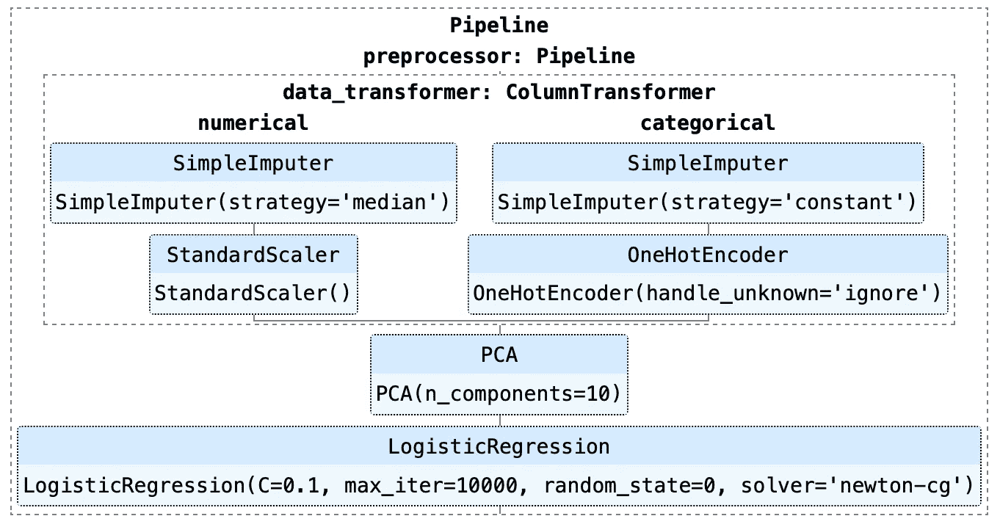
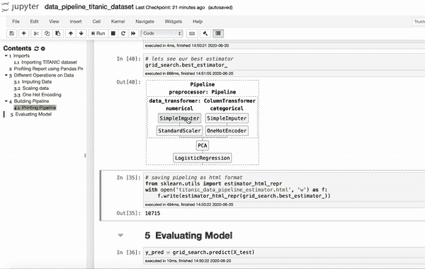

# 你在 Scikit-Learn 中使用 Pipeline 了吗？

> 原文：<https://towardsdatascience.com/are-you-using-pipeline-in-scikit-learn-ac4cd85cb27f?source=collection_archive---------24----------------------->

## 使用 Pipeline 和 GridSearchCV 找到最佳的定标器、估算器和不同的变压器。



来源:作者图片

如果你在做机器学习，你会遇到管道，因为它们可以帮助你做出更好的机器学习工作流程，易于理解和重现。

> 如果你不知道管道，你可以参考 Rebecca Vickery 的博客[Scikit-learn 管道的简单指南](https://medium.com/vickdata/a-simple-guide-to-scikit-learn-pipelines-4ac0d974bdcf)和[Saptashwa Bhattacharyya](https://medium.com/u/9a3c3c477239?source=post_page-----ac4cd85cb27f--------------------------------)[Scikit-learn 的机器学习管道的简单例子](/a-simple-example-of-pipeline-in-machine-learning-with-scikit-learn-e726ffbb6976)。

我最近发现，你可以将 Pipeline 和 GridSearchCV 结合起来，不仅可以为你的模型找到最好的超参数，还可以为你的机器学习任务找到最好的变压器

1.  缩放器缩放您的数据。
2.  填补缺失值的估算策略。
3.  您应该使用的 PCA 成分数量。

和许多其他人。让我们看看如何能做到这一点。

## 数据集详细信息

为了更好地演示，我将使用 OpenML 中的 **Titanic 数据集**来演示如何创建数据管道。

您可以使用以下命令下载数据集-

```
from sklearn.datasets import fetch_openml# Dataset details at- [https://www.openml.org/d/40945](https://www.openml.org/d/40945)
X, y = fetch_openml("titanic", version=1, as_frame=True, return_X_y=True)
```

此外，看看我的笔记本，里面有关于每个操作的更多细节，可以随意下载并导入到您的环境中，然后进行试验-

[](https://github.com/ankitgoel1602/data-science/tree/master/data-pipeline) [## ankitgoel 1602/数据科学

### 该目录详细介绍了如何使用数据管道对数据进行各种操作。还有…

github.com](https://github.com/ankitgoel1602/data-science/tree/master/data-pipeline) 

## 创建数据转换器管道

在这里，我将使用一部分特性来进行演示。数据集既有分类特征又有数值特征，我们将对它们应用不同的操作。流程是这样的-

1.定义数字和分类特征。

2.对于数字特征，填充缺失值，然后缩放数据。

数据集中的数字特征很少有缺失值，我们在这里使用简单估算器来填充这些值，也可以使用其他估算器。此外，我们应该使用比例来标准化数字特征的范围，因为许多机器学习模型需要遵循相同比例的特征。我还没有定义输入的策略和缩放器需要使用，因为同样可以使用 GridSearchCV 搜索。

3.对于分类特征，填充缺失值，然后应用一键编码。

我们数据集中的“已装船”要素几乎没有缺失值。因为我们有不同的策略来填充分类特征，所以要为此创建不同的估算器。此外，由于分类特性只有几个值，所以我使用 OneHotEncoder，它通常用于为分类列中的每个值创建不同的特性。使用 GridSearchCV 搜索输入策略。

4.使用 ColumnTransformer 组合数字和分类转换器。

ColumnTransformer 有助于为不同类型的输入定义不同的转换器，并在转换后将它们组合到单个特征空间中。在这里，我们应用上面为我们的数字和分类特征创建的数字转换器和分类转换器。

5.应用主成分分析降低维数。

主成分分析(PCA)是一种线性降维算法，用于通过保持最大方差来减少数据集中的特征数量。我们可能不需要在这里应用 PCA，因为它是一个小数据集，但我们的想法是展示如何使用 GridSearchCV 在 PCA 中搜索 number_of _components。

## 将分类器添加到管道中

上面，我们创建了一个预处理器管道，其中包含了我们希望应用于数据的所有操作。我将在这里使用逻辑回归作为我们问题的分类器。如果你有兴趣知道如何应用多种模型，丽贝卡·维克里在她的博客中提到了一个很好的方法。

## 应用 GridSearchCV

每个数据科学家都知道 GridSearchCV，它可以帮助我们找到模型的最佳超参数。有一点是**错过了**的，那就是你甚至可以借助**管道**用它来找出**最好的变形金刚**。在我们上面创建的预处理器管道中，你可能已经注意到我们**没有定义**

1.  定标器，
2.  输入缺失值的策略，
3.  PCA 中的组件数量

因为我们可以使用 GridSearchCV 来找到它们的最佳值。这是如何做到的-

以上，我试图从 3 个不同的定标器和估算策略中找出最佳定标器，用于我们的数字和分类列，以及 PCA 的组件和我们模型的超参数。很有帮助，不是吗？

## 可视化管道

Scikit-Learn 0.23.1 增加了可视化复合估计量的功能，这对于交叉检查您应用的步骤非常有帮助。下面的代码可以帮助你可视化数据管道。



来源:作者 GIF

## 缓存管道中的转换器

在这里，我创建了许多不同的数据可以计算密集型变压器。管道提供了一个参数'**存储器**，如果参数和输入数据相同，可以用它来缓存转换器。我们可以将“memory”设置为缓存转换器的目录路径，或者它可以是一个 joblib。内存对象。下面，我使用当前目录作为缓存目录，在这里将创建转换器的所有缓存对象。

```
cache_dir = "."
cached_pipeline = Pipeline(estimators, memory=cache_dir)
```

我一直在使用管道，因为它非常容易实现，并且帮助我们解决了许多问题。我希望这也能帮助你们改进机器学习的工作流程。如果你刚刚开始你的数据科学之旅，或者想了解一些用于数据科学的很酷的 python 库，那么看看这个- [今天就开始你的数据科学之旅](/swlh/start-your-data-science-journey-today-37366ee463f)。

注意安全！！！继续学习！！！