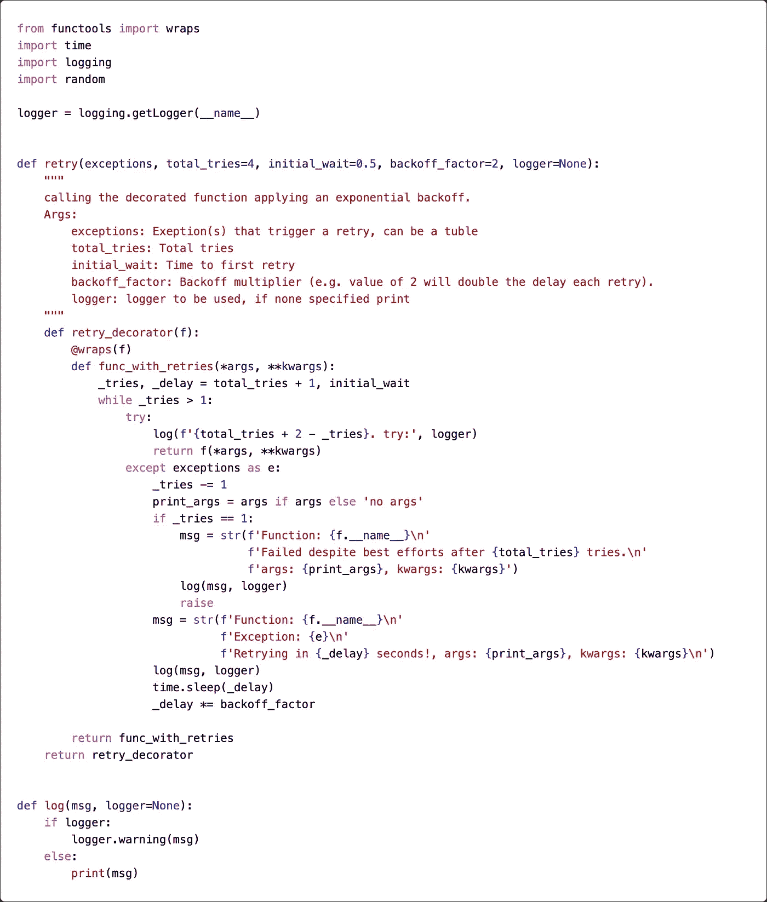
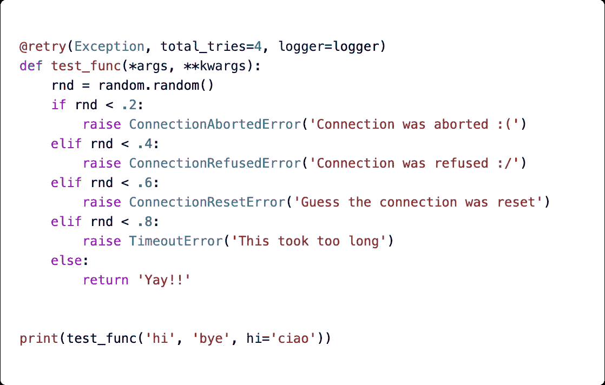
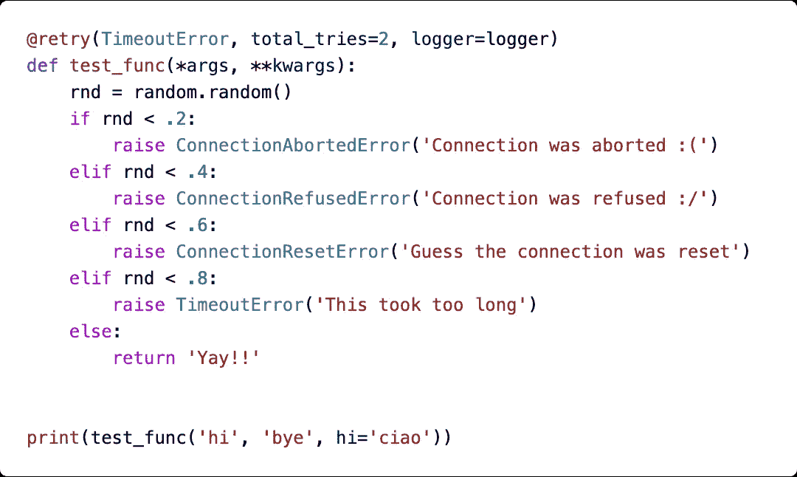
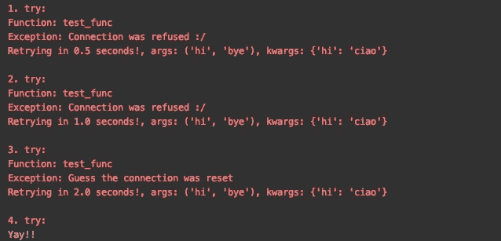

# 你使用 Python 和 API 吗？了解如何使用重试装饰器！

> 原文：<https://towardsdatascience.com/are-you-using-python-with-apis-learn-how-to-use-a-retry-decorator-27b6734c3e6?source=collection_archive---------2----------------------->

## 实现重试装饰器可以防止意外的一次性异常。


图片由[免费提供-照片](https://pixabay.com/photos/?utm_source=link-attribution&utm_medium=referral&utm_campaign=image&utm_content=1081904)来自 [Pixabay](https://pixabay.com/?utm_source=link-attribution&utm_medium=referral&utm_campaign=image&utm_content=1081904)

人们经常将 Python 描述为“胶合语言”术语“粘合语言”对我来说意味着一种语言有助于连接系统，并确保数据以期望的结构和格式从`**A**`传到`**B**`。

我用 Python 构建了无数 ETL 脚本( **E** 提取 **T** 转换 **L** oad)。所有这些脚本本质上都是根据相同的原理运行的。他们从某个地方提取数据，转换数据，然后运行最后的操作。最后一个操作通常意味着将数据上传到某个地方，但也可能是有条件的删除。

越来越多的典型公司基础设施正在向云迁移。越来越多的公司转向微服务方式。这些从本地到基于云的范式转变意味着您可能也面临过这样的情况，您必须从本地计算机之外的某个地方提取数据或将数据写入某个地方。

在小范围内，很少会有这方面的问题。如果某些提取或写回失败，您通常会注意到这一点，并能够纠正错误。但是，当您走向更大规模的操作和潜在的成千上万的事务时，您不希望由于 internet 连接的暂时中断、太多的并发写入、暂时无响应的源系统或天知道还有什么其他原因而受到影响。

我发现一个非常简单的 retry-decorator 在无数类似的情况下是一个可取之处。我的大多数项目，或多或少，最终都在某个 util 模块中使用了 retry decorator。

# 装饰者

## 函数是一级对象

在 Python 中，函数是一级对象。函数就像任何其他对象一样。这一事实意味着函数可以动态创建、传递给函数本身，甚至可以更改。看看下面这个例子(虽然有点傻):

```
**def** my_function(x):
    print(x)**IN:** my_function(2)
**OUT:** 2**IN:** my_function.yolo = 'you live only once'
print(my_function.yolo)
**OUT:** 'you live only once'
```

## 装饰功能

很高兴知道我们可以用另一个函数包装一个函数来满足特定的需求。例如，我们可以确保函数在被调用时向某个日志记录端点报告，我们可以打印出参数，我们可以实现类型检查、预处理或后处理等等。让我们看一个简单的例子:

```
**def** first_func(x):
    **return** x**2

**def** second_func(x):
    **return** x - 2
```

当用字符串`'2'`调用时，两个函数都失败。我们可以在组合中加入一个类型转换函数，并用它来修饰我们的`first_func`和`second_func`。

```
**def** convert_to_numeric(func): *# define a function within the outer function*
 **def** new_func(x):
        **return** func(float(x)) *# return the newly defined function*    **return** new_func
```

这个`convert_to_numeric`包装函数期望一个函数作为参数，并返回另一个函数。

现在，虽然之前会失败，但是如果您包装这些函数，然后用一个字符串数字调用它们，所有功能都会按预期工作。

```
**IN:**
new_fist_func = convert_to_numeric(first_func)*###############################*
*convert_to_numeric returns this function:* ***def***new_func*(x):* ***return***first_func*(float(x))
###############################*new_fist_func('2')
**OUT:** 4.0**IN:**
convert_to_numeric(second_func)('2')
**OUT:** 0
```

**那么这到底是怎么回事呢？**

嗯，我们的`convert_to_numeric`以一个函数 **(A)** 作为参数，返回一个新的函数 **(B)** 。新函数 **(B)** 在被调用时，调用函数 **(A)** ，但是它不是用传递的参数`x`调用它，而是用`float(x)`调用函数 **(A)** ，因此解决了我们之前的`TypeError`问题。

## 装饰语法

为了让开发人员更容易理解，Python 提供了一种特殊的语法。我们还可以执行以下操作:

```
***@convert_to_numeric***
def first_func(x):
    return x**2
```

上述语法相当于:

```
**def** first_func(x):
    **return** x**2first_func = convert_to_numeric(first_func)
```

这个语法让我们更清楚到底发生了什么，尤其是在使用多个 decorators 的时候。

# 重试！

现在我们已经讨论了基础知识，让我们转到我最喜欢和经常使用的`retry`——装饰者:



此处代码[为](https://gist.github.com/FBosler/be10229aba491a8c912e3a1543bbc74e)！

包装被包装的函数。这是一些盗梦空间的东西。但是请原谅我，这并没有那么复杂！

让我们一步一步地浏览代码:

1.  Outmost 函数`**retry**`:这将参数化我们的装饰器，即我们想要处理的异常是什么，我们想要多长时间尝试一次，我们在两次尝试之间等待多长时间，以及我们的指数补偿因子是什么(即我们每次失败时用什么数字乘以等待时间)。
2.  `**retry_decorator**`:这是参数化的装饰器，由我们的`**retry**` 函数返回。我们正在用`**@wraps**`装饰`**retry_decorator**` 内的功能。严格来说，就功能而言，这是不必要的。这个包装器更新被包装函数的`__name__`和`__doc__`(如果我们不这样做，我们的函数`__name__`将总是`**func_with_retries**`)
3.  `**func_with_retries**`应用重试逻辑。该函数将函数调用包装在 try-except 块中，并实现指数后退等待和一些日志记录。

## 用法:



用 retry-decorator 修饰的函数，对任何异常最多尝试四次

或者，更具体一点:



用 retry on TimeoutError 修饰的函数将最多尝试两次。

# 结果:

调用修饰函数并遇到错误会导致如下结果:



被调用的函数在 ConnectionRefusedError 上失败了两次，在 ConnectionResetError 上失败了一次，并在第四次尝试时成功。

这里我们有很好的日志记录，我们打印出了`args`和`kwargs`以及函数名，这将使调试和修复问题变得轻而易举(如果在所有重试次数用完之后错误仍然存在)。

# 结论

这就是了。您了解了装饰器如何在 Python 中工作，以及如何用一个简单的重试装饰器来装饰您的任务关键型函数，以确保它们即使在面临一些不确定性时也能执行。

如果你喜欢你所阅读的内容，并且不想错过新的故事，请在此订阅:

[](https://medium.com/@fabianbosler/membership) [## 通过我的推荐链接加入 Medium-Fabian Bosler

### 作为一个媒体会员，你的会员费的一部分会给你阅读的作家，你可以完全接触到每一个故事…

medium.com](https://medium.com/@fabianbosler/membership) 

关于如何加速代码的进一步阅读:

[](https://medium.com/better-programming/every-python-programmer-should-know-the-not-so-secret-threadpool-642ec47f2000) [## 每个 Python 程序员都应该知道并不秘密的线程池

### 通过多线程，您只需要几行代码就可以将代码速度提高几个数量级

medium.com](https://medium.com/better-programming/every-python-programmer-should-know-the-not-so-secret-threadpool-642ec47f2000) [](https://medium.com/better-programming/every-python-programmer-should-know-lru-cache-from-the-standard-library-8e6c20c6bc49) [## 每个 Python 程序员都应该知道标准库中的 Lru_cache

### 通过使用简单的缓存功能，只需一行代码就可以加快函数的速度

medium.com](https://medium.com/better-programming/every-python-programmer-should-know-lru-cache-from-the-standard-library-8e6c20c6bc49)