# 你在你的 Keras 深度学习模型中使用了“Scikit-learn wrapper”吗？

> 原文：<https://towardsdatascience.com/are-you-using-the-scikit-learn-wrapper-in-your-keras-deep-learning-model-a3005696ff38?source=collection_archive---------6----------------------->

## 如何使用 Keras 的特殊包装类进行超参数调优？

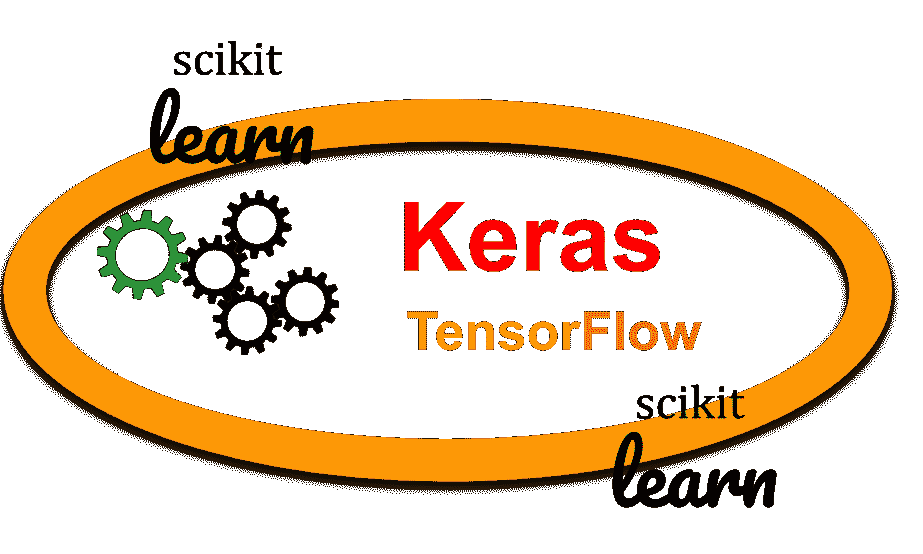

作者使用开源模板创建的图像

# 介绍

Keras 是深度学习领域最受初学者和专业人士欢迎的 Python 库/API 之一。虽然它最初是由弗朗索瓦·乔莱作为一个独立项目开发的，但从 2.0 版本开始，它已经被原生集成到 TensorFlow 中。点击 了解更多信息 [**。**](https://keras.io/about/)

正如官方文档所说，它是“*一个为人类而不是机器*设计的 API”，因为它“*遵循了减少认知负荷的最佳实践*。


图片来源: [**Pixabay**](https://pixabay.com/illustrations/thoughts-think-psyche-psychology-551263/)

认知负荷肯定会增加的情况之一是**超参数调整**。尽管有这么多支持库和框架来处理它，但对于简单的网格搜索，我们总是可以依赖 Keras 中的一些内置的好东西。

[](https://www.jeremyjordan.me/hyperparameter-tuning/) [## 机器学习模型的超参数调整。

### 当创建一个机器学习模型时，你会看到如何定义你的模型的设计选择…

www.jeremyjordan.me](https://www.jeremyjordan.me/hyperparameter-tuning/) 

在本文中，我们将快速查看一个这样的内部工具，并研究我们可以用它来进行超参数调优和搜索。

# sci kit-学习交叉验证和网格搜索

几乎每个 Python 机器学习实践者都非常熟悉 Scikit-learn 库和它的[漂亮的 API 以及简单的方法](https://www.tutorialspoint.com/scikit_learn/scikit_learn_estimator_api.htm)，比如`fit`、`get_params`和`predict`。

该库还为[](https://scikit-learn.org/stable/modules/cross_validation.html)**[**模型选择**](https://scikit-learn.org/stable/model_selection.html)[**流水线**](https://scikit-learn.org/stable/tutorial/statistical_inference/putting_together.html)[**网格搜索**](https://scikit-learn.org/stable/modules/grid_search.html) 能力提供了极其有用的方法。如果你环顾四周，你会发现大量使用这些 API 方法解决经典 ML 问题的例子。但是对于你遇到的一个深度学习问题，如何使用相同的 API 呢？**

**[](https://stackabuse.com/cross-validation-and-grid-search-for-model-selection-in-python/) [## Python 中模型选择的交叉验证和网格搜索

### 简介典型的机器学习过程包括在数据集上训练不同的模型，并选择一个…

stackabuse.com](https://stackabuse.com/cross-validation-and-grid-search-for-model-selection-in-python/) 

> 认知负荷肯定会增加的情况之一是超参数调整。

## 当 Keras 与 Scikit-learn 纠缠在一起时

Keras 提供了几个**特殊的包装类**——都是为了回归和分类问题——来充分利用这些 Scikit-learn 自带的 API 的全部功能。

在本文中，让我向您展示一个使用简单的 [k-fold 交叉验证](https://medium.com/datadriveninvestor/k-fold-cross-validation-6b8518070833)和穷举网格搜索以及 [Keras 分类器模型](https://www.tensorflow.org/api_docs/python/tf/keras/wrappers/scikit_learn/KerasClassifier)的例子。它利用了针对 Keras 的 Scikit-learn 分类器 API 的实现。

Jupyter 笔记本演示可以在我的 Github repo 中找到[。](https://github.com/tirthajyoti/Deep-learning-with-Python/blob/master/Notebooks/Keras_Scikit_Learn_wrapper.ipynb)

## 从模型生成函数开始

为了正常工作，我们应该创建一个简单的函数来合成和编译带有一些内置可调参数的 Keras 模型。这里有一个例子，

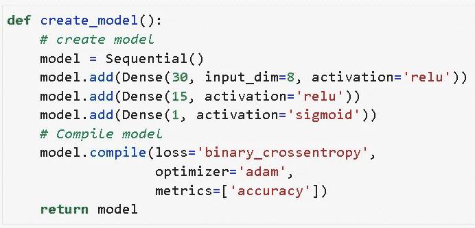

## 数据

对于这个演示，我们使用的是流行的 [**皮马印第安人糖尿病**](https://www.kaggle.com/uciml/pima-indians-diabetes-database) 。这个数据集最初来自国家糖尿病、消化和肾脏疾病研究所。数据集的目的是基于数据集中包含的某些诊断测量结果，诊断性地预测患者是否患有糖尿病。所以，这是一个二元分类任务。

*   我们创建特征和目标向量— `X`和`Y`
*   我们使用 Scikit 的缩放 API 来缩放特征向量——像`MinMaxScaler`一样学习。我们称之为`X_scaled`。

数据预处理到此为止。我们可以将这个`X_scaled`和`Y`直接传递给特殊类，我们将在下一步构建。

> Keras 提供了几个**特殊的包装类**——都是为了回归和分类问题——来充分利用这些 Scikit-learn 自带的 API 的全部功能。

## KerasClassifier 类

这是来自 Keras 的特殊包装类，它将 Scikit-learn 分类器 API 与 Keras 参数模型结合在一起。我们可以传递与`create_model`函数对应的各种模型参数，以及其他超参数，比如 epochs 和 batch size。

这是我们如何创造它，

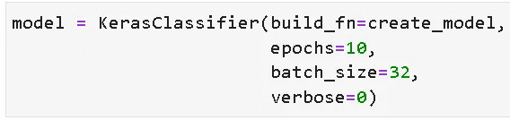

请注意，我们是如何将模型创建函数作为`**build_fn**`参数传递的。这是一个[使用函数作为 Python](https://dbader.org/blog/python-first-class-functions) 中一级对象的例子，在这里你可以将函数作为常规参数传递给其他类或函数。

[](https://dbader.org/blog/python-first-class-functions) [## Python 的函数是一流的——dbader.org

### Python 的函数是一级对象。你可以将它们赋给变量，存储在数据结构中，传递它们…

dbader.org](https://dbader.org/blog/python-first-class-functions) 

现在，我们已经确定了批量大小和我们想要运行模型的时期数，因为我们只想在这个模型上运行交叉验证。稍后，我们将这些作为超参数，并进行网格搜索以找到最佳组合。

## 10 重交叉验证

使用 Scikit-learn API 可以轻松构建 10 重交叉验证估计器。这是代码。请注意我们是如何从 Scikit-learn 的`model_selection` S 模块导入估算器的。

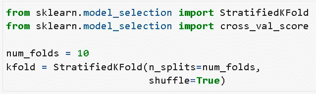

然后，我们可以简单地用这段代码运行模型，在这里我们传递我们之前构建的`KerasClassifier`对象以及特征和目标向量。这里重要的参数是我们传递上面构建的`kfold`对象的`cv`。这告诉`cross_val_score`估算者在 10 重分层交叉验证设置中使用提供的数据运行 Keras 模型。

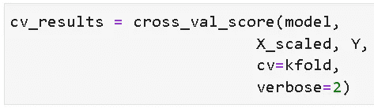

输出`cv_results`是所有准确度分数的简单 Numpy 数组。为什么是准确性？因为这是我们在模型编译过程中选择的度量标准。我们可以选择任何其他分类标准，如精确度、召回率等。并且，在这种情况下，该度量将被计算并存储在`cv_results`数组中。

```
model.compile(loss='binary_crossentropy', 
                  optimizer='adam', 
                  metrics=['**accuracy**'])
```

我们可以很容易地计算 10 倍 CV 运行的平均值和标准偏差，以估计模型预测的稳定性。这是交叉验证运行的主要工具之一。

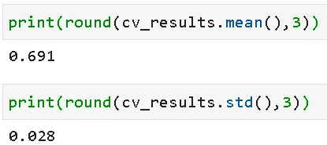

## 增强网格搜索的模型创建功能

穷举(或随机化)网格搜索通常是超参数调整或深入了解机器学习模型工作的常见做法。被赋予了大量超参数的深度学习模型是这种系统搜索的主要候选对象。

在本例中，我们将搜索以下超参数，

*   ***激活功能***
*   ***优化器类型***
*   ***初始化方法***
*   ***批量***
*   ***历元数***

不用说，我们必须将前三个参数添加到我们的模型定义中。

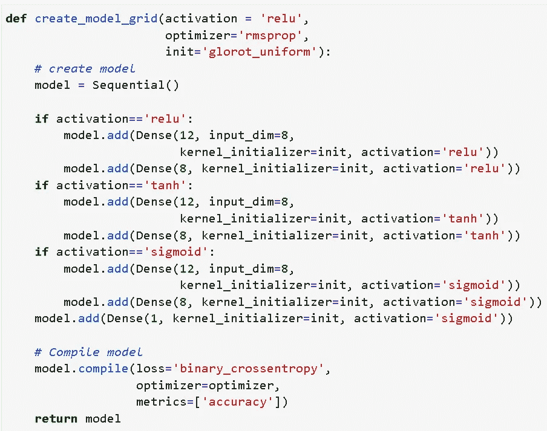

然后，我们创建和以前一样的`KerasClassifier`对象，

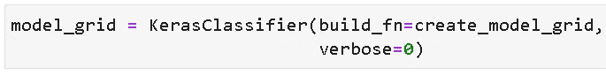

## 搜索空间

我们决定使穷举超参数搜索空间大小为 3×3×3×3=243。

请注意，Keras 运行的**实际数量也将取决于我们选择的交叉验证**的数量，因为交叉验证将用于这些组合中的每一个。

以下是选择，

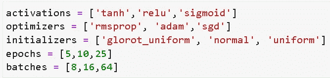

要搜索的维度太多了！


图片来源: [**Pixabay**](https://pixabay.com/illustrations/fractal-complexity-mathematical-1906796/)

## 用 Keras 学习 GridSearchCV

我们必须创建一个搜索参数字典，并将其传递给 Scikit-learn `GridSearchCV`估计器。这是代码，

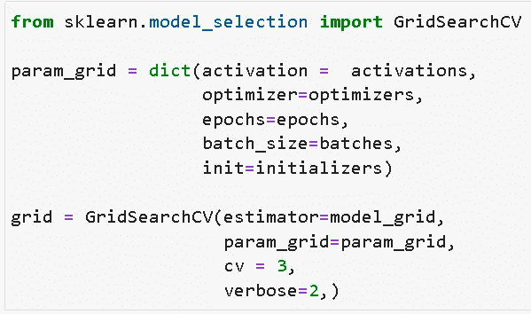

默认情况下，如果没有明确指定`cv`参数，GridSearchCV 会运行 5 重交叉验证(从 Scikit-learn v0.22 开始)。这里，我们将它保持在 3，以减少总运行次数。

建议将`GridSearchCV`的详细程度设置为 2，以保持对正在发生的事情的可视化跟踪。**记住保留** `**verbose=0**` **作为主** `**KerasClassifier**` **类虽然**，因为你可能不想显示训练单个时代的所有血淋淋的细节。

## 然后，就合体了！

当我们都开始欣赏 Scikit-learn 漂亮统一的 API 时，是时候调用这种能力，只需说`fit`就可以搜索整个空间了！

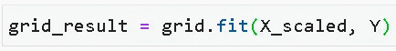

图片来源: [**Pixabay**](https://pixabay.com/illustrations/woman-coffee-mug-coffee-mug-902214/)

喝杯咖啡，因为这可能需要一段时间，具体取决于深度学习模型架构、数据集大小、搜索空间复杂性和您的硬件配置。

总共将有 729 个模型拟合，243 个参数组合中的每一个都有 3 次交叉验证运行。

如果你不喜欢全网格搜索，你可以随时尝试 Scikit-learn stable 的随机网格搜索！

结果看起来怎么样？正如您对 Scikit-learn 估算器的期望一样，为您的探索存储了所有好东西。

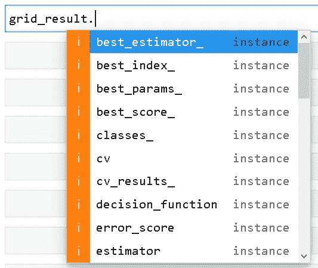

# 你能对结果做什么？

您可以根据您的研究兴趣或业务目标，以多种方式探索和分析结果。

## 最佳精度的组合是什么？

这可能是你最关心的问题。只需使用来自`GridSearchCV`估算器的`best_score_`和`best_params_`属性将其打印出来。

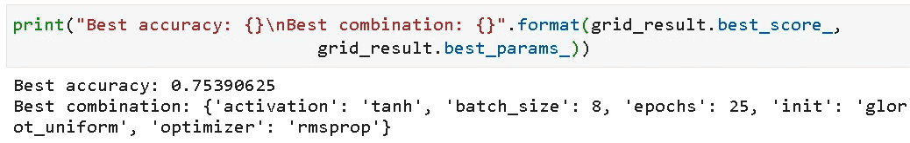

我们使用[**ReLU activation**](https://machinelearningmastery.com/rectified-linear-activation-function-for-deep-learning-neural-networks/)和[**Adam optimizer**](/adam-latest-trends-in-deep-learning-optimization-6be9a291375c)做了最初的 10 重交叉验证，得到的平均准确率为 0.691。在进行彻底的网格搜索后，我们发现[**tanh activation**](https://stats.stackexchange.com/questions/330559/why-is-tanh-almost-always-better-than-sigmoid-as-an-activation-function)和[**rms prop optimizer**](/understanding-rmsprop-faster-neural-network-learning-62e116fcf29a)可能是解决这个问题的更好选择。我们有更好的准确性！

## 提取数据帧中的所有结果

很多时候，我们可能希望在广泛的超参数下分析深度学习模型性能的统计性质。为此，从网格搜索结果中创建一个熊猫数据框架并进一步分析它们是非常容易的。

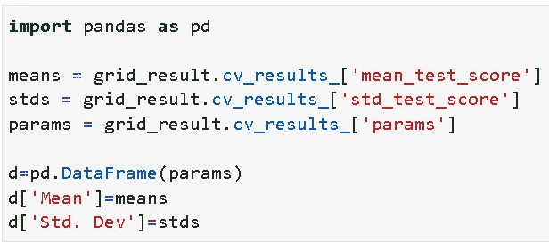

这是结果，

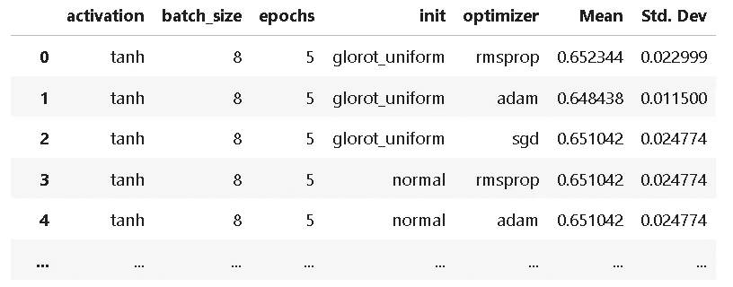

## 视觉分析

我们可以从这个数据集创建漂亮的可视化效果，来检查和分析选择什么样的超参数可以提高性能并减少变化。

这是一组使用 Seaborn 从网格搜索数据集中创建的平均精确度的小提琴图。

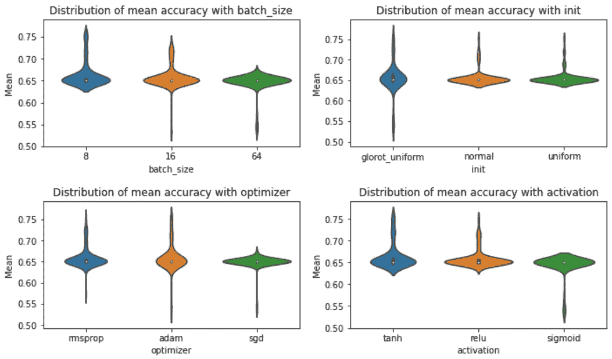

这是另一个情节，

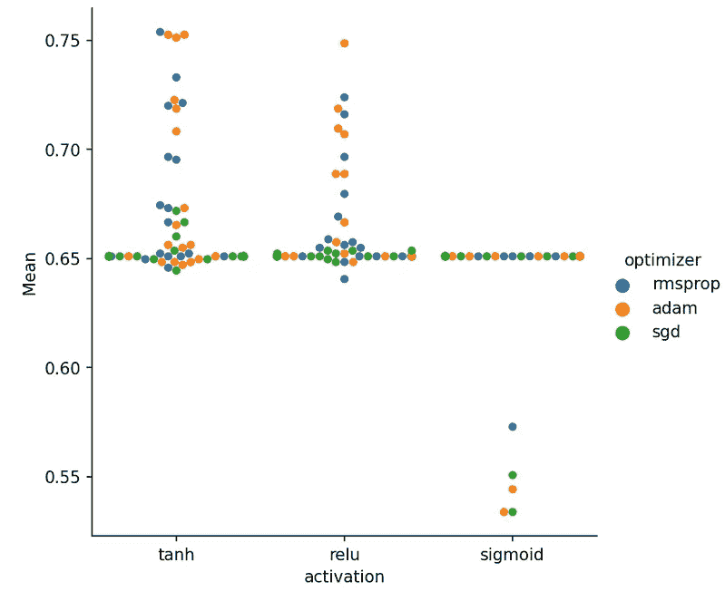

> …从网格搜索结果中创建熊猫数据框架并对其进行进一步分析非常容易。

# 总结和进一步的思考

在本文中，我们介绍了如何使用 Keras 库提供的强大的 Scikit-learn 包装器 API 来进行 10 重交叉验证和超参数网格搜索，以实现二进制分类问题的最佳准确性。

使用该 API，可以融合基于 Scikit-learn 的通用 ML 管道和 Keras 模型的最佳工具和技术。这种方法无疑具有巨大的潜力，可以节省从业者为交叉验证、网格搜索、Keras 模型管道化编写定制代码的大量时间和精力。

同样，这个例子的 [**演示代码可以在这里**](https://github.com/tirthajyoti/Deep-learning-with-Python/blob/master/Notebooks/Keras_Scikit_Learn_wrapper.ipynb) 找到。其他相关深度学习教程可以在 [**同库**](https://github.com/tirthajyoti/Deep-learning-with-Python) 中找到。如果您愿意，请随意启动和分叉该存储库。

Y 你可以查看作者的 [**GitHub**](https://github.com/tirthajyoti?tab=repositories) **知识库**中的代码、思想和机器学习和数据科学方面的资源。如果你和我一样，对人工智能/机器学习/数据科学充满热情，请随时[在 LinkedIn 上添加我](https://www.linkedin.com/in/tirthajyoti-sarkar-2127aa7/)或[在 Twitter 上关注我](https://twitter.com/tirthajyotiS)。

[](https://www.linkedin.com/in/tirthajyoti-sarkar-2127aa7/) [## Tirthajyoti Sarkar - Sr .首席工程师-半导体、人工智能、机器学习- ON…

### 通过写作使数据科学/ML 概念易于理解:https://medium.com/@tirthajyoti 开源和…

www.linkedin.com](https://www.linkedin.com/in/tirthajyoti-sarkar-2127aa7/)**