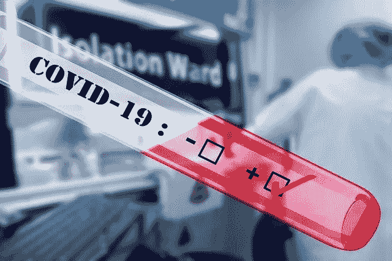
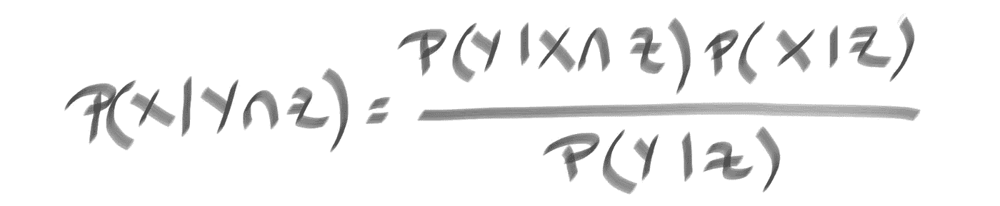
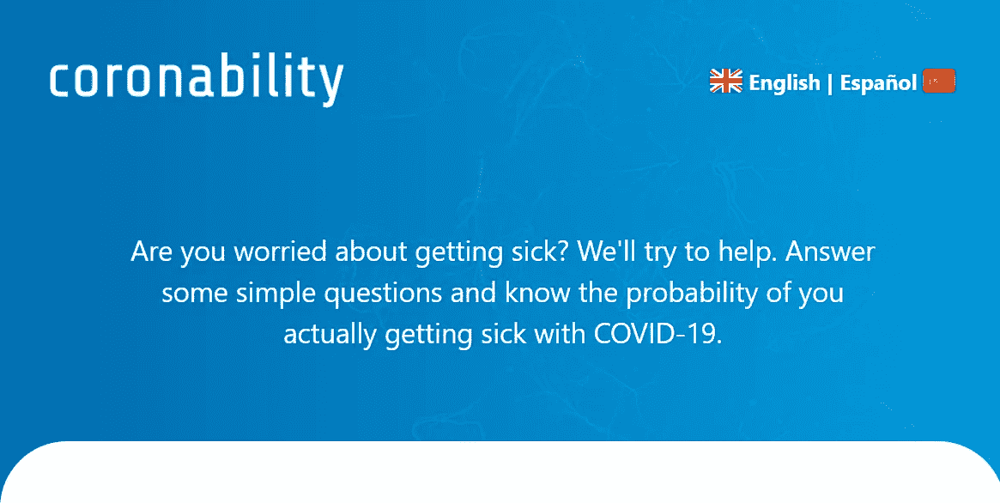

# 你担心感染冠状病毒吗？

> 原文：<https://towardsdatascience.com/are-you-worried-about-getting-coronavirus-well-try-to-help-821302bb07f7?source=collection_archive---------42----------------------->

## 保持冷静，计算自己生病的概率。

如果您有以下任何问题:

*   我感染冠状病毒的真实几率有多大？
*   如果我感染了冠状病毒，我死亡的概率有多大？
*   在我的生活方式中包含社交距离值得吗？
*   根据我的行为、年龄和居住地，我能得到这些问题的具体答案吗？

在这篇文章的结尾，你将能够自己回答其中的一些问题(直到一些计算和一些数据处理)

这个想法是让你根据你的具体情况获得风险估计。当然，这些概率只是提供信息的统计工具，并不能代替官方或医生的官方信息。

# **让我们从数据开始**

为了创建这个工具，我们依赖了来自[世界银行](https://data.worldbank.org/)、[世界卫生组织](https://www.who.int/gho/database/en/)和《2019 年世卫组织-中国冠状病毒疾病联合任务报告》的公开数据。

*   世界银行的数据提供了每个国家按年龄和性别区分的人口统计数据。
*   世界卫生组织提供了每个国家冠状病毒病例数量的信息。我们可以访问一个更加用户友好的数据表单 [Worldometer](https://www.worldometers.info/coronavirus/) 网页，在那里我们可以找到病例总数、死亡人数、活跃病例等。每日报告。
*   2019 年世卫组织-中国冠状病毒疾病联合任务报告基于中国 55，924 例实验室确诊病例，并为该样本提供了描述性统计数据。我们感兴趣的报告的主要部分是死亡率，取决于几个因素，如年龄、性别和既往疾病。这些结果也在 [Worldometer](https://www.worldometers.info/coronavirus/coronavirus-death-rate/) 网页中进行了总结。我们需要澄清的是，这些统计数据是基于**中国的案例。**

# **如果我被感染，死亡的概率**

我们将考虑两个特定变量来计算一个人被感染后的死亡概率:居住国家(C)和年龄(A)。如果我们用(D)来表示“如果我被感染就会死亡”的事件，我们要计算的是:

P(D|A ∩ C) →如果被感染死亡的概率，假设我是“A”岁，我住在“C”。

我们将使用贝叶斯定理的一个版本，其中包括在多个事件中的条件来找到这个概率。

多事件贝叶斯定理

特别是 P(D|A∩C)=P(A|D∩C)*P(D|C)/P(A|C)。由于原则上我们没有特定国家按死亡年龄区分的特定概率的先验信息，我们可以假设 P(A | D∩C)= P(A | D)= P(D | A)* P(A)/P(D)→基本贝叶斯定理。

现在我们得到了一个可以计算的表达式:

P(D | A∩C)= P(D | A)* P(A)* P(D | C)/(P(A | C)* P(D))

我们有全球人口概率，取决于世界银行数据中的年龄 P(A)和 P(A|C)。我们还可以从 worldometer 提供的每日报告中计算出某个国家的当前死亡概率 P(D|C)和全球死亡概率 P(D)。最后，我们有来自世卫组织-中国冠状病毒疾病联合任务 2019 年报告的 P(D|A )(我们可以假设该报告给出了该疾病的“全球”概率)。

# 编码定制概率

[此处](https://drive.google.com/drive/folders/1DQjhwkX81wN8ORIxHcnm3_X0itBCFKqU?usp=sharing)我们以 csv 格式提供来自世界银行的世界人口数据，以 xlsx 格式提供来自 Worldometer 的冠状病毒数据(截至 2020 年 4 月 17 日)。

世界银行的年龄范围是 0-14，15-65 和+65，而世卫组织报告的年龄范围是 0-9，10-19，…，70-79，+80。这意味着我们需要对世界银行的数据进行一些插值，以确定世卫组织中国报告的范围:

在我们创建的这个代码片段中

*   包含所有国家疾病状况的一般信息的数据框。这包括病例数、死亡数、康复病例数、人口等。这允许计算 P(D|C)和 P(D)。
*   包含 P(A|C)，给定一个国家有某个年龄的概率(A)的字典(C)。这是为每个国家计算的，年龄范围为 0-9 岁，…，70-79 岁，80 岁以上。
*   根据[国家的 ISO ALPHA-3 代码](https://www.tracemyip.org/tools/country-code-list-alpha-2-alhpa-3-converter/)，数据框和字典的主关键字(索引)都是国家代码。使用“WORLD”键，我们可以访问世界概率。

现在我来计算我的概率。我在哥伦比亚，年龄范围是 30-39 岁。

我得到 0.001%。

如果你想要你的原始感染概率，你可以用你国家的病例数除以国家人口数(当然这只是一个说明性的估计。

以我为例，我得到< 0.001%，相当低。

最后，如果你想对你还没有被感染的情况下死于冠状病毒的死亡率有一个估计，你可以把之前的两个值相乘(这肯定是非常低的)。

# 你担心感染冠状病毒吗？

我的感染概率和感染后死亡的概率并不高，因为哥伦比亚的死亡人数相对于感染人数并不多(截至 2020 年 4 月 17 日)，但这在其他国家发生了很大变化，当然，这种情况随着年龄的增长而增加，并取决于你的行为(社会距离)。

你也可以在免费的在线冠状病毒概率计算器****中计算出几个涉及性别、既往状况、社会距离的概率。**根据你的社交距离，你可以使用 SEIR 模型看到 15 天的预测！**

**对于疫情之争，我的建议是保持冷静并遵循世卫组织将军的指示，因为当我们将范围缩小到城市和社区时，你的可能性会大大增加。**

**好了，现在你可以计算你的概率，并与你的朋友分享！**

****

**可晕性**

*****编者按:*** [*走向数据科学*](http://towardsdatascience.com/) *是一份以数据科学和机器学习研究为主的中型刊物。我们不是健康专家，这篇文章的观点不应被解释为专业建议。***