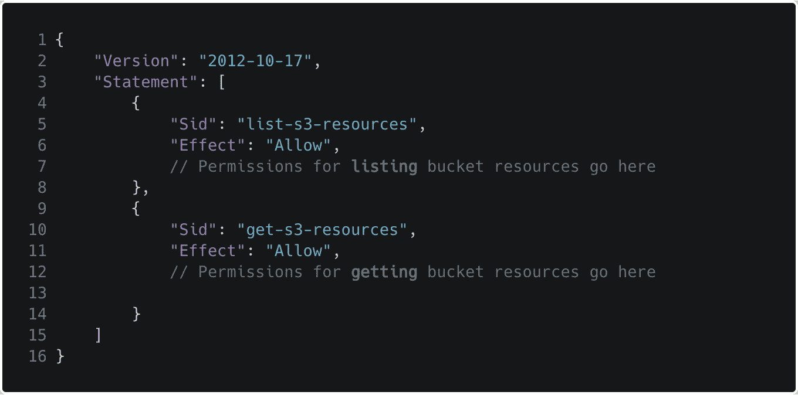
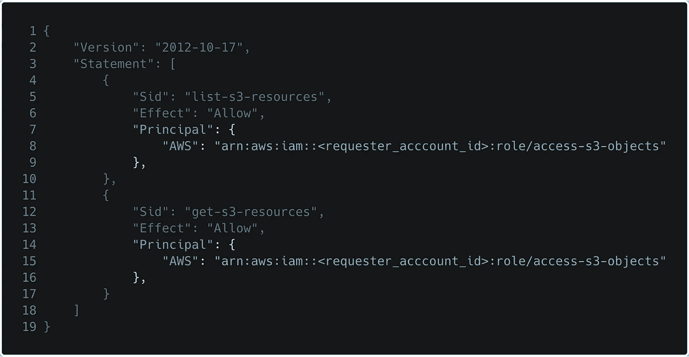
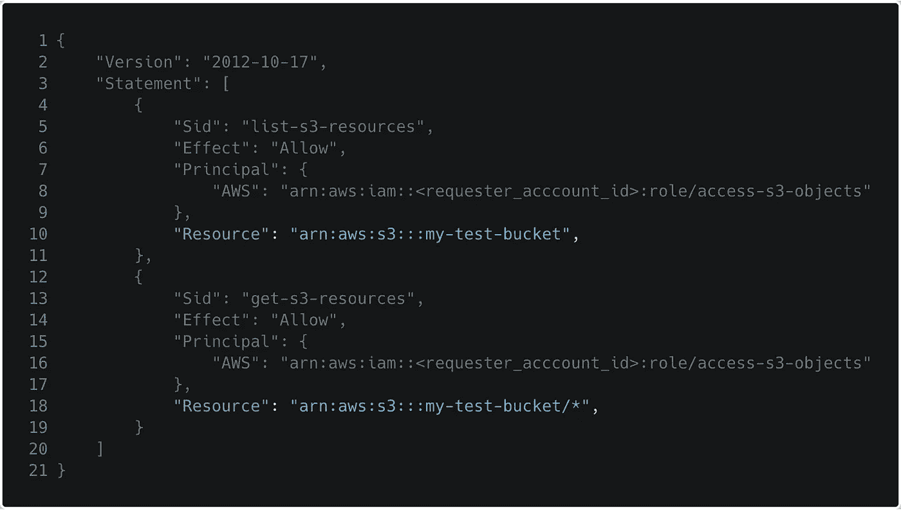
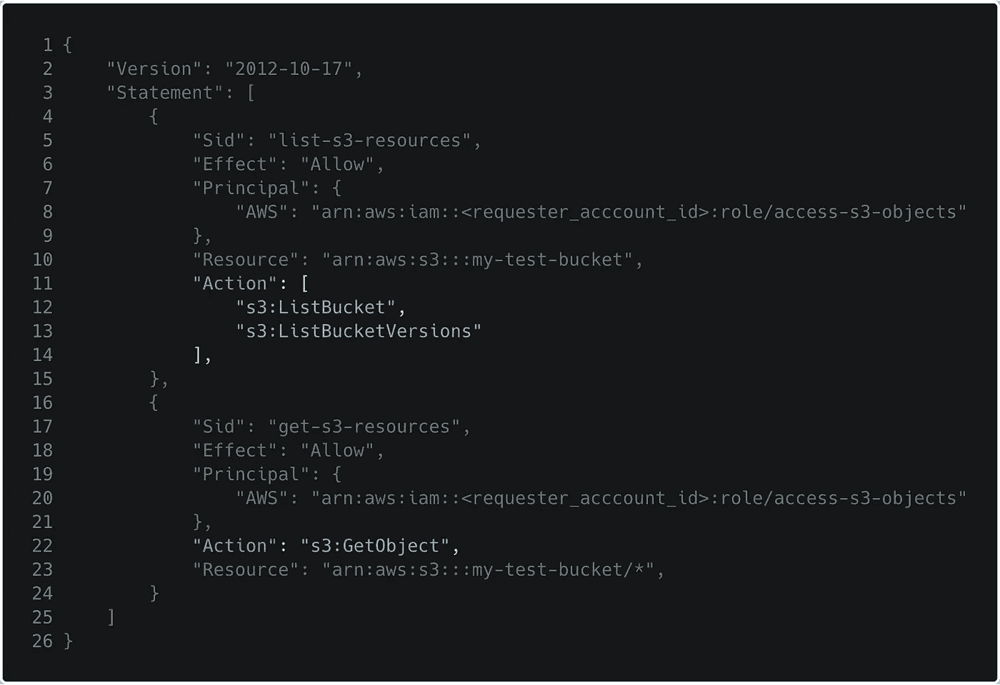
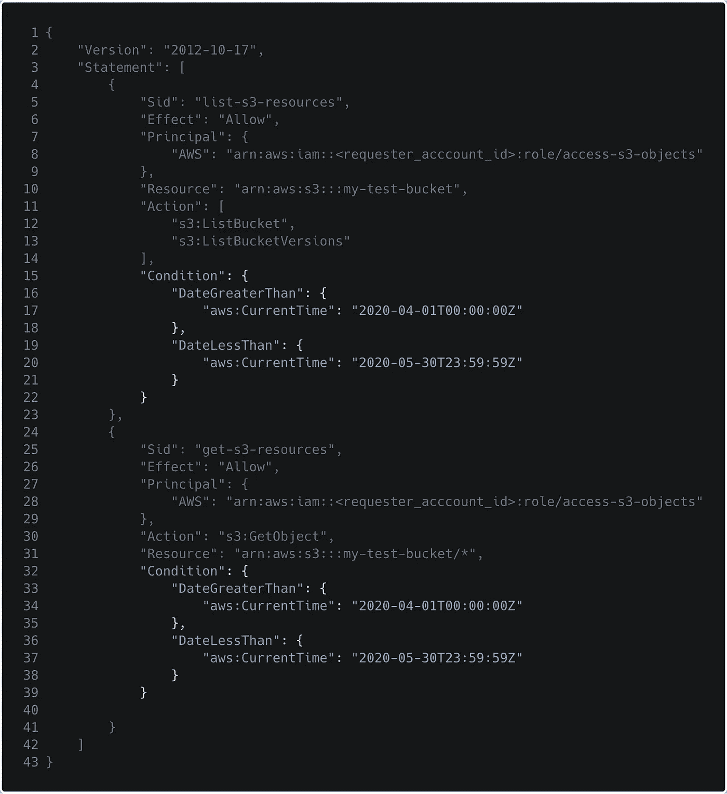
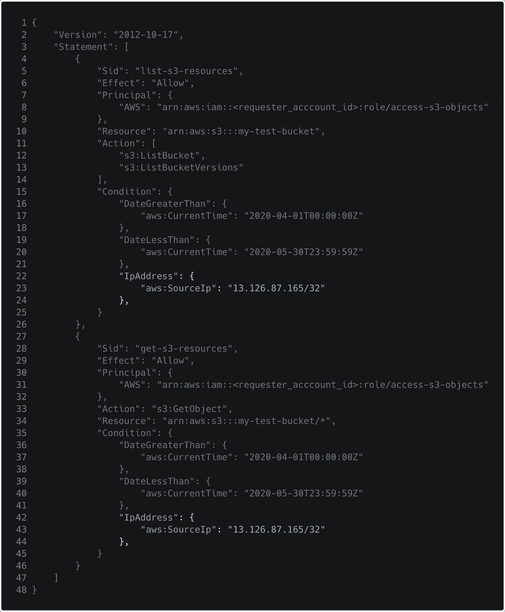
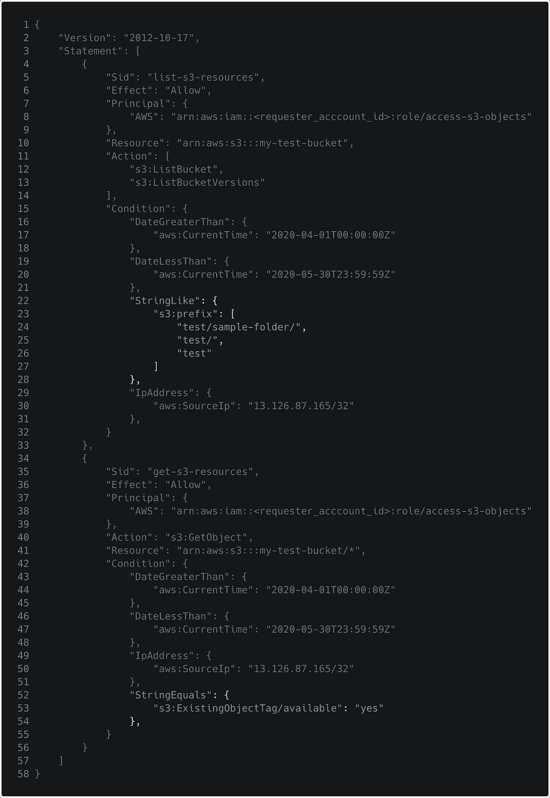

# 你的 AWS S3 铲斗安全吗？

> 原文：<https://towardsdatascience.com/are-your-aws-s3-buckets-secure-5cc07f63788?source=collection_archive---------50----------------------->

## 自动警报系统

## 学习释放 IAM 政策的全部潜力，并开始利用'*条件'*政策元素

由[克里斯·帕纳斯](https://unsplash.com/@chrispanas?utm_source=unsplash&utm_medium=referral&utm_content=creditCopyText)在 [Unsplash](https://unsplash.com/s/photos/security?utm_source=unsplash&utm_medium=referral&utm_content=creditCopyText) 上拍摄

定义 IAM 安全策略的一个重要方面是减少爆炸半径，这是人们经常忽略的，这实际上意味着，在访问泄漏的情况下，如何进一步减少/消除损害。从这个角度来看安全定义通常可以帮助您考虑其他因素，以便在发生安全违规时限制损害。

安全性通常归结为两件事:身份验证和授权。认证定义*你是谁*，授权定义*你能做什么(认证后)。*在使用 AWS 云时，IAM(身份和访问管理)扮演把关者的角色，从而负责我们讨论的两个方面。 *IAM 策略*管理*授权*部分，对于限制用户可以/不可以做什么非常重要。

在这篇文章中，我想讨论当你给别人访问你的 AWS 资源时，你应该考虑的最基本的步骤。让我们用最常用的 AWS 服务 S3 来定义一个示例问题陈述

> 在 EC2 实例中运行某些工作流的不同 AWS 帐户的用户需要在特定的日期和时间间隔内访问您的 S3 对象。访问被进一步限制为列出具有特定前缀的文件，并且只下载具有相关联的特定标签的文件。流量也应该来自白名单网络

首先，将 S3 桶和与对象相关的权限分离到不同的部分通常是一个好的做法。AWS 在政策文件中将它们称为**声明**。

基本 IAM 策略框架

# 谁需要访问权限？

或者用 AWS 的术语来说，谁是**的主要负责人。*作为最佳实践，让我们假设没有访问键被提供和注入到消费者 EC2 实例中。相反，有一个 IAM 角色将被*承担*以访问 S3 资源。要定义主体，您可以扩展策略模板，如下所示:*

**

*IAM 策略—具有主体(请求资源的实体)*

*此时，像 EC2 这样映射到 IAM 角色`arn:aws:iam::<requester_account_id>:roleaccess-s3-objects`的服务可以从位于 [http://169.254.169.254 的实例元数据端点获取动态临时凭证。这是由官方 SDK 和 CLI 自动处理的，所以用户不必担心。](http://169.254.169.254.)*

# ***需要访问什么？***

*上面的问题陈述提到了需要从不同的帐户访问的 S3 存储桶。这成为 IAM 策略中的**资源**元素。让我们假设私有桶的名称为`my-test-bucket`*

**

*IAM 策略—需要访问的资源*

*对于不同的部分，您可以适当地定义资源元素。首先指整个桶，其次指桶内的物体*

# *在 S3 存储桶上应该允许哪些操作？*

*这由 IAM 策略结构中的**动作**元素定义。在这里遵循最小特权原则非常重要，要不惜一切代价避免类似`s3:*`的事情发生。此外，可以使用 [AWS 策略模拟器](https://policysim.aws.amazon.com/home/index.jsp?#)进行简单的测试，以满足模拟/调试需求。*

*对于这个场景，用户只需要拥有`s3:List ucketVersions`、`s3:ListBucket`和`s3:GetObject`三个基本权限*

**

*IAM 策略—允许其他 AWS 帐户执行的操作*

# *应该在哪个日期间隔内允许访问？*

*输入 [**条件**](https://docs.aws.amazon.com/IAM/latest/UserGuide/reference_policies_elements_condition.html)*

*条件给 IAM 政策注入了兴奋剂。您现在可以开始使用他们允许您实施的粒度控制。在这个例子中，假设您只想允许`2020-04-01T00:00:00Z`和`2020-05-30T23:59:59Z`之间的请求。你可以使用任何 ISO 8601 格式来定义这些时间线。条件键有两种风格:全局的和特定于服务的。介绍完这些之后，IAM 策略看起来像:*

**

*IAM 策略—允许在特定时间间隔内进行访问*

*如果您希望允许临时访问在预定义时间自动过期的外部实体，这将非常有用。*

# *不仅仅是日期，您还希望只允许来自特定网络流量*

*让我们假设输出 NAT 网关，或实例公共 IP 是`13.126.87.165`。您可以限制仅来自此来源的流量。*

**

*IAM 策略—仅允许来自特定网络的入口*

# *限制对数据子集的访问*

*如问题陈述中所述，您还希望控制资源访问，这应该仅限于 bucket 中的一些前缀。使用这种方法，您可以限制不同用户看到的内容，以及他们可以从该集中进一步下载的内容。假设您只想限制列出带有前缀`test/`和`test/sample-folder`的文件夹的能力*

*此外，用户应该只能下载带有标签`available:yes`的对象*

*这可以通过其他有趣的条件键来实现:*

**

*IAM 策略—标签和文件夹前缀条件*

*这里需要注意的是，web 控制台中的 S3 看起来像一个典型的目录结构。然而，在内部，它只是名称前缀，您可以使用它来引用单个对象。*

*完整的 IAM 政策要点可以在[这里](https://gist.github.com/akskap/3ccdae007c2c4c9de063c422aa61d96f)找到，如果你想复制或编辑的话。*

# *结论和进一步阅读*

*在这一点上，我相信即使您丢失了访问密钥，您也不会感到害怕，因为粒度策略定义的深度使得黑客在访问您的机密数据之前很难勾选所有的框。*

## *注意事项*

*   *无论是全局的还是特定于服务的，并不是所有的条件关键字都会一直存在。记得检查哪些 S3 选项支持哪些条件键。*
*   *当涉及到安全性时，考虑使用策略边界。它们定义了最大权限区域，您自己帐户中的用户可以将其权限提升到。*
*   *为了更加清晰，将对象和存储桶级别的权限分开*
*   *如果你也对 EC2 使用的其他安全实践感兴趣，或者有效地管理你的密码，请随意查看我的其他帖子*

*我希望这篇文章能帮助你下次定义更安全的 IAM 策略。如果能听到您的评论和您已经完成的其他用例，那就太好了。*

*下次见， *tschüss* ！*