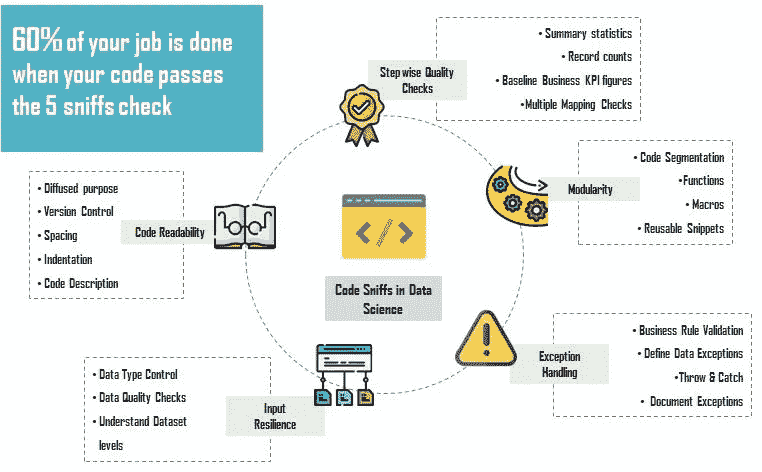
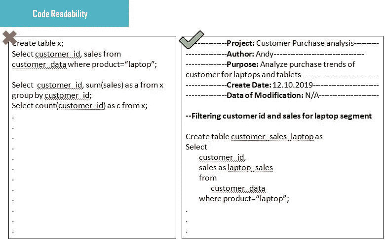
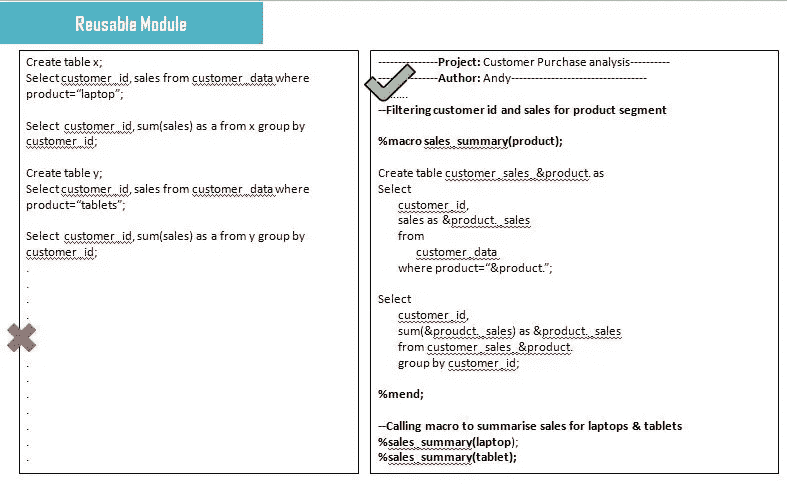
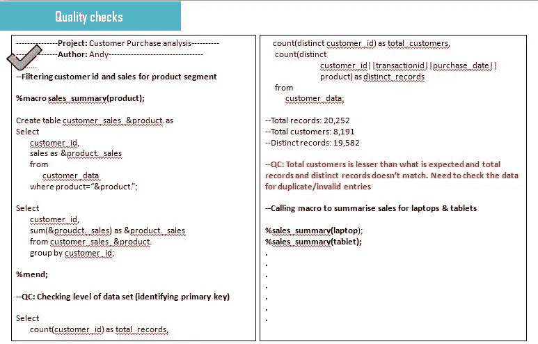
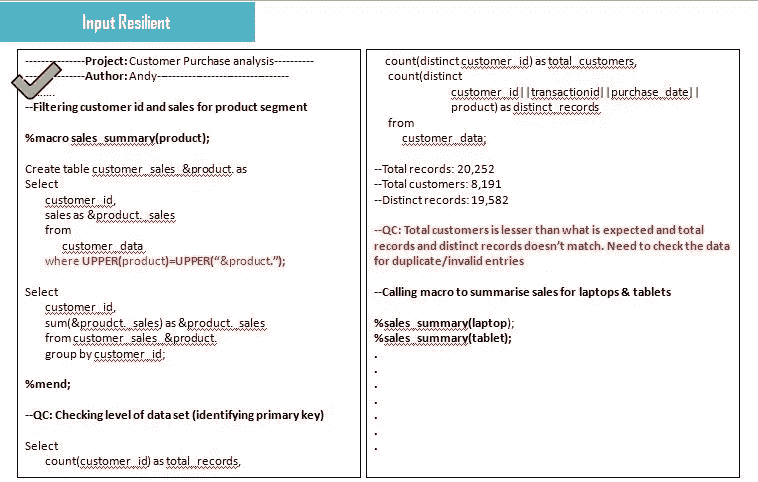

# 对于数据科学的工作，你的编码技能够好吗？

> 原文：<https://towardsdatascience.com/are-your-coding-skills-good-enough-for-a-data-science-job-49af101457aa?source=collection_archive---------9----------------------->

## 5 编码嗅探如果你在数据科学行业工作，你必须知道

“我 *t 是星期五晚上。我清楚地记得那天剩下的时间和家人在一起我是多么兴奋。我的父母第一次去班加罗尔旅行，我已经计划带他们参观这座城市。我已经完成了一天的工作，因此在任何组织中，周五晚上通常都不那么忙碌。我正要离开时，突然收到了一封来自我的利益相关者的电子邮件，要求我提供一份我们一年前就停止提交的非常旧的报告。我很失望，但我知道运行标准代码通常不需要太多努力。唉！我的假设是错误的。因果报应咬了我一口，我整个晚上都在……"*

您一定想知道这个故事与数据科学工作所需的任何类型的编码技能有什么关系，或者你们中的一些人可能已经猜到了我的故事和文章其余部分之间的*相关性*。让我先声明一下*“当今的组织正在将数据科学作为决策周期每个阶段的关键杠杆之一，以推动关键业务战略*。但是什么构成了数据科学问题呢？数据分析师、业务分析师或数据科学家如何在任何组织中工作？

任何数据科学问题都被分解成两个部分，一组**【活动】和一些**【最佳实践流程】**。数据收集、数据清理、数据争论、假设检验、模型开发、验证等等都属于**“活动”。**我们大多数在分析组织工作或渴望成为数据科学家的人都非常熟悉这些术语，但当涉及到**“最佳实践流程”时，**我们知道的并遵循的很少。**

**根据我在这个行业 4 年的工作经验，我可以告诉你，作为**“最佳实践过程”**的一部分，很多重点都放在了项目管理、知识库构建、文档、沟通和代码维护上。作为一名数据科学家，您需要确保遵守“ **3 C、一致性、沟通和消费”**。你的工作应该是**一致的**，你应该**向你的利益相关者传达**每一个商业上的错综复杂，最重要的是你的工作应该**消耗**。**

**数据科学行业中的编码与软件开发非常不同。您的编码技能不仅仅局限于您的技术知识，还需要大量的数据和业务理解。今天我将谈论“一致性”以及如何在你的编码实践中实现它。许多这些最佳实践都是基于我在 Mu 适马商业解决方案公司工作的 3 年经验以及我迄今为止所面临的挑战。以下 5 个嗅探会让你简单了解“**数学+商业+数据+技术=数据科学”**。**

**"O *当今的组织正在寻找能够创建可跨多个团队扩展的解决方案的数据科学家。把它想象成一个产品，任何人、任何人都可以轻松使用。这不仅节省了他们在不同业务部门的类似问题上的投资成本，还减少了未来几天处理该问题的现有资源的时间和精力"***

** [## 使用 Python 实现决策树分类器和成本计算剪枝

### 使用成本计算修剪构建、可视化和微调决策树的完整实践指南…

towardsdatascience.com](/decision-tree-classifier-and-cost-computation-pruning-using-python-b93a0985ea77) 

# 5 个代码嗅探可以提升你的游戏！

## 1.你的代码可读性够吗？

一段格式良好且经过注释的代码是代码大师的天堂。它帮助您轻松调试代码，并确保更顺利的质量检查。任何数据科学团队都遵循*同行质量检查* (QC)的概念，以确保输出无误。在向利益相关者交付最终成果之前，让您的同行评审您的代码被认为是一种最佳实践。可读代码包括:

*   项目名称、代码目的、版本、作者姓名、创建日期、修改日期、最后修改人、开始更改
*   在每个代码片段开始之前对其进行一行描述(使用这些编码人员跟踪所使用的明确的业务规则或过滤器)
*   每个片段适当缩进，两个片段之间留有足够的空间
*   正确使用表名的命名约定。您可以编写“创建表 customer_volume_summary ”,而不是编写类似“创建表 a”的代码片段。这使得您的表格非常直观，甚至无需浏览其余的代码段

## **2。你的代码有可重用的模块吗？**

很多时候，您将最终处理具有相似模式的数据集，但是根据所面临的业务问题，对不同的属性(列)使用不同的过滤器。也可能反过来，您最终使用同一个表来总结同一业务问题的不同场景。

例如，假设您有一个包含客户 id、交易 id、购买日期、产品类型和销售额的客户数据集。您需要找出对每种产品类型销售额贡献 80%的顶级客户。在正常情况下，您可以为特定的产品类型创建一组代码，复制粘贴相同的代码，然后使用不同的过滤器对产品类型进行重用。一个好的编码人员会创建一个用户定义的模块，该模块将产品类型和销售阈值作为输入，并生成所需的输出。可以在所有平台上创建可重复使用的模块，从而节省不必要的生产线，并确保轻松进行质量控制。

## **3。您的输出符合数据和商业感觉检查吗？**

在任何组织中，交付正确的数字是项目成功的关键。许多业务决策都是基于我们报告的数字做出的，即使是很小的不准确也可能对组织的决策产生更大的影响。

> 让我们以上面的客户数据集为例。要求您根据交易量确定前 100 名忠实客户。使用您的推荐，该组织将为这些用户提供 30%的折扣券，用于他们即将到来的夏季销售。

这种分析的整体思想是识别忠诚的客户，并影响他们购买更多。该组织正在打击其销售，以确保更高的交易量。现在，我们中的许多人都没有意识到这样一个事实，即大多数组织使用的数据集并不是以最干净的形式出现的，在被消费之前需要进行处理。例如，客户在支付他的账单时可能经历由系统记录的失败的交易。但是，在计算交易量时，应消除此类交易 id，否则我们最终会错误地估计每个客户的交易量。挑战在于识别这种异常现象。以下是您在编码时必须做的一些检查:

*   在开始任何操作之前，请检查数据集的级别。级别被定义为可用于从数据库/表中唯一标识记录的单个列或列的组合。这将有助于您识别任何重复条目，并防止重复计算
*   对数据集进行快速描述性统计。这有助于您找出数据的分布和所有可能丢失的值
*   联接一个或多个表时，请确保它们处于同一级别。务必跟踪所有 join 语句前后的记录数量。这将帮助您识别多重映射或重复计算(如果有)
*   让您组织的*关键绩效指标触手可及。这将有助于你在每一步的基线数字。在上面的例子中，购买的客户总数是组织绩效的关键指标。根据贵组织的年度报告，您知道大约有 12，000 名客户从贵组织的网站上购买了产品。但是，在查询数据集时，您只找到 8000 个客户 id。你的数据正确吗？重新检查您的代码，或者向您的利益相关者指出数据问题*

**

## *4.你的代码输入有弹性吗？*

*输入弹性意味着无论输入类型如何，代码都应该能够产生输出。任何编码实践中最困难的部分是诱导输入弹性，这导致代码的可重用性。分析师可能会从不同的涉众那里收到类似的数据请求。因此，理想的情况是编写能够满足不同业务需求的代码。*

*例如，电子产品和化妆品部门的销售主管希望了解不同客户 id 下各自的产品销售情况。由于分析师以前曾在笔记本电脑和平板电脑上工作过，他/她知道所有与电子产品相关联的产品名称都是以小写形式显示的。但是，要检查化妆品，他/她可能必须首先过滤掉所有产品，并查看如何在客户数据中捕获与化妆品相关的交易。相反，在产品列中简单使用 UPPER()可以防止不必要的检查。在真实的场景中，很难使每个代码输入都具有弹性，但是需要考虑所有可能处理的异常。*

**

## *5.归纳异常处理*

*输入弹性和异常处理听起来可能相似，但工作方式不同。让我问你一个简单的问题？您认为任何组织的客户数据有多少条记录？20，252 条记录，如上例所示？你在开玩笑吧！任何包含不同产品交易信息的客户数据都将有数百万条记录。在 SQL、R、Python 甚至 Alteryx 中查询这样的数据集需要运行数小时。现在想象一个场景，您需要为不同的产品查询这样的表，您如何引发异常处理？*

*   *所有编程语言都允许您以这样一种方式设置执行异常过程，即一个失败的查询将停止后续代码片段的执行。这允许您在条件失败或抛出错误时立即做出必要的更正，而不是在整个代码执行之前等待很长时间*
*   *请确保检查您的查询时间。由于并发使用，查询较大的数据集通常会花费比预期更多的时间，即多个用户可能会同时查询同一个数据集。确保代码执行超过一定的运行时间后自动停止*

**米 y 的手机突然开始震动起来。我没有意识到已经是晚上 8 点了。我花了 5 个小时来解决一些数字不匹配的问题。一年前从事这项工作后，我几乎记不起当时使用的商业规则。我希望我把它记录在某个地方。缺少流程和每一步的质量控制数据使得发现问题变得更加困难。现在我意识到良好的编码实践的重要性，我希望这篇文章能帮助你在未来的日子里组织你的编码思维过程"****