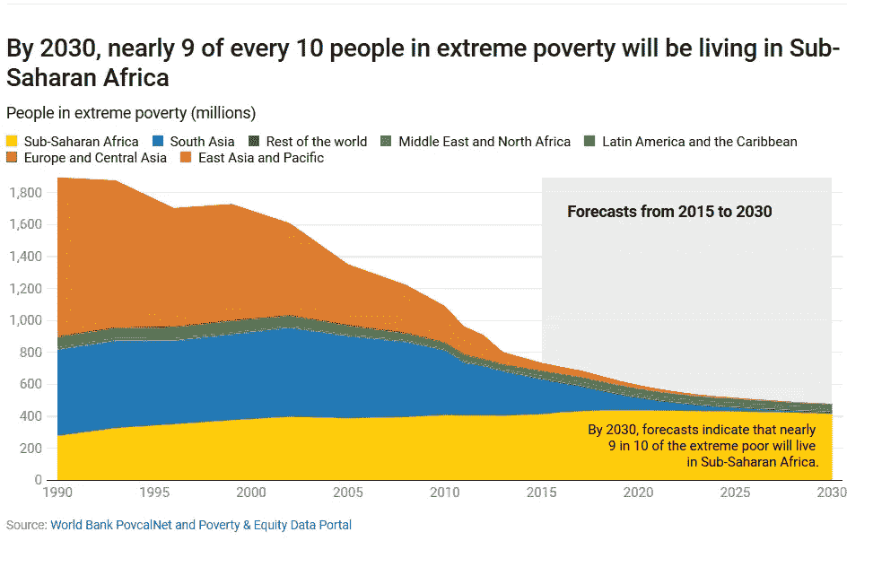
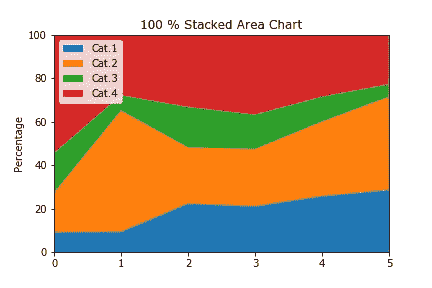

# 面积图:标准、堆叠和重叠:

> 原文：<https://towardsdatascience.com/area-charts-standard-stacked-overlapping-d9b77df5dec8?source=collection_archive---------24----------------------->

## **为什么&如何**

图片来自 Unsplash 的 Manny Moreno

面积图是折线图的一种形式，横轴和连接数据点的线之间的区域用颜色填充。它们用于传达总体趋势，而不关心显示准确的值。与折线图不同，轴和线之间区域的着色以更大的视觉力量传递趋势。

**如何**:面积图是二维的，有两个轴。习惯上，纵轴代表一个数量变量，而横轴是一条时间线或一系列数值区间。数据点由形成折线的线段连接，并且**折线和水平轴之间的区域用颜色或某种类型的阴影填充。**

面积图的示意图

面积图(AC)有四种类型:1)标准 AC；2)堆叠式 AC；3)堆叠交流百分比；4)交迭交流。

让我们分别分析每种类型:

1.  标准面积图(又名面积图):它们对于显示一个数值变量随时间的演变特别有效。这样做的目的是更加强调整体趋势以及连接数据点的线的波峰和波谷。相比之下，折线图更强调显示数字变量的精确值。

资料来源:国家大学政策秘书处

上图显示了 1950-2000 年间阿根廷大学生数量的变化。在 1976 年至 1983 年血腥的军事独裁统治期间，学生人数明显减少。如果没有面积图的视觉效果，同样的故事也可以用折线图来讲述。

就像条形图一样，您必须始终从 0 开始垂直轴。与折线图不同，如果修改基线，我们不可避免地会扭曲信息。

2.**堆积面积图**:就像几个面积图一个叠一个。在这种类型的图表中，有第三个变量，通常是分类变量，以及相应的数据系列。每一个数据序列的表示都是从前一个数据序列结束的地方开始的(**它们不重叠**)。最后一个数字表示所有数据的总和。

下面的堆叠式 AC 显示了世界上生活在极端贫困中的人们的历史数据和预测数据。纵轴代表数百万人，而横轴代表 1990 年至 2015 年期间的历史数据和 2015 年至 2030 年的预测数据。第三个分类变量是用不同颜色表示的世界区域。最高线的高度相当于某一年生活在贫困中的所有人的总和。该图清楚地展示了数据故事:南亚、东亚和太平洋地区的贫困率持续下降，而撒哈拉以南非洲却没有出现同样的情况。它还表明，在过去 30 年里，超过 10 亿人摆脱了极端贫困。

来源:世界银行，2018 年

现在信息不同了，因为堆积面积图被用来进行成分分析。这是一个典型的部分对整体的图表，其中每个地区(每个部分，每个地区)对整体(整体，生活在极端贫困中的人)的贡献。每个区域的高度代表每个特定类别的值，而最终高度是这些值的总和。

堆叠面积图在可视化时存在一些困难，因为视线移动到每条线的最大值。但是，由于每条线都沿着下面那条线的基线，每个特定的区域都受到下面那条线的强烈影响。因此，随着时间的推移，每一个特定的趋势都类似于下面的趋势。出于这些原因，一些作者警告我们在以下方面谨慎使用它们:“只要确保当你使用这种方法时，你的观众知道不要沿着每个部分顶部的线条斜率来看整体的一部分如何随着时间的推移而变化”(Stephen 少数，2011)。

比较上面的数字: **A，B & C 区域对于两个图表**有完全相同的数据值。堆栈底部的 A 区没有问题。但是看看 B 区(蓝色区域)。看起来它的总体趋势对于每个图都是绝对不同的。这是堆积面积图的真正问题:它们可能会误导人，因为每个区域都遵循下面区域的基线，并类似于其趋势。

此外，即使堆叠的 AC 创建引人入胜和丰富多彩的视觉效果，也要明智地使用它们，因为堆叠中超过四个或五个级别需要大量的视觉处理时间，并可能使观众困惑。

3.**百分比堆积面积图**(也称为 100%堆积面积图):就像前面的图表一样，几个区域堆叠在另一个区域的顶部，并表示第三个分类变量。这是一个部分对整体的图表，其中每个区域表示每个部分相对于类别总数的**百分比**。垂直轴的最终高度始终为 100%。这意味着图表顶部有第二条基线，有助于跟踪某些特定趋势。

**如何**:每一个不同的堆栈代表整体的不同部分。与堆叠面积图类似，堆叠不会重叠。与它们不同，垂直轴的范围总是从 0 到 100%。每个堆栈的高度表明**每个类别的百分比如何随时间变化**。在下图中，您可以通过观察不同颜色如何沿水平轴增长或收缩来了解不同的趋势。

百分比堆积面积图的示意图

当我们向上堆叠时，分类变量的项目之间的差异或贡献更难读取。相应的区域无法进行严格的比较，因为它们偏离了不同的基线。特别是，没有连接到底部或顶部基线的区域很难读取，因为它们受到其邻居的强烈影响(上图中的第 3 类)。

永远记住，你必须选择一个合适的调色板。你可以通过选择分类的、连续的或发散的调色板来赋予故事意义。

下面的 100%堆叠交流显示谷歌音乐时间线。这张图表提供了一张基于 Google Play 用户的粗略地图，显示了这些年来流派和艺术家的流行程度。它有一个互动的版本，你可以点击其中一个流派，并获得该流派当时最受欢迎的专辑列表。我喜欢这个图表，因为它清楚地强调了 60' & 70' 的进步摇滚是有史以来最好的音乐。

来源:谷歌音乐时间轴

就像堆积条形图一样(https://towards data science . com/stacked-bar-graphs-why-how-f1 b 68 a 7454 b 7)，我们仅在**相对差异**重要时使用 100%堆积面积图，而在**相对和绝对差异**重要时使用堆积面积图。

4.**重叠区域图**:在这种图形中，区域之间有一些重叠。颜色和透明度必须适当调整，以便可以很容易地看到特定的线条。它们让我们能够很好地比较不同的趋势。我们的建议是使用不超过两个区域，因为三个或更多区域的重叠(及其相应的重叠颜色)很容易混淆观众。

以下重叠 AC 显示了全球城市和农村人口的历史值和预测值。浅绿色阴影区域对应于农村人口，而浅蓝色对应于城市人口。与讲故事相关，图表显示，1960 年，地球上大约三分之一的人生活在城市，而在 2008 年，人类历史上第一次，城市人口超过了农村人口。此外，据预测，到 2050 年，城市人口将是农村人口的两倍。重叠的 AC 允许我们对各自种群的进化进行适当的比较，并以一种特别有效的方式传达故事。

来源:世界银行，2018 年

作为**最后的警告**，永远记住面积图很难阅读和解释，因为它们依赖于观众通过比较面积来解码数字信息的能力。我们更喜欢通过比较长度或高度来比较数值。通过矩形(条)的高度或坐标矩形中点和线的位置，我们可以很容易地跟踪基于趋势的数据可视化。因此，只使用 AC 来传达整体趋势和每个部分对整体的相对贡献，而不关心显示确切的值。面积图优先考虑数据的清晰性而不是准确性。

如果你对这篇文章感兴趣，请阅读我以前的:

簇状和重叠条形图，为什么和如何

[https://towards data science . com/clustered-overlapped-bar-charts-94 f1 db 93778 e](/clustered-overlapped-bar-charts-94f1db93778e)

堆积条形图，为什么和如何，讲故事和警告

[https://towards data science . com/stacked-bar-graphs-why-how-f1 b 68 a 7454 b 7](/stacked-bar-graphs-why-how-f1b68a7454b7)

*参考文献:*

*少数，Stephen，“组合时间序列和部分到整体关系的定量显示”，*[*https://www . perceptual edge . com/articles/visual _ business _ intelligence/Displays _ for _ Combining _ Time-Series _ and _ Part-to-Whole . pdf*](https://www.perceptualedge.com/articles/visual_business_intelligence/displays_for_combining_time-series_and_part-to-whole.pdf)

*谷歌音乐时间轴，*[*http://research.google.com/bigpicture/music/#*](http://research.google.com/bigpicture/music/)

*http://estadisticasuniversitarias.me.gov.ar/*

*世界银行，2018，*[https://www . world bank . org/en/news/feature/2018/12/21/year-in-review-2018-in-14-charts](https://www.worldbank.org/en/news/feature/2018/12/21/year-in-review-2018-in-14-charts)