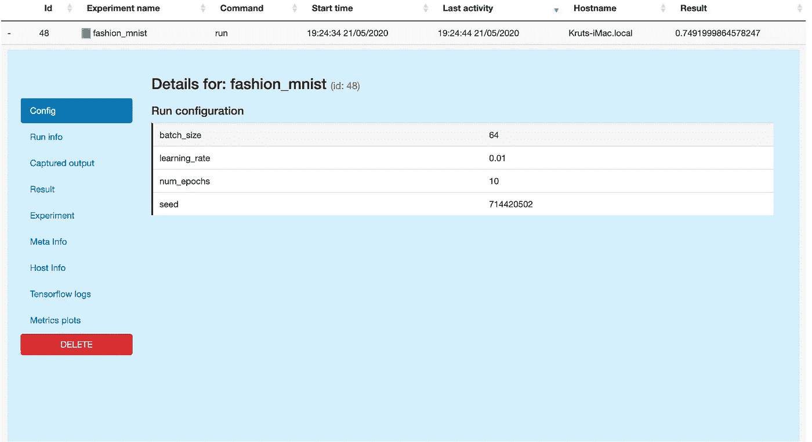
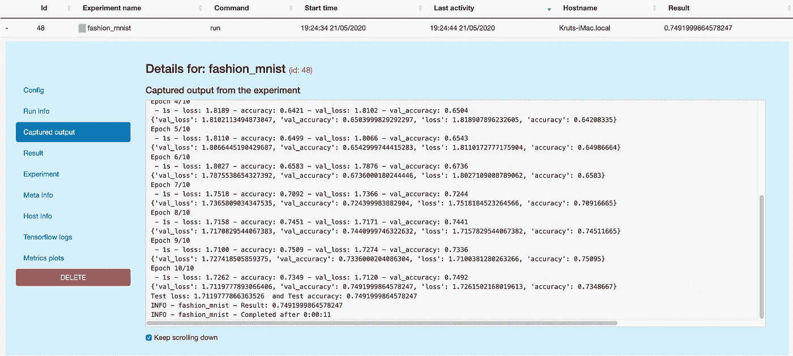
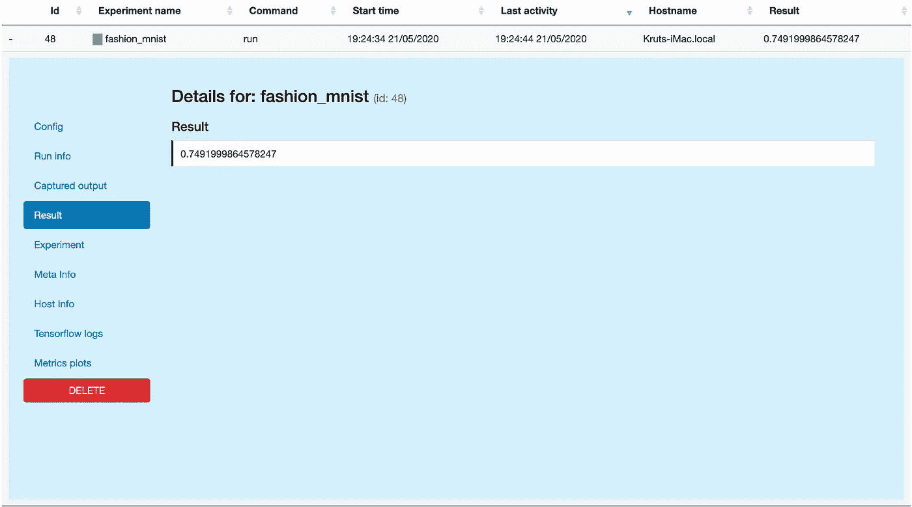
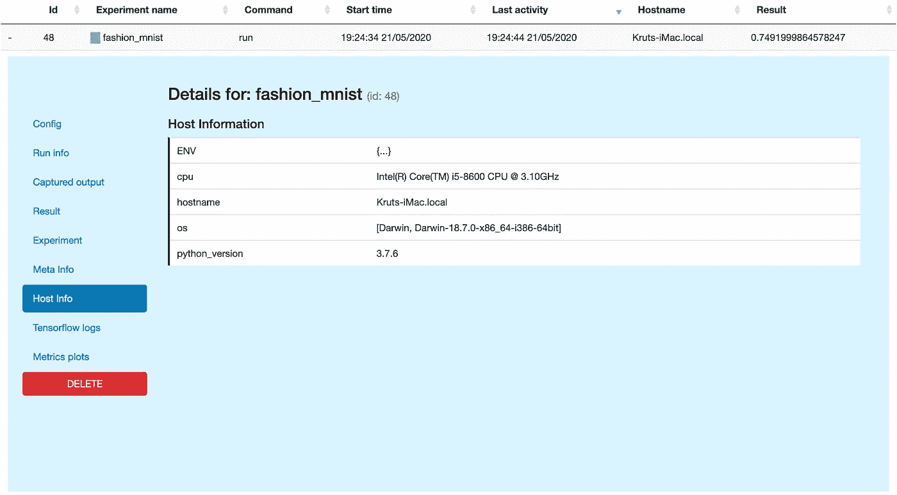
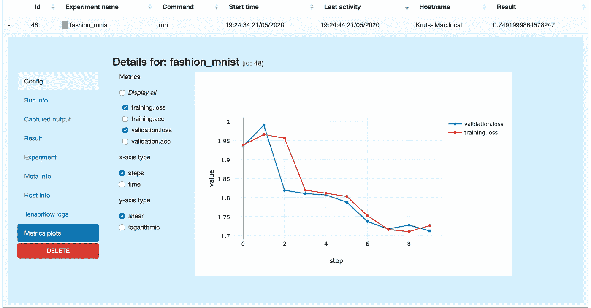
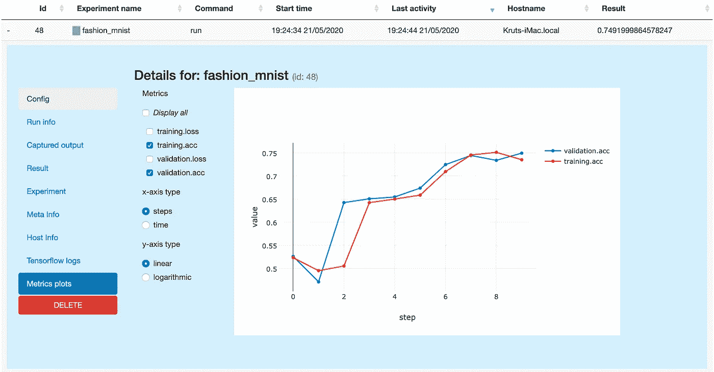

# 你所有的实验不都是神圣的吗？—使用 Sacred 管理您的机器学习实验

> 原文：<https://towardsdatascience.com/arent-all-your-experiments-sacred-managing-your-machine-learning-experiments-4f8a66be65ae?source=collection_archive---------40----------------------->


图片由 Luka 从 [Pexels](https://www.pexels.com/photo/analytics-blur-close-up-commerce-590020/)

你可能已经花了无数个小时来调整你的超参数，观察你的机器学习模型的性能指标和运行时间，当你想回到你以前的迭代时，你就是无法获得超参数或其他一些正确的配置来重新创建结果。作为一名研究人员，重要的是记录这些超参数和观察值，以便在需要时再次重现相同的结果。手动将它们记录在某个地方既乏味又容易出错，这会使您的进度落后几天。此外，很难理解你的日志，也很难长时间地重现实验。

假设你正在做一个简单的时尚 MNIST 分类项目，下面是你可能想出的用于训练和评估的代码:

该代码在每个时期具有三个配置参数`batch_size`、`num_epochs`和`learning_rate`以及四个性能度量`train loss`、`train accuracy`、`val loss`和`val accuracy`。此外，您可能希望跟踪`test accuracy`和`run-time`。为每个实验手动地做它是不令人兴奋的，并且你甚至可能有更多的度量想要为每个实验跟踪。

这就是神圣在画面中出现的地方。

> 每个实验都是神圣的
> 每个实验都是伟大的
> 如果一个实验被浪费了
> 上帝会非常生气

这是《神圣的:D》的标题

## 什么是神圣？

[神圣](https://github.com/IDSIA/sacred)是由 Instituto Dalle Molle di Studi sull ' intelligenza artificial e(id sia)开发的工具。它可以帮助您配置、组织、记录和重现您的实验。它旨在完成您在实际实验中需要做的所有繁琐的日常工作，以便:

*   记录你实验的所有参数
*   轻松运行不同设置的实验
*   在数据库中保存单次运行的配置
*   重现您的结果

## 神圣是如何工作的？

神圣连接到一个 MongoDB，并把所有关于实验的信息放入一个名为 experiments 的集合中的一个文档中。`MongoObserver`是神圣附带的默认观察者之一。神圣试图捕捉所有的输出，并将信息传送给观察者。

`Experiment`是神圣框架的中心类，收集大量关于运行的信息，像:

*   启动时间和停止时间
*   使用的配置
*   结果或发生的任何错误
*   运行它的机器的基本信息
*   实验所依赖的包及其版本
*   所有导入的本地源文件
*   用 ex.open_resource 打开的文件
*   使用 ex.add_artifact 添加的文件

## 安装神圣的

你可以像这样直接从 pypi 获得神圣:

```
pip install sacred
```

我们还需要安装 pymango，因为我们需要连接一个 MongoDB

```
pip install pymango
```

## 修改时尚 MNIST 分类脚本以使用神圣

下面是更早的脚本修改使用神圣。

我们首先创建一个名为`fashion_mnist`的实验实例`ex`，并将一个观察者链接到它。`MongoObserver`是圣物自带的默认观察者。你甚至可以使用其他可用的[观察者](https://readthedocs.org/projects/sacred/downloads/pdf/latest/#section.1.6)

```
ex = Experiment("fashion_mnist")
ex.observers.append(MongoObserver())
```

接下来，我们在用`@ex.config`修饰的函数`cfg()`中定义配置变量。这会创建一个配置范围，然后收集函数局部范围内定义的所有变量，并成为实验的配置条目。在我们的示例中，我们将`batch_size`、`num_epochs`和`learning_rate`视为配置变量。

```
@ex.config
def cfg():
    batch_size = 64
    num_epochs = 10
    learning_rate = 0.01
```

接下来，我们需要将脚本的模型训练和评估部分放在一个用`@ex.automain`修饰的函数内。这告诉实验文件在脚本运行时需要执行什么。这个函数将所有的配置变量和一个`_run`对象作为参数。`_run`对象表示并管理实验的一次运行。它存储与实验相关的所有信息，然后将这些信息写入观察器。如果您想了解更多关于`_run`对象的信息，请参考[和](https://sacred.readthedocs.io/en/stable/apidoc.html?highlight=_run#the-run-object)。

```
@ex.automain
def run(_run, batch_size, num_epochs, learning_rate):
    # importing the dataset
    fashion_mnist = keras.datasets.fashion_mnist

    (train_images, train_labels), (test_images, test_labels) = 
         fashion_mnist.load_data() # normalizing the images to 0 and 1
    train_images = train_images / 255.0
    test_images = test_images / 255.0 # setting up the model
    model = keras.Sequential([
        keras.layers.Flatten(input_shape=(28, 28)),
        keras.layers.Dense(128, activation='relu'),
        keras.layers.Dense(10, activation='softmax')
    ]) # compiling the model
    model.compile(optimizer=keras.optimizers.Adam(
        learning_rate=learning_rate),
        loss=keras.losses.SparseCategoricalCrossentropy(
                 from_logits=True
             ),
        metrics=['accuracy']) # training the model
    model.fit(train_images, 
             train_labels,
             batch_size=batch_size,
             epochs=num_epochs,
             validation_data=(test_images, test_labels),
             callbacks=[MetricsLoggerCallback(_run)],
             verbose=2)

    # evaluating the model
    test_loss, test_acc = model.evaluate(
                              test_images, 
                              test_labels, 
                              verbose=2) print('Test loss:', test_loss, ' and Test accuracy:', test_acc) return test_acc
```

我们还希望记录度量标准，如每个时期的训练和验证的损失和准确性。为此，我们定义了一个名为`MetricsLoggerCallback`的 Keras 自定义回调类，它有`on_epoch_end`方法。回调类将`_run`对象作为参数。`_run`对象有一个`[log_scalar](https://sacred.readthedocs.io/en/stable/apidoc.html?highlight=_run#sacred.run.Run.log_scalar)`方法，可以用来捕获指标。

```
class MetricsLoggerCallback(keras.callbacks.Callback):
    def __init__(self, _run):
        super().__init__()
        self._run = _run 

    def on_epoch_end(self, _, logs):
        self._run.log_scalar("training.loss", logs.get('loss'))
        self._run.log_scalar("training.acc", logs.get('accuracy'))
        self._run.log_scalar("validation.loss",
                             logs.get('val_loss'))
        self._run.log_scalar("validation.acc",
                             logs.get('val_accuracy'))
```

度量和日志也可以用一个用`@ex.capture` decorator 修饰的函数以不同的方式捕获，如这个[示例](https://sacred.readthedocs.io/en/stable/logging.html?highlight=ex.capture#integrate-logging-into-your-experiment)所示。

我们的`@ex.automain`修饰函数也返回`test_acc`值。该值存储在`_run`对象的`[result](https://sacred.readthedocs.io/en/stable/apidoc.html?highlight=result#sacred.run.Run.result)`属性中。它代表了我们实验的主要结果。

## 运行实验

为了运行实验，您需要在运行脚本时链接一个观察器，如下所示:

```
python fashion_mnist_sacred.py -m sacred_fashion_mnist
```

运行脚本时，您还可以从 cli 修改配置变量，如下所示:

```
python fashion_mnist_sacred.py with learning_rate=0.003 num_epochs= 20 -m sacred_fashion_mnist
```

一旦运行完成，你可以使用 Sacredboard 或任何其他由 Sacred 支持的[前端](https://github.com/IDSIA/sacred#frontends)来查看实验日志。

## 神圣纸板

[SacredBoard](https://github.com/chovanecm/sacredboard) 连接到 Sacred 使用的 MongoDB 数据库，显示实验列表、它们的状态、Sacred 的配置和运行程序的标准输出。

您可以用 pypi 安装它:

```
pip install sacredboard
```

在运行它时，我们需要将它与我们的观察者连接起来:

```
sacredboard -m sacred_fashion_mnist
```

启动后，您可能会看到所有实验的详细信息，如下图所示:



配置详细信息



捕获的日志



结果(即我们的 test_acc)



进行实验的主机信息



训练和验证损失



训练和验证准确性

## 从这里去哪里？

这只是让你的生活变得简单的一瞥。它有大量的其他功能，更多的功能仍在添加。如果你想进一步探索，他们的[文档](https://sacred.readthedocs.io/en/stable/index.html)非常详细。