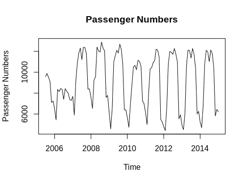
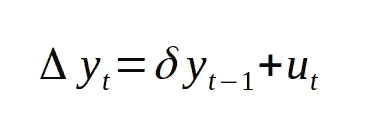
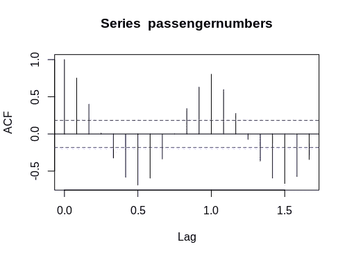
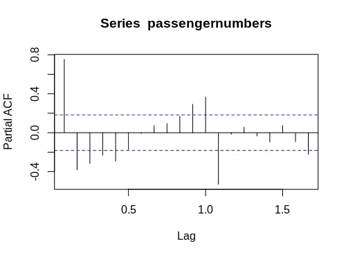
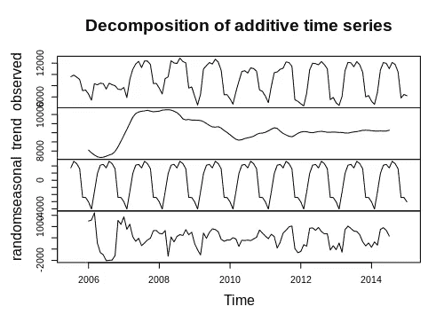
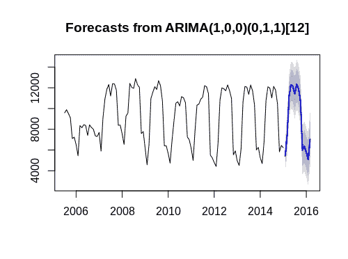
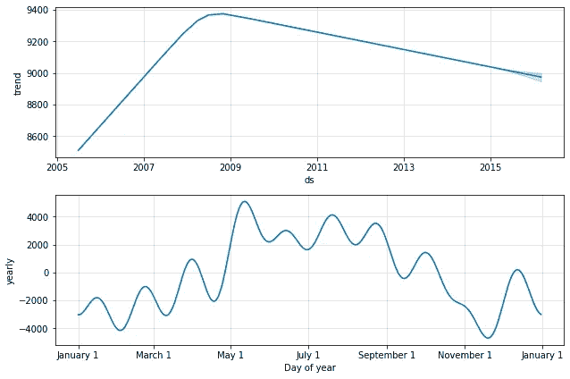
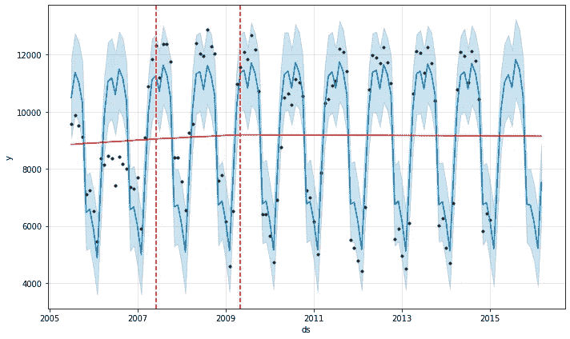

# ARIMA 与预言家:预测航空乘客数量

> 原文：<https://towardsdatascience.com/arima-vs-prophet-forecasting-air-passenger-numbers-4e01b2d93608?source=collection_archive---------12----------------------->

## 哪个型号性能更好？

这是我之前文章的后续: [*用 Prophet 进行时间序列分析:航空旅客数据*](/time-series-analysis-with-prophet-air-passenger-data-6f29c7989681)

在本例中，使用 R 构建了一个 ARIMA(自回归综合移动平均)模型，通过使用**三藩市国际机场关于航空公司月度客运量统计的报告来预测航空旅客人数。**

具体来说，对航空公司**荷航** (enplaned)调整后的乘客人数进行过滤，作为从 2005 年 5 月**到 2016 年 3 月**期间的时间序列进行分析。



资料来源:RStudio

结果将与 Prophet 获得的结果进行比较，以了解 ARIMA 相对于该模型的表现如何。

该模型在 90%的时间序列(训练集)上进行训练，序列的后 10%用于与预测(测试集)进行比较。

# ARIMA 的背景

ARIMA 模型由坐标(p，d，q)组成:

*   **p** 代表自回归项的数量，即用于预测未来值的过去时间值的观测值的数量。例如，如果 p 的值是 2，那么这意味着序列中的两个先前的时间观察被用于预测未来趋势。
*   **d** 表示使时间序列稳定所需的差异数(即具有恒定均值、方差和自相关的时间序列)。例如，如果 d = 1，则意味着必须获得级数的一阶差分，才能将其转换为平稳的级数。
*   **q** 代表我们模型中之前预测误差的移动平均值，或误差项的滞后值。例如，如果 q 的值为 1，那么这意味着我们在模型中有一个误差项的滞后值。

## 平稳性

说到预测，时间序列数据的一个关键假设是平稳性。这是一个序列的均值、方差和自相关是常数的地方。

这种假设的原因是，如果一个序列的均值、方差和自相关性在一段时间内不是常数，那么使用预测模型进行预测就会变得困难得多。

然而，正如我们上面提到的，ARIMA 模型中的 *d* 参数表示使序列稳定所需的差异数。当使用 R 中的 **auto.arima** 功能时，自动选择 *p、d、*和 *q* 值。

平稳性通常可以通过对数据的目视检查直观地表示出来。

我们再来看看时间序列。


资料来源:RStudio

我们可以看到——总的来说——时间序列显示出一种之字形模式，在一段时间内总体趋势几乎没有变化。

然而，这可以通过使用迪基-富勒测试进行正式测试。零假设是序列有一个单位根(非平稳)，另一个假设是平稳或趋势平稳。

单位根的测试如下:



来源:作者图片

对序列运行测试时，获得的 p 值为 0.01，这意味着在 5%的显著性水平上拒绝零假设，表明序列中存在平稳性。

```
> adf.test(passengernumbers)Augmented Dickey-Fuller Testdata:  passengernumbers
Dickey-Fuller = -8.061, Lag order = 4, p-value = 0.01
alternative hypothesis: stationary
```

## 自相关

ARIMA 的 **p** 参数说明了模型中自回归项的数量——这使得模型能够处理自相关。自相关是时间序列中不同观测值的误差项之间存在相关性的一种情况，这也会扭曲预测。

这是时间序列的 ACF(自相关函数)图(设置了 20 的最大滞后):



资料来源:RStudio

我们看到自相关在滞后 0 之后持续了两个月，在 6 个月和 12 个月期间持续了正相关和负相关。在这种情况下，滞后是按月计算的，因此 6 个月的周期表示为 **0.5** ，而 12 个月的周期表示为 **1.0** 。

部分自相关函数试图去除由每个观测值之间存在的固有线性函数产生的间接相关性。

这是该系列的偏相关图:



资料来源:RStudio

我们看到偏自相关函数在滞后 0 两个月后仍然显示相关性(尽管是负的)。因此，ARIMA 模型将需要以这样一种方式配置，以便考虑自回归项的正确数量。

以下是时间序列趋势组成部分的概述:

```
> components <- decompose(passengernumbers)
> components
```



资料来源:RStudio

当观察该系列时，大约每六到八个月就会观察到显著的季节性模式。考虑到这一点，ARIMA 模型将需要在其预测中考虑这种季节性。

# 使用 auto.arima 建模

给定自相关和季节性的视觉指示， **auto.arima** 用于自动生成许多具有不同 p、d 和 q 坐标的 arima 模型，然后根据具有最低 BIC(贝叶斯信息标准)的模型选择最佳模型。

```
> # ARIMA
> fitpassengers<-auto.arima(passengernumbers, trace=TRUE, test="kpss", ic="bic")ARIMA(2,0,2)(1,1,1)[12] with drift         : 1693.37
 ARIMA(0,0,0)(0,1,0)[12] with drift         : 1779.685
 ARIMA(1,0,0)(1,1,0)[12] with drift         : 1682.899
 ARIMA(0,0,1)(0,1,1)[12] with drift         : 1724.722
 ARIMA(0,0,0)(0,1,0)[12]                    : 1775.932
 ARIMA(1,0,0)(0,1,0)[12] with drift         : 1702.397
 ARIMA(1,0,0)(2,1,0)[12] with drift         : 1685.158
 ARIMA(1,0,0)(1,1,1)[12] with drift         : 1684.594
 ARIMA(1,0,0)(0,1,1)[12] with drift         : 1680.905
 ARIMA(1,0,0)(0,1,2)[12] with drift         : 1684.211
 ARIMA(1,0,0)(1,1,2)[12] with drift         : Inf
 ARIMA(0,0,0)(0,1,1)[12] with drift         : 1772.299
 ARIMA(2,0,0)(0,1,1)[12] with drift         : 1684.965
 ARIMA(1,0,1)(0,1,1)[12] with drift         : 1685.149
 ARIMA(2,0,1)(0,1,1)[12] with drift         : 1688.428
 ARIMA(1,0,0)(0,1,1)[12]                    : 1676.443
 ARIMA(1,0,0)(0,1,0)[12]                    : 1697.822
 ARIMA(1,0,0)(1,1,1)[12]                    : 1680.163
 ARIMA(1,0,0)(0,1,2)[12]                    : 1679.795
 ARIMA(1,0,0)(1,1,0)[12]                    : 1678.467
 ARIMA(1,0,0)(1,1,2)[12]                    : Inf
 ARIMA(0,0,0)(0,1,1)[12]                    : 1768.607
 ARIMA(2,0,0)(0,1,1)[12]                    : 1680.489
 ARIMA(1,0,1)(0,1,1)[12]                    : 1680.677
 ARIMA(0,0,1)(0,1,1)[12]                    : 1720.732
 ARIMA(2,0,1)(0,1,1)[12]                    : 1683.954Best model: ARIMA(1,0,0)(0,1,1)[12]
```

最佳模型配置表示为 **ARIMA(1，0，0)(0，1，1)【12】**。

该模型的系数如下:

```
> fitpassengers
Series: passengernumbers 
ARIMA(1,0,0)(0,1,1)[12]Coefficients:
         ar1     sma1
      0.7794  -0.5001
s.e.  0.0609   0.0840sigma^2 estimated as 585834:  log likelihood=-831.27
AIC=1668.54   AICc=1668.78   BIC=1676.44
```

# 准确(性)

ARIMA 模型生成以下预测:



资料来源:RStudio

RMSE(均方根误差)和 MFE(平均预测误差)如下:

*   RMSE: 698
*   **MFE:** -115

```
> # Errors
> library(Metrics)
> rmse(df$`Actual Passenger Numbers`, df$`Forecasted Passenger Numbers`)[1] 698.6527

> ## Forecast Error
> forecast_error=(df$`Actual Passenger Numbers`-df$`Forecasted Passenger Numbers`)
> forecast_error
 [1] -415.8149 -982.0972 -273.1147 -539.5008 -520.7138 -845.2062 -824.7485
 [8] -212.4401 -454.4602 1387.1299  962.7507  153.2876  257.2238  687.3703
> mean(forecast_error)[1] -115.7381
```

# 与先知的比较

ARIMA 和预言家之间的一个关键区别是，预言家模型解释了“变化点”，或时间序列中趋势的特定变化。虽然在 R 中用 ARIMA 实现这一点在技术上是可行的——但它需要使用一个名为 **AEDForecasting** 的独立包。

Prophet 通过使用一个加法模型来工作，从而使序列中的非线性趋势与适当的季节性(无论是每天、每周还是每年)相适应。

在这个特定的数据集中，趋势的转变发生在 2009 年之后，当时我们看到乘客需求的总体趋势出现了逆转:



来源:Jupyter 笔记本输出

标准 Prophet 模型适用于数据集，没有任何季节性的手动说明:

```
prophet_basic = Prophet()
prophet_basic.fit(train_dataset)
```

通过反复试验， **4** 个变化点被证明可以最小化 RMSE 和 MFE，因此被定义为模型中适当数量的变化点:

```
pro_change= Prophet(n_changepoints=4)
forecast = pro_change.fit(train_dataset).predict(future)
fig= pro_change.plot(forecast);
a = add_changepoints_to_plot(fig.gca(), pro_change, forecast)
```



来源:Jupyter 笔记本输出

RMSE 和平均相对误差的计算如下:

```
>>> from sklearn.metrics import mean_squared_error
>>> from math import sqrt
>>> mse = mean_squared_error(passenger_test, yhat14)
>>> rmse = sqrt(mse)
>>> print('RMSE: %f' % rmse)RMSE: 524.263928>>> forecast_error = (passenger_test-yhat14)
>>> forecast_error
>>> mean_forecast_error = np.mean(forecast_error)
>>> mean_forecast_error71.58326743881493
```

用 Prophet 分别得到 **524** 和 **71** 的 RMSE 和 MFE，误差明显低于用 ARIMA 得到的 **698** 和 **-115** 的误差。

从这个角度来看，虽然 ARIMA 解释了时间序列中的季节性和自相关性等模式——Prophet 在正确识别序列中的相关变化点方面表现出色——但这似乎提高了模型的预测准确性。

当预测具有更明确定义的趋势或不特别表现出季节性的数据时，ARIMA 可能会表现出色-我们在所讨论的数据集中看到了非常明显的迹象。但是，不存在季节性的其他情况可能不适合使用 Prophet。

# 结论

在本例中，我们看到:

*   如何配置 ARIMA 模型
*   时间序列中变化点的相关性
*   ARIMA 和 Prophet 在计算预报精度方面的比较

非常感谢您的阅读，欢迎提问或反馈。

*免责声明:本文是在“原样”的基础上编写的，没有任何担保。本文旨在提供数据科学概念的概述，不应以任何方式解释为专业建议。*

# 参考

*   [分析 Vidhya: SARIMA —使用 Python 和 R 预测季节性数据](https://medium.com/analytics-vidhya/sarima-forecasting-seasonal-data-with-python-and-r-2e7472dfad83)
*   [起重机—包装预测](https://cran.r-project.org/web/packages/AEDForecasting/AEDForecasting.pdf)
*   [data.world:空中交通乘客数据](https://data.world/data-society/air-traffic-passenger-data)(原始来源:[三藩市公开数据](https://data.sfgov.org/Transportation/Air-Traffic-Passenger-Statistics/rkru-6vcg))
*   [GitHub: facebook/prophet](https://github.com/facebook/prophet)
*   [机器学习掌握:自相关和偏自相关的温和介绍](https://machinelearningmastery.com/gentle-introduction-autocorrelation-partial-autocorrelation/)