# 武装自己选择你的第一个数据库

> 原文：<https://towardsdatascience.com/arm-yourself-to-select-your-first-database-8bc9008bf8ec?source=collection_archive---------28----------------------->

*您没有计算机科学背景，希望更好地了解数据基础设施如何影响您的业务或数据分析项目？这篇文章应该为您揭开数据库之谜。*

*为了更好地理解数据库选择的概念，您可以将它想象为选择从 A 点到 b 点的正确交通工具。
许多不同的交通工具可以让您从 A 点到 b 点。同样，许多数据库可以让您存储数据。
诀窍在于理解你的优先事项，以及你可以放弃什么。*

在当今世界，如果你正在建立一个企业，你可以获得的数据是一种资产。你必须想出如何最好地利用这一资产。在过去，企业家只会依靠直觉。但如今，数据正指引着未来的方向。从降低成本项目到寻找新的收入来源或改善客户体验，数据分析领域是当今公司的关键。
那么，您是否渴望利用您的数据来更好地服务您的客户或跟踪您的增长？在考虑进行任何分析之前，您应该考虑如何存储您的数据。数据存储的目标是允许您访问完整、准确且可查询的业务数据表示。
我在与企业家讨论时注意到，数据库的选择可能会令人困惑。大多数企业家似乎没有意识到数据库对其数据分析性能的未来可能产生的影响，从而影响到整体业务。数据库前景广阔，他们发现很难理解推动他们选择的数据库需求是什么。
阅读完这篇由 3 部分组成的文章后，您应该能够评估哪种类型的数据库(DB)最适合您当前的业务需求，并了解您选择的解决方案的局限性。

本文分为三个部分:

*   **第 1 部分—选择数据存储解决方案简介**
    选择数据库可能会让人不知所措。市场上有数百种数据库解决方案。
    将业务需求转化为技术数据存储需求也很复杂。
    这一部分向您介绍了数据库世界，并帮助您识别和优先考虑您的数据库需求。
*   **第 2 部分—用于克服大数据存储挑战的技术**
    五种主要技术用于克服传统关系数据库面临的大数据挑战:横向扩展、反规范化、灵活的模式、最终一致性、图形数据库。这部分解释了这些技术是如何工作的——包括解决了什么问题以及带来了什么缺点。
    *如果对技术角度不感兴趣，可以跳过这部分。*
*   **第 3 部分—关于选择数据库的可行见解**
    这一部分涵盖了传统关系型数据库可能无法满足您的数据库需求的五种边缘情况。对于每一个场景，我们都会向您推荐解决这些挑战的技术、目前非常适合这些要求的特定数据库解决方案，以及这些解决方案的利弊。
    在这五种边缘情况之外，建议从关系数据库开始，例如 PostgreSQL。你可以参考[这篇文章](https://www.stavros.io/posts/startup-mistakes-datastore/)和下面的*第一部分——“选择你的第一个 DB”部分*来理解这种说法背后的原因。

数据库领域正在快速发展。越来越多的数据库可以累积不同的技术，并尽量减少随之而来的权衡。了解 DBs 面临的典型技术问题及其当前的解决方案，将有助于您找到最适合您业务的 DB。

# 第 1 部分—介绍如何选择数据存储解决方案

*这一部分向您介绍了数据库世界，并帮助您识别和优先考虑您的数据库需求。*

例如，如果我们想从法国的巴黎到厄瓜多尔的明多，我们的要求应该是什么—时间、成本*、环境影响？*

## 简而言之的数据库历史

回顾 DB 的历史可以让你更好地把握 DB 的前景，并理解各种选择背后的动机。近五十年来，数据主要存储在关系数据库中。关系数据库允许你以一种整洁而有逻辑的方式组织数据:你可以用键列连接的表来组织数据。

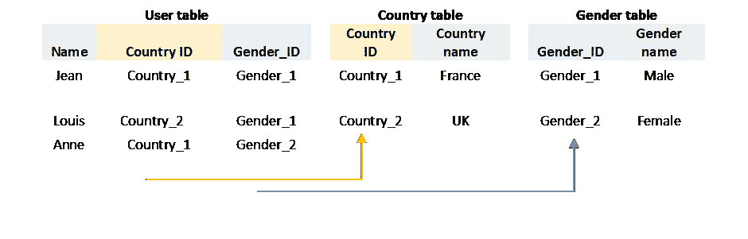

您可以在上面找到一个存储在关系数据库中的数据示例。

随着可收集数据量的增加，关系数据库面临着更高的性能要求和新的数据存储格式。“不仅仅是 SQL”(no SQL)数据库是为了解决这些新的数据挑战而开发的。然而，这些新类型的数据库只能解决特定的问题，这是以牺牲一些关系数据库的好处为代价的。
到目前为止，NOSQL 数据库有五种类型:文档存储、键值存储、宽列存储、搜索引擎、图形数据库。

您可以在上面的表格中找到六种主要类型的数据库以及这些数据库的开源示例。

请注意，本文中提到的数据库是每种数据库类型的 [db-engines 排名列表](https://db-engines.com/en/ranking)中的前两个开源数据库。开源数据库是指任何人都可以访问和修改源代码的数据库。

## 了解您的数据库用途

在列出需求之前，你应该试着用一句话概括 DB 要实现的总体目标。
举几个例子，您可能需要一个数据库来接收您的企业在给定期间产生的所有交易。您可能需要一个数据库来对历史数据进行分析。在 web/移动应用程序的情况下，您可能需要一个数据库来支持应用程序后端的实时查询。
所有这些用例都意味着不同的需求，因此会有不同的最适合它们的数据库。
到目前为止，还没有哪种数据库能够同时解决所有的数据存储挑战。这就是为什么在开始选择练习之前，你应该确保对你的主要目标有一个清晰的想法。数据库的第一个目的应该是允许你优先考虑你的需求，并在权衡各种数据库的利弊时支持你。

## 了解您的数据库要求

选择数据库时，您应该按照重要性顺序列出您的数据库要求，并确保您了解您正在考虑的解决方案的利弊权衡。

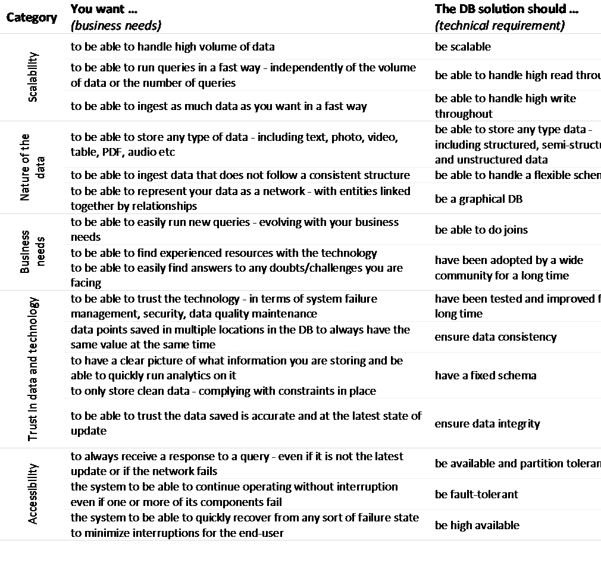

*您可以在上面找到业务需求列表，以及这些需求如何转化为技术需求。*

## 选择您的第一个数据库

如果您还不知道您的业务和性能需求，强烈推荐使用[关系数据库](https://www.stavros.io/posts/startup-mistakes-datastore/)。
事实上，只有当您知道您的数据库需求时，您才能评估关系数据库是不可行的，并为您的业务选择正确的 NOSQL 数据库。有许多不同的 NOSQL DB 类型，它们不能解决相同的问题。如果没有您的数据库需求，您将无法选择正确类型的 NOSQL 数据库。
您也可能会失去关系数据库的主要优势，却不知道自己在牺牲什么，例如数据一致性。数据一致性确保数据库中没有矛盾的信息，并且所有数据点都符合适当的约束。在关系数据库中，这是由表周围的固定模式允许的——这在大多数 NOSQL 数据库中是不存在的。此外，关系数据库已经被测试和使用了很长时间。因此，技术更稳定，社区更大(这使得寻找资源或解决问题更容易、更便宜)。
最后，尽管当前存在 NOSQL 趋势，但您应该记住，NOSQL 数据库是为了解决特定的大数据难题而开发的。NOSQL 数据库并不意味着要取代关系数据库。如果您正在开始一项新业务，您很可能不需要数据库来立即解决大数据挑战。

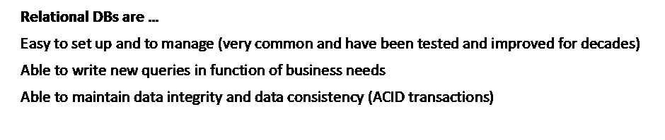

*你可以在上面找到关系数据库的三个主要优势。*

## 最后的想法

随着业务的增长，您的数据库需求也将随之发展，您的数据架构也将随之发展。
通常情况下，最终会形成一个由多个数据库组成的混合结构，以解决数据流不同点的各种挑战。
目前，这第一步不应该是解决您不确定的未来问题，而应该是建立数据架构的基础，让您拥有未来。

# 第 2 部分—用于克服大数据存储挑战的技术

*这一部分解释了主要的 NOSQL 技术是如何工作的——包括解决了什么问题，带来了什么缺点。*

依靠不同技术的各种引擎可以让我们从欧洲一直旅行到南美洲。

## 横向扩展—增加存储容量

**什么是横向扩展？** 扩展数据存储系统的目标是增加其整体存储容量。您可以“横向扩展”或“纵向扩展”。横向扩展或“水平扩展”是指通过增加机器数量来提高解决方案的性能。与扩大规模或“垂直规模”相反，后者是指增加机器的大小。
向外扩展时，数据分布在机器网络的不同节点上。能够向外扩展的系统称为分布式系统。

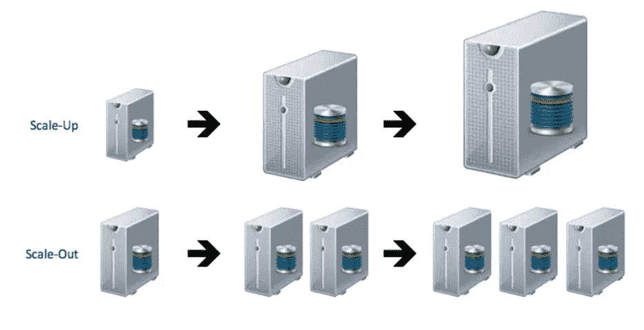

*您可以在上面找到纵向扩展与横向扩展的* [*插图*](https://interviewbubble.com/what-is-the-difference-between-scaling-horizontally-vs-scaling-vertically-scale-up-vs-scale-out/) *。*

**为什么要横向扩展？** 纵向扩展的主要优势在于，在增加数据存储容量时，您无需更改任何数据库管理流程。缺点是您的增长受到硬件的限制，前期成本很高，并且您有更高的系统故障风险。
您的增长能力有限，因为您只能通过购买更大的硬件系统来增加存储容量。换句话说，你被市场上可用的技术所限制。
此外，前期成本很高，因为每次您想要增加存储容量时，都需要购买新的更高性能的硬件。
最后，您有更高的系统故障风险，因为如果管理数据的一台机器出现故障，那么您的整个系统都会出现故障。
横向扩展解决了所有这些问题。
首先，当增加你的存储容量时，你只需要在网络上增加新的机器，所以理论上，你有无限的存储容量。
其次，买多台正常尺寸的机器比买一台性能异常的机器便宜。第三，通过增加机器的数量，你增加了其中一台机器发生故障的风险。因此，这些过程被认为是通过在网络的几个节点中复制数据来降低机器故障的风险。换句话说，即使一个或多个组件出现故障，向外扩展的系统也会继续运行。

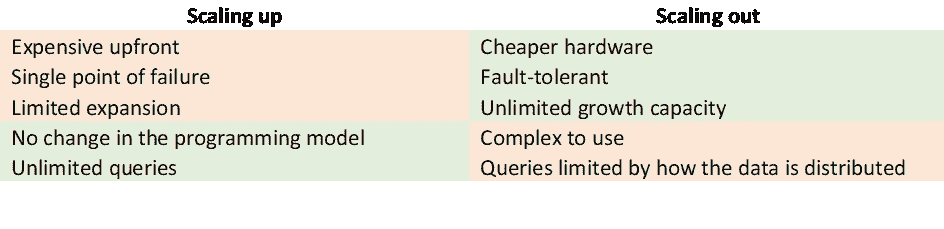

*您可以在上面找到纵向扩展与横向扩展的优缺点。*

**横向扩展有什么缺点，为什么？

此外，根据上限定理，分布式系统必须在一致性、可用性和分区容差之间做出选择，并且不能累积这三个属性。
如果位于不同节点的所有副本始终具有相同的值，则系统是一致的。另一种理解方式是，当您读取数据库时，您应该总是在网络的任何位置更新最新的值。
如果每个非故障节点在合理的时间内返回对所有读写请求的响应，则系统可用。
如果一个系统即使在节点间的通信中断时仍能继续工作，则该系统是分区容忍的。另一种理解方式是，系统可以承受任何数量的网络故障，而不会导致整个网络瘫痪。
总结一下 CAP 定理，在分布式系统中，当出现故障时，您必须在数据的可访问性和数据的一致性之间做出选择。
*你可以在下面找到一个例子来帮助你理解 CAP 定理。***

> 让我们举例说明这个定理，以便更好地理解为什么这三个属性不能累积:
> 让我们考虑两个节点 A 和 B，每个节点上有复制的数据。如果两个节点 A 和 B 之间的通信失败，分区容差要求系统继续工作。如果您想要一致性，您需要节点 A 或节点 B 充当不可用(否则您可能在 A 和 B 上有不同的值),因此您将有一个不会响应的非故障节点，您将失去可用性。按照同样的逻辑，如果您希望保持可用性并让两个非故障节点做出响应，您可能会从节点 A 和节点 B 获得不同的值，因为它们不再通信，从而失去了一致性。为了保持一致性和可用性，您需要两个节点进行通信，以确保它们具有相同的值，因此您会失去分区容差，也就是说，即使网络出现故障，系统也应该能够运行。

最后，跨节点分布数据限制了连接的能力。根据数据的分布情况，您可能无法完成所有可能的[连接](http://you can picture "joins" as VLOOKUP operations in excel)。如果要连接的数据点没有保存在同一个节点上，则连接可能会失败，并且不会返回所需的结果。不能进行连接限制了可以对数据进行的查询的多样性，因为这意味着您只能逐个查询每个表。

## 非规范化—提高查询的性能

**什么是反规范化？**
要理解反规格化，我们先来理解什么是规格化。标准化旨在减少数据冗余(数据的复制)并提高数据一致性。换句话说，通过将每个数据点都放在一个地方，您可以确保自己有一个单一的真实来源，并避免在一个数据点的不同位置有不同的值。标准化还减少了用于存储数据的空间，因为每个数据点只存储在一个位置。
另一方面，反规范化是引入数据冗余来构建自动足够的表格。换句话说，回答业务查询所需的所有信息都存储在每个表中，即使这意味着一些信息在多个表中重复。

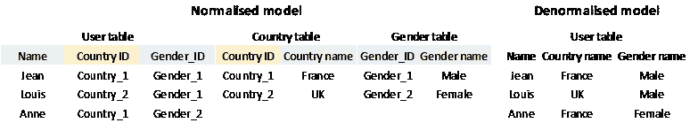

*你可以在上面找到一个数据模型规格化与反规格化的例子。*

**为什么要反规范化？**
反规范化的主要目标是提高读取性能。当使用反规范化时，您可以根据您将要询问的查询来创建表。您将所有需要的信息都存储在同一个表中，以便轻松快速地访问。
让我们用一个标准化模型来说明相反的逻辑。在规范化模型中，数据不会跨表复制，只存储在一个位置。当查询数据时，您将不得不执行大量的[连接](http://you can picture "joins" as VLOOKUP operations in excel)，从而降低查询的性能。

**反规格化的缺点是什么，为什么？** 复制数据的一个主要缺点是数据一致性下降。通过在不同的位置复制数据点，您就有可能在不同的位置拥有相同数据点的不同值。
此外，更新数据和写入新数据可能会更加复杂，因为您必须确保在所有位置写入或更新数据。

## 灵活的模式—提高接收数据的性能

**灵活模式是什么意思？** 要理解什么是灵活模式，我们先来理解什么是 DB 模式。
DB 模式是如何组织数据的框架，包括所有不同的数据概念(可以在公共主题下分组的数据点)、链接这些数据概念的所有关系以及对所有数据点的约束。
具有灵活模式的数据库是可以存储不遵循任何特定结构并且不必遵守任何配置约束的数据的数据库。

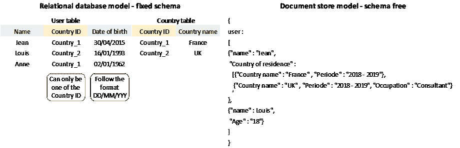

*您可以在上面找到一个固定模式和灵活模式的数据模型的例子。*

**为什么要使用灵活的模式数据库？
灵活的模式可以接收任何类型的数据，因为任何模式都没有强制约束。
写入数据的性能得到了提高，因为对于要摄取的数据的结构或格式不再有任何限制。灵活的模式数据库可以适应任何新类型的数据，而不必了解新数据如何与其他数据相适应——因为，同样，对数据的组织方式没有限制。最后，设计固定模式既复杂又耗时。不必在每次新类型的数据进来时都执行这一步，这样可以节省时间。**

灵活模式数据库的缺点是什么，为什么？
DB 模式允许您了解数据中有什么，并在存储更多数据的同时保持数据质量。数据质量确保存储的数据是可信的，并且可以用来获得业务洞察力。数据质量通过准确性、完整性、一致性等因素来衡量。对于企业来说，理解数据库应该能够保持的数据质量水平是一件头等大事。
跳过 DB 模式会降低数据质量，最终可能会得到质量差的数据。例如，您可能有错误或没有值的数据点，而您对此一无所知。
此外，因为对数据没有任何约束，也因为没有维护任何类似关系的结构，所以灵活的模式数据库不能执行[连接](http://you can picture "joins" as VLOOKUP operations in excel)。事实上，您将无法找到一个一致的键来连接您的数据。

## 最终一致性—提高查询的性能

最终一致性是什么意思？
要理解什么是最终一致性，我们先根据 CPA 定理定义来理解什么是一致性。
如*第 2 部分—横向扩展章节*所述，如果位于不同节点的所有副本始终具有相同的值，则系统是一致的。
另一方面，最终的一致性只要求更新在需要的时间内到达所有系统。换句话说，您可能在某个时间点有不一致的数据，但是如果您等待足够长的时间，它应该在所有位置都是相同的，并且处于最新状态。

**为什么使用最终一致性？** 如*第 2 部分—向外扩展章节*所述，根据 CAP 定理，在系统故障的情况下，分布式系统无法同时满足响应性和一致性。为了尽可能地满足这两个要求，系统一直以最终一致性为目标，而不是以完全一致性为目标。
此外，最终一致性还可以通过在写入操作仅排队时考虑写入操作已完成来加快写入过程。

最终一致性的缺点是什么，为什么？
直接的缺点是最终的一致性并不是纯粹的一致性——因此你接受了一个数据点的多个版本同时存储在不同位置的可能性。此外，这意味着在查询数据时，您可能无法获得该数据点的最新版本。
如果你想了解更多关于最终一致性的内容，我建议你看看[碱法和酸法](https://www.freecodecamp.org/news/nosql-databases-5f6639ed9574/  https://medium.com/@katrinagarloff/databases-acid-and-base-simplified-5b0cc5350e90)。

## 图形数据库—管理具有复杂关系的数据

**什么是图形数据库？** 图形数据库是不仅存储数据点，还存储链接数据点的关系的数据库。在图 DB 中有两个主要元素，节点(或实体)和边(或关系)。每个节点代表一个概念，如一件事或一个人，通过边链接到其他节点，并由其唯一标识符、传入/传出边及其属性来定义。

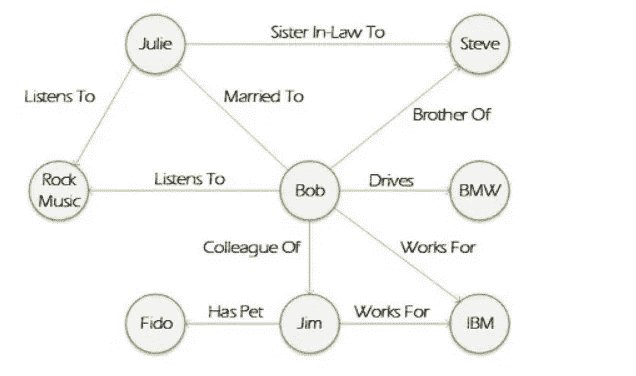

*你可以在上面的* [*中找到一个 graph DB 数据模型的例子*](https://whatis.techtarget.com/definition/graph-database) *。*

**为什么要使用图结构？** 如果存储的数据是高度相关的，使用图形数据库有很多好处。事实上，我们甚至可以说图形数据库比关系数据库更适合于高度相关的数据。图形数据库的主要优点是处理查询的速度和模式的灵活性。
图数据库具有所谓的无索引邻接性质。每个节点和每个边只存储它的邻居信息。它允许查询只遍历需要分析的数据。换句话说，当使用图形数据库运行查询时，查询不必扫描所有数据库，因此查询速度更快。此外，图形数据库支持灵活的模式。换句话说，您不需要预先对数据建模，也不需要构建预定义的数据存储结构。您只能在节点和边到来时更新它们。

**graph DB 有哪些弊端，为什么？** 图形数据库尚未成熟。图形数据库提出了一种不同于关系数据库的替代方案，因此图形技术的采用比其他 NOSQL 数据库要慢一些。例如，MongoDB(一个文档存储 NOSQL DB)于 2009 年发布，在 DB-engines 流行度排名中排名第 5，而 Neo4j(一个图形 DB——也是 NOSQL)于 2007 年发布，目前排名第 22。因为该解决方案比其他类型的 NOSQL DB 经过的测试和扩展更少，所以 graph DB 的经验更少。
Graph DB 当前状态是求解复杂关系分析。然而，图形数据库在它所能处理的容量方面是有限的。大多数图形数据库都不能横向扩展，因此管理不断增长的数据量并不是现成的。

# 第 3 部分—关于选择数据库的可行见解

*这一部分涵盖了关系数据库可能无法满足您的数据库需求的五种边缘情况。对于每一个场景，我们都会向您推荐解决这些挑战的技术、目前非常适合这一要求的特定数据库解决方案，以及这些解决方案的利弊。*

那么，你想去哪里？

## 关系数据库可能无法满足您需求的五种极端情况是:

*   **我希望能够处理大量数据**
    您还不知道将如何使用您存储的所有数据，但如果您今天不存储这些数据，您可能会丢失明天的宝贵信息。为了确保你不会失去这种潜在的价值，鼓励你收集和保存尽可能多的数据。
*   **我希望能够存储任何种类的数据** 我们特意选择了“任何种类的数据”这个词来说明世界上存在的各种数据。数据可以来自不同的来源(企业内部或外部)，以不同的格式(如文本、照片、视频、表格、PDF、音频等)，可以由人或机器生成，可以很容易地获取信息，或者可能需要大量的工作才能获取信息。
*   **我希望能够以快速的方式运行查询，与要处理的数据量或同时执行的查询数量无关** 网站和应用程序是用户与企业互动的主要窗口。响应时间是关键——如果您的用户等待太久，他们只需点击一下就可以寻找其他选项，或者放弃他们不确定的交易。同时与您的应用程序交互的用户数量或处理的数据量会极大地影响响应时间。
*   **我希望能够以快速的方式摄取尽可能多的数据** 随着物联网、移动应用和社交媒体的兴起，可供企业收集的数据每天都在增加。这一要求与存储容量无关，而是与快速存储大量数据的能力有关。它必须足够快，才能存储大量数据，而不会破坏系统或丢失数据点。
*   **我希望能够处理具有复杂和/或有价值关系的数据** 数据点的集合在两个方面有价值:每个数据点和组合数据点包含什么信息，以及数据点是如何连接的。虽然可供存储的数据量在快速增长，但企业了解他们可以访问的数据中有哪些是有价值的，这一点非常重要。它可能是一段时间内多次交易的价值，也可能是这些交易之间的联系以及导致它们发生的潜在原因。根据您的优先级，不同的数据库类型会更适合您的用例。

## 我希望能够处理大量数据，这可以通过“横向扩展”来解决

**您的数据存储需求是什么？** 如果您已经收集了数据，您可以通过对您当前的数据存储空间应用一个增长因子来估计您未来的数据存储需求。例如，如果您的增长是由您的用户数量推动的，您可以将您当前的数据存储空间乘以您估计的用户增长。
如果您没有收集到任何数据，您可以粗略估计一段时间内您将收集的数据点的数量。
*您可以在下面找到一个如何估算未来数据存储需求的示例。*

> 让我们考虑一下书店的例子。如果您希望每周产生 Y 笔销售，并且每笔销售都以 N 个数据点(账面价格、交易日期和时间、客户 ID 等)为特征，您可以估计在一年内，您将在 DB 中累积 Y x 52(一年中的周数)笔销售(或行)x N 笔销售特征(或列)。然后，您可以参考下表来评估公共关系数据库是否能够处理如此大量的数据。

本练习中要考虑的一个更重要的因素是，在将数据移动到另一个存储空间之前，将数据存储多长时间是合适的。

**对于关系数据库来说，有多少数据实际上“太大”而无法处理？** DB 引擎提供商分享[性能容量指标](https://en.wikipedia.org/wiki/Comparison_of_relational_database_management_systems)。您可以使用这些准则来确定关系数据库是否能够处理您的大量数据。

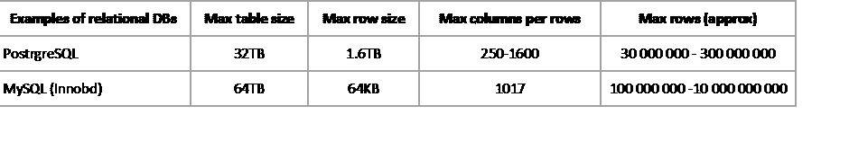

*你可以在上面找到 PostgreSQL 和 MySQL 的关键性能指标——两个关系数据库。*

您应该注意到，最大列数和最大行数的范围很宽。这些容量限制受其他参数的影响，例如数据的编码技术和数据模型。编码技术是数据在计算机中的存储方式。
数据模型指的是组织数据的方式。例如，通过标准化你的数据，你可以节省大量的存储空间。规格化在本文的*第 2 部分——反规格化章节*中有详细解释。

**什么数据库可以处理大量数据？** 为了管理大量数据或者能够快速增加存储容量，您的数据库需要能够横向扩展。您可以参考*第 2 部分—向外扩展部分*来深入了解向外扩展技术。如今，关系数据库可以横向扩展。然而，没有为此目的而设计的。换句话说，关系数据库并没有被优化为在分布式服务器上运行，也不是开箱即用的。
另一方面，除了图形数据库之外的所有 NOSQL 数据库都被认为能够向外扩展。它们都能够在分布式系统上快速运行。

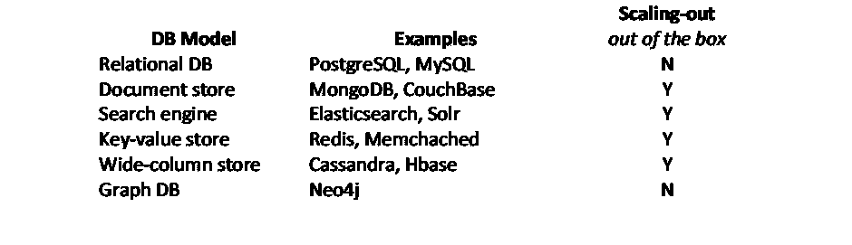

*您可以找到以上针对横向扩展进行了优化的数据库类型和示例。*

从业务影响的角度来看，这些 DBs 有哪些缺点？
如*第 2 部分—横向扩展章节*中所述，横向扩展的第一个缺点是在系统出现故障的情况下，必须在能够访问数据和能够读取数据库上的最新更新之间做出选择。另一个缺点是很难在分布式系统中进行[连接](http://you can picture "joins" as VLOOKUP operations in excel)。让我们讨论一下这对您的企业意味着什么。为了在可用性和一致性之间做出选择，你应该回顾你的需求和你的主要目标。
如果您的数据库正在为一个实时应用程序提供服务，那么在系统出现故障的情况下，您不能允许它有任何停机时间。这意味着可用性是必须的，你必须放弃一致性。
如果您的企业需要确保多个用户始终拥有相同的数据视图，例如，如果您正在管理库存，那么您不应该在物品短缺的情况下向不同的客户销售相同的物品。您需要保持一致性而不是可用性。
关于无法进行连接，这对企业意味着什么？
表示只能逐条表查询数据。换句话说，它限制了您可以在数据库上执行的查询，并迫使您根据将要执行的查询对数据建模，而不是根据数据本身对数据建模。具体地说，如果您有新的查询要运行，您很可能必须创建新的表。因此，更难适应不断变化的业务需求。在关系数据库中，数据库是根据数据建模的，您可以在其中执行连接，您的查询可以随着您的业务需求而发展，而不必重新建模数据库。

## 我希望能够存储任何类型的数据—可以用“灵活的模式”来解决

**您正在收集哪些不同的数据类型？** 在选择您的数据库之前，您应该列出您想要存储的不同数据元素，并确定它们的来源、创建者、结构级别和类型。
他们的来源至少应该区分内部数据和外部数据，并且最好应该告知是什么系统生成了这些数据。
它们的创造者应该区分这些数据是由人类还是由机器制造的。它会提示您预期的数据质量水平，以及潜在的转换或检查，您应该在接收数据之前应用。
它们的结构级别可以通过以下三个类别之一来限定:结构化数据、半结构化数据和非结构化数据。简而言之，数据的结构化程度可以看作是从数据中提取信息的难易程度。结构化数据被有逻辑地和一致地组织起来(例如:表格),允许你直接从数据中获取有用的信息。而非结构化数据必须经过处理才能从数据(如文本、表格、图像、视频等)中提取有价值的见解。
它们的类型指的是存储数据的格式。docx，xlsx，。jpg，。wmv 等)。

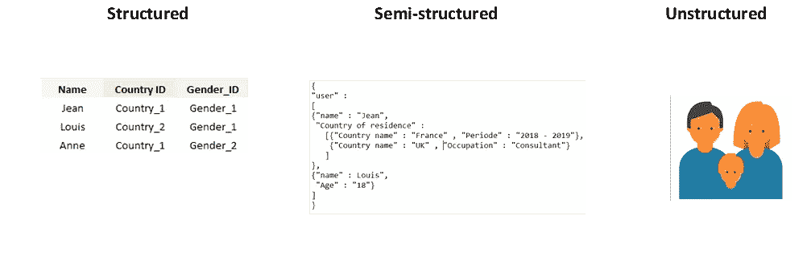

*你可以在上面找到结构化、半结构化和非结构化数据的例子。*

你能用关系数据库收集这些数据类型吗？
来源和创建者不应该影响数据是否可以存储。
关系数据库只能存储结构化数据。关系数据库要求要存储的数据可以用预定义列组织成类似表格的结构。半结构化和非结构化数据不符合这一要求，因此如果您要存储半结构化或非结构化数据，您应该寻找 NOSQL DB 解决方案。
关于数据类型，在关系表中存储任何可能的数据类型在技术上是可能的。然而，它会吃掉大量的存储空间，却没有太多的附加值。在这种情况下，建议存储文件的标题或路径，并将实际文件放在 DB 之外。

**什么类型的 NOSQL DB 可以处理哪些具体的数据类型？** 根据要存储的数据结构，您可以找到最适合您需求的数据库。
键值存储，顾名思义，只存储一个键和值。您可以通过使用键来检索存储的值，除了这些二元关系之外，几乎不维护任何结构。
文档存储类似于键值存储，但是具有扩展的存储选项。使用文档存储，不仅可以存储成对的键值，还可以将这些键值组合成集合，或者将它们嵌套在一起。
宽列存储，顾名思义，以列的形式存储数据。让我们举个例子来形象化它的意思。
*你可以在下面找到一个行存储数据的例子和一个行存储数据的例子。*

> **按行存储的数据(关系数据库中的数据):**
> 用户、国家、性别
> 1:法国吉恩，男性
> 2:英国路易斯，男性
> 3:法国安妮，女性
> 
> **存储在列中的数据(宽列存储中的数据):**
> 用户，国家，性别
> 1:让，2:路易斯，3:安妮
> 2:法国，2:英国，3:法国
> 1:男性，2:男性，3:女性

与使用关系数据库运行分析相比，这种结构允许使用宽列存储运行更快的分析。此外，与其他 NOSQL 数据库相比，宽列存储允许维护类似表格的结构。

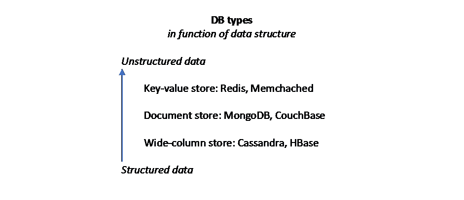

*你可以根据要存储的数据结构找到上面推荐的 DBs。*

**就业务影响而言，这些 DBs 的缺点是什么？** 正如在*第 2 部分—灵活模式章节*中所解释的，灵活模式的主要缺点是失去了数据质量，并且失去了对存储内容的跟踪。让我们讨论一下这对您的企业意味着什么。鉴于你要存储的数据将是半结构化或非结构化的，从中提取洞察力将更加困难。存储这些数据只会推迟清理数据和找出如何利用数据的过程。此外，存储这些数据可能会给你一种建立某种资产的感觉，你可以从中创造价值。然而，在你弄清楚如何使用这些数据之前，你不能给你存储的东西赋予任何价值。换句话说，你正在失去对一项资产的清晰性，这项资产可能非常有价值，或者根本没有价值。

## 我希望能够以一种快速的方式运行查询——可以通过“反规范化”来解决

您的数据库的响应速度应该如何？
根据您的数据库的用途，您可能需要不同级别的响应时间。
如果您的数据库位于面向客户端的应用程序的后端，您需要确保您的响应时间足够短，以让客户端满意。根据用户在应用程序上执行的操作类型，进行了许多研究来了解响应时间限制。给你一个[的例子](https://github.com/Tendrl/documentation/wiki/Best-Practices-for-Response-Times-and-Latency)，建议任何对用户动作的响应持续时间少于 1 秒。
另一方面，如果您的数据库是为了内部目的而运行分析，您可以更加灵活地组织您的团队来适应数据库的处理时间。

如何评估关系数据库是否能够处理您所需的读取吞吐量？
如果您已经收集了数据并可以对其运行查询，那么您可以收集性能信息并评估您的数据库是否符合您的响应时间要求。
如果您还没有收集到数据或者还不能在您的数据库上运行查询，您可以参考*第 3 部分“我希望能够处理大量数据”一节中提到的容量指标*。如果要分析的数据量接近存储容量上限，那么查询将会非常耗时。

**什么类型的 NOSQL 数据库可以处理高读取吞吐量？** 响应时间不仅受数据量的影响，还受查询和数据模型的影响。
查询优化调查运行和构建查询的不同方式，并比较它们的性能。非规范化的数据模型允许查询运行得更快，因为所有的信息都存储在一起。
此外，使用分布式系统，您可以并行操作并减少整个查询的时间。如上所述，关系数据库可以在分布式系统上运行，但这并不是它的目的。一些 NOSQL DB 类型已经过优化，可以在分布式系统上运行。
根据您想要执行的操作，不同的数据库最适合您的需求。

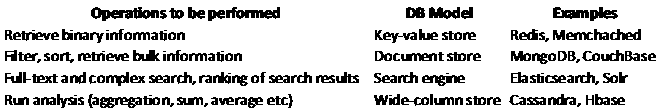

*您可以在上面找到多个操作示例和推荐的数据库。*

从业务影响的角度来看，这些 DBs 有哪些缺点？
如*第 2 部分——反规格化章节*所述，反规格化的主要缺点是降低数据一致性。让我们讨论一下这对您的企业意味着什么。
数据一致性确保数据库上同时运行的所有读取操作返回相同的值。具体来说，如果你的数据库被用在网站的后端，并且网站的一些标签上的信息没有在所有的标签上更新，它会使你的网站混乱并损害你的可信度。
如*第 2 部分—最终一致性章节*所示，如果您通过追求最终一致性来损害数据一致性，这意味着您的目标是在某个时间点拥有一致的数据，但不一定是在任何时间。换句话说，它不允许你运行实时分析。
最后，如果您还没有阅读过*第 2 部分—横向扩展部分*，因为上面提到的 NOSQL 数据库类型(键值存储、文档存储、宽列存储)都是分布式数据库。

## 我希望能够以快速的方式接收尽可能多的数据，这可以通过“灵活的模式”和“最终的一致性”来解决

**您的数据库接收大量数据的速度应该有多快？** 您的数据库接收数据的速度将直接影响它是否能够接收您所需的数据量。您需要数据库足够快地接收数据，以免丢失任何数据点。
如果您计划进行实时分析，您还需要以足够快的速度存储数据以便能够使用。

**您如何评估关系数据库是否能够处理您所需的写吞吐量？** 如果您已经有要收集的数据并设置了摄取过程，那么您可以收集性能信息并评估您的数据库是否符合您的存储时间要求。
如果您还没有要收集的数据或还不能接收数据，您可以参考*第 3 部分中提到的容量指标—“我希望能够处理大量数据”* *部分*并检查您要存储的数据量是否至少在容量性能指标范围内。

什么类型的 NOSQL 数据库可以处理高写吞吐量？
在数据库中写入数据的时间受存储数据之前和之后要检查的约束以及理解数据应该存储在哪里所花费的时间的影响。
没有约束的灵活模式数据库将允许跳过约束进行检查，并具有更好的写入性能。文档存储(例如:MongoDB、CouchBase)和键值存储(Redis、Memchached)是具有非常灵活的模式的 NOSQL 数据库。
最终的一致性将允许在数据被接收之后推迟一致性检查，而不是在接收被验证之前进行，这将有助于加快写入过程。一些宽列存储使用最终一致性并保持某种模式(比关系数据库的固定模式更灵活，但比文档存储和键值存储中几乎不存在的模式更严格)。Cassandra 就是其中之一，它允许对存储的数据进行一些分析，同时针对写操作进行优化。

**就业务影响而言，这些 DBs 有哪些缺点？** 如*第 2 部分—灵活模式章节*所述，灵活模式的主要缺点是失去数据质量，这使得利用数据和对数据进行分析变得更加困难。让我们讨论一下这对您的企业意味着什么。
通过跳过 DB 模式，查询数据变得更加困难，因为您不再确切地知道数据中存储了什么以及如何查询它。同样，您应该回顾您的主要目标和需求，以了解对您将要存储的数据进行分析的重要性。如果您的需求包括能够过滤、排序和检索数据以对其进行一些分析，您还可以找到添加模式的方法，就一些指导原则达成一致，并在数据进入数据库之前强制执行(直接在源数据上，或者在到达数据库之前实现转换过程)。
最后，如果您还没有阅读过*第 2 部分——横向扩展部分*,我建议您阅读一下，因为上面提到的 NOSQL 数据库类型(键值存储、文档存储、宽列存储)都是分布式数据库。

## 我希望能够存储复杂的数据关系——可以用图形数据库解决

您的数据中的关系有多复杂和有价值？
数据关系中的复杂性可能来自两个因素。第一个是两个点可以通过不同类型的关系链接起来——例如在网飞，用户可以点击、观看或评论一部电影。第二，一个关系可以将一侧的多个点链接到另一侧的多个点——在网飞的例子中，如果我们考虑“点击”关系，许多用户可以点击许多电影。
如果您的数据在数据模型中累积了大量复杂的关系，您应该认为您的数据是高度关联的。
现在的问题是这些联系有多大价值？你应该问问自己，数据的价值是来自于数据点，还是来自于有联系，如何联系的事实。另一种方式是问问自己，在分析数据点时，如果忽略数据点之间的关系，是否会丢失信息。

**您能使用关系数据库收集这些数据吗？** 虽然顾名思义——关系数据库不是强调数据关系的数据库。尽管存在跟踪和存储数据的关系，但重点是按照相同的模式对数据点进行分组，并通过索引和列来访问这些信息。如果你的数据是高度关联的，理论上你可以把它存储在关系数据库中。但是，在其上运行查询的性能会受到查询复杂性的影响。事实上，关系数据库上的关系是通过连接[【1】](#_ftn1)调用的。因此，如果您要在高度连接的数据库上运行查询，您很可能会使用大量的连接，这会降低查询的速度。

**什么类型的 NOSQL DB 可以处理高度连接的数据？** 图形数据库旨在突出数据点之间关系的值。
图形数据库不仅能够对具有复杂关系的数据进行分析，而且能够以非常快速的方式执行这种分析。
要了解更多关于图形数据库的优势，您可以查看*第 2 部分——图形数据库章节*

从业务影响的角度来看，这些 DBs 有哪些缺点？
如*第 2 部分—图形数据库章节*中所述，图形数据库的两个主要缺点是尚未成熟，并且没有横向扩展的设计。让我们讨论一下这对您的企业意味着什么。
事实上，有很多新的数据库还没有被测试过，这使得图形数据库不太可信。此外，这项技术的专家更少，因此更难招募和解决问题。
因为图形数据库不是为横向扩展而设计的，所以如果您确实需要增加存储容量，您必须定制您的架构。定制允许您根据自己的特定需求定制解决方案，但同时也会带来更高的成本和失败风险。

很好地完成了这篇文章的结尾！
我希望你理解并学习了数据库的新概念。如果你只需要记住一件事，我会最后一次强调没有数据库是完美的，它们都有缺点。对您来说，关键是理解这些权衡，并找到最适合您业务需求的方案。

**照片从上至下从左至右由:
凯尔·科特雷尔、考特尼·米勒、安德烈亚斯·海默尔、谢里·胡利、马多·埃尔·胡利、阿玛纳斯·塔德、亚采克·迪拉格、斯蒂芬·塞伯、马丁·卡特勒、克里斯托弗·伯恩斯和阿纳斯塔西娅·彼得罗娃在 Unsplash 上。*