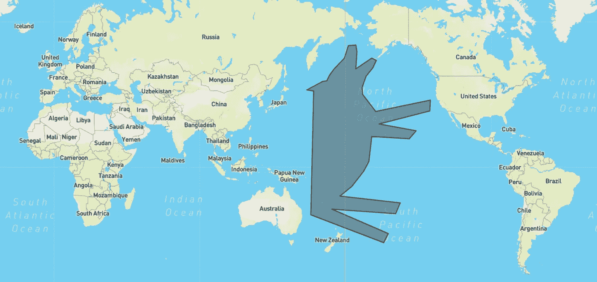
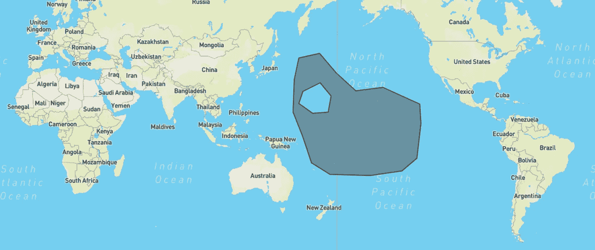
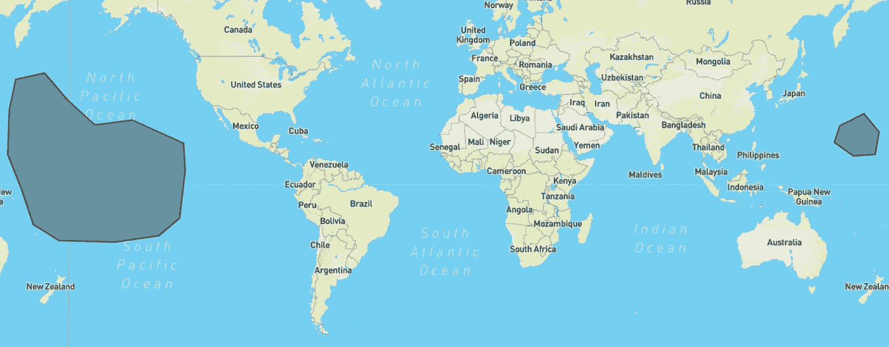
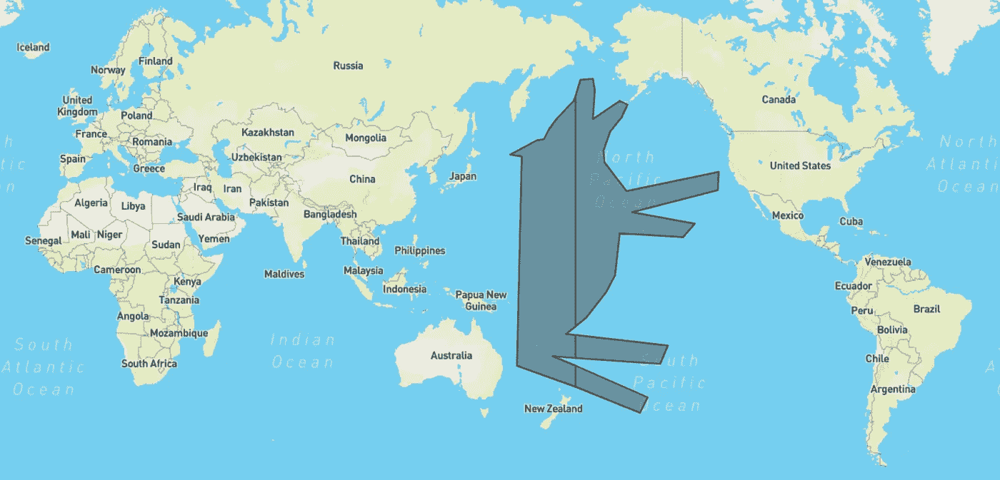

# 80 行环游世界

> 原文：<https://towardsdatascience.com/around-the-world-in-80-lines-crossing-the-antimeridian-with-python-and-shapely-c87c9b6e1513?source=collection_archive---------12----------------------->

## 使用 Python 和 Shapely 进行全球地理空间分析

## 处理穿过反子午线(又名 180 度经线或国际日期变更线)的有问题的现实世界几何图形(多边形)

得益于物联网、运输、物流和气候/地球科学领域新发展的激增，越来越多的数据分析师/科学家(通常熟悉 **Python** 生态系统)正在将地理空间分析纳入他们的问题和工作流程。

虽然流行的 Python 库，如 Shapely 或 GeoPandas，通常都是开箱即用的，但我现在遇到了几个例子，人们在使用**笛卡尔坐标系**时经常会遇到问题。特别是，如果一个多边形穿过[反子午线](https://en.wikipedia.org/wiki/180th_meridian)(又名 180 度经线) :

*   “我的多边形在我的可视化/地图上看起来像一团乱麻！”
*   *“我的地理空间谓词/操作(例如包含、交集等。)失败"*
*   *“我不知道怎么/懒得把这个吓人的多边形分割开来”*

棘手的多边形[*I*mage by pawa rit Laosunthara]:甚至可能在视觉上看起来很好，但进一步的地理空间操作很可能会向南***(双关语)***

你并不孤单。事实上，即使是官方的 GeoJSON 标准也认识到了这个问题，并提倡沿着反子午线分割几何图形。虽然分割一个线串应该足够简单，但对于挑战**多边形**来说，这可能并不简单:

*   多次来回穿越反子午线
*   包含孔或内环(即不只是简单的实心形状)
*   会分裂成两个以上的组成部分

放心吧——确实有几种工具可以解决这个问题。然而，我将介绍一个精简的、可访问的 Python 实现，它只需要 80 行代码…不包括文档字符串😅

**TL；DR —** [这是我对多边形反子午线分裂的实现](https://gist.github.com/PawaritL/ec7136c0b718ca65db6df1c33fd1bb11)(最后的片段也在文章的最后提供)。

# **让我们来看物理**

正如本文标题中提到的，我们将利用 Shapely 来解决这个问题最核心的方面。因此，任何几何构造最终都应符合 [Shapely Polygon API 规范](https://shapely.readthedocs.io/en/stable/manual.html#polygons)。

下面是一个输入 GeoJSON(作为一个 Python 字典)的例子，它将被提供给最终的`split_polygon`函数(参见本文底部):

我们还应该提出一些实际的假设:

1.  如果两个连续点之间的**纵向距离**超过 180 度，那么我们假设反子午线被穿过。
2.  我们假设两个连续点之间的纵向距离总是最小的。例如，[-179，0]到[179，0]表示纵向距离为 2 度，而不是 358 度。
3.  我们假设感兴趣的多边形的跨度小于 360 度(即不会环绕整个地球)。这个要求是由于对 [Shapely 的分割操作的可接受类型的约束。](https://shapely.readthedocs.io/en/stable/manual.html#shapely.ops.split)

**步骤 1:检测反子午线交叉**

根据上面的假设 1，我们可以编写一个超短函数来检测反子午线是否交叉。该功能将应用于 [**每个多边形环**的连续坐标对。](http://esri.github.io/geometry-api-java/doc/Polygon.html)

**步骤 2:将顶点移动到笛卡尔空间⬅️ ➡️**

对于*每个环*的每个坐标:如果检测到交叉，我们**现在基于假设 2 执行** **移位**以确保连续顶点之间的纵向距离总是最小。在这个新的移位空间中，我们可以设置范围[-180，+180]之外的 x 坐标(即移位经度)。下面是基本的，* **不完整的*** 骨架:

**小心，小心:**如果一个多边形的边界(外壳)穿过反子午线*并因此移动*，但是任何内环不包含任何交叉点，那么移动后的几何体可能会以**损坏或**无效而告终。

理想的视觉表现[ *我*法师由帕瓦里·劳孙塔拉]使用:[https://geojson.io/](https://geojson.io/)

如果在没有任何修正的情况下执行移位，则会导致损坏

为了解决这个问题，我们需要跟踪外壳的边界。在对每个内环执行**步骤 2** 后，如果相应环的任何坐标仍然位于外壳的边界之外，则必须首先对整个环应用+/- 360 度的 x 分量**校正**。随后，我们现在可以注意到**(移位)环**是否与线`x = -180`或`x = 180`重叠。本质上，这一行将作为我们的**。**

****第三步:拆分✂️并翻译🔙至经度、纬度****

**在所有这些转变之后，我们现在可以:**

1.  **用我们的移位环在笛卡尔空间中实例化一个形状优美的多边形**
2.  ***让刀来做工作* : Shapely 会自动用对应于反子午线的适当线串来分割我们的良好成形的多边形。**注意:** Shapely 的分割器只能使用笛卡尔几何进行插值，不能使用测地线。**
3.  **将生成的几何图形转换回有效的地理空间坐标**

**…我们完成了！(代码见下面的要点)**

****

**成功分割后的示例结果[*I*pawa rit Lao sunthara 的法师]**

# ***裹住*-起来**

**希望本演练和下面的实现对您有所帮助。如果您有任何疑问、反馈或问题，请随时通过 [LinkedIn](https://www.linkedin.com/in/pawarit-laosunthara/) 与我联系。感谢您的宝贵时间！**

# ****Python 的最终实现****

****常见问题/议题****

*   **[https://github.com/Toblerity/Shapely/issues/495](https://github.com/Toblerity/Shapely/issues/495)**
*   **[https://GIS . stack exchange . com/questions/226605/shapely-polygons-crossing-the-anti meridian](https://gis.stackexchange.com/questions/226605/shapely-polygons-crossing-the-antimeridian)**
*   **[https://GIS . stack exchange . com/questions/95990/split-a-polygon-that-crossed-international-date-line-arcpy](https://gis.stackexchange.com/questions/95990/split-a-polygon-that-crosses-international-date-line-arcpy)**

****替代工具/实施****

*   **https://www.gplates.org/docs/pygplates/generated/pygplates.DateLineWrapper.html**
*   **[https://github.com/briannaAndCo/Leaflet.Antimeridian](https://github.com/briannaAndCo/Leaflet.Antimeridian)**