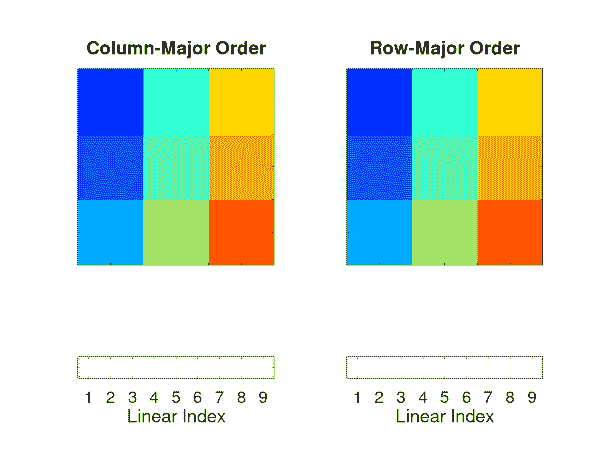

# 在 MATLAB/Octave 中高效循环

> 原文：<https://towardsdatascience.com/array-order-and-permute-in-matlab-237593e59953?source=collection_archive---------57----------------------->


作者图片

## 数组顺序和 permute()函数

在 MATLAB/Octave 中循环数据时，数组顺序是一个重要的考虑因素。选择循环哪个维度实际上会对计算效率产生重大影响。在本教程中，我介绍并说明了数组顺序的概念，创建了一个简单的实验来演示循环时数组顺序的影响，并解释了如何使用 MATLAB 中的 *permute()* 命令来编写高效的循环。

所有例子的源代码都可以在 [GitHub 库](https://github.com/ThinkData-science/CodingTips/tree/master/matlab)中找到。

# 数组顺序

在处理多维或 N 维(ND)数组时，了解数据在内存中的存储方式非常重要。这被称为数组排序。有两种通用约定:行优先和列优先排序。这两种不同的方法仅仅是指 ND 数组中的哪些元素在内存中是连续的，以及如何对这些数组进行线性索引。在列优先顺序中，列的元素在内存中是连续的。按照行优先的顺序，行的元素在内存中是连续的。所以基本上，我们对列主要的元素按列计数，对行主要的元素按行计数。

下面的代码片段显示了一个 3 x 3 矩阵的示例，其中每个元素都显示了线性索引是什么。同样，你可以把矩阵中的数字看作数据在内存中的顺序(例如 1 是第一个内存地址，2 是第二个内存地址，等等)。

```
colMaj = [ 1, 4, 7; 2, 5, 8; 3, 6, 9 ];
disp( colMaj )
           1   4   7
           2   5   8
           3   6   9
rowMaj = [ 1:3; 4:6; 7:9 ];
           1   2   3
           4   5   6
           7   8   9
disp( rowMaj )
```

通过使用“:”操作符，我们可以很容易地看到 MATLAB 是如何存储数据的，这个操作符将打开数据。由于 MATLAB 是以列为主的，您可以看到 *colMaj* 矩阵以正确的顺序返回索引，但是 *rowMaj* 矩阵以无序的顺序返回元素。

```
disp( colMaj(:) )1
           2
           3
           4
           5
           6
           7
           8
           9disp( rowMaj(:) )1
           4
           7
           2
           5
           8
           3
           6
           9
```

为了使这一点更清楚，我们可以建立一个简单的动画。动画展示了如何使用这两种惯例展开矩阵。底部的线性索引显示了各个元素在内存中的实际存储方式。



作者图片

# 数据循环

那么为什么数组顺序很重要呢？当你在数据上循环时，数组顺序实际上对运行时间有很大的影响。访问内存中连续的数据要高效得多。因此，了解我们的数据在内存中是如何组织的，也可以帮助我们编写计算效率更高的代码。

让我们用一个简单的例子来说明这一点。假设我们有一组想要操作的图像。这些图像的大小为( *nX* ， *nY* )像素，我们的数据集中有 *nI* 个图像。这些图像在内存中可能有两种排列方式:[ *nX* ， *nY* ， *nI* 或[ *nI* ， *nX* ， *nY* 。在第一方向中，图像将在存储器中连续排列，而在第二方向中则不是这样。

为了了解数组顺序会产生什么样的差异，我们可以编写下面的测试代码。注意， *tic()* 和 *toc()* 函数允许我们对部分代码执行进行计时。如果您不熟悉此功能， *tic()* 实际上启动了一个定时器，而 *toc()* 记录了自您启动定时器以来已经过了多长时间。您可以在 MATLAB 帮助中找到更多文档。

```
% Arrange images at the first two dimension
imageData = randn( nX, nY, nI );
a = tic();
for ix1=1 : nI
  thisImg = imageData( :, :, ix1 );
end
et1 = toc( a );% Arrange images at the last two dimensions
imageData = randn( nI, nX, nY );
a = tic();
for ix1=1 : nI
  thisImg = imageData( ix1, :, : );
end
et2 = toc( a );% Plot the results
fprintf( 'Looping over the last dimension: %0.4f seconds\n', et1 );
fprintf( 'Looping over the first dimension: %0.4f seconds\n', et2 );
fprintf( '%0.1f factor increase\n', et2/et1 );
```

为了说明数组顺序的影响，代码运行时使用了 *nX* = *nY* = 128 和 *nI* 取值 1000、10000 和 50000。鼓励勇敢和好奇的人下载源代码，尝试更多有趣的组合！

从 1，000 幅图像开始，我们可以看到数组顺序似乎没有太大的影响，但是，运行时间仍然有大约 10%的增加。

```
Looping over the last dimension: 0.8328 seconds
Looping over the first dimension: 0.9570 seconds
1.1 factor increase
```

将图像的数量增加到 10，000，我们开始看到运行时间有了很大的不同。当图像不是连续存储在内存中时，运行时间会增加 2.4 倍。

```
Looping over the last dimension: 0.9039 seconds
Looping over the first dimension: 2.1613 seconds
2.4 factor increase
```

进一步将图像数量增加到 50，000，我们继续看到运行时间的更大增长。现在运行时间增加了 8 倍！

```
Looping over the last dimension: 1.2299 seconds
Looping over the first dimension: 10.3527 seconds
8.4 factor increase
```

需要注意的是，这是一个简单的例子，只有一个循环和三个维度。对于多维数组或者嵌套多个循环时，这种影响实际上会更糟。有时，在代码中添加一些 *tic() / toc()* 调用，或者运行 Profiler 来更新代码是值得的。

# MATLAB 中的 Permute()

MATLAB 包括一个名为 *permute()* 的函数，它是转置函数的一个推广，但用于 ND 数组。 *Permute()* 接受一个 ND 数组和所需的数组顺序，然后返回重新排列的数据。语法是这样的: *newArray = permute( oldArray，[oldDim1，oldDim2，oldIm3 等…]* )。在该语法中，变量 *oldDim#* 表示旧数组的数组顺序索引，函数输入中的位置表示新数组顺序位置。

例如，假设我们有一个形状为[200，450，120，680]的 ND 数组， *A* ，我们这样调用 permute()函数: *B* = permute( A，[3，1，4，2])。数组 *B* 的最终形状将是[120，200，680，450]。这里，我们将维度 3 移至维度 1，维度 1 移至维度 2，维度 4 移至维度 3，维度 2 移至维度 4。

使用 *permute()* 函数，我们可以根据我们想要循环的维度重新排列任意的 ND 数组。回到我们之前的图像示例，我们可以使用形状为[ *nI，nX，nY* ]的数组 *imageData* ，并通过使用以下命令将其重新排列为形状为[ *nI，nX，nY* ]的数组。

```
imageData = permute( imageData, [ 2, 3, 1 ] );
```

这将允许我们在最后一个维度上循环，我们刚刚展示了它的计算效率。将这一简单的行添加到我们之前的示例中，我们可以重新运行我们的测试。更新后的代码将如下所示。

```
% Arrange images at the first two dimension
imageData = randn( nX, nY, nI );
a = tic();
for ix1=1 : nI
  thisImg = imageData( :, :, ix1 );
end
et1 = toc( a );% Permute data before looping
imageData = randn( nI, nX, nY );
imageData = permute( imageData, [ 2, 3, 1 ] ); % loop over the last dim
a = tic();
for ix1=1 : nI
  thisImg = imageData( :, :, ix1 );
end
et2 = toc( a );% Plot the results
fprintf( 'Looping over the last dimension: %0.4f seconds\n', et1 );
fprintf( 'Permute and loop over the last dimension: %0.4f seconds\n', et2 );
fprintf( '%0.1f factor increase\n', et2/et1 );
```

使用 *nI* = 50，000 运行该实验，会产生以下输出。

```
Looping over the last dimension: 1.0844 seconds
Permute and loop over the last dimension: 1.1350 seconds
1.0 factor increase
```

使用 *permute()* 命令大大减少了循环时间。当然，使用 permute 函数会有一点点开销，但是在几乎所有的实际情况下，最好包含它。正如我前面提到的，对于高维数组和嵌套多个循环时尤其如此。

# 摘要

在本教程中，我们讨论了在 MATLAB/Octave 中循环 ND 数组时数组顺序的重要性。使用一些简单的 MATLAB 代码，我们展示了循环访问内存中连续数据的好处。我们进一步展示了 *permute()* 命令允许我们在循环之前重新排列数组的维数，这样我们就可以始终确保循环是高效的。

以下是需要记住的几点:

*   在 MATLAB 中，数据是按列主顺序排列的
*   我们应该总是在最外层的维度上循环，以使我们的循环尽可能高效。
*   可以在任何循环之前(和之后)使用 Permute() 来确保我们高效地循环 ND-数组。
*   对于嵌套循环，最里面的循环应该在最外面的维度上循环。

编码快乐！