# 用 Python NumPy 进行面向数组的编程

> 原文：<https://towardsdatascience.com/array-oriented-programming-with-python-numpy-e0190dd6ab65?source=collection_archive---------11----------------------->

## 再见平原，老 For-loops！你好 Numpy 数组！

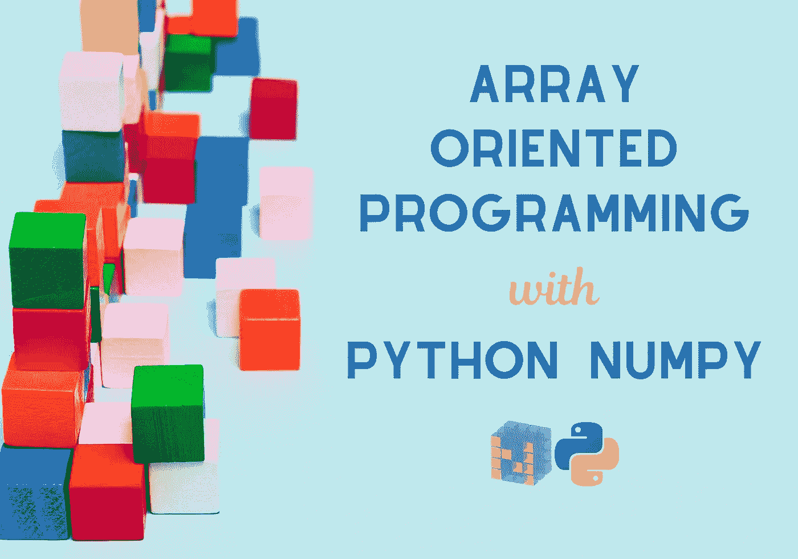

# NumPy 简介

NumPy 是最受欢迎的用于高性能数组实现的 Python 库:数组上的操作比列表上的操作快得多，这在大数据世界中可以放大运行时差异。根据 [libraries.io](https://libraries.io/pypi/numpy/dependents) (截至 2020 年 4 月)4K 的图书馆依赖 NumPy，包括最流行的数据科学包，Pandas 和 SciPy。

NumPy 的美妙之处在于它提供了面向数组的编程风格。也就是说，它提供了带有内部迭代的**函数式**、**矢量化**操作，而不是使用条件 for 循环(或 n 维时的嵌套 for 循环)来处理数组元素，这使得数组操作更简单、更简洁。

在本教程中，你将发现从初级到高级的所有你需要知道的东西，超过 10 个综合主题。但是如果你是已经进阶的人，不要害怕！您可以 ***直接跳到最后两个部分([高级](#4ac5) & [专家](#fa1d))，在那里将解决数组定向的“症结”以及基本的性能技巧。最后，您将能够将您的过程化编程风格转变为优雅、快速、无循环、基于数组的风格。***

> 我们开始吧。。。


# ➊ —阵列创建

导入 NumPy `import numpy as np`后，我们准备滚动:

## 一维

我们可以通过传递元素列表来创建数组；本例中的整数:
`array = np.array([1, 2, 3, 5, 8, 13, 21])`

📌您能在输出中注意到一些有趣的东西吗？


所有逗号分隔的值宽度相同，并且右对齐。由于最大数字 21 占据 2 个位置，所有其他值都被格式化为两个字符的字段。现在你知道为什么在[和 1 之间有一个前导空格了。😏

## 多维度

我们将创建一个 2 行 3 列的数组，传递两个嵌套的列表，每个列表包含三个元素:
`array2x3 = np.array([[1, 2, 3], [10, 20, 30]])`

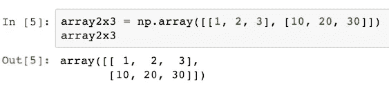

输出的格式基于维度的数量，对齐每行中的列:正如我们看到的，1 和 10 对齐，2 和 20 对齐，等等。

## 阵列形状

我们可以用`shape`属性确定数组的形状，该属性返回一个具有维度的元组:

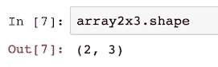

以及带有`ndim`属性的维数(即数组的秩)，如下所示:

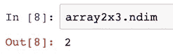

`ndim`与数组形状输出的轴数或长度(`len`相同:

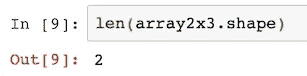

## 元素数量

使用属性`size`我们可以得到数组的元素总数:

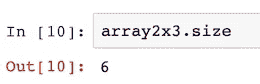

## 元素类型和元素大小

由于 NumPy 是用 C 编写的，所以它使用它的数据类型。因此，整数被存储为`int64`值——在 c #中对应于 64 位(即 8 字节)整数。

通过访问`dtype`属性，确定数组的元素类型很容易:

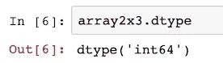

以及存储每个元素所需的字节数，通过访问`itemsize`:

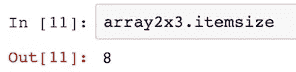

## 存储容量

内存占用(`nbytes`)是元素数乘以字节数。

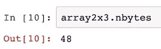

## 常见数组

为了用特定的值填充数组，NumPy 提供了三个特殊的函数:`zeros`、`ones`和`full`，分别创建包含 0、1 或特定值的数组。请注意，零和一包含`float64`值，但是我们显然可以定制元素类型。

*   0 的 1D 数组:`zeros = np.zeros(5)`

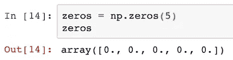

*   整数类型的 0 的 1D 数组:`zeros_int = np.zeros(5, dtype = int)`

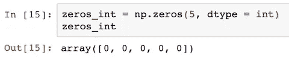

*   1 的 2D 数组(2x 5):`ones = np.ones((2, 5))`

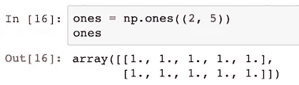

*   7 的 2D 阵列(2x 5):`full = np.full((2, 5), 7)`

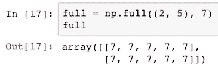

## 均匀分布的范围

NumPy 为从范围创建数组提供了优化的函数。创建均匀间隔范围的两个最重要的函数是`arange`和`linspace`，分别用于整数和浮点。

**◼️整数:给定区间** `np.arange(start, stop, step)`:在半开区间`[start, stop)`内产生值，即包括启动但不包括停止的区间。默认`start`值为 0，默认`step`大小为 1。

*   范围从 0 到 4，增量为 1:
    T21
*   范围从 5 到 9，增量为 1:
    `np.arange(5, 10)`
*   范围从 2 到 8，增量为 2:
    `np.arange(2, 10, 2)`
*   范围从 8 到 2，增量为-2:
    `np.arange(8, 0, -2)`

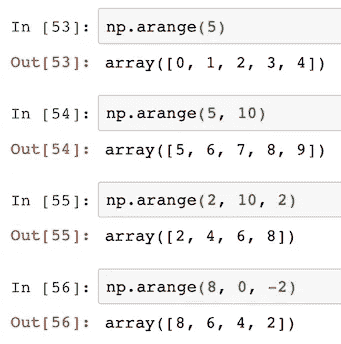

**◼️浮点数:给定元素的个数** `np.linspace(start, stop, num, endpoint)`:返回`num`个间隔均匀的样本，在间隔`[start, stop]`内计算。间隔的`endpoint`可以选择排除。默认`num`值为 50，默认`endpoint`为真。

*   5 从 1.0 到 2.0(不包括 2.0)的等间距元素:
    `np.linspace(1, 2, num = 5, endpoint = False)`
*   5 从 1.0 到 2.0(包括 2.0)的等间距元素:
    `np.linspace(1, 2, num = 5, endpoint = True)`

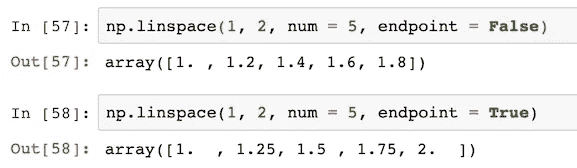

> *💡虽然我们可以通过将范围作为参数传递来创建数组，但我们总是更喜欢内置函数，因为它们可以优化性能。*

## 随机范围

为了生成随机范围，NumPy 提供了一些选项，但以下是最常用的:

**来自[0，1)** `np.random.rand(d0, d1, ...)`上的均匀分布的◼️随机样本，其中`dn`是数组维数:

*   具有 5 个随机样本的 1D 阵列:
    `np.random.rand(5)`
*   2 行 5 个随机样本的 2D 阵列:
    `np.random.rand(2, 5)`

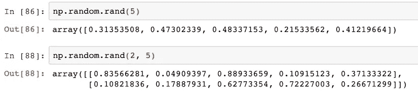

**◼️随机整数** `np.random.randint(low, high, size)`:返回从`low`(含)到`high`(不含)的随机整数。如果`high`为无(默认)，则结果来自`[0, low)`。

*   从 1 到 99 的 10 个随机整数:
    `np.random.randint(low = 1, high = 100, size = 10)`

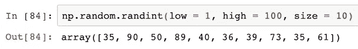

# ➋ —索引

## 一维

我们可以使用方括号中的从**零开始的**索引来引用数组元素，例如在一个五元素数组中，第一个元素由`[0]`访问，最后一个由`[4]`访问。

也可以通过使用负的索引从末尾访问数组，从最后一个元素的-1 开始。所以在前面的例子中，最后一个元素(`[4]`)可以用`[-1]`访问，它的第一个元素(`[0]`)可以用`[-5]`访问:

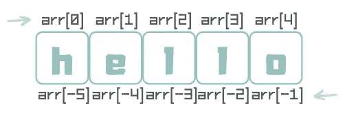

所以在这个阵中:
`array1D = np.array([0, 1, 2, 3, 4])`

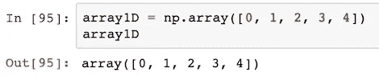

我们可以选择第三个元素:`array1D[2]`

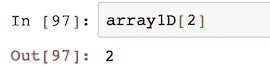

或者从结尾开始:`array1D[-3]`

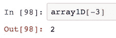

## 多维度

2D 数组可以用这个符号来访问:`[row_index, column_index]`。

所以在这个实例中:
`array2D = np.array([[0, 1, 2, 3, 4], [5, 6, 7, 8, 9]])`

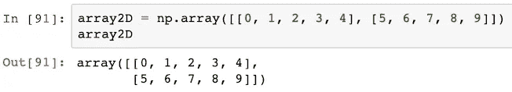

我们可以通过`array2D[1, 2]`选择第 2 行第 3 列的元素

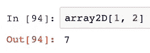

# ➌ —切片

使用`[first:last]`符号将数组分割成原始元素的子集，这将返回一个包含从索引`first`到`last-1`的元素的子数组。

→如果省略`first`，则假设为 0，因此返回从开始到`last-1`的元素。
→如果省略`last`，则假定数组的长度，因此返回从`first`到末尾的元素。
→如果`first`和`last`都省略，则返回整个数组。

## 一维

延续之前的`array1D`示例:

*   具有第 2 和第 3 个元素的子数组(从索引 1 到 2):
    `array1D[1:3]`
*   具有前 3 个元素的子数组(从开始到索引 2):
    `array1D[:3]`
*   具有最后 3 个元素的子数组(从第 2 个索引到结尾):
    `array1D[2:]`
*   包含所有元素的子数组:
    `array1D[:]`

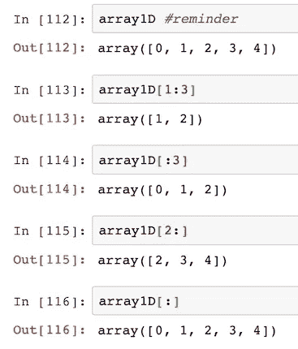

## 多维度

类似的原理也适用于 2D 数组，所以切片使用这个符号:
`[row_first:row_last, column_first:column_last]`。

→要选择多行，我们使用:`[row_first:row_last, :]`。
→要选择多个列，我们使用:`[:, column_first:column_last]`。

承接前面`array2D`的例子:

*   从行索引 0 到 1 和列索引 1 到 2 的子 2D 数组
    `array2D[0:2, 1:3]`
*   从开始到索引 2 有多列的子 2D 数组:
    `array2D[:, :3]`
*   从索引 1 到结尾有多行的子 2D 数组:
    `array2D[1:, :]`
*   包含所有元素的子数组:
    `array2D[:, :]`


下一节我们将解释为什么 Numpy 子数组只是视图！


# ➍ —复印

## 浅薄的文案/观点

切片不会修改原始数组。新创建的数组使原始元素的 ***浅*** 副本(或 ***视图*** )这意味着它复制元素的引用，但不复制它们所指向的对象。

换句话说，对新创建的数组的任何修改也将反映在原始数组中。

这里是一个新创建的有 10 个元素的数组:
`originalArray = np.arange(0, 10)`

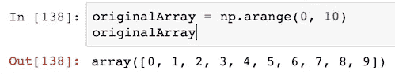

我们通过选择最后 5 个元素来分割它:
`subArray = originalArray[5:]`

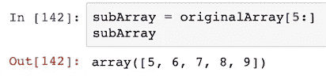

我们通过使用内置的`id`函数:
`display(id(originalArray))`和`display(id(subArray))`，观察到原始数组和切片数组确实是两个不同的对象。

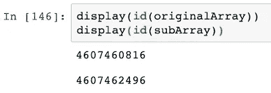

为了证明`subArray`与`originalArray`查看相同的数据，我们将修改`subArray`的第一个元素:
`subArray[0] = subArray[0] * 10`

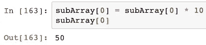

然后显示两个数组—原始值也发生了变化:

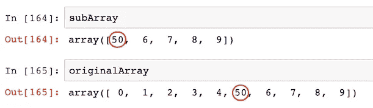

## 深层拷贝

尽管浅层副本在共享数据时节省了内存，但有时还是有必要创建原始数据的独立副本。这个操作被称为 ***深度*** 复制，在多线程编程中非常有用，在多线程编程中，程序的不同部分可能会试图同时修改数据，这可能会破坏数据。

NumPy 提供了方法`copy`，该方法返回一个新的数组对象，其中包含原始数组对象数据的深层副本。

重复前面的示例，我们可以看到，修改子数组时，原始数组没有受到影响。

我们先把`originalArray`复制到`newArray` :
`newArray = originalArray.copy()`

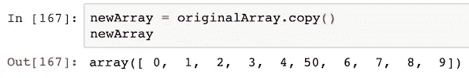

然后我们修改第 6 个元素:
`newArray[5] = newArray[5] * 10`

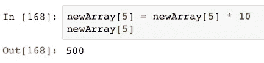

最后，我们显示两个数组——看看原始数组的值是如何保持不变的？

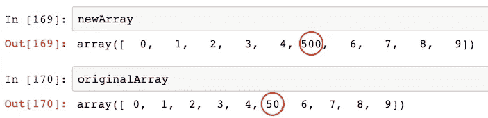

# ➎ —元素式操作

NumPy 提供了许多操作符，使我们能够编写简单的表达式来对整个数组执行操作。这是我们以后变得更高级和消除程序中 for 循环的垫脚石！

## 带标量

我们可以用数组和标量执行基于元素的算术运算。在这些操作中，标量被应用于每个数组元素，所以这个代码片段给每个元素加 5:`array + 5`。

每个操作返回一个包含结果的新数组(即不修改原始数组)。

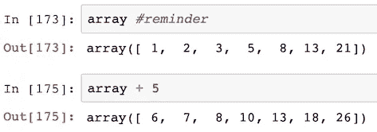

增强赋值修改左操作数中的每个元素。在这个例子中:`array += 1`，原始数组的元素现在增加 1。与前面的情况相反，这里没有发生内存分配，因为这种就地操作是首选的。

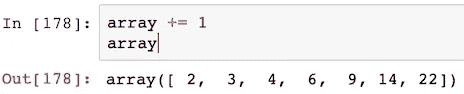

乘、减、除、取幂和前面的加法一样简单。

📌标量操作是我们将在下一节讨论的最简单的广播形式。

## 数组之间

我们可以在**相同形状**的数组之间执行逐元素的算术运算。结果是两个数组的元素组合成一个新的数组。

在本例中，我们有两个数组，每个数组有 5 个元素:

```
arrayA = np.arange(2, 12, 2)
arrayB = np.arange(0, 5) + 1
```

当我们添加它们:`arrayA + arrayB`时，我们可以看到新的组合数组:

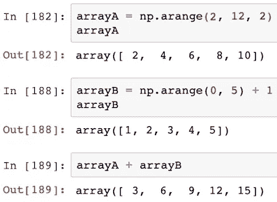

📌请注意，数组乘法不是矩阵乘法。这些元素只是按分量相乘。利用前面的数组，我们可以通过使用`dot`函数
`np.dot(arrayA, arrayB)`来计算**矩阵乘法**

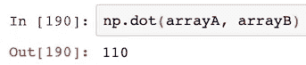

## 比较

当比较两个数组时，我们得到一个布尔数组，其中每个元素为真或假，表示各自的比较结果。

给定两个随机整数数组:

```
compA = np.random.randint(low = 1, high = 10, size = 5)
compB = np.random.randint(low = 1, high = 10, size = 5)
```

我们可以检查第一个数组的元素是否大于第二个数组的元素:`compA > compB`。

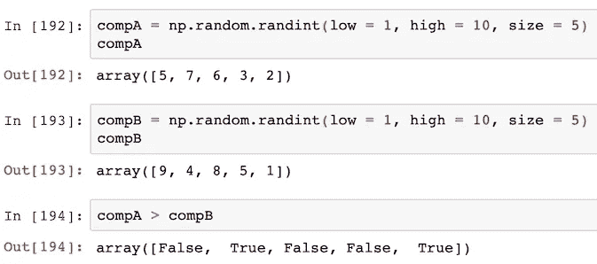

📌为了比较完整的数组是否相等，我们使用了`array_equal`函数，如果两个数组具有相同的*形状*和相同的*元素* :
`np.array_equal(compA, compB)`，则该函数返回 True

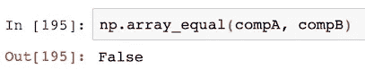

## 逻辑运算

此外，我们可以通过分别使用`logical_or` 和`logical_and`函数，对数组元素应用逻辑 OR 和 and。

给定两个布尔数组:

```
logA = np.array([True, True, False, False])
logB = np.array([True, False, True, False])
```

我们得到:
`np.logical_or(logA, logB)`和`np.logical_and(logA, logB)`。

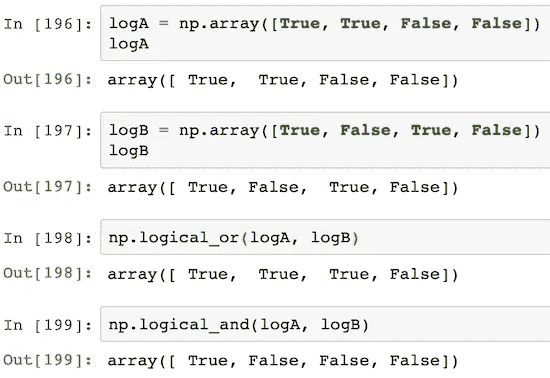

## 通用函数

此外，NumPy 提供了许多独立的通用函数(或`ufuncs`)来执行各种元素操作。每个都返回一个包含结果的新数组。

官方文档列出了五个类别——数学、三角学、位操作、比较和浮点。建议快速浏览，这样你就知道什么是可用的。

> 干得好！你晋级了！


# ➏ —广播

到目前为止，这些操作需要两个大小和形状相同的数组作为操作数。当阵列的形状与**兼容**时，广播就放松了这些限制，实现了一些简洁而强大的操作。

较小的阵列在较大的阵列中“广播”。它可以让我们避免循环，也可以创建不必要的数据副本。

基于[官方文件](https://docs.scipy.org/doc/numpy/user/basics.broadcasting.html):

> *在两个数组上操作时，NumPy 按元素比较它们的形状。它从* ***尾随尺寸*** *开始，一直向前。
> 两个维度兼容当:* *它们相等，或者* *其中一个为 1
> 如果不满足这些条件，抛出* `*ValueError: operands could not be broadcast together*` *异常。*

我们将通过几个循序渐进的乘法示例来演示广播的操作原理。很大程度上，较小的数组会“伸展”,以便与较大数组的每一行相乘。

> 它在内存中不是字面意义上的拉伸；重复的是计算。

## 说明 1

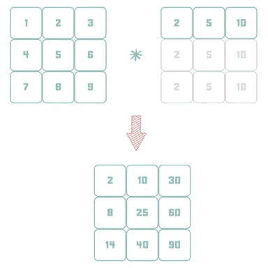

在本例中，我们有一个 3x3 的表格和一个 1x3 的表格。

```
ex1A = np.array([[1, 2, 3], [4, 5, 6], [7, 8, 9]])
ex1B = np.array([2, 5, 10])
```

我们可以观察到广播条件得到满足，并且两个维度是兼容的:

行维度:虽然它们不同(即 3 对 1)，但其中一个是 1。
列尺寸:两者相同(即 3)

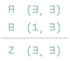

所以相乘的结果(`ex1A * ex1B`)是:

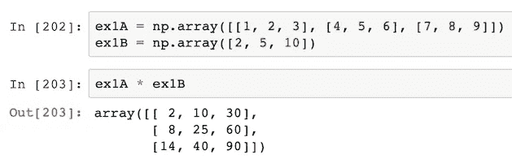

## 说明 2

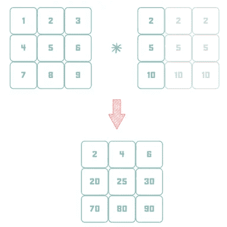

在第二个示例中，我们有一个 3x3 的表和一个 3x1 的表。

```
ex2A = np.array([[1, 2, 3], [4, 5, 6], [7, 8, 9]])
ex2B = np.array([[2], [5], [10]])
```

同样，阵列是兼容的:

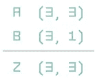

所以相乘的结果(`ex2A * ex2B`)是:

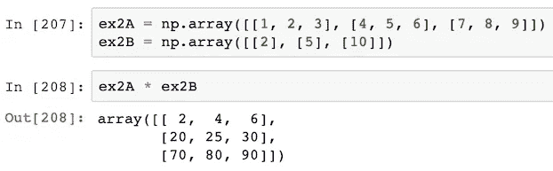

## 说明 3

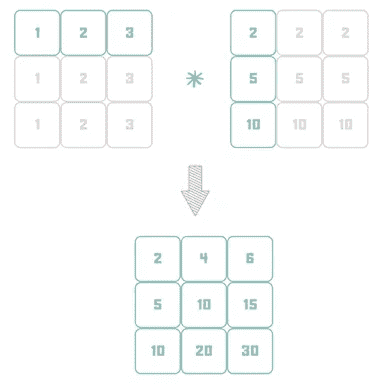

在第三个示例中，我们有一个 1x3 的表和一个 3x1 的表。

```
ex3A = np.array([1, 2, 3])
ex3B = np.array([[2], [5], [10]])
```

同样，阵列是兼容的:

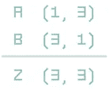

所以相乘的结果(`ex3A * ex3B`)是:

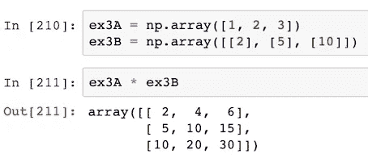

## 不相容尺寸

在本例中，行数不同(即 3 对 2)，并且都不是 1。

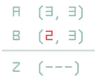

同样，倒数第二个尺寸不匹配:

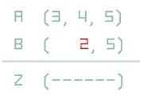

# ➐——塑造操纵

了解播音之后，另一个重要的概念就是操控造型。让我们来看看一些技巧:

## 使再成形

通常的做法是创建一个 NumPy 数组作为 1D，然后再将其整形为 multiD，反之亦然，保持元素总数不变。

📌`reshape`返回一个新数组，它是原数组的**浅**副本。

这是一个有 9 个元素的 1D 数组:`array09 = np.arange(1, 10)`。


我们可以将其重塑为一个 3x3 的数组:`array09.reshape(3, 3)`。


或者作为 9x1 数组:`array09.reshape(9, 1)`。


## 调整大小

如果我们需要改变元素的总数，那么我们需要调整数组的大小。如果我们扩大它，它将添加尾随零，直到它达到新的大小。否则，它将被截断为新的大小。

📌`resize` **修改了**原来的阵列。

继续这个例子，我们可以将 9 元素数组扩大到 15 元素:
`array09.resize(15, refcheck = False)`。


或者我们可以将其截断为 5 个元素:
`array09.resize(5, refcheck = False)`。


📌扩大数组的另一个期望行为是让它重复自己，直到它达到新的大小。在这种情况下，我们可以使用`resize`的“静态”版本，它将原始数组作为输入:
`np.resize(array09, 10)`


## 新维度

在数组中插入一个新轴会增加数组的维数。`newaxis`通常用于使阵列兼容广播。

在本例中，我们将了解如何将一个单行表格转置为一个单列表格:

```
array1x4 = np.array([1, 2, 3, 4])
print(array1x4)
print(np.shape(array1x4))array4x1 = array1x4[:, np.newaxis]
print(array4x1)
print(np.shape(array4x1))
```

很整洁，对吧？


## 变平与变松

展平是整形的逆操作。我们可以用方法`flatten`和`ravel`将多维数组展平成一维。方法`flatten` **deep** 复制原始数组的数据，而`ravel` **shallow** 复制它，[这样展平比较慢]。

下面是一个 2x2 的数组:`array2x2 = np.arange(1, 5).reshape(2, 2)`。


我们将它展平—深度复制:`array2x2.flatten()`


然后迅速重新设置为 2x2: `array2x2 = array2x2.reshape(2, 2)`

然后再解开——浅抄:`array2x2.ravel()`


## 移项

转置一个数组，也就是改变它的维度(意味着把它的形状从`(X,Y)`变成`(Y,X)`)也非常简单。

📌`transpose`返回一个新数组，它是原数组的**浅**副本。

下面是一个数组:
`toBeTransposed = np.arange(1, 5).reshape(2, 2)`


这里是它的转置副本:
`toBeTransposed.transpose()`


## 加入

连接或串联意味着将两个或多个数组的内容放在一个数组中，沿着指定的轴，将它们“堆叠”在(`axis = 1`)下面或(`axis = 0`)旁边。有几个选项可以做到这一点，但`concatenate`功能是最受欢迎的。

这里有两个 3x3 数组，`arr1`和`arr2`:

```
arr1 = np.arange(9).reshape(3, 3)
arr2 = arr1 * 2
```


**◼️垂直拼接【行式|轴= 0】** `np.concatenate((arr1, arr2))`


**◼️水平串联【列式|轴= 1】** `np.concatenate((arr1, arr2), axis = 1)`


## 裂开

拆分是连接的反向操作，即我们将一个数组的内容沿着指定的轴拆分成多个子数组。
我们可以将它们拆分成**相同形状**的数组，或者指示**位置**，在此之后应该进行拆分。

使用这个九元素数组(`arr3`)，我们将看到这两种变化(在`axis = 0`上):


**◼️均匀分割** `np.split(arr3, 3)` 将产生 3 个大小相等的子阵列:


**◼️不均匀分割，基于一维数组** `np.split(arr3, [2, 7]))` 中指示的位置，将产生 3 个子数组，在第 2 个和第 7 个元素之后分割:


```
'Map, Filter and Reduce' are paradigms of functional programming. They allow us to write simpler, shorter code, without needing to bother about for-loops or if-else branching. Even if they are powerful on their own, 'the cherry on top' is that they can be chained together.The next three sections will cover **exactly that**, when it comes to NumPy arrays.
```


# ➑ —制图

为了将转换应用到 NumPy 数组中，我们将使用`vectorize`函数。返回一个新数组，映射生效。

下面是一个简单的数组:
`toBeMapped = np.arange(0, 10)`


我们现在将通过传递一个 lambda 匿名函数使数组的所有元素加倍:
`np.vectorize(lambda x: x * 2)(toBeMapped)`


如果我们有一个更复杂的计算(有许多行代码)，我们可以传递一个函数来代替。

📌根据文档，“提供`[vectorize](https://docs.scipy.org/doc/numpy/reference/generated/numpy.vectorize.html#numpy.vectorize)`功能主要是为了方便，而不是为了提高性能。该实现本质上是一个 for 循环。然而可读性是这里的关键，所以尽管它使用了 for 循环，但我们的代码没有！

# ➒滤波

Filter，用一元谓词测试每个元素。NumPy 为此提供了`extract`函数。满足谓词的元素被保留；不符合的将被删除。返回一个新数组；过滤器不会修改原始数组。

下面是我们的示例数组:
`toBeFiltered = np.arange(0, 9).reshape(3, 3)`


我们要选择奇数:
`np.extract(toBeFiltered % 2 == 1, toBeFiltered)`


实现相同结果的等效方式如下:
`toBeFiltered[toBeFiltered % 2 == 1]`


# ➓——还原

当面对大量数据时，期望的步骤是通过在整个阵列或其一个轴上应用计算来减少维度。

下面是一个 2x3 的数组:
`toBeReduced = np.arange(1, 7).reshape(2, 3)`


## 总和

**整个数组** `toBeReduced.sum()` 上的◼️将产生一个代表所有元素之和的标量:


**◼️按列[axis = 0]** `toBeReduced.sum(axis = 0)` 将产生一个 1x3 数组，其中每个元素是各自列的总和:


**◼️按行[axis = 1]** `toBeReduced.sum(axis = 1)` 将产生一个 3x1 的数组，其中每个元素是各自行的总和:


## 其他削减

他们都以同样的方式工作。例如:

**◼️最小/最大值** `toBeReduced.min()`和`toBeReduced.max()`


**◼️其他
t27】另外两个重要的类别包括:**

*   [逻辑归约(真值测试)](https://docs.scipy.org/doc/numpy/reference/routines.logic.html#truth-value-testing)
*   [统计](https://docs.scipy.org/doc/numpy/reference/routines.statistics.html)

我建议你浏览一下，然后边走边学。

> 我的赞美！你已经准备好为一个**骰子**叫牌了！


# NumPy 性能提示和技巧

为了优化程序的性能，我们要做的第一件事就是将计算或内存分配移到 for 循环之外。我们已经介绍了很多关于 NumPy 技术的材料，但是让我们提炼这些技巧和诀窍，并使它们变得清晰，以帮助您编写更高性能的代码。

## 1️⃣ —矢量化

矢量化是以元素方式处理整个数组的操作。它们将 Python 的显式 for 循环转化为隐式、低级、优化和编译的 C 实现，因此您应该更喜欢它们。

## 2️⃣ —副本

你应该避免不必要的深层拷贝；尽可能使用浅层副本(或视图)和就地操作。

## 3️⃣ —广播

在组合数组之前，应该使用广播对尽可能小的数组进行操作；最小的维度在内部被拉伸以匹配另一个维度，但是这个操作不涉及任何内存复制。

## 4️⃣——记忆

Numpy 数组按行优先顺序存储，即展平的内存是逐行表示的。因此，将数据存储在连续的内存块中可以确保现代 CPU 的架构在内存访问模式和 CPU 缓存方面得到最佳利用。因此，以连续的方式访问或遍历一个数组比随机访问要快得多，所以你应该明智地选择如何在 n 维中表示数据。作为一个说明性的例子，沿行对元素求和比沿列快。

## 5️⃣ —函数阵列编程

你应该使用 Map、Filter、Reduce 来避免 for 循环和条件编程。

> 精彩！你坚持到了最后！

# 推荐阅读

*   [100 Numpy 演习](https://github.com/rougier/numpy-100/blob/master/100_Numpy_exercises_with_solutions.md)
*   [真正的 Python:用 NumPy 进行数组编程](https://realpython.com/numpy-array-programming/)
*   [NumPy 数组:高效数值计算的结构](https://hal.inria.fr/inria-00564007/document)
    **** *****必读* ********
*   [科学讲座:高级数字](http://scipy-lectures.org/advanced/advanced_numpy/)
*   [美丽的代码](https://www.amazon.co.uk/Beautiful-Code-Leading-Programmers-Practice/dp/0596510047)【论文 19:‘Numpy 中的多维迭代器’】

# 收场白

我希望 NumPy 的强大和它所带来的灵活性能让你有所启发。现在，您已经具备了帮助您优化代码性能并尽可能消除 for 循环所需的知识和技能。你需要做的就是:
练习——练习——练习！

感谢阅读！

*我经常在媒体上写关于领导力、技术&的数据——如果你想阅读我未来的帖子，请*[*‘关注’我*](https://medium.com/@semika) *！*