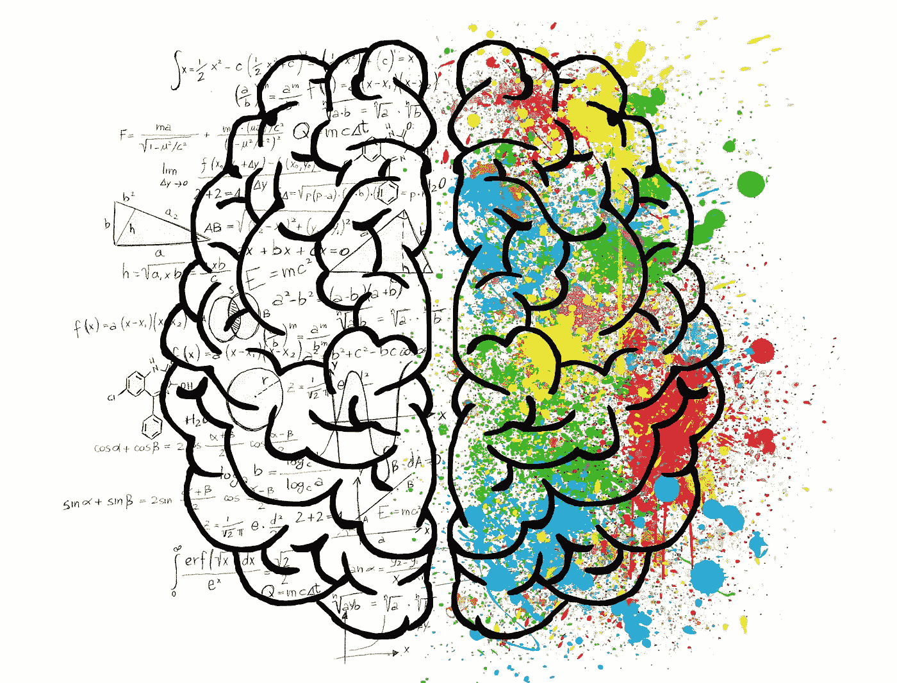

# (艺术)智力。新的创造性人工智能。

> 原文：<https://towardsdatascience.com/art-ificial-intelligence-the-new-creative-ai-8d0c4dd7d0a5?source=collection_archive---------57----------------------->

## 人类的创造力是唯一永不停止创造事物的机器。但是人工智能会变得“有创造力”吗？

“你能想象的一切都是真实的”——巴勃罗·毕加索

一个人工智能能做很多事情，但它能成为“**创意”**吗？很明显，人类使用人工智能来提高和增强他们作为人类的创造力，然而我问自己的问题是，这种“人机合作”是否有必要存在，以创造真正有价值的令人兴奋的东西。

照片由 [ElisaRiva](https://pixabay.com/es/users/ElisaRiva-1348268/) 在 [Pixabay](https://pixabay.com) 上拍摄

## [与+1K 人一起加入我的电子邮件列表，获取更多独家内容](https://www.oscargarciaramos.com/newsletter-exclusive-content)

*如果你想了解更多，请访问*[***oscargarciaramos.com***](https://oscargarciaramos.com)

如今，认为人工智能完全取代人类创造力是没有意义的。拥有两台如此强大的“机器”而避开其中一台，将是一个绝对的错误。相反，我们应该利用两者所提供的 200%的潜力，这是一个不可替代的可怕组合。

让我们谈谈艺术、音乐、舞蹈、写作……*“有创造力意味着热爱生活”*，能够自发地产生新的想法或概念。

***AI 是否发生在这些领域？还是应该只留给人类？***

# 艺术

《爱德蒙·德·贝拉米的肖像》，一幅人工智能画作，已经以 43.2 万美元的价格售出。它的创造者？一种算法，特别是一种生成敌对网络(GAN ),它被输入覆盖六个世纪的 15，000 个肖像的数据集，以通知其输出。

如果我们谈论爱达呢？“世界上第一个超现实的人形人工智能机器人艺术家”。它配备了眼睛摄像头和机械臂，能够绘画或说话，这要归功于一个名为*人在回路或 HITL* 的仿真模型。

关于……

# 音乐

在过去的几年里，人工智能音乐领域的进展迅速加快。

如果我们回到过去，1951 年，艾伦·图灵是第一个用几乎占满整个实验室的机器录制计算机生成音乐的人。

今天使用最多的技术之一是 ***强化学习*** ，这是一种学习歌曲中发现的特征和模式的算法，以复制或模拟某种音乐流派的新歌曲。 [***谷歌的 Magenta 项目***](https://magenta.tensorflow.org) 就是一个例子，一个制作歌曲的开源平台，编写并生成感谢 AI，或者也是 IBM 的索尼 Watson[**Flow Machine**](https://www.flow-machines.com)解决方案。事实上，格莱美提名制作人亚历克斯·达吉德在他的“创作”过程中就依靠了这个工具。

你听说过 ***AIVA*** 吗？“人工智能创作情感配乐音乐”被称为“创意人的创意助手”，它允许你根据不同的风格或影响创作音乐:现代电影，电子，流行，摇滚，幻想，等等。

# 跳舞

在 [**Peltarion**](https://peltarion.com) ，一位人工智能(AI)专家兼舞蹈编导是 AI 在舞蹈中应用的一个明显例子。该团队设法创造了一个解决方案，不仅基于学习某种风格的舞蹈，而且专注于创造自己的编舞。它是如何工作的？它由一个名为“chor-rnn”的*循环神经网络*组成，从 5 个小时的当代舞蹈中获得+1350 万个不同的位置。仅在 48 小时内，他们就取得了第一批成果。

NVIDIA 还能够根据歌曲的风格，跟随音乐的节拍创造新的舞蹈动作。他们使用一个 MM-GAN(生成对抗网络)收集来自芭蕾、尊巴和嘻哈的不同视频。得益于这一解决方案，他们成功生成了 361，000 个剪辑，总共包含 71 个小时的新舞步。

最后…

# 写作

在我们“创造力”的最后一个领域，我们可以找到我们所谓的自然语言生成(NLG)，它包括从数据中创造“叙事写作”。比如美国*美联社*目前正在使用 AI 撰写数千篇体育报道。

新的网站也出现了，从一个标题生成“独特的”文本，以创建一篇新文章的完整草稿。这个过程很简单:选择一个主题或标题，等一会儿，并采取自动文章作者起草的。不可思议，你不觉得吗？

## 那么，下一步是什么？

**“人类的创造力”**是唯一永不停止创造事物的机器。

让我们开始与人工智能形成新的合作，创造你以前从未想象过甚至梦想过的东西。不是说 AI 要来取代我们。

不是这样的。

我们不要找借口了。顺其自然，利用新的人工智能能力。

让我们开始创造吧！

*欢迎发表评论、鼓掌或分享这篇文章。跟随* [*me*](https://medium.com/@ogarciaramos) *进行未来岗位。*

*如果你想了解更多，你可以在*[***oscargarciaramos.com***](https://oscargarciaramos.com)找到我

## [与+1K 人一起加入我的电子邮件列表，获取更多独家内容](https://www.oscargarciaramos.com/newsletter-exclusive-content)