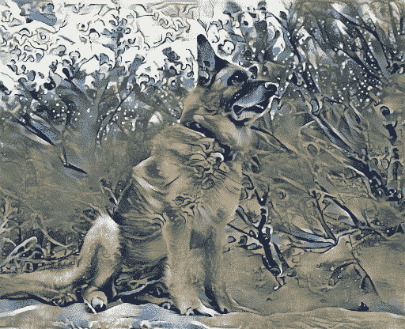

# 基于不同神经网络的艺术风格转换

> 原文：<https://towardsdatascience.com/art-style-transfer-using-neural-networks-a28f5888746b?source=collection_archive---------12----------------------->

## 模型之间的比较

# 介绍

艺术风格的转变在于将一幅图像转变成一幅类似于艺术家所画的图像。

如果我们是文森特·梵高的粉丝，并且我们喜欢德国牧羊犬，我们可能会想要一张我们最喜欢的狗的照片，用梵高的星夜时尚来画。

作者图片

*梵高《星夜》，* [*公共领域*](https://commons.wikimedia.org/w/index.php?curid=10749998)

生成的图片可能是这样的:

作者图片

相反，如果我们喜欢葛饰北斋的神奈川巨浪，我们可能会得到这样一张照片:

*神奈川大浪潮作者葛饰北斋，* [*公共领域*](https://commons.wikimedia.org/wiki/File:Great_Wave_off_Kanagawa.jpg)

作者图片

如果我们更喜欢瓦西里·康丁斯基的作品 7，就像下面这幅图一样:

*瓦西里·康丁斯基作文 7，* [*公共领域*](https://commons.wikimedia.org/wiki/File:Vassily_Kandinsky,_1913_-_Composition_7.jpg)

作者图片

由于计算处理能力的进步，允许使用更复杂的神经网络，这些图像转换成为可能。

在继续之前，您可能想看看如何在没有任何复杂框架的情况下使用 python 实现一个基本的神经网络[点击此处](/artificial-intelligence-beginnings-6f8937acdc6a)

由一系列卷积矩阵运算层组成的卷积神经网络(CNN)是图像分析和物体识别的理想选择。它们采用了与 Gimp 或 Photoshop 等应用程序中使用的图形过滤器和检测器类似的概念，但功能更强大，方式更复杂。

矩阵运算的一个基本例子是由边缘检测器执行的。它获取一个 n×n 像素的小图片样本(以下示例中为 5×5)，将其值乘以预定义的 n×n 卷积矩阵，并获得一个值，该值指示图像的该部分中是否存在边缘。对图像的所有 n×n 部分重复该过程，我们可以生成新的图像，其中我们已经检测到存在于其中的对象的边界。

作者图片

CNN 的两个主要特征是:

*   卷积矩阵的数值不是预先定义的，以找到特定的图像特征，如边缘。这些值是在优化过程中自动生成的，因此它们能够检测比边界更复杂的特征。
*   它们具有分层结构，因此第一层将检测简单的图像特征(边缘、色块等)。)并且最新的层将使用来自先前层的信息来检测复杂的对象，如人、动物、汽车等。

这是卷积神经网络的典型结构:

图片由[aphex 34](https://upload.wikimedia.org/wikipedia/commons/thumb/6/63/Typical_cnn.png/512px-Typical_cnn.png)/[CC BY-SA 4.0](https://creativecommons.org/licenses/by-sa/4.0)

感谢像马修·d·泽勒、罗布·弗格斯的*“可视化和理解卷积网络”【1】*和克里斯·奥拉、亚历山大·莫德温采夫、路德维希·舒伯特的*“特征可视化”【12】*这样的论文，我们可以直观地了解 CNN 不同层检测到的特征:

马修·d·泽勒等人的图片*“可视化和理解卷积网络”【1】，授权使用*

第一层检测图像的最基本特征，如边缘。

马修·d·泽勒等人的图片*“可视化和理解卷积网络”【1】，授权使用*

接下来的层结合前一层的信息来检测更复杂的特征，如纹理。

马修·d·泽勒等人的图片*“可视化和理解卷积网络”【1】，授权使用*

下面的层，继续使用以前的信息来检测重复模式等特征。

马修·d·泽勒等人的图片*“可视化和理解卷积网络”【1】，授权使用*

最新的网络层能够检测复杂的特征，如对象部分。

马修·d·泽勒等人的图片*“可视化和理解卷积网络”【1】，授权使用*

最终层能够对图像中存在的完整对象进行分类。

检测复杂图像特征的可能性是对这些特征执行复杂变换，但仍然感知图像中相同内容的关键使能因素。

# 独立图像优化

关于艺术风格转移的最重要的论文之一是由 Leon A. Gatys、Alexander S. Ecker、Matthias Bethge 撰写的“*艺术风格的神经算法”* [2]。

它的主要发现是，自然图像的 ***内容*** 及其 ***风格*** 可以彼此独立地分离和处理，这允许我们从经典艺术绘画中“提取”风格并将其应用到我们自己的图像中。

这里讨论的许多其他神经类型转移模型采用了这一思想，并用更快和更复杂的网络扩展了它，但仍然使用这一基础。

Gatys 等人的模型基于 VGG-19[3]神经网络，该网络通常用于视觉对象识别，可与人类性能相媲美。

作者图片

然后，它使用它的片段来定义一些函数:

*   一个**内容损失**函数，它计算生成的图像内容与我们原始图像的内容有何不同。为了比较内容，而不是比较图像像素，它检查输入图像 的 ***的 CNN 最高层之一的值和输出图像*** 的该层的值。这将允许我们生成包含相似对象的不同图像。
*   一个**风格损失**函数，它计算生成的图像的风格与经典艺术绘画的风格(或我们选择使用的任何风格的图像)有何不同。要比较风格，需要不同的方法。它采用不同级别的层(以比较不同复杂性的特征),并且对于每一层，创建具有检测到的特征之间的相关性的矩阵(Gram 矩阵)。该矩阵指示哪些特征同时出现(如发现水平线总是具有 X 颜色等)。风格损失被计算为 ***风格图像*** 的层的克矩阵和 ***输出图像*** 的层的克矩阵之间的距离。这使得我们可以将一些简单的特征，如一些颜色的块，应用到最复杂的，如波浪或艺术家的笔触。
*   考虑内容损失和风格损失的总损失函数。

作者图片

然后，它运行几轮优化(数千次或更多)，将在我们的工作图像中引入变化，这将减少总损失，从而在我们的照片和绘画风格之间产生混合。

以前所有的德国牧羊犬艺术形象都是用这种方法生成的。

你也可以使用这种方法去 artcopypaste.com 网站制作你自己的艺术图片。

***优点:***

*   适用于任意样式和任意大小的图像(仅受进程中使用的 GPU 内存限制)。
*   不需要预先训练神经网络(它使用用于对象检测的 VGG19 ImageNet 权重)。
*   主要的深度学习框架都有可用的例子: [PyTorch](https://pytorch.org/tutorials/advanced/neural_style_tutorial.html) 、 [Tensorflow](https://www.tensorflow.org/tutorials/generative/style_transfer) 、 [Keras](https://keras.io/examples/generative/neural_style_transfer/) 等。

***缺点:***

*   它需要很长时间才能产生结果，在中等范围的 GPU 上大约需要几分钟。
*   它需要存储 VGG 预训练的重量数据(550 MB)。

# 用于单一风格转换的预训练网络

这些网络解决了之前描述的模型的主要缺点:制作艺术图像所花费的时间。

它们基于贾斯廷·约翰逊、亚历山大·阿拉希、李菲菲的论文*“实时风格转换和超分辨率的感知损失”* [4]中描述的模型。

这些模型用特定的风格预先训练 CNN，这可能需要在 GPU 中花费几个小时，然后这些网络可以用于几乎实时地将选定的风格应用到任何图像，也可以在几分钟内将风格应用到电影。

它们由两个 CNN 组成:

*   一个可优化的 ***图像变换网络*** ，它采用原始图像并按照编码器-解码器设计生成新的艺术图像。图像首先被简化为一组高级特征，然后可以被扩展以重新创建图像，但是在这种情况下，应用了艺术风格。
*   一个固定的 ***损失网络*** ，用于测量“感知损失”，即生成的图像尽管改变了风格，但与原始图像有何不同。这种损失类似于 *Gatys 等人* [2]的总损失函数(内容损失+风格损失)，但它是使用预训练的 VGG16[3]网络而不是 VGG19 网络来计算的。

作者图片

图像变换网络的结构类似于:

作者图片

*   网络结构遵循来自*拉德福德等人【5】*的指南
*   C1-3 是具有步骤 2 的卷积，没有合并，对图像进行下采样，并且具有批量归一化和重新激活。
*   RN1–5 是用于高级图像特征识别的 resnet[6]。在图像识别问题上，雷斯内特被证明比 VGG 更快。
*   C4-6 是跨越而不合并的卷积，用于图像上采样，具有批量归一化和 ReLU 激活，除了最后一层使用 Tanh 激活来生成 0 到 255 之间的像素值。
*   卷积 C1 和 C6 使用 9x9 内核，C2–5 使用 3x3 内核。

这种图像下采样和上采样有助于检测图像的更高级特征。在某种程度上，它的工作方式类似于有损压缩，但针对的是图像的高级特征(而不是 JPEG 图像中的像素或颜色)。

使用与之前相同的图像和样式，将产生以下结果:

作者图片，星夜风格

作者图片，大波浪风格

作者图像，合成 7 样式

***优点:***

*   一旦经过训练，图像变换网络就可以很快地将它所训练的风格应用于任何类型的原始图像。它在中档 GPU 中工作在几十秒的量级。

***缺点:***

*   它需要花费更多的时间来训练，因为它需要根据图像数据集来训练网络。
*   它不仅需要 VGG 的权重数据(550 MB)，还需要用于训练的影像数据集(例如，包含 82，700 张影像且需要 13.7 GB 存储空间的 COCO 2014 数据集)

# 用于任意风格转换的预训练网络

这些网络还生成预训练模型，但不限于仅一种风格，该模型旨在能够再现风格图像中存在的任何风格。

Golnaz Ghiasi、Honglak Lee、Manjunath Kudlur、Vincent Dumoulin、黄邦贤·施伦斯的论文*“探索实时、任意神经艺术风格化网络的结构”*【7】中描述了创建这种类型的网络模型的一种方法。

另一个非常相似的模型，在黄浚、瑟奇·贝隆吉的*“使用自适应实例规范化的实时任意风格转换”【8】*中有所描述。

该模型由三个神经网络组成:

*   一个 ***风格的传输网络*** (类似于*约翰逊等人的*图像传输网络)
*   一张 ***亏损网*** (类似*强生等人*vgg 16【3】)
*   并增加了一个 ***风格预测网***(Inception V3【9】)。

作者图片

*Golnaz Ghiasi 等人* [7]论文扩展了文森特·杜默林、黄邦贤·施伦斯和曼朱纳斯·库德鲁尔在“艺术风格的习得性表征”[10]中描述的初始工作，该工作实现了一个类似于*约翰逊等人* [4]的模型，但是通过操纵风格变换网络的归一化参数，它能够将 32 种绘画风格应用于图像。

由于增加了 ***风格预测网络*** ，该模型能够应用任意数量的风格，甚至是它没有被训练过的风格。该网络产生表示风格图像中存在的检测到的风格的标准化参数矢量，并将它们应用于风格传递网络以生成艺术品。

为了训练该模型，不仅需要大的图像数据集来用作训练风格传输网络的内容(在这种情况下，ImageNet 数据集包括 1400 万个图像)，而且需要大的风格图像数据集来训练风格预测网络(在这种情况下，Painter by Numbers 数据集包括 80.000 个艺术绘画和可描述纹理数据集，包括 5600 个纹理)。

幸运的是，有一些预先训练好的模型可以直接使用:

*   第一个版本，在 Tensorflow Hub 中可用，权重数据大小只有 39 MB，可以生成以下图像:[https://tfhub . dev/Google/magenta/arbitrary-image-stylization-v1-256/1](https://tfhub.dev/google/magenta/arbitrary-image-stylization-v1-256/1)

作者图片，星夜风格

作者图片，大波浪风格

作者图像，合成 7 样式

*   第二个更新版本，大小为 82 MB，也可在 Tensorflow Hub 获得:[https://tfhub . dev/Google/magenta/arbitrary-image-stylization-v1-256/2](https://tfhub.dev/google/magenta/arbitrary-image-stylization-v1-256/2)

作者图片，星夜风格

作者图片，大波浪风格

作者图像，合成 7 样式

你也可以在 artcopypaste.com 的[网站用这个模型测试你自己的图片。](https://artcopypaste.com/)

***优点:***

*   这种模式非常快。用预训练的模型仅通过 1 次风格转移网络和风格预测网络，就产生艺术图像输出。

***缺点:***

*   它需要大量的图像数据集和训练时间。但幸运的是，预先训练的模型是可用的，随时可以使用。
*   由于用于训练的样式的分辨率有限，它们不会生成与 *Gatys 等人【2】*或 *Johnson 等人【4】*同样高细节的结果，但它们仍然是非常令人满意的结果。

# 利用编码器-解码器网络的通用风格传输

该模型在、、、、王、陆、明的论文*“通过特征变换的通用风格转换”*【11】中有详细描述

它试图放弃在样式图像上训练网络的需要，同时仍然保持视觉上吸引人的变换图像。

它首先训练一系列连接到 VGG 网络不同层的解码器网络。VGG 网络充当编码器。它加载了 ImageNet 权重并被固定。直到解码器连接到编码器的点，每个解码器结构都具有 VGG 的逆结构。

使用图像数据集，解码器被训练来重新生成原始图像馈送到 VGG。一旦他们接受了训练，他们的体重在剩下的过程中是固定的。

作者图片

这产生了一组编码器-解码器，其将原始图像转换成具有不同复杂程度的特征，但是能够重构原始图像，或者执行单级变换，或者为了更好的生成质量，执行多级变换。

对于单级转换:

1.  内容和样式图像都通过 VGG 进行编码。
2.  两个图像的特征都是从特定层提取的。
3.  然后，对这些特征应用白化和着色变换。
4.  然后，WCT 的结果被馈送到相应的解码器网络，以生成风格化图像。

作者图片

实际上，白化过程有助于捕捉内容和样式图像中存在的内容特征。另一方面，着色过程有助于捕捉风格特征。最后，该过程混合内容和风格特征，给定每个特征指定的相对权重。这种混合然后被馈送到解码器以继续该过程。

对于多级优化:

1.  原始图像和样式图像被馈送到 VGG。
2.  从第五层提取两幅图像的特征。
3.  在特征中执行白化和着色变换，然后馈送到第五解码器。
4.  然后，解码器输出与风格化图像一起再次馈入 VGG。
5.  然后我们从第四层提取两幅图像的特征。
6.  用白化和着色变换处理这些特征，然后馈送到第四解码器。
7.  类似地，重复这些步骤，直到我们从第一个解码器获得生成的图像。
8.  这个生成的图像就是我们最终的艺术图像。

作者图片

这种模式的一些例子如下:

作者图片，星夜风格

作者图片，大波浪风格

作者图像，合成 7 样式

***优点:***

*   这种模式速度很快。通过五次传递(每个编码器-解码器一次)，它产生艺术图像输出。

***缺点:***

*   训练五个解码器网络中的每一个都需要大量的图像数据集和时间，但这仅需要一次，但该论文甚至在代码样本中包括预训练的权重。

# 最后的想法

这项工作远远没有描述所有现有的神经网络模型来执行艺术风格转移的迷人过程，这是在不断演变。

最好的例子是 Gatys 等人将图像的内容和风格分开，这是几乎所有其他模型所采用和扩展的。

我也只是想用几个例子来展示，我们如何更深入地理解我们在图像中考虑的对象，尽管它在颜色和形式上可能会遭受所有可能的转换，并更好地了解我们如何感知我们周围的世界。

其他相关故事:[人工智能开端(用 Python 从零开始构建神经网络)](/artificial-intelligence-beginnings-6f8937acdc6a)

# **参考文献**

1:马修·d·泽勒，罗布·弗格斯，“可视化和理解卷积网络”(2013)，https://arxiv.org/abs/1311.2901

2:莱昂·A·加蒂丝，亚历山大·s·埃克，马蒂亚斯·贝赫，《艺术风格的一种神经算法》(2015)，[https://arxiv.org/abs/1508.06576](https://arxiv.org/abs/1508.06576)

3:卡伦·西蒙扬，安德鲁·齐泽曼，“用于大规模图像识别的极深度卷积网络”(2014)，[https://arxiv.org/abs/1409.1556](https://arxiv.org/abs/1409.1556)

4:贾斯廷·约翰逊，亚历山大·阿拉希，李菲菲，“实时风格转换和超分辨率的感知损失”(2016)，[https://arxiv.org/abs/1603.08155](https://arxiv.org/abs/1603.08155)

5:亚历克·拉德福德，卢克·梅茨，苏史密斯·钦塔拉，“深度卷积生成对抗网络的无监督表示学习”(2015)，[https://arxiv.org/abs/1511.06434](https://arxiv.org/abs/1511.06434)

6:何，，任，，《深度残差学习用于图像识别》(2015)，

7: Golnaz Ghiasi，Honglak Lee，Manjunath Kudlur，Vincent Dumoulin，黄邦贤·施伦斯，“探索一个实时、任意的神经艺术风格化网络的结构”(2017)，[https://arxiv.org/abs/1705.06830](https://arxiv.org/abs/1705.06830)

8:https://arxiv.org/abs/1703.06868[、黄浚、塞尔日·贝隆吉，“自适应实例归一化的实时任意风格转换”(2017)](https://arxiv.org/abs/1703.06868)

9:克里斯蒂安·塞格迪，文森特·范霍克，谢尔盖·约夫，黄邦贤·施伦斯，兹比格涅夫·沃伊纳，“重新思考计算机视觉的盗梦空间架构”(2015)，[https://arxiv.org/abs/1512.00567](https://arxiv.org/abs/1512.00567)

10:文森特·杜穆林，黄邦贤·施伦斯，曼朱纳斯·库德鲁尔，“艺术风格的学术代表”(2016)，[https://arxiv.org/abs/1610.07629](https://arxiv.org/abs/1610.07629)

11:，，，，王，，吕鑫，明，“通过特征转换实现通用风格转换”(2017)，

12:克里斯·奥拉(Chris Olah)，亚历山大·莫尔德温采夫(Alexander Mordvintsev)，路德维希·舒伯特(Ludwig Schubert)，《特征可视化》(2017)，https://distill.pub/2017/feature-visualization/