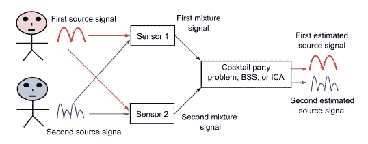
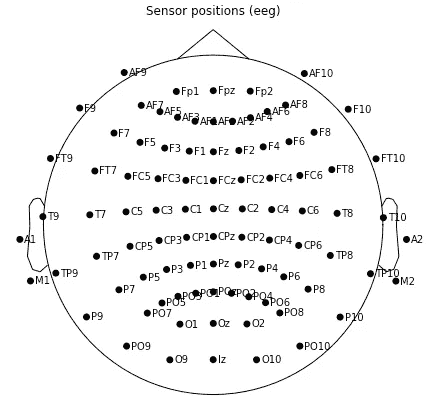
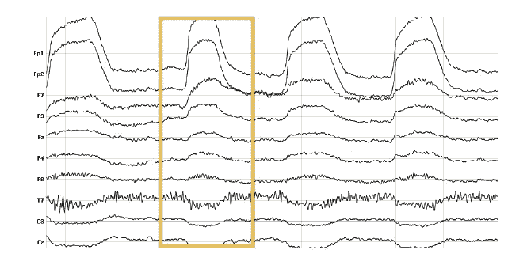
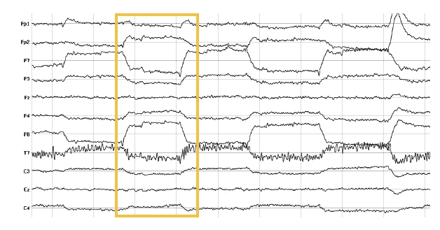
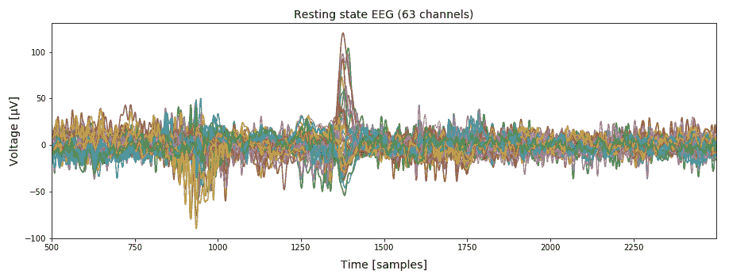
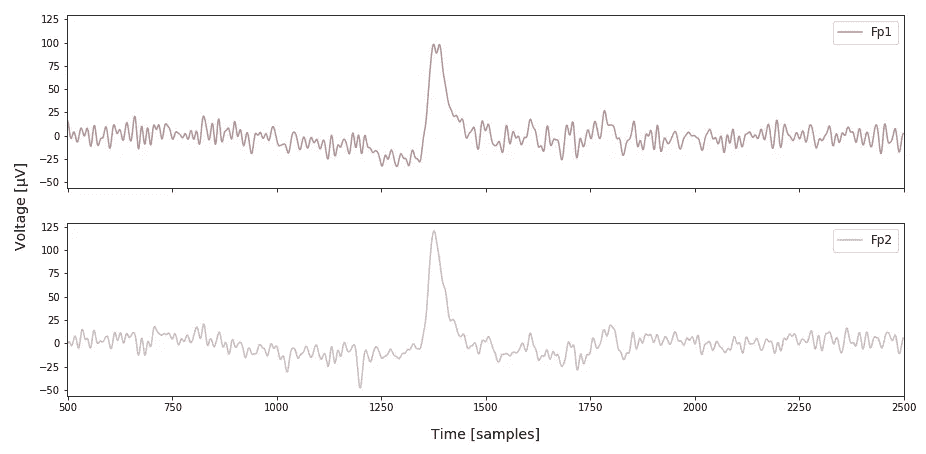
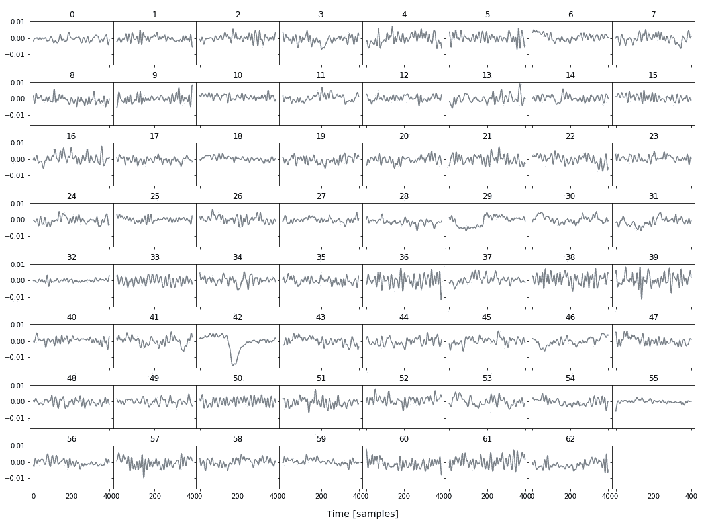
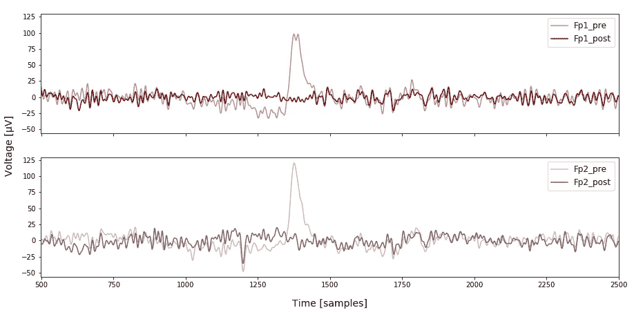

# 利用独立分量分析进行伪影校正

> 原文：<https://towardsdatascience.com/artefact-correction-with-ica-53afb63ad300?source=collection_archive---------25----------------------->

## 用神经科学的例子来说明

时间序列数据往往被不需要的信号假象所污染，这些假象有可能严重扭曲任何进一步的分析。独立分量分析(ICA)是解决这个问题的有效方法。这里，我将简要介绍 ICA，然后演示如何实现它来消除信号伪像。在整篇文章中，我将使用通过脑电图(EEG)获得的时间序列数据，EEG 是一种来自神经科学的技术，用于测量大脑大脑皮层的电活动。

**注意:**我在这里只展示关键的代码片段。用 Python 3 写的完整代码可以在我的 [GitHub](https://github.com/tadorfer/Artefact-Correction-ICA/blob/master/artefact_removal_ica.ipynb) 上以 Jupyter 笔记本的形式找到。

# 国际通信机构(International Communications Agency)

ICA 是一种信号处理方法，能够将多变量信号分离成它的附加子分量或源。它基于这样的假设，即来源在统计上是独立的，并且每个来源中的值是非高斯分布的基础[1]。源分离的一个经典例子是[鸡尾酒会问题](https://www.cell.com/current-biology/pdf/S0960-9822(09)01680-7.pdf)，一个房间里的多个人同时说话，他们的声音被位于不同空间位置的麦克风记录下来。然后可以应用 ICA 将混合源数据分离成代表最大时间独立信号的各种信息源。换句话说，房间里每个人的声音都可以以相当高的准确度还原出来，如下图所示。



简化的鸡尾酒会问题。来源:Tharwat，A. (2018) [2]。

# 脑电图的应用

## 脑电图及其假象

在 EEG 的情况下，ICA 可以识别包括诸如眨眼或眼球运动等伪影的成分。然后，在数据从源空间(ICA 计算的单个源)转换回传感器空间(原始 EEG 数据)之前，可以移除这些分量。这些传感器或电极的位置图示如下。



[头皮上的标准 10–20 电极位置](http://chgd.umich.edu/wp-content/uploads/2014/06/10-20_system_positioning.pdf)(俯视图)。

通过检查时间序列数据，通常可以相当容易地检测到眨眼和眼球运动。它们尤其被位于眼睛正上方或靠近眼睛的前部通道接收到。每种方法的示例如下所示。



正面通道中眨眼的图示(F & Fp)。来源:[https://imotions.com/blog/eeg/](https://imotions.com/blog/eeg/)



额叶通道的眼球运动图解(F & Fp)。来源:[https://imotions.com/blog/eeg/](https://imotions.com/blog/eeg/)

## 使用 FastICA 纠正伪影

科学界一直在使用各种 ICA 算法，如 Infomax、JADE 和 FastICA [3，4]，后者可以说是最流行的一种。另外， [scikit-learn](https://scikit-learn.org/stable/modules/generated/sklearn.decomposition.FastICA.html) 在其分解模块中提供了 FastICA 算法，这进一步促使我在这次演示中使用它。

这里使用的数据是从大约 8 分钟的静息状态 EEG 会话中获取的。在我们开始之前，让我们看一下脑电图的时间序列。



描述所有 63 个通道的 EEG 时间序列数据的 2000 样本切片。

这里的采样率是 500 Hz，所以上图显示了 4 秒钟的数据。在样本 1250 和 1500 之间可以看到眨眼。眨眼通常在通道 Fp1 和 Fp2 中最明显，因此我们分别绘制它们。



通道 Fp1 和 Fp2 中眨眼的描述。

观察 Fp1，在眨眼开始之前可以检测到轻微的箱形。这代表水平的眼球运动，理想情况下也应该去除。现在，让我们运行 scikit-learn 的 FastICA 并绘制所有 63 个 ICA 组件，看看我们是否可以识别任何伪像的来源。

```
## Computing ICA componentsfrom sklearn.decomposition import FastICAica = FastICA(n_components=63, random_state=0, tol=0.05)
comps = ica.fit_transform(eeg)# eeg --> raw data, shape: (224930, 63)
# comps --> ICA components, shape: (224930, 63)
```



ICA 组件。

为了简单起见，我只绘制了 400 个样本的组成部分，从 1200 到 1600，希望能发现 Fp1 和 Fp2 中可见的眨眼。在仔细检查时，看起来好像分量 29 包含水平眼睛运动，而分量 42 包含眨眼伪影。为了证实这一点，我查看了更长的数据切片(此处未显示),发现这些分量中的伪像实际上与各种前额通道中的眨眼和眼球运动伪像同时出现。

**注意:** ICA 根据统计测量将信号分成子分量，这意味着没有特定的分量顺序。如果你不指定`random_state`，你会发现包含工件的组件可以不同。

现在，让我们移除组件 29 和 42，并使用逆变换将源数据转换回原始传感器空间。

```
## Set artefact components to zero before inverse transformcomps[:,[29,42]] = 0 
restored = ica.inverse_transform(comps)
```



Fp1 和 Fp2 的原始和 ICA 校正信号。

成功了！恢复的信号(Fp1_post 和 Fp2_post，深色)不再包含原始信号(Fp1_pre 和 Fp2_pre，浅色)中存在的眨眼和眼球运动伪影。

**注意:** ICA 已经被证明对诸如眨眼和眼球运动之类的刻板假象非常有效。然而，在各种空间位置产生噪声的非定型假象，即当受试者抓头时，会破坏 ICA 的工作，应谨慎对待。

# 参考

[1]hyv rinen，a .，2016 年。独立成分分析:最新进展。*菲洛斯译数学物理科学*。 **371** (1984):20110534。[ [考研](https://www.ncbi.nlm.nih.gov/pmc/articles/PMC3538438/) ]

[2]塔尔瓦特，a .，2018 年。独立成分分析:导论。*应用计算。通知*。[https://doi.org/10.1016/j.aci.2018.08.006](https://doi.org/10.1016/j.aci.2018.08.006)[[PDF](https://reader.elsevier.com/reader/sd/pii/S2210832718301819?token=324A2A25D7E16ABCBF04BB0D66B4CC4D2DFC8610B43B5F1C4DFF7D1E2B86B7D0DD4EEBA3E96FBDF61FB942692DE5945A)

[3]海弗里宁，1999 年。用于独立成分分析的快速且鲁棒的定点算法。 *IEEE 神经网络汇刊*。**10**(3):626–634。[ [PDF](https://www.cs.helsinki.fi/u/ahyvarin/papers/TNN99new.pdf)

[4]hyv rinen，a；Oja，e .，2000 年。独立成分分析:算法与应用。*神经网络*。**13**(4–5):411–430。[ [PDF](https://www.cs.helsinki.fi/u/ahyvarin/papers/NN00new.pdf)