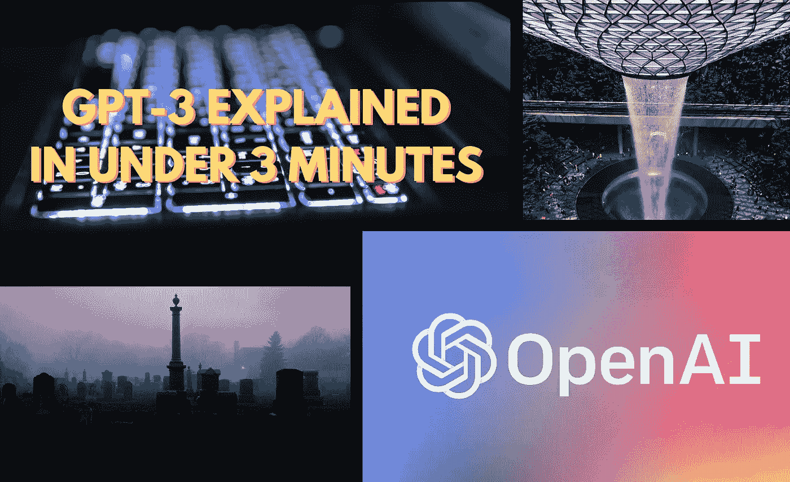

# 有助于您了解 GPT-3 的文章

> 原文：<https://towardsdatascience.com/articles-that-will-help-you-understand-gpt-3-610dedc37859?source=collection_archive---------48----------------------->

## 意见

## 增强你对最新炒作的人工智能模型:GPT 3 的了解

我通常会张贴本周在 Medium 上遇到的与人工智能和机器学习主题相关的有趣文章。

但是最近，很难逃脱围绕 GPT-3 的炒作和兴趣。

因此，本周我已经确定了几篇文章，它们将带你从零开始了解 GPT 3 号，成为有点像英雄的人物。

本文将为您提供一些知识，以了解 GPT-3 的基本背景，以及其直观的应用和潜在的威胁。

*对于那些有点赶时间的人来说，可以随意只阅读'* ***【短评'*** *对所提交文章的总结和回顾。*

*而那些时间稍微多一点的人可以深入研究一下“* ***”详细回顾一下“*** *的总结来了解我对所提到文章的想法和看法。*

## 您会发现一些文章:

*   **这就解释了 GPT 在 3 分钟内 3 投 3 中的原因**
*   **或者，解释一下为什么 GPT-3 被过度宣传，也是在 3 分钟内**
*   **深入了解 GPT-3**
*   **质疑编码角色的寿命，因为 GPT-3 的潜力。**

包含文章的封面图像

# GPT-3:第一个人工通用智能？朱利安·劳蕾特

> 一站式获取有关 GPT-3 的历史、发展和潜力的信息。

## 简短评论

Julien Lauret 的文章全面总结了迄今为止创造 GPT 3 号的历程。

Julien 已经成功地将多年来对建模语言和解决自然语言处理的方法和技术的开发和介绍总结为几个小而简洁的段落。

除了向读者提供 GPT-3 的背景资料，朱利安还用外交辞令回答了 GPT-3 是否是 AGI 的问题。他的回答真实地反映了问题本身的性质，因为无论是谁提出这个问题，这个问题都要服从于智力的定义。

## 详细审查

朱利安关于 GPT-3 的最新文章是一篇非常需要的文章，因为我觉得人工通用智能(AGI)的话题在我们的想象中几乎已经退居二线了。

朱利安在文章的开头指出了关于 AGI 的两种观点。一种观点暗示 AGI 还有几十年的时间；另一个问题是人类是否有可能到达 AGI。

Julien 的文章中充斥着一些技术和专业术语，但每个术语都附有简短的定义，在某些情况下还有广泛的背景知识。

诸如“深度神经网络”、“机器翻译”、“Word2vec”和“少量学习”等术语的呈现和定义方式为读者提供了语言建模和 NLP 的速成课程，以及有关 GPT-3 的主要信息。

这篇文章直到文章中途才提到 GPT-3，这是因为 Julien 巧妙地带领读者经历了一次概述对语言建模和 GPT-3 本身的进步做出贡献的关键发展和研究的旅程。

关于 GPT-3 和它的前身的内在特征*(重量数)*的信息被提供给读者，以使读者了解 GPT 模型在每个发布版本中所取得的进步水平。

本文的后半部分展示了早期 access API 用户开发的 GPT-3 的直观应用程序示例。

但更重要的是，朱利安回答了文章题目中提出的问题。朱利安对 GPT-3 是否是 AGI 的结论是，它不是。但更重要的是，问题本身的答案并不像人们想象的那样清晰。

这种不明确性源于这样一个事实，即智力的定义是模糊的，取决于个人的解释。

朱利安指出，讨论 GPT-3 的应用是一个重要的问题。我们已经看到了它生成诗歌、游戏场景和通过语言定义的 web 组件的能力。

我们现在需要观察的是，人工智能的最新成就如何应用于涉及视频和图像的更广泛的环境中。

朱利安的文章有趣地包含了一些哲学观点和陈述。例如，朱利安指出，我们无法确定 GPT-3 拥有的智力水平，就像我们无法确定一个瘫痪的人或身体有缺陷的人的认知功能水平一样。

这篇文章深入探讨了值得思考的人工智能领域。

## 这篇文章非常适合:

> **机器学习从业者**:使用的语言和技术术语，任何参与机器学习的人都非常熟悉。所包括的定义和论文允许进一步探讨与 GPT-3 有关的主题

 [## GPT-3:第一个人工通用智能？

### 当历史学家回顾过去时，他们会选择 2020 年作为发明 AGI 的一年吗？

towardsdatascience.com](/gpt-3-the-first-artificial-general-intelligence-b8d9b38557a1) 

# GPT-3 由[戴尔·马科维茨](https://medium.com/u/1b81dbdfe1ea?source=post_page-----610dedc37859--------------------------------)在不到 3 分钟的时间内解释

> 关于 GPT 3 号的简短信息

## 简短评论

对于那些时间不多并且想了解 GPT 3 号的信息的人来说，戴尔·马科维茨的文章是一个完美的停留。有了良好的结构和介绍的段落，你就能得到 GPT-3 关键性能的重要信息。本文还包括一些基于 GPT-3 的应用程序示例。

## 详细审查

戴尔的文章可以被描述为包含 GPT 3 号重要细节的有用信息的快速拍摄。

戴尔在文章中探讨了 GPT-3 语言模型的一般构成，但没有大量的技术术语和细节。

本文首先通过一系列嵌入式 twitter 帖子展示了一些基于 GPT 3 的应用程序。

戴尔的文章为 GPT-3 相关的通用技术思想的定义提供了信息，这就是“语言模型”。

对“语言模型”的描述附有一个甚至五岁孩子都能理解的例子。

更重要的是，戴尔的文章包括了 GPT-3 的重要性质，以便进行进一步的探索。这篇文章提到了 GPT-3 基于变压器的架构，以及 GPT-3 和它的前身中的一些参数。

文章最后陈述了 GPT-3 号与其同类产品不同的主要原因，主要是 GPT-3 号可普遍应用于各种任务，无需微调。

## 这篇文章非常适合阅读:

> **普通观众**:这篇文章使用的语言并不太专业。所提供的信息结构合理，格式清晰，便于理解新 GPT 协议的主要特点和优势。不需要主要的技术背景。

 [## GPT 3 号在两分钟内解释完毕

### 快速了解 OpenAI 的 GPT-3 模型如何在引擎盖下工作。

towardsdatascience.com](/gpt-3-explained-in-under-2-minutes-9c977ccb172f) 

# 最新的 AI 会杀死编码吗？由[弗雷德里克·巴斯勒](https://medium.com/u/16c852692647?source=post_page-----610dedc37859--------------------------------)

> Web 程序员会想要阅读这篇文章

## 简短评论

弗雷德里克·布斯勒(Frederik Bussler)写了一篇文章，重新点燃了科技行业几年来一直存在的一个问题。

弗雷德里克介绍了不同版本的 GPT 的简要背景，以及基于观点的推理，解释了为什么编码工作角色可能迟早会面临人工智能的末日。

## 详细审查

弗雷德里克在他的最新文章中向读者指出了人工智能进步的速度有多快。他引用了研究人员在 2017 年提出的一个问题，该问题提出了“到 2040 年，人工智能能写出大多数代码吗？”。毫无疑问，在 2020 年，我们将开始看到这个问题的答案。

像大多数其他描述 GPT-3 的文章一样，弗雷德里克提到了 GPT-3 语言模型的关键特征，即由于其非常健壮的神经网络参数，它能够推广到特定领域的任务。正如弗雷德里克所指出的，这就是为什么 GPT-3 可以用几乎任何编程语言编码。

弗雷德里克脱离了文章试图解决的主要问题，为读者提供了 GPT 语言模型变体的详细描述。

这篇文章回到了主题，有一个部分叫做“进化或死亡”，这是一个大多数行业都可能会经历的信念，但是程序员比其他人更快。

弗雷德里克为读者提供了进一步的信息——那些可能对弗雷德里克的说法持怀疑态度的人——随着 Squarespace、Wix、GoDaddy 等平台的引入，无代码运动已经全面展开，这些平台通常是*所见即所得*的网站生成平台。

为了支持无代码平台出现的趋势，Frederik 包括 AutoML 和一家公司的链接，该公司能够创建没有编码技能的人工智能模型。

我得到的印象是，Frederik 非常确信，在不久的将来，编码或程序员的角色是人工智能的公平游戏。

阅读这篇基于观点的文章，找到可以重申你对几个行业内人工智能大灾难的担忧的论点。

## 这篇文章是以下人士的必读之作:

> **程序员**:尽管人工智能和自动化将在未来大量减少工作岗位，但程序员和编码员仍将是必需的，这让我一直感到欣慰。GPT-3 的出现和潜力似乎引发了一些担忧，我们或许应该给予更多的关注。

 [## GPT-3 会杀死编码吗？

### 人工智能现在可以用任何语言编码，无需额外训练。

towardsdatascience.com](/will-gpt-3-kill-coding-630e4518c04d) 

# 一个 3 分钟的解释为什么 GPT-3 被阿尤什·夏尔马夸大了

> 不是每个人都买 GPT-3 卖的东西

## 简短版本

赞美 GPT 3 号的文章不在少数，但阿尤什的文章试图将我们带回现实。这篇直言不讳的文章很短，让读者相信 GPT-3 只不过是一个被主流媒体夸大的人工智能工具。

## 详细版本

Ayush Sharma 这篇文章旨在让那些持有 GPT-3 是备受期待的人工通用智能(AGI)的到来这一概念的技术人员。

我特别喜欢他所用的比喻，他描述了科技领域一些人所信奉的概念与穴居人通过发现火而解决了核聚变的相似性。

阿尤什似乎没有被 GPT 3 中闪亮的新玩具所迷惑。这篇文章提醒我们，我们目前看到的炒作和关注是主流媒体采用的一种熟悉的行为周期，以高估 AI advanced 的潜力，所有这些都是为了出售故事。

将 GPT-3 描述为“*美化的 10 美元以上自动完成软件*”是相当苛刻的。在这篇文章中，Ayush 直截了当地陈述了为什么 GPT-3 不是 AGI 的原因。

文章进一步列举了 GPT-3 协议的不足之处。

这篇文章的结论包括一条来自 Open AI 首席执行官 Sam Altman 的嵌入式推文，他在其中表示，围绕 GPT-3 的炒作是没有道理的，尽管它可能令人印象深刻，但仍有很长的路要走。

## 这篇文章非常适合阅读:

> **每个人**:人们很容易迷失在互联网上展示的人工智能的潜力中。因此，有一个相当像批评家的视角总是健康的，这样才能管理公众的期望，防止未来的失望。

 [## 一个 3 分钟的解释为什么 GPT-3 被过分夸大。

### 是的，GPT 3 号令人印象深刻。不，它与人工通用智能(AGI)相去甚远。

medium.com](https://medium.com/@ayushsharma_mit/a-3-minute-explainer-on-why-gpt-3-is-overhyped-7f134d10c8ce) 

# 我希望这篇文章对你有用。

要联系我或找到更多类似本文的内容，请执行以下操作:

1.  订阅我的 [**YouTube 频道**](https://www.youtube.com/channel/UCNNYpuGCrihz_YsEpZjo8TA) 即将发布的视频内容 [**这里**](https://www.youtube.com/channel/UCNNYpuGCrihz_YsEpZjo8TA)
2.  跟着我上 [**中**](https://medium.com/@richmond.alake)
3.  通过 [**LinkedIn**](https://www.linkedin.com/in/richmondalake/) 联系我